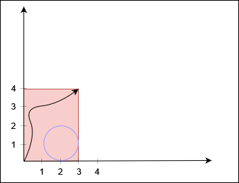
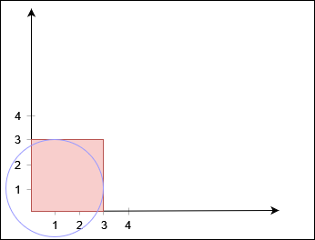
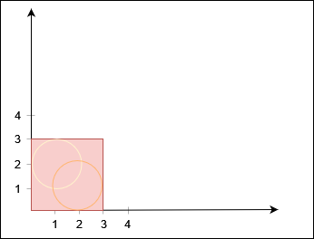

3235. Check if the Rectangle Corner Is Reachable

You are given two positive integers `X` and `Y`, and a 2D array `circles`, where `circles[i] = [xi, yi, ri`] denotes a circle with center at `(xi, yi)` and radius `ri`.

There is a rectangle in the coordinate plane with its bottom left corner at the origin and top right corner at the coordinate `(X, Y)`. You need to check whether there is a path from the bottom left corner to the top right corner such that the **entire path** lies inside the rectangle, **does not** touch or lie inside **any** circle, and touches the rectangle **only** at the two corners.

Return `true` if such a path exists, and `false` otherwise.

 

**Example 1:**
```
Input: X = 3, Y = 4, circles = [[2,1,1]]

Output: true

Explanation:
```

```
The black curve shows a possible path between (0, 0) and (3, 4).
```

**Example 2:**
```
Input: X = 3, Y = 3, circles = [[1,1,2]]

Output: false

Explanation:
```

```
No path exists from (0, 0) to (3, 3).
```

**Example 3:**
```
Input: X = 3, Y = 3, circles = [[2,1,1],[1,2,1]]

Output: false

Explanation:
```

```
No path exists from (0, 0) to (3, 3).
```
 

**Constraints:**

* `3 <= X, Y <= 10^9`
* `1 <= circles.length <= 1000`
* `circles[i].length == 3`
* `1 <= xi, yi, ri <= 10^9`

# Submissions
---
**Solution 1: (Union Find)**

__Intuition__
The problem involves determining if there is a path from the bottom-left corner to the top-right corner of a rectangle, while avoiding any circles that obstruct the path. This can be visualized as a problem of connectivity in a graph, where we want to check if two points (the corners of the rectangle) belong to the same connected component while avoiding the circles.

__Approach__
* Initialization: Initialize a union-find data structure where each node represents a circle. Additionally, add two virtual nodes: one representing the bottom-left corner and another representing the top-right corner.

* Union Operations:

* For each circle, check if it touches the left or top boundary of the rectangle. If it does, union it with the bottom-left corner node.

* Similarly, if a circle touches the right or bottom boundary of the rectangle, union it with the top-right corner node.

* For each pair of circles, check if they overlap. If they do, union them.

* Check Connectivity: After performing all union operations, check if the bottom-left corner node is connected to the top-right corner node using the union-find data structure.

__Complexity__
Time complexity: O(n^2)

Space complexity: O(n)

```
Runtime: 203 ms
Memory: 39.77 MB
```
```c++
class Solution {
    int find(vector<int>& f, int i) {
        if (f[i] != i) {
            f[i] = find(f, f[i]);
        }
        return f[i];
    }
public:
    bool canReachCorner(int X, int Y, vector<vector<int>>& circles) {
        int n = circles.size();
        vector<int> f(n + 2);
        for (int i = 0; i < n + 2; i++) {
            f[i] = i;
        }

        for (int i = 0; i < n; i++) {
            int x = circles[i][0];
            int y = circles[i][1];
            int r = circles[i][2];

            if (x - r <= 0 || y + r >= Y) {
                f[find(f, n)] = find(f, i);
            }
            if (x + r >= X || y - r <= 0) {
                f[find(f, n + 1)] = find(f, i);
            }

            for (int j = 0; j < i; j++) {
                int x2 = circles[j][0];
                int y2 = circles[j][1];
                int r2 = circles[j][2];

                if ((long long)(x - x2) * (x - x2) + (long long)(y - y2) * (y - y2) <= (long long)(r + r2) * (r + r2)) {
                    f[find(f, i)] = find(f, j);
                }
            }
        }

        return find(f, n) != find(f, n + 1);
    }
};
```
