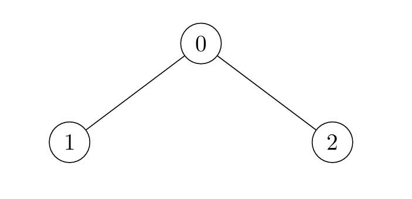
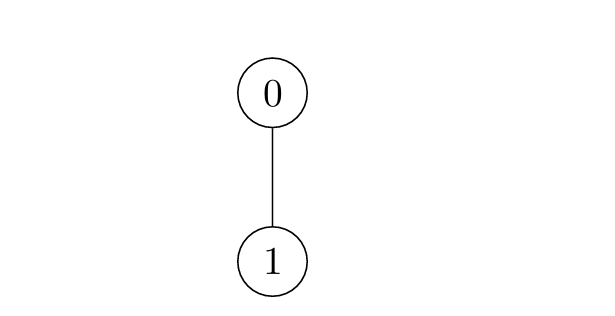
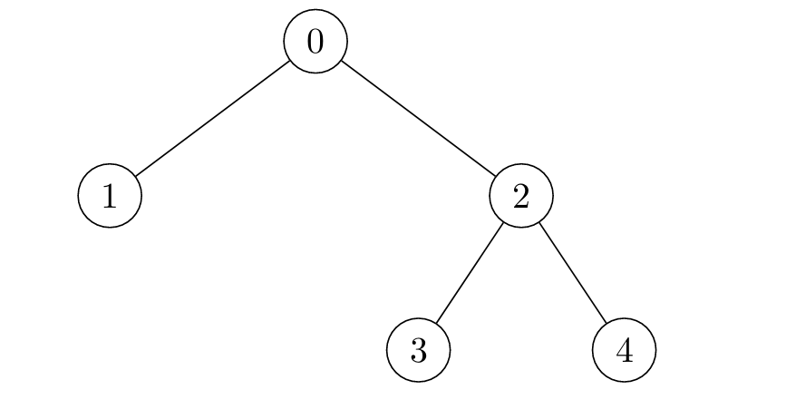
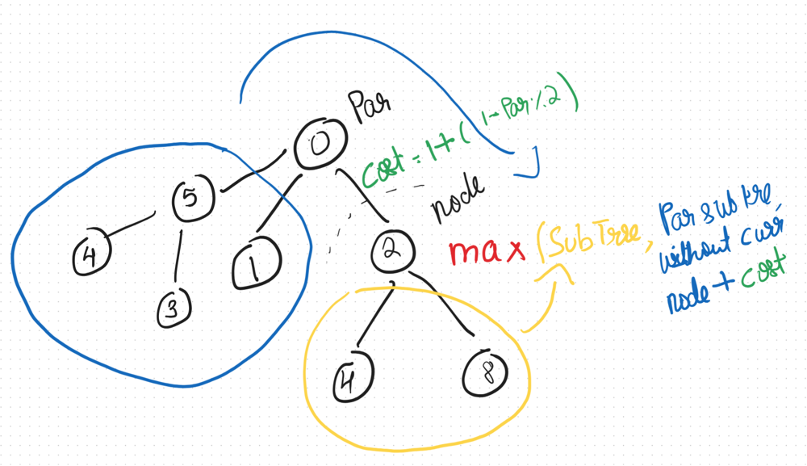

3241. Time Taken to Mark All Nodes

There exists an **undirected** tree with `n` nodes numbered `0` to `n - 1`. You are given a 2D integer array `edges` of length `n - 1`, where `edges[i] = [ui, vi]` indicates that there is an edge between nodes `ui` and `vi` in the tree.

Initially, **all** nodes are **unmarked**. For each node `i`:

* If `i` is **odd**, the node will get marked at time `x` if there is **at least** one node adjacent to it which was marked at time `x - 1`.
* If `i` is **even**, the node will get marked at time `x` if there is at least one node adjacent to it which was marked at time `x - 2`.

Return an array `times` where `times[i]` is the time when all nodes get marked in the tree, if you mark node `i` at time `t = 0`.

**Note** that the answer for each `times[i]` is **independent**, i.e. when you mark node `i` all other nodes are **unmarked**.

 

**Example 1:**
```
Input: edges = [[0,1],[0,2]]

Output: [2,4,3]

Explanation:
```


```
For i = 0:
Node 1 is marked at t = 1, and Node 2 at t = 2.
For i = 1:
Node 0 is marked at t = 2, and Node 2 at t = 4.
For i = 2:
Node 0 is marked at t = 2, and Node 1 at t = 3.
```

**Example 2:**
```
Input: edges = [[0,1]]

Output: [1,2]

Explanation:
```

```
For i = 0:
Node 1 is marked at t = 1.
For i = 1:
Node 0 is marked at t = 2.
Example 3:

Input: edges = [[2,4],[0,1],[2,3],[0,2]]

Output: [4,6,3,5,5]

Explanation:
```


 

**Constraints:**

* `2 <= n <= 10^5`
* `edges.length == n - 1`
* `edges[i].length == 2`
* `0 <= edges[i][0], edges[i][1] <= n - 1`
* The input is generated such that `edges` represents a valid tree.

# Submissions
---
**Solution 1: (Re-root DP)**

__Intuition__
* We want to calculate an answer with each node as the root i.e the roots keep changing + there is a clear repeating subproblem in the form of subtrees.
* DP + Re-rooting technique comes naturally as intuition, if you know this technique alreadly.
__Approach__
* First, calculate the answer with Node 0 as the root. For every subtree calculate dp[i] - which is a pair of vectors. We need to maintain the top 2 costs for each node, as when we are re-rooting we need to ignore the current node while calculating the answer from its parent.
* dp[i] = {{maxCostNode, maxCost}, {2ndMaxCostNode, 2ndMaxCost}}
* Now, we re-root. When we move from [par] -> [node], we now need to calculate the answer as if [node] is the parent. We already know the answer for [node]'s subtree i.e dp[node]. Now, the cost of the remaining tree would be the max time to mark all nodes of its parent except the [node]'s subtree + cost to mark parent.



__Complexity__
Time complexity: We visit every edge, node twice
O(V+E)

Space complexity:
O(V+E)

```
Runtime: 681 ms
Memory: 344.44 MB
```
```c++
class Solution {
    struct NodeInfo {
        int node;
        int cost;
        NodeInfo(int n = 0, int c = 0) : node(n), cost(c) {}
    };

    void dfs(int node, const vector<vector<int>>& adj, int parent, vector<pair<NodeInfo, NodeInfo>>& dp) {
        for (int child : adj[node]) {
            if (child == parent) continue;
            dfs(child, adj, node, dp);
            updateNodeInfo(dp[node], {child, calculateCost(child, dp[child].first.cost)});
        }
    }

    void dfs2(int node, const vector<vector<int>>& adj, int parent, 
              const vector<pair<NodeInfo, NodeInfo>>& dp, vector<pair<NodeInfo, NodeInfo>>& dp2) {
        if (parent != -1) {
            int parentCost = (dp2[parent].first.node == node) ? dp2[parent].second.cost : dp2[parent].first.cost;
            int costFromParent = calculateCost(parent, parentCost);
            dp2[node] = {{parent, costFromParent}, {0, 0}};
            
            for (int child : adj[node]) {
                if (child == parent) continue;
                updateNodeInfo(dp2[node], {child, calculateCost(child, dp[child].first.cost)});
            }
        }

        for (int child : adj[node]) {
            if (child == parent) continue;
            dfs2(child, adj, node, dp, dp2);
        }
    }

    void updateNodeInfo(pair<NodeInfo, NodeInfo>& info, const NodeInfo& newInfo) {
        if (newInfo.cost > info.first.cost) {
            info.second = info.first;
            info.first = newInfo;
        } else if (newInfo.cost > info.second.cost) {
            info.second = newInfo;
        }
    }
    int calculateCost(int node, int childCost) {
        return 1 + childCost + (node % 2 == 0);
    }
public:
    vector<int> timeTaken(vector<vector<int>>& edges) {
        int n = edges.size() + 1;
        vector<vector<int>> adj(n);
        for (const auto& edge : edges) {
            adj[edge[0]].push_back(edge[1]);
            adj[edge[1]].push_back(edge[0]);
        }

        vector<pair<NodeInfo, NodeInfo>> dp(n), dp2(n);
        dfs(0, adj, -1, dp);
        dp2 = dp;
        dfs2(0, adj, -1, dp, dp2);

        vector<int> answer;
        for (const auto& info : dp2) {
            answer.push_back(info.first.cost);
        }
        return answer;
    }
};
```
