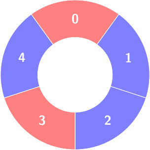
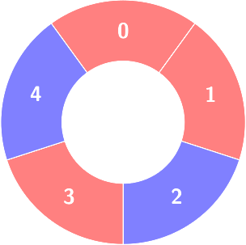
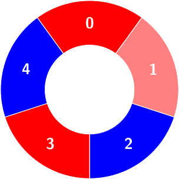
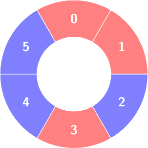
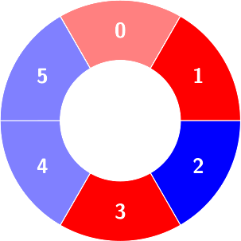

3245. Alternating Groups III

There are some red and blue tiles arranged circularly. You are given an array of integers `colors` and a 2D integers array `queries`.

The color of tile `i` is represented by `colors[i]`:

* `colors[i] == 0` means that tile i is **red**.
* `colors[i] == 1` means that tile i is **blue**.

An **alternating** group is a contiguous subset of tiles in the circle with **alternating** colors (each tile in the group except the first and last one has a different color from its **adjacent** tiles in the group).

You have to process queries of two types:

* `queries[i] = [1, sizei]`, determine the count of **alternating** groups with size `sizei`.
* `queries[i] = [2, indexi`, colori], change `colors[indexi]` to `colori`.

Return an array `answer` containing the results of the queries of the first type in order.

**Note** that since colors represents a **circle**, the **first** and the **last** tiles are considered to be next to each other.

 

**Example 1:**
```
Input: colors = [0,1,1,0,1], queries = [[2,1,0],[1,4]]

Output: [2]

Explanation:
```

```
First query:

Change colors[1] to 0.
```

```
Second query:

Count of the alternating groups with size 4:
```


**Example 2:**
```
Input: colors = [0,0,1,0,1,1], queries = [[1,3],[2,3,0],[1,5]]

Output: [2,0]

Explanation:
```

```
First query:

Count of the alternating groups with size 3:
```

```
Second query: colors will not change.

Third query: There is no alternating group with size 5.
```
 

**Constraints:**

* `4 <= colors.length <= 5 * 104`
* `0 <= colors[i] <= 1`
* `1 <= queries.length <= 5 * 104`
* `queries[i][0] == 1` or `queries[i][0] == 2`
* For all `i` that:
    * `queries[i][0] == 1: queries[i].length == 2, 3 <= queries[i][1] <= colors.length - 1`
    * `queries[i][0] == 2: queries[i].length == 3, 0 <= queries[i][1] <= colors.length - 1, 0 <= queries[i][2] <= 1`

# Submissions
---
**Solution 1: (Segment Tree)**

__Intuition__

Keep alternating groups in a set. Do not worry about the group which goes through (n-1)->(0). Just consider it a straight line and keep groups. (only maximal groups). Remember also keep groups of size 1,2 etc.

Now maintain a segmentree tree/fenwick tree to maintain a datastructure which can maintain fequency of size of alternating groups. And give query(l,r) returns groups of size l
It would be something like

freq[l]+2*freq[l+1]+3*freq[l+1]...
Now for updage query, one of the three things can happen.
a) break a chain into two
b) merge two chains
c) change length of at max one chains

Handle that in O(logn) and update the frequency.

Corner cases:

Now while answering query. Check size of first and last set. and see if they form a chain. Update answer accordingly.
If whole circle is a group,
If first and last element are different answer is n
otherwise normal logic applies.
Approach

__Complexity__

Time complexity:
O(((n+q)logn)

Space complexity:
O(n)

```
Runtime: 411 ms
Memory: 188.92 MB
```
```c++
class SegmentTree {
public:
    SegmentTree(int n) : n(n) {
        sum1.assign(2 * n, 0);
        sum2.assign(2 * n, 0);
    }

    void update(int idx, int delta) {
        if(idx == 0)
            return;
        int diff1 = delta;
        int diff2 = delta * idx;

        for (int i = idx + n; i > 0; i /= 2) {
            sum1[i] += diff1;
            sum2[i] += diff2;
        }
    }

    int querySum1(int left, int right) {
        return query(sum1, left, right);
    }

    int querySum2(int left, int right) {
        return query(sum2, left, right);
    }

    int computeResult(int l, int r) {
        int sum1Val = querySum1(l, r);
        int sum2Val = querySum2(l, r);
        return sum2Val - max(l-1,0) * sum1Val;
    }

private:
    int n;
    vector<int> sum1, sum2;

    int querySingle(const vector<int>& tree, int idx) {
        return tree[idx + n];
    }

    int query(const vector<int>& tree, int left, int right) {
        int res = 0;
        for (left += n, right += n + 1; left < right; left /= 2, right /= 2) {
            if (left % 2 == 1) res += tree[left++];
            if (right % 2 == 1) res += tree[--right];
        }
        return res;
    }
};

class Solution {
public:
    vector<int> numberOfAlternatingGroups(vector<int>& colors, vector<vector<int>>& queries) {
        int n = colors.size();
        set<pair<int, int>> groups;
        map<int, int> sizeCounts;

        SegmentTree st(n+1);
        // Function to update the set of alternating groups
        auto updateGroups = [&](int l, int r, bool adding) {
            if(l<=r) {
                int size = r - l + 1;
                if (adding) {
                    groups.insert({l, r});
                    st.update(size,1);
                } else {
                    groups.erase({l, r});
                    st.update(size,-1);
                }
            }
        };


        auto isAlternate = [&](int i) {
            return colors[i] != colors[(i - 1 + n) % n];
        };
        // Initialize the groups
        int start = 0;
        while (start < n) {
            int end = start;
            while (end+1<=n-1 && isAlternate(end+1)) {
                end = (end + 1) % n;
            }
            updateGroups(start, end, true);
            start = end+1;
        }

        vector<int> result;
        for (auto& query : queries) {
            if (query[0] == 1) {
                int size = query[1];
                if(groups.size()==1) {
                    if(colors[n-1]!= colors[0])
                        result.push_back(n);
                    else
                        result.push_back(n-size+1);
                    continue;
                }         
                int ans = st.computeResult(size,n);
                if(colors[n-1]!= colors[0]) {
                    auto it = groups.begin();
                    int sz = it->second-it->first+1;
                    if(sz>=size) {
                        ans -= sz-size+1;
                    }
                    it = groups.end();
                    it--;
                    int sz2 = it->second-it->first+1;
                    if(sz2>=size) {
                        ans -= sz2-size+1;
                    }
                    sz+=sz2;
                    if(sz>=size) {
                        ans += sz-size+1;
                    }
                }
                result.push_back(ans);
                continue;
            }  
            int index = query[1];
            int newColor = query[2];
            if (colors[index] == newColor) 
                continue;
            colors[index] = newColor;
            auto it = groups.lower_bound({index+1, index+1});
            it--;
            if (it != groups.end() && it->first <= index) {
                int l = it->first;
                int r = it->second;
                if(l==index && r==index) {
                    int l2 = l;
                    int r2 = r;

                    if(it!=groups.begin()) {
                        it--;
                        l2=it->first;
                        assert(it->second+1==index);
                        it++;
                    }

                    it++;
                    if(it!=groups.end()) {
                        r2=it->second;
                        assert(it->first-1==index);
                    }
                    updateGroups(l, r, false);
                    updateGroups(l2, r2, true);
                    if(l2!=l) {
                        updateGroups(l2, index-1, false);
                    }
                    if(r2!=r) {
                        updateGroups(index+1, r2, false);
                    }
                    continue;
                }

                if(l==index && it!=groups.begin()) {
                    it--;
                    int l2 = it->first;
                    int r2 = it->second;
                    if(r2+1 == index) {
                        updateGroups(l2, r2, false);
                        updateGroups(l2, r2+1, true);                    
                    }
                }
                if(r==index){
                    it++;
                    if(it!=groups.end()) {
                        int l2 = it->first;
                        int r2 = it->second;
                        if(index+1 == l2) {
                            updateGroups(l2, r2, false);
                            updateGroups(l2-1, r2, true);                    
                        }
                    }
                }
                updateGroups(l, r, false);
                updateGroups(l, index-1, true);
                updateGroups(index+1, r, true);

                it = groups.lower_bound({index, index});
                if(it==groups.end() || it->first>index) {
                    if(it==groups.begin()) 
                        updateGroups(index,index,true);
                    else {
                        it--;
                        if(it->second<index)
                            updateGroups(index,index,true);
                    }
                }
            } else {
                assert(false);
            }            
        }

        return result;
    }
};
```
