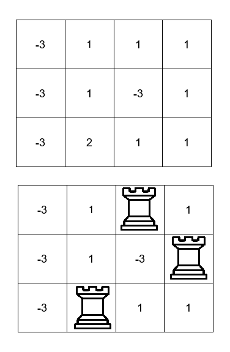

3257. Maximum Value Sum by Placing Three Rooks II

You are given a `m x n` 2D array `board` representing a chessboard, where `board[i][j]` represents the value of the cell `(i, j)`.

Rooks in the **same** row or column attack each other. You need to place three rooks on the chessboard such that the rooks **do not attack** each other.

Return the **maximum** sum of the cell **values** on which the rooks are placed.

 

**Example 1:**
```
Input: board = [[-3,1,1,1],[-3,1,-3,1],[-3,2,1,1]]

Output: 4

Explanation:
```

```
We can place the rooks in the cells (0, 2), (1, 3), and (2, 1) for a sum of 1 + 1 + 2 = 4.
```

**Example 2:**
```
Input: board = [[1,2,3],[4,5,6],[7,8,9]]

Output: 15

Explanation:

We can place the rooks in the cells (0, 0), (1, 1), and (2, 2) for a sum of 1 + 5 + 9 = 15.
```

**Example 3:**
```
Input: board = [[1,1,1],[1,1,1],[1,1,1]]

Output: 3

Explanation:

We can place the rooks in the cells (0, 2), (1, 1), and (2, 0) for a sum of 1 + 1 + 1 = 3.
```

 

**Constraints:**

* `3 <= m == board.length <= 500`
* `3 <= n == board[i].length <= 500`
* `-109 <= board[i][j] <= 10^9`

# Submissions
---
**Solution 1: (DP Top-Down, Greedy)**

Time Complexity: O(m*n*log(m))
Space Complexity: O(m*n)

```
Runtime: 418 ms
Memory: 92.19 MB
```
```c++
class Solution {
    long long dp[502][502];
    long long helper(int row, int prev2, int prev1, vector<vector<pair<long long,int>>> &grid){
        if(row>=grid.size()) return -1e18;
        if(dp[row][prev1+1]!=-1) return dp[row][prev1+1];
        
		// not placing rook in the current row.
        long long ans = helper(row+1, prev2, prev1, grid);
        
		// place rook in any of the best three columns of the current row.
        for (int col=0; col < 3; col++){
            if (grid[row][col].second!=prev2 && grid[row][col].second!=prev1){
                if (prev1!=-1) ans = max(ans,  grid[row][col].first);
                else ans = max(ans, grid[row][col].first + helper(row+1, prev2, grid[row][col].second, grid));
            }
        }
        
        return dp[row][prev1+1]=ans;
    }
public:
    long long maximumValueSum(vector<vector<int>>& board) {
        int m = board.size();
        int n = board[0].size();

		// Create a new grid grid of pairs where each element is a pair (value, column_index).
        vector<vector<pair<long long,int>>> grid(m, vector<pair<long long,int>> (n));
        for (int i = 0; i < m; i++){
            for (int j = 0; j < n; j++){
                grid[i][j] = make_pair(board[i][j], j);
            }
        }
        
		// Sort each row of grid in descending order based on the value. 
		// This ensures that the highest values in each row are considered first.
        for (int i = 0; i < m;i++){
            sort(grid[i].rbegin(), grid[i].rend());
        }
        
		// Sort the entire grid in descending order based on the first element of each row. 
		// This prioritizes the most valuable rows.
        sort(grid.rbegin(), grid.rend());
        
		long long ans=-1e18;
        for (int col = 0; col < 3; col++){
            memset(dp, -1, sizeof(dp));
            ans = max(ans ,grid[0][col].first + helper(1, grid[0][col].second, -1, grid));
        }
        return ans;
    }
};
```
