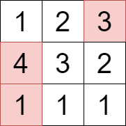
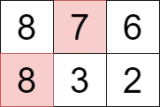

3276. Select Cells in Grid With Maximum Score

You are given a 2D matrix `grid` consisting of positive integers.

You have to select one or more cells from the matrix such that the following conditions are satisfied:

* No two selected cells are in the **same** row of the matrix.
* The values in the set of selected cells are **unique**.

Your score will be the **sum** of the values of the selected cells.

Return the **maximum** score you can achieve.

 

**Example 1:**
```
Input: grid = [[1,2,3],[4,3,2],[1,1,1]]

Output: 8

Explanation:
```

```
We can select the cells with values 1, 3, and 4 that are colored above.
```

**Example 2:**
```
Input: grid = [[8,7,6],[8,3,2]]

Output: 15

Explanation:
```

```
We can select the cells with values 7 and 8 that are colored above.
```
 

**Constraints:**

`1 <= grid.length, grid[i].length <= 10`
`1 <= grid[i][j] <= 100`

# Submissions
---
**Solution 1: (DP Top-Down)**
```
Runtime: 332 ms
Memory: 80.92 MB
```
```c++
class Solution:
    def maxScore(self, grid: List[List[int]]) -> int:
        n = len(grid)
        vals = {}
        for i in range(n):
            for h in grid[i]:
                if h not in vals:
                    vals[h] = []
                vals[h].append(i)
        vals = list(vals.items())
        
        @lru_cache(maxsize = None)
        def maxval(i, mask):
            if i >= len(vals):
                return 0
            res = maxval(i + 1, mask)
            for j in vals[i][1]:
                if not mask & (1 << j):
                    res = max(res, vals[i][0] + maxval(i + 1, mask | (1 << j)))
            return res
        return maxval(0, 0)
```
