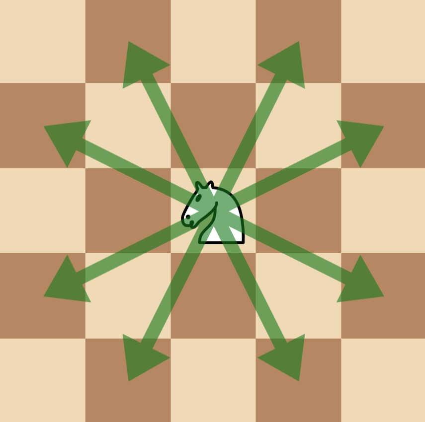
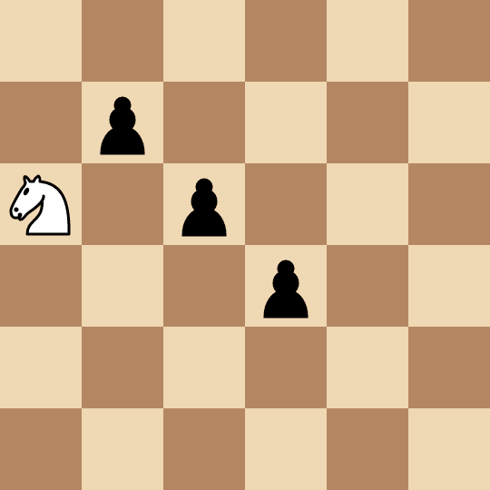

3283. Maximum Number of Moves to Kill All Pawns

There is a `50 x 50` chessboard with **one** knight and some pawns on it. You are given two integers `kx` and `ky` where `(kx, ky)` denotes the position of the knight, and a 2D array `positions` where `positions[i] = [xi, yi]` denotes the position of the pawns on the chessboard.

Alice and Bob play a turn-based game, where Alice goes first. In each player's turn:

* The player selects a pawn that still exists on the board and captures it with the knight in the **fewest** possible moves. **Note** that the player can select **any** pawn, it **might not** be one that can be captured in the **least** number of moves.
* In the process of capturing the selected pawn, the knight **may** pass other pawns **without** capturing them. **Only** the selected pawn can be captured in this turn.

Alice is trying to **maximize** the sum of the number of moves made by both players until there are no more pawns on the board, whereas Bob tries to **minimize** them.

Return the **maximum** total number of moves made during the game that Alice can achieve, assuming both players play **optimally**.

Note that in one **move**, a chess knight has eight possible positions it can move to, as illustrated below. Each move is two cells in a cardinal direction, then one cell in an orthogonal direction.



 

**Example 1:**
```
Input: kx = 1, ky = 1, positions = [[0,0]]

Output: 4

Explanation:
```

```
The knight takes 4 moves to reach the pawn at (0, 0).
```

**Example 2:**
```
Input: kx = 0, ky = 2, positions = [[1,1],[2,2],[3,3]]

Output: 8

Explanation:
```

```
Alice picks the pawn at (2, 2) and captures it in two moves: (0, 2) -> (1, 4) -> (2, 2).
Bob picks the pawn at (3, 3) and captures it in two moves: (2, 2) -> (4, 1) -> (3, 3).
Alice picks the pawn at (1, 1) and captures it in four moves: (3, 3) -> (4, 1) -> (2, 2) -> (0, 3) -> (1, 1).
```

**Example 3:**
```
Input: kx = 0, ky = 0, positions = [[1,2],[2,4]]

Output: 3

Explanation:

Alice picks the pawn at (2, 4) and captures it in two moves: (0, 0) -> (1, 2) -> (2, 4). Note that the pawn at (1, 2) is not captured.
Bob picks the pawn at (1, 2) and captures it in one move: (2, 4) -> (1, 2).
```

**Constraints:**

* `0 <= kx, ky <= 49`
* `1 <= positions.length <= 15`
* `positions[i].length == 2`
* `0 <= positions[i][0], positions[i][1] <= 49`
* All `positions[i]` are **unique**.
* The input is generated such that `positions[i] != [kx, ky]` for all `0 <= i < positions.length`.

# Submissions
---
**Solution 1: (Bitmask DP, check all permutations)**
```
Runtime: 1720 ms
Memory: 405.04 MB
```
```c++
class Solution {
public:
    int maxMoves(int kx, int ky, vector<vector<int>>& positions) {
        static vector<vector<int>> dist(2500, vector<int>(2500, 0));
        static vector<bool> done(2500, false);
        int m = 50, n = 50;
        positions.push_back({kx, ky});
        for (auto el : positions) {
            int i = el[0];
            int j = el[1];
            int source = n * i + j;
            if (done[source]) continue;
            deque<tuple<int, int, int>> q;
            q.emplace_back(i, j, 0);
            vector<vector<bool>> v(m, vector<bool>(n, false));
            v[i][j] = true;

            while (!q.empty()) {
                auto [ii, jj, d] = q.back(); q.pop_back();
                dist[source][n * ii + jj] = d;

                for (int dx : {-2, -1, 1, 2}) {
                    for (int dy : {-2, -1, 1, 2}) {
                        if (abs(dx) == abs(dy)) continue;
                        int x = ii + dx, y = jj + dy;
                        if (x >= 0 && x < m && y >= 0 && y < n && !v[x][y]) {
                            v[x][y] = true;
                            q.emplace_front(x, y, d + 1);
                        }
                    }
                }
            }
            
            done[source] = true;
        }

        int n_positions = positions.size();
        int target = (1 << n_positions) - 1;
        vector<vector<vector<int>>> dp(n_positions, vector<vector<int>>(1 << n_positions, vector<int>(2, -1)));
        for (int i = 0; i < n_positions; ++i) dp[i][target][0] = dp[i][target][1] = 0;
        for (int mask = target - 1; mask >= 0; --mask) {
            for (int curr = 0; curr < n_positions; ++curr) {
                for (int alice = 0; alice < 2; ++alice) {
                    dp[curr][mask][alice] = alice ? -1e7 : 1e7;
                    for (int i = 0; i < n_positions - 1; ++i) {
                        if (!(mask & (1 << i))) {
                            int cost = dist[n * positions[curr][0] + positions[curr][1]][n * positions[i][0] + positions[i][1]];
                            if (alice) {
                                dp[curr][mask][alice] = max(dp[curr][mask][alice], cost + dp[i][mask | (1 << i)][1 - alice]);
                            } else {
                                dp[curr][mask][alice] = min(dp[curr][mask][alice], cost + dp[i][mask | (1 << i)][1 - alice]);
                            }
                        }
                    }
                }
            }
        }
        return dp[n_positions - 1][1 << (n_positions - 1)][1];
    }
};
```
