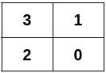
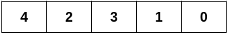
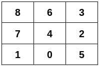

3311. Construct 2D Grid Matching Graph Layout

You are given a 2D integer array `edges` representing an undirected graph having `n` nodes, where `edges[i] = [ui, vi]` denotes an edge between nodes `ui` and `vi`.

Construct a 2D grid that satisfies these conditions:

* The grid contains **all nodes** from `0` to `n - 1` in its cells, with each node appearing exactly **once**.
* Two nodes should be in adjacent grid cells (**horizontally** or **vertically**) if and only if there is an edge between them in `edges`.

It is guaranteed that `edges` can form a 2D grid that satisfies the conditions.

Return a 2D integer array satisfying the conditions above. If there are multiple solutions, return any of them.

 

**Example 1:**
```
Input: n = 4, edges = [[0,1],[0,2],[1,3],[2,3]]

Output: [[3,1],[2,0]]

Explanation:
```


**Example 2:**
```
Input: n = 5, edges = [[0,1],[1,3],[2,3],[2,4]]

Output: [[4,2,3,1,0]]

Explanation:
```


**Example 3:**
```
Input: n = 9, edges = [[0,1],[0,4],[0,5],[1,7],[2,3],[2,4],[2,5],[3,6],[4,6],[4,7],[6,8],[7,8]]

Output: [[8,6,3],[7,4,2],[1,0,5]]

Explanation:
```

 

**Constraints:**

* `2 <= n <= 5 * 10^4`
* `1 <= edges.length <= 10^5`
* `edges[i] = [ui, vi]`
* `0 <= ui < vi < n`
* All the edges are distinct.
* The input is generated such that `edges` can form a 2D grid that satisfies the conditions.

# Submissions
---
**Solution 1: (Graph)**

__Intuition__
We need to create a grid layout from a set of nodes, ensuring the grid's edges match the original connections.

__Approach__
Build an adjacency list and track the degree of each node.
Group nodes by their degrees for easier processing.
Start from nodes of degree 1, then try pairs of degree 2 nodes, and extend from degree 2 nodes until a valid layout is formed.
Check if the constructed grid contains all nodes and matches the original edges.

```
Runtime: 1404 ms
Memory: 431.61 MB
```
```c++
typedef pair<int, int> pii;
class Solution {
    // Ensure the first element is less than or equal to the second in the pair
    pii fixPair(pii p) {
        if (p.first > p.second) swap(p.first, p.second);
        return p;
    }
public:
    vector<vector<int>> constructGridLayout(int n, vector<vector<int>>& edges) {
        // Graph representation and degree count
        unordered_map<int, vector<int>> graph; // Adjacency list
        unordered_map<int, int> degree;        // Degree of each node

        // Build the graph and degree count
        for (const auto& edge : edges) {
            degree[edge[0]]++;
            degree[edge[1]]++;
            graph[edge[0]].push_back(edge[1]);
            graph[edge[1]].push_back(edge[0]);
        }

        // Map nodes by degree
        unordered_map<int, vector<int>> nodesByDegree;
        for (const auto& node : degree) {
            nodesByDegree[node.second].push_back(node.first);
        }

        // Sort edges for later comparison
        vector<pii> edgeList;
        for (const auto& edge : edges) {
            edgeList.push_back(fixPair(pii(edge[0], edge[1])));
        }
        sort(edgeList.begin(), edgeList.end());

        // Function to check the validity of the grid layout
        auto isValidGrid = [&](const vector<vector<int>>& grid) -> bool {
            if (grid.empty() || grid.size() * grid[0].size() != n) return false;

            set<int> visited;
            for (const auto& row : grid) {
                for (int node : row) {
                    visited.insert(node);
                }
            }
            if (visited.size() != n) return false;

            vector<pii> generatedEdges;
            for (size_t i = 0; i < grid.size(); ++i) {
                for (size_t j = 0; j < grid[0].size(); ++j) {
                    if (i > 0) generatedEdges.push_back(fixPair(pii(grid[i][j], grid[i-1][j])));
                    if (j > 0) generatedEdges.push_back(fixPair(pii(grid[i][j], grid[i][j-1])));
                }
            }
            sort(generatedEdges.begin(), generatedEdges.end());
            return generatedEdges == edgeList;
        };

        // Function to extend the grid layout
        auto extendGrid = [&](vector<int> start) -> vector<vector<int>> {
            vector<vector<int>> grid;
            set<int> visited;
            grid.push_back(start);
            for (int node : start) visited.insert(node);

            while (true) {
                vector<int> nextRow;
                for (int u : grid.back()) {
                    int newAdj = -1;
                    for (int v : graph[u]) {
                        if (visited.find(v) == visited.end()) {
                            newAdj = v; // Find an unvisited adjacent node
                            break;
                        }
                    }
                    if (newAdj == -1) return {}; // No more unvisited adjacent nodes
                    nextRow.push_back(newAdj);
                    visited.insert(newAdj);
                }
                grid.push_back(nextRow);
                if (isValidGrid(grid)) return grid; // Check if the current layout is valid
            }
        };

        // Try to construct the grid layout starting from nodes of degree 1
        if (!nodesByDegree[1].empty()) {
            auto result = extendGrid({nodesByDegree[1][0]});
            if (!result.empty()) return result; // Return if a valid layout is found
        }

        // Try pairs of nodes of degree 2
        for (int a : nodesByDegree[2]) {
            for (int b : nodesByDegree[2]) {
                if (a != b) {
                    auto result = extendGrid({a, b});
                    if (!result.empty()) return result; // Return if a valid layout is found
                }
            }
        }

        // Try extending from a single node of degree 2
        if (!nodesByDegree[2].empty()) {
            vector<int> currentNodes;
            int startNode = nodesByDegree[2][0];
            currentNodes.push_back(startNode);
            set<int> visited;
            visited.insert(startNode);

            while (true) {
                int nextNode = -1;
                int current = currentNodes.back();
                for (int neighbor : graph[current]) {
                    if (visited.find(neighbor) == visited.end() && degree[neighbor] <= 3) {
                        nextNode = neighbor; // Find an unvisited node with degree <= 3
                        break;
                    }
                }
                if (nextNode == -1) break; // No more valid nodes to add
                currentNodes.push_back(nextNode);
                visited.insert(nextNode);
                if (degree[currentNodes.back()] == 2) break; // Stop if we reached a node of degree 2
            }
            auto result = extendGrid(currentNodes);
            if (!result.empty()) return result; // Return if a valid layout is found
        }

        return {}; // Return empty if no valid layout is found
    }
};
```

**Solution 2: (Graph, scan row by row)**
```
Runtime: 990 ms
Memory: 373.39 MB
```
```c++
class Solution {
public:
    vector<vector<int>> constructGridLayout(int n, vector<vector<int>>& edges) {
        vector<unordered_set<int>> g(n);
        for (auto e: edges) {
            g[e[0]].insert(e[1]);
            g[e[1]].insert(e[0]);
        }
        int i, k = INT_MAX, pre, cur;
        for (i = 0; i < n; i ++) {
            if (k > g[i].size()) {
                k = g[i].size();
                pre = i;
            }
        }
        vector<vector<int>> ans;
        vector<int> row;
        while (true) {
            row.clear();
            row.push_back(pre);
            i = 1;
            while (true) {
                if (ans.size() == 0) {
                    k = INT_MAX;
                    for (auto npre: g[pre]) {
                        if (k > g[npre].size()) {
                            k = g[npre].size();
                            cur = npre;
                        }
                    }
                } else {
                    for (auto npre: g[pre]) {
                        if (*g[ans.back()[i]].begin() == npre) {
                            cur = npre;
                            break;
                        }
                    }
                }
                row.push_back(cur);
                g[cur].erase(pre);
                g[pre].erase(cur);
                if (ans.size()) {
                    g[cur].erase(ans.back()[i]);
                    g[ans.back()[i]].erase(cur);
                }
                if (g[cur].size() == g[row[0]].size()) {
                    break;
                }
                pre = cur;
                i += 1;
            }
            ans.push_back(row);
            if (g[row[0]].size() == 0) {
                break;
            }
            pre = *g[row[0]].begin();
            g[row[0]].erase(pre);
            g[pre].erase(row[0]);
        }
        return ans;
    }
};
```
