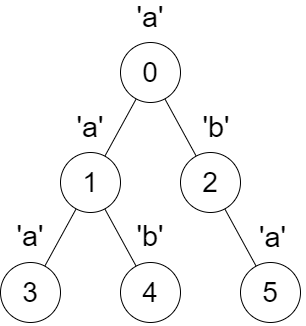
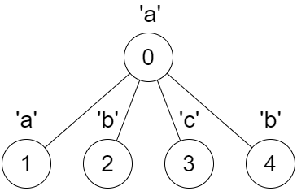

3327. Check if DFS Strings Are Palindromes

You are given a tree rooted at node 0, consisting of `n` nodes numbered from `0` to `n - 1`. The tree is represented by an array `parent` of size `n`, where `parent[i]` is the parent of node `i`. Since node `0` is the root, `parent[0] == -1`.

You are also given a string `s` of length `n`, where `s[i]` is the character assigned to node `i`.

Consider an empty string `dfsStr`, and define a recursive function `dfs(int x)` that takes a node `x` as a parameter and performs the following steps in order:

* Iterate over each child `y` of `x` **in increasing order of their numbers**, and call `dfs(y)`.
* Add the character `s[x]` to the end of the string `dfsStr`.

**Note** that `dfsStr` is shared across all recursive calls of `dfs`.

You need to find a boolean array `answer` of size `n`, where for each index `i` from `0` to `n - 1`, you do the following:

* Empty the string `dfsStr` and call `dfs(i)`.
* If the resulting string `dfsStr` is a **palindrome**, then set `answer[i]` to `true`. Otherwise, set `answer[i]` to `false`.

Return the array `answer`.

A **palindrome** is a string that reads the same forward and backward.

 

**Example 1:**


```
Input: parent = [-1,0,0,1,1,2], s = "aababa"

Output: [true,true,false,true,true,true]

Explanation:

Calling dfs(0) results in the string dfsStr = "abaaba", which is a palindrome.
Calling dfs(1) results in the string dfsStr = "aba", which is a palindrome.
Calling dfs(2) results in the string dfsStr = "ab", which is not a palindrome.
Calling dfs(3) results in the string dfsStr = "a", which is a palindrome.
Calling dfs(4) results in the string dfsStr = "b", which is a palindrome.
Calling dfs(5) results in the string dfsStr = "a", which is a palindrome.
```

**Example 2:**


```
Input: parent = [-1,0,0,0,0], s = "aabcb"

Output: [true,true,true,true,true]

Explanation:

Every call on dfs(x) results in a palindrome string.
```
 

**Constraints:**

* `n == parent.length == s.length`
* `1 <= n <= 10^5`
* `0 <= parent[i] <= n - 1 for all i >= 1.`
* `parent[0] == -1`
* `parent` represents a valid tree.
* `s` consists only of lowercase English letters.

# Submissions
---
**Solution 1: (Manacher Algorithm)**

__Intuition__
Manacher algorithm helps us to find if a substring is a palindrome in O(1) and O(N) precomputation.

__Approach__
dfsStr of a node is a substring of root's dfsStr.
Store starting and ending index of a node's dfsStr in root's dfsStr.
Run Manacher Algorithm on root's dfsStr.
For each node we know the starting and ending index of it's dfsStr (say a and b) in root's dfsStr hence, assign a center and check if manacher_array[center] >= b-a+1.
__Note__
Sorting the childs is not needed because we process child in increasing order while constructing the tree (Thanks to @Ajit123 for pointing it out.)
You can study about Manacher Algorithm from cp-algorithms but it can be used as a blackbox, just knowing what it does is fine.
__Complexity__
Time complexity:
O(N)
Code

```
Runtime: 342 ms
Memory: 282.35 MB
```
```c++
class Solution {
    vector<pair<int, int>> range;
    
    vector<int> manacher_odd(string s) {
        int n = s.size();
        s = "$" + s + "^";
        vector<int> p(n + 2);
        int l = 1, r = 1;
        for(int i = 1; i <= n; i++) {
            p[i] = max(0, min(r - i, p[l + (r - i)]));
            while(s[i - p[i]] == s[i + p[i]]) {
                p[i]++;
            }
            if(i + p[i] > r) {
                l = i - p[i], r = i + p[i];
            }
        }
        return vector<int>(begin(p) + 1, end(p) - 1);
    }
    
    vector<int> manacher(string s) {
        string t;
        for(auto c: s) {
            t += string("#") + c;
        }
        auto res = manacher_odd(t + "#");
        return vector<int>(begin(res) + 1, end(res) - 1);
    }
    
    void dfs(int node, vector<int> tree[], string &s, string &res, int par = -1) {
        int idx = res.size();
        for (int child : tree[node]) {
            if (child == par) continue;
            dfs(child, tree, s, res, node);
        }
        
        res += s[node];
        range[node] = {idx, res.size() - 1};
    }
public:
    vector<bool> findAnswer(vector<int>& parent, string s) {
        int n = parent.size();
        vector<int> tree[n];
        for (int i = 1; i < n; i++) tree[parent[i]].push_back(i);

        range.resize(n);
        string res;
        dfs(0, tree, s, res);

        vector<int> manacher_array = manacher(res);

        vector<bool> ans(n, false);
        
        for (int i = 0; i < n; i++) {
            auto &[a, b] = range[i];
            int len = b - a + 1;
            int temp = manacher_array[a + b] - 1;
            if (temp >= len) ans[i] = true;
        }

        return ans;
    }
};
```
