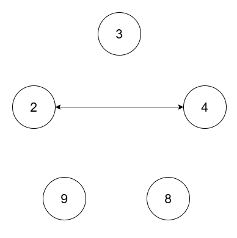
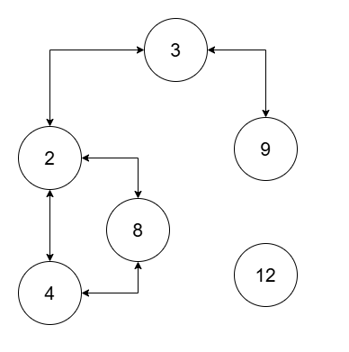

3378. Count Connected Components in LCM Graph

You are given an array of integers `nums` of size `n` and a positive integer `threshold`.

There is a graph consisting of `n` nodes with the `i`^th node having a value of `nums[i]`. Two nodes `i` and `j` in the graph are connected via an undirected edge if `lcm(nums[i], nums[j]) <= threshold`.

Return the number of **connected components** in this graph.

A **connected component** is a subgraph of a graph in which there exists a path between any two vertices, and no vertex of the subgraph shares an edge with a vertex outside of the subgraph.

The term `lcm(a, b)` denotes the **least common multiple** of `a` and `b`.

 

**Example 1:**
```
Input: nums = [2,4,8,3,9], threshold = 5

Output: 4

Explanation: 
```
 
```
The four connected components are (2, 4), (3), (8), (9).
```

**Example 2:**
```
Input: nums = [2,4,8,3,9,12], threshold = 10

Output: 2

Explanation: 
```

```
The two connected components are (2, 3, 4, 8, 9), and (12).
```
 

**Constraints:**

* `1 <= nums.length <= 10^5`
* `1 <= nums[i] <= 10^9`
* All elements of `nums` are unique.
* `1 <= threshold <= 2 * 105`

# Submissions
---
**Solution 1: (Union Find)**
```
Runtime: 371 ms
Memory: 91.98 MB
```
```c++
struct UnionFind {
    vector<int> parent, rank;
    explicit UnionFind(int n) : parent(vector<int>(n)), rank(vector<int>(n, 1)) {
        iota(parent.begin(), parent.end(), 0);
    }
    int find(int node) {
        if(node == parent[node]) return node;
        return parent[node] = find(parent[node]);
    }
    bool unite(int node1, int node2) {
        int p1 = find(node1);
        int p2 = find(node2);
        if(p1 == p2) return false; // Same parent
        if(rank[p1] >= rank[p2]) {
            // Append p2 under p1
            parent[p2] = p1;
            rank[p1] += rank[p2];
        }else {
            parent[p1] = p2;
            rank[p2] += rank[p1];
        }
        return true;
    }
};

class Solution {
public:
    int countComponents(vector<int>& nums, int threshold) {
        int ans = 0;
        sort(nums.begin(), nums.end());
        // threshold <= 200k, lcm(a,b) at least a and b, so discard anything > threshold
        while(!nums.empty() && nums.back() > threshold) ans++, nums.pop_back();
        if(nums.empty()) return ans;
        int n = nums.size();

        // for fixed x and factor d (of x),
        // to minimize lcm(x,y) such that y also has a factor d
        // it is optimal that y is minimum / minimized
        // note: lcm(a,b) = a*b / gcd(a,b)
        // so we store the minimum y for each d

        UnionFind dsu(n);
        unordered_map<int, int> minIdx;
        auto tryUnite = [&](int i, int divisor) {
        	if(minIdx.count(divisor)) {
        		int other = minIdx[divisor];
        		if(lcm(nums[i], nums[other]) <= threshold) {
        			dsu.unite(i, other);
        		}
        	}else {
        		minIdx[divisor] = i;
        	}
        };
        for(int i = 0; i < n; i++) {
        	for(int divisor = 1; divisor * divisor <= nums[i]; divisor++) {
        		if(nums[i] % divisor == 0) {
        			tryUnite(i, divisor);
        			tryUnite(i, nums[i] / divisor);
        		}
        	}
        }
        unordered_set<int> components;
        for(int i = 0; i < n; i++) components.insert(dsu.find(i));
        return ans + components.size();
    }
};
```
