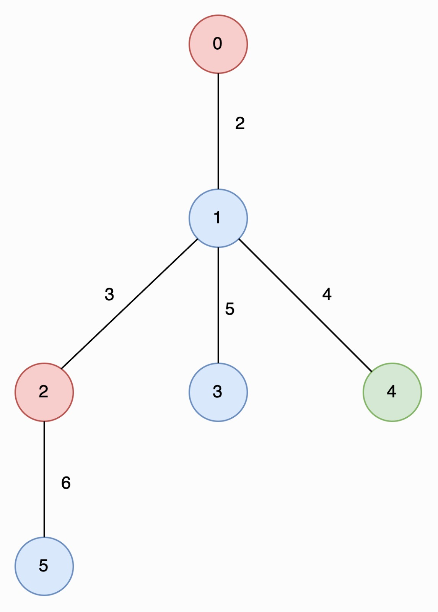
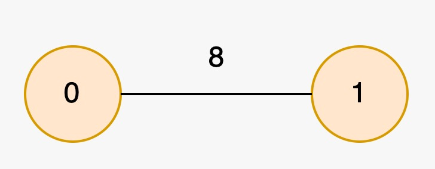

3425. Longest Special Path

You are given an undirected tree rooted at node `0` with `n` nodes numbered from `0` to `n - 1`, represented by a 2D array `edges` of length `n - 1`, where `edges[i] = [ui, vi, lengthi]` indicates an edge between nodes `ui` and `vi` with length `lengthi`. You are also given an integer array `nums`, where `nums[i]` represents the value at node `i`.

A special path is defined as a **downward** path from an ancestor node to a descendant node such that all the values of the nodes in that path are **unique**.

**Note** that a path may start and end at the same node.

Return an array `result` of size 2, where `result[0]` is the **length** of the **longest** special path, and `result[1]` is the **minimum** number of nodes in all possible **longest** special paths.

 

**Example 1:**
```
Input: edges = [[0,1,2],[1,2,3],[1,3,5],[1,4,4],[2,5,6]], nums = [2,1,2,1,3,1]

Output: [6,2]

Explanation:

In the image below, nodes are colored by their corresponding values in nums
```

```
The longest special paths are 2 -> 5 and 0 -> 1 -> 4, both having a length of 6. The minimum number of nodes across all longest special paths is 2.
```

**Example 2:**
```
Input: edges = [[1,0,8]], nums = [2,2]

Output: [0,1]

Explanation:
```

```
The longest special paths are 0 and 1, both having a length of 0. The minimum number of nodes across all longest special paths is 1.
```
 

Constraints:

* `2 <= n <= 5 * 10^4`
* `edges.length == n - 1`
* `edges[i].length == 3`
* `0 <= ui, vi < n`
* `1 <= lengthi <= 10^3`
* `nums.length == n`
* `0 <= nums[i] <= 5 * 10^4`
* The input is generated such that edges represents a valid tree.

# Submissions
---
**Solution 1: (Sliding Window On Tree)**
```
Runtime: 1718 ms
Memory: 274.33 MB
```
```c++
class Solution {
public:
    vector<int> longestSpecialPath(vector<vector<int>>& edges, vector<int>& nums) {
        int n = edges.size() + 1;

        // <to, length>
        vector<vector<array<int, 2>>> adj(n);
        for(auto& edge : edges) {
            adj[edge[0]].push_back({edge[1], edge[2]});
            adj[edge[1]].push_back({edge[0], edge[2]});
        }

        // prefix sum of edges lengths
        vector<int> pre;
        map<int, int> res;
        map<int, vector<int>> occurence;

        // length = 0 -> min 1 node
        res[0] = 1;
        auto dfs = [&](this auto&& dfs, int v, int parent,
                int startDepth, int currDepth) -> void {
            int val = nums[v];
            if(!occurence[val].empty()) {
                startDepth = max(startDepth, occurence[val].back() + 1);
            }
            occurence[val].push_back(currDepth);

            int nodes = currDepth - startDepth + 1;
            int edges = nodes - 1;
            if(edges > 0) {
                int sz = pre.size();
                int len = pre[sz-1];
                if((sz-edges-1) >= 0) len -= pre[sz-edges-1];
                if(res.count(len)) {
                    res[len] = min(res[len], nodes);
                }else {
                    res[len] = nodes;
                }
            }


            for(auto& [nextV, edgeLen] : adj[v]) {
                if(nextV != parent) {
                    if(pre.empty()) pre.push_back(edgeLen);
                    else pre.push_back(pre.back() + edgeLen);
                    dfs(nextV, v, startDepth, currDepth + 1);
                    pre.pop_back();
                }
            }


            occurence[val].pop_back();
        };
        dfs(0, -1, 0, 0);
        return {res.rbegin()->first, res.rbegin()->second};
    }
};
```
