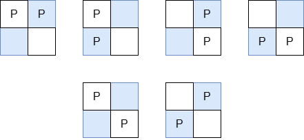

3426. Manhattan Distances of All Arrangements of Pieces

You are given three integers `m`, `n`, and `k`.

There is a rectangular grid of size `m × n` containing `k` identical pieces. Return the sum of Manhattan distances between every pair of pieces over all **valid arrangements** of pieces.

A **valid arrangement** is a placement of all k pieces on the grid with **at most** one piece per cell.

Since the answer may be very large, return it **modulo** `10^9 + 7`.

The Manhattan Distance between two cells `(xi, yi)` and `(xj, yj)` is `|xi - xj| + |yi - yj|`.

 

**Example 1:**
```
Input: m = 2, n = 2, k = 2

Output: 8

Explanation:

The valid arrangements of pieces on the board are:
```

```
In the first 4 arrangements, the Manhattan distance between the two pieces is 1.
In the last 2 arrangements, the Manhattan distance between the two pieces is 2.
Thus, the total Manhattan distance across all valid arrangements is 1 + 1 + 1 + 1 + 2 + 2 = 8.
```

**Example 2:**
```
Input: m = 1, n = 4, k = 3

Output: 20

Explanation:

The valid arrangements of pieces on the board are:
```

```
The first and last arrangements have a total Manhattan distance of 1 + 1 + 2 = 4.
The middle two arrangements have a total Manhattan distance of 1 + 2 + 3 = 6.
The total Manhattan distance between all pairs of pieces across all arrangements is 4 + 6 + 6 + 4 = 20.
```
 

**Constraints:**

* `1 <= m, n <= 10^5`
* `2 <= m * n <= 10^5`
* `2 <= k <= m * n`

# Submissions
---
**Solution 1: (Combination)**

__Explanation__
Consider the contribution of distance from two different rows:

If the distance of rows is d = 1,
there are m - 1 combination: (0,1),(1,2) ...
If the distance of rows is d = 2,
there are m - 2 combination: (0,2),(1,3) ...
For distance d, there are m - d combinations.

For each combination of (xi, xj) above,
the yi has n options,
yj has n options,
the rest of points has comb(m - n - 2, k - 2) combinations.

Same process for contribution from two different cols.

__Complexity__
Time O(m + n + k)
Space O(1)

```
Runtime: 19 ms
Memory: 8.74 MB
```
```c++
class Solution {
    long long comb(long long a, long long b, long long mod) {
        if (b > a) return 0;
        long long numer = 1, denom = 1;
        for (long long i = 0; i < b; ++i) {
            numer = numer * (a - i) % mod;
            denom = denom * (i + 1) % mod;
        }

        // Fermat's Little Theorem
        long long denom_inv = 1;
        long long exp = mod - 2;
        while (exp) {
            if (exp % 2) denom_inv = denom_inv * denom % mod;
            denom = denom * denom % mod;
            exp /= 2;
        }
        return numer * denom_inv % mod;
    }
public:
    int distanceSum(int m, int n, int k) {
        int mod = 1e9 + 7;
        long long base = comb(m * n - 2, k - 2, mod);
        long long res = 0;
        for (int d = 1; d < n; ++d) {
            res = (res + 1LL * d * (n - d) % mod * m % mod * m % mod) % mod;
        }
        for (int d = 1; d < m; ++d) {
            res = (res + 1LL * d * (m - d) % mod * n % mod * n % mod) % mod;
        }
        return res * base % mod;
    }
};
```
