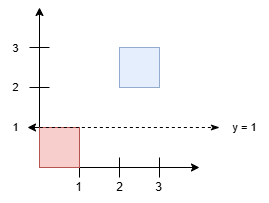
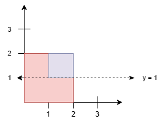

3454. Separate Squares II

You are given a 2D integer array `squares`. Each `squares[i] = [xi, yi, li]` represents the coordinates of the bottom-left point and the side length of a square parallel to the x-axis.

Find the **minimum** y-coordinate value of a horizontal line such that the total area covered by squares above the line equals the total area covered by squares below the line.

Answers within `10^-5` of the actual answer will be accepted.

**Note**: Squares may overlap. Overlapping areas should be counted **only once** in this version.

 

**Example 1:**
```
Input: squares = [[0,0,1],[2,2,1]]

Output: 1.00000

Explanation:
```

```
Any horizontal line between y = 1 and y = 2 results in an equal split, with 1 square unit above and 1 square unit below. The minimum y-value is 1.
```

**Example 2:**
```
Input: squares = [[0,0,2],[1,1,1]]

Output: 1.00000

Explanation:
```

```
Since the blue square overlaps with the red square, it will not be counted again. Thus, the line y = 1 splits the squares into two equal parts.
```
 

**Constraints:**

* `1 <= squares.length <= 5 * 10^4`
* `squares[i] = [xi, yi, li]`
* `squares[i].length == 3`
* `0 <= xi, yi <= 10^9`
* `1 <= li <= 10^9`

# Submissions
---
**Solution 1: (Line Sweep + Segment Tree)**

__Prerequisites__
Coordinate Compression
Line Sweep
Segment Tree
__Approach__
To calculate the full area of rectangles without calculating overlap, you can use Line Sweep. Make events on when the squares START and END. Sort it by y-coordinate, then one-by-one, process each event:
Query the cells covered by all ranges [more on this later], multiply it by distance to previous event, then add to total_area.
START: Add range (x1, x2)
END: Remove range (x1, x2)
So, we have found the total_area then we need to find the point where each half contains total_area/2.
We can do another Line Sweep to achieve the same effect, with a little bit of math: (let T = total_area)
At some event after we add the current covered area, we will have the area cross T/2. That means the best partition point is in between prev_y and event.y.
next_area=prev_area+covered∗(y−prev_y)
We want next_area = T/2 for best point.
2
T
​
 =prev_area+covered∗(y−prev_y)
2
T
​
 −prev_area=covered∗(y−prev_y)
covered
2
1
​
 T−prev_area
​
 =y−prev_y
prev_y+ 
covered
2
1
​
 T−prev_area
​
 =y
Now, the Line Sweep part is done, but how do we do the following operations efficiently?
Insert range (x1, x2)
Erase range (x1, x2)
Query covered cells by all ranges
Here is my approach:
Stop thinking in the borders of the cells. Think in the indices of each cell. This is easier in my opinion.
image.png
Compress the x-coordinates into a managable size.
What are the important points? The important points are the border of each range and 1 cell outside the border of each range.
Why do we need the 1 cell outside the border of each range? Well, we could have the following scenario: (after compression)
Range [0,1] and Range [4, 5]
If we don't consider 1 outside, then if we cover Range [0,1] and Range [4,5], the segment tree will assume we will've covered [1,4] as well. (This will be explained later)
Let adding and removing a range as just incrementing / decrementing a value of a SegmentTree node. We will navigate through the segment tree and increment/decrement covered_cnt at the node. This will indicate how many ranges cover [L, R] fully.
We will also have covered_len which is the actual covered length which can be calculated as follows:
If covered_cnt≥1, covered_len = v 
r
​
 −v 
l
​
 +1
Otherwise, covered_len = covered[childrenOne]+covered[childrenTwo]
However, this misses a case where a range is split into two nodes and the distances aren't counted for.
For example:
Segment tree nodes split into (after decompression) [11, 20] and [40, 60]
If we cover the range [11, 60], then the calculated length would actually be (20 - 11 + 1) + (60 - 40 + 1) = 31 instead of the expected 50.
To account for this, we add two variables:
left_covered: Whether the left side of this node is covered.
right_covered: Whether the right side of this node is covered.
When merging, if left_children has right side covered and right_children has left side covered, we can merge the difference between them, which is val[mid + 1] - val[mid] - 1. In that example, we would be adding (40 - 20 - 1) = 19 so 31 + 19 = 50-> correct.
This is also why we need to include 1 cell outside each range, so we also don't mistakenly merge when we actually don't add range [11, 60] but add [11,20] and [40,60]. In this case, the segment tree would recognize there is 21 and 39 in between them and wouldn't merge the values.
Finally, the amount of covered cells will be at the root of the Segment Tree.
image.png

__Complexity__
Time complexity: O(n∗log(n))

Space complexity: O(n)

```
Runtime: 551 ms, Beats 20.00%
Memory: 143.53 MB, Beats 10.00%
```
```c++
const int START = +1, END = -1;
struct Event {
	int x1, x2, y, type;
};
struct Range {
	int x1, x2;
};
struct Node {
	int covered_cnt;
	int covered_len;
	bool left_covered = false;
	bool right_covered = false;
};
struct SegmentTree {
	vector<int> vals;
    vector<Node> tree;
    int sz;
    SegmentTree(const set<int>& st) : tree(vector(4*st.size(), Node {0, 0})), sz(st.size()) {
    	vals.assign(st.begin(), st.end());
    }

    void update_range(int l, int r, int delta) {
    	update_range(l, r, delta, 1, 0, sz - 1);
    }
    void update_range(int l, int r, int delta, int v, int vl, int vr) {
    	if(vl > r || vr < l) return;

    	int mid = (vl + vr) / 2;
    	if(l <= vl && vr <= r) {
    		tree[v].covered_cnt += delta;
    	}else {
	    	update_range(l, r, delta, 2*v, vl, mid);
	    	update_range(l, r, delta, 2*v + 1, mid + 1, vr);
    	}
    	if(tree[v].covered_cnt) {
    		tree[v].covered_len = vals[vr] - vals[vl] + 1;
    		tree[v].left_covered = tree[v].right_covered = true;
    	}else if(vl == vr) {
    		tree[v].covered_len = 0;
    		tree[v].left_covered = tree[v].right_covered = false;
    	}else {
    		tree[v].covered_len = tree[2*v].covered_len + tree[2*v+1].covered_len;
    		if(tree[2*v].right_covered && tree[2*v+1].left_covered) {
    			tree[v].covered_len += vals[mid + 1] - vals[mid] - 1;
    		}
    		tree[v].left_covered = tree[2*v].left_covered;
    		tree[v].right_covered = tree[2*v+1].right_covered;
    	}
    }
    int covered() {
    	return tree[1].covered_len;
    }
};

class Solution {
public:
    double separateSquares(vector<vector<int>>& squares) {
        map<int, int> mapping;
    	set<int> vals;
		for(auto& sq : squares) {
			vals.insert(sq[0] - 1);
			vals.insert(sq[0]);
			vals.insert(sq[0] + sq[2] - 1);
			vals.insert(sq[0] + sq[2]);
		}
		for(int val : vals) {
			mapping[val] = mapping.size();
		}
        
    	vector<Event> events;
		for(auto& sq : squares) {
			int x1 = sq[0], x2 = sq[0] + sq[2] - 1;

			events.emplace_back(mapping[x1], mapping[x2], sq[1], START);
			events.emplace_back(mapping[x1], mapping[x2], sq[1] + sq[2], END);
		}
		sort(events.begin(), events.end(), [](auto& a, auto& b) -> bool { return a.y < b.y; });

		SegmentTree segtree(vals);

		int prev_y = 0;
		long long total_area = 0;
		for(auto& event : events) {
			total_area += 1LL * (event.y - prev_y) * segtree.covered();
			prev_y = event.y;
			segtree.update_range(event.x1, event.x2, event.type);
		}

		long long current_area = 0;
		prev_y = 0;
		for(auto& event : events) {	
			long long next_area = current_area + 1LL * (event.y - prev_y) * segtree.covered();
			if(next_area >= (total_area + 1) / 2) {
				return prev_y + ( (total_area / 2.0) - current_area ) / segtree.covered();
			}else {
				current_area = next_area;
			}
			prev_y = event.y;
			segtree.update_range(event.x1, event.x2, event.type);
		}
		throw "impossible";
    }
};
```

**Solution 2: (Scanning Line + Segment Tree)**
```
Runtime: 275 ms, Beats 90.65%
Memory: 137.43 MB, Beats 69.07%
```
```c++
class SegmentTree {
private:
    vector<int> count;
    vector<int> covered;
    vector<int> xs;
    int n;

    void modify(int qleft, int qright, int qval, int left, int right, int pos) {
        if (xs[right + 1] <= qleft || xs[left] >= qright) {
            return;
        }
        if (qleft <= xs[left] && xs[right + 1] <= qright) {
            count[pos] += qval;
        } else {
            int mid = (left + right) / 2;
            modify(qleft, qright, qval, left, mid, pos * 2 + 1);
            modify(qleft, qright, qval, mid + 1, right, pos * 2 + 2);
        }

        if (count[pos] > 0) {
            covered[pos] = xs[right + 1] - xs[left];
        } else {
            if (left == right) {
                covered[pos] = 0;
            } else {
                covered[pos] = covered[pos * 2 + 1] + covered[pos * 2 + 2];
            }
        }
    }

public:
    SegmentTree(vector<int>& xs_) : xs(xs_) {
        n = xs.size() - 1;
        count.resize(4 * n, 0);
        covered.resize(4 * n, 0);
    }

    void update(int qleft, int qright, int qval) {
        modify(qleft, qright, qval, 0, n - 1, 0);
    }

    int query() { return covered[0]; }
};

class Solution {
public:
    double separateSquares(vector<vector<int>>& squares) {
        vector<tuple<int, int, int, int>> events;
        set<int> xsSet;

        for (auto& sq : squares) {
            int x = sq[0], y = sq[1], l = sq[2];
            int xr = x + l;
            events.emplace_back(y, 1, x, xr);
            events.emplace_back(y + l, -1, x, xr);
            xsSet.insert(x);
            xsSet.insert(xr);
        }

        // sort events by y-coordinate
        sort(events.begin(), events.end());
        // discrete coordinates
        vector<int> xs(xsSet.begin(), xsSet.end());
        // initialize the segment tree
        SegmentTree segTree(xs);

        vector<double> psum;
        vector<int> widths;
        double total_area = 0.0;
        int prev = get<0>(events[0]);

        // scan: calculate total area and record intermediate states
        for (auto& [y, delta, xl, xr] : events) {
            int len = segTree.query();
            total_area += 1LL * len * (y - prev);
            segTree.update(xl, xr, delta);
            // record prefix sums and widths
            psum.push_back(total_area);
            widths.push_back(segTree.query());
            prev = y;
        }

        // calculate the target area (half rounded up)
        long long target = (long long)(total_area + 1) / 2;
        // find the first position greater than or equal to target using binary
        // search
        int i =
            lower_bound(psum.begin(), psum.end(), target) - psum.begin() - 1;
        // get the corresponding area, width, and height
        double area = psum[i];
        int width = widths[i], height = get<0>(events[i]);

        return height + (total_area - area * 2) / (width * 2.0);
    }
};
```
