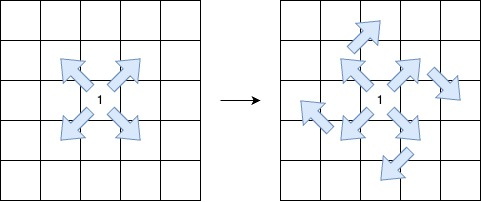

3459. Length of Longest V-Shaped Diagonal Segment

You are given a 2D integer matrix `grid` of size `n x m`, where each element is either `0`, `1`, or `2`.

A **V-shaped diagonal segment** is defined as:

* The segment starts with `1`.
* The subsequent elements follow this infinite sequence: `2, 0, 2, 0, ....`
* The segment:
    * Starts **along** a diagonal direction (top-left to bottom-right, bottom-right to top-left, top-right to bottom-left, or bottom-left to top-right).
    * Continues the **sequence** in the same diagonal direction.
    * Makes **at most one clockwise 90-degree turn** to another diagonal direction while **maintaining** the sequence.



Return the **length** of the **longest V-shaped diagonal segment**. If no valid segment exists, return 0.

 

**Example 1:**
```
Input: grid = [[2,2,1,2,2],[2,0,2,2,0],[2,0,1,1,0],[1,0,2,2,2],[2,0,0,2,2]]

Output: 5

Explanation:
```

```
The longest V-shaped diagonal segment has a length of 5 and follows these coordinates: (0,2) → (1,3) → (2,4), takes a 90-degree clockwise turn at (2,4), and continues as (3,3) → (4,2).
```

**Example 2:**
```
Input: grid = [[2,2,2,2,2],[2,0,2,2,0],[2,0,1,1,0],[1,0,2,2,2],[2,0,0,2,2]]

Output: 4

Explanation:
```

```
The longest V-shaped diagonal segment has a length of 4 and follows these coordinates: (2,3) → (3,2), takes a 90-degree clockwise turn at (3,2), and continues as (2,1) → (1,0).
```

**Example 3:**
```
Input: grid = [[1,2,2,2,2],[2,2,2,2,0],[2,0,0,0,0],[0,0,2,2,2],[2,0,0,2,0]]

Output: 5

Explanation:
```

```
The longest V-shaped diagonal segment has a length of 5 and follows these coordinates: (0,0) → (1,1) → (2,2) → (3,3) → (4,4).
```

**Example 4:**
```
Input: grid = [[1]]

Output: 1

Explanation:

The longest V-shaped diagonal segment has a length of 1 and follows these coordinates: (0,0).
```
 

**Constraints:**

* `n == grid.length`
* `m == grid[i].length`
* `1 <= n, m <= 500`
* `grid[i][j]` is either `0`, `1` or `2`.

# Submissions
---
**Solution 1: (DP)**

__Explanation__
DFS with memo.
Current position (i, j),
the value to search x, where x = 0,1,2
the direction indice d, where direction is [[1,1],[1,-1],[-1,-1],[-1,1]]
and k is the time to turn.

__Complexity__
Time and Space O(m * n * 3 * 4 * 2)

```
Runtime: 4837 ms, Beats 100.00%
Memory: 755.55 MB, Beats 100.00%
```
```python
class Solution:
    def lenOfVDiagonal(self, grid: List[List[int]]) -> int:

        @cache
        def dp(i,j,x,d,k):
            if not (0 <= i < n and 0 <= j < m): return 0
            if grid[i][j] != x: return 0
            res = dp(i + ds[d][0], j + ds[d][1], nx[x], d, k) + 1
            if k > 0:
                d2 = (d + 1) % 4
                res2 = dp(i + ds[d2][0], j + ds[d2][1], nx[x], d2, 0) + 1
                res = max(res, res2)
            return res

        ds = [[1,1],[1,-1],[-1,-1],[-1,1]]
        nx = [2,2,0]
        res = 0
        n, m = len(grid), len(grid[0])
        for i in range(n):
            for j in range(m):
                if grid[i][j] == 1:
                    cur = max(dp(i, j, 1, d, 1) for d in range(4))
                    res = max(res, cur)
        return res
```

**Solution 2: (DP Top-Down)**
```
Runtime: 230 ms, Beats 85.03%
Memory: 103.34 MB, Beats 74.33%
```
```c++
class Solution {
    int dx[4] = {1, 1, -1, -1};
    int dy[4] = {1, -1, -1, 1};
    int dp[500][500][4][2];
    int dfs(int i, int j, int d, bool is_turn, int target, vector<vector<int>> &grid) {
        int m = grid.size(), n = grid[0].size(), ni, nj;
        ni = i + dx[d];
        nj = j + dy[d];
        if (ni < 0 || nj < 0 || ni >= m || nj >= n || grid[ni][nj] != target) {
            return 0;
        }
        if (dp[ni][nj][d][is_turn] != -1) {
            return dp[ni][nj][d][is_turn];
        }
        int rst = dfs(ni, nj, d, is_turn, 2 - target, grid);
        if (is_turn) {
            rst = max(rst, dfs(ni, nj, (d + 1)%4, false, 2 - target, grid));
        }
        rst += 1;
        dp[ni][nj][d][is_turn] = rst;
        return rst;
    };
public:
    int lenOfVDiagonal(vector<vector<int>>& grid) {
        int m = grid.size(), n = grid[0].size(), i, j, ni, nj, d, ans = 0;
        memset(dp, -1, sizeof(dp));
        for (i = 0; i < m; i ++) {
            for (j = 0; j < n; j ++) {
                if (grid[i][j] == 1) {
                    for (d = 0; d < 4; d ++) {
                        ans = max(ans, dfs(i, j, d, true, 2, grid) + 1);
                    }
                }
            }
        }
        return ans;
    }
};
```
