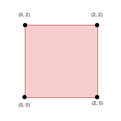
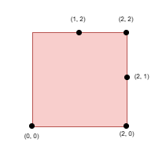
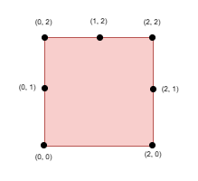

3464. Maximize the Distance Between Points on a Square

You are given an integer `side`, representing the edge length of a square with corners at `(0, 0)`, `(0, side)`, `(side, 0)`, and `(side, side)` on a Cartesian plane.

You are also given a positive integer `k` and a 2D integer array `points`, where `points[i] = [xi, yi]` represents the coordinate of a point lying on the boundary of the square.

You need to select `k` elements among `points` such that the **minimum** Manhattan distance between any two points is **maximized**.

Return the **maximum** possible **minimum** Manhattan distance between the selected `k` points.

The Manhattan Distance between two cells `(xi, yi)` and `(xj, yj)` is `|xi - xj| + |yi - yj|`.

 

**Example 1:**
```
Input: side = 2, points = [[0,2],[2,0],[2,2],[0,0]], k = 4

Output: 2

Explanation:
```

```
Select all four points.
```

**Example 2:**
```
Input: side = 2, points = [[0,0],[1,2],[2,0],[2,2],[2,1]], k = 4

Output: 1

Explanation:
```

```
Select the points (0, 0), (2, 0), (2, 2), and (2, 1).
```

**Example 3:**
```
Input: side = 2, points = [[0,0],[0,1],[0,2],[1,2],[2,0],[2,2],[2,1]], k = 5

Output: 1

Explanation:
```

```
Select the points (0, 0), (0, 1), (0, 2), (1, 2), and (2, 2).
```
 

**Constraints:**

* `1 <= side <= 10^9`
* `4 <= points.length <= min(4 * side, 15 * 103)`
* `points[i] == [xi, yi]`
* The input is generated such that:
* `points[i]` lies on the boundary of the square.
* All points[i] are unique.
* `4 <= k <= min(25, points.length)`

# Submissions
---
**Solution 1: (Binary Search, Greedy, Circular Array Handling, Coordinate Transformation)**

__Intuition__
Since all the given points lie on the boundary of a square, we can linearize the problem by mapping each point to a 1D coordinate along the square’s perimeter. This converts the 2D Manhattan distance problem into a 1D circular gap problem. Once mapped, our goal is to choose k points from this circular list such that the minimum gap between any two consecutive selected points (in circular order) is maximized.

__Approach__
Mapping to 1D:
Each point (x, y) is mapped to a coordinate t along the perimeter:

Bottom edge ((y = 0)): (t = x).
Right edge ((x = side})): (t = side + y).
Top edge ((y = side)): (t = 3 * side - x).
Left edge ((x = 0)): (t = 4 * side - y).
Sorting and Extended Array:
Sort the mapped coordinates. To handle the circular nature of the perimeter (of total length (L = 4 * {side})), create an extended array by duplicating the sorted array and adding (L) to each element in the duplicate. This allows us to treat the circle as a straight line when checking gaps.

Binary Search on the Candidate Distance:
Use binary search to determine the maximum candidate minimum distance (d) in the range ([0, 2 * text{side}]).

Feasibility Check with Greedy Selection:
For each candidate (d), perform a greedy selection on the extended array:

Start from each possible starting index in the original sorted array.
Greedily select the next point that is at least (d) away from the last chosen point.
Ensure that after selecting (k) points, the wrap-around gap (from the last chosen point back to the first, adjusted by (L)) is also at least (d).
Return the Result:
The binary search returns the maximum feasible (d) that meets the selection criteria.

__Complexity__
Time Complexity:

Mapping and Sorting:(O(n log n)), where (n) is the number of points.
Binary Search: (O(log(2∗textside)))iterations.
Feasibility Check per Iteration:Each check uses greedy selection with binary search, taking approximately(O(n∗k∗logn))in the worst case (with(k<=25)as a small constant).
Overall: (O(nlogn+log(2∗side)∗n∗k∗logn)), which is efficient given(n<=15000).
Space Complexity:
(O(n))for storing the mapped coordinates and the extended array.

```
Runtime: 205 ms, Beats 10.45%
Memory: 75.65 MB, Beats 8.96%
```
```c++
class Solution {
    // Map a boundary point (x,y) to a coordinate in [0, 4*side)
    long long mapPoint(int side, int x, int y) {
        // bottom: (x,0) -> t = x.
        // right: (side,y) -> t = side + y.
        // top: (x,side) -> t = 3*side - x.
        // left: (0,y) -> t = 4*side - y.
        if (y == 0) return x; 
        if (x == side) return side + y;
        if (y == side) return 3LL * side - x;
        return 4LL * side - y;
    }
    
    // Given sorted 1D positions t (mapped from points) and candidate distance d,
    // check if we can select k points around the circle (perimeter L = 4*side)
    // so that every adjacent gap (in circular order) is at least d.
    bool canPlace(const vector<long long>& t, int k, int side, int d) {
        int n = t.size();
        long long L = 4LL * side;
        // Build an "extended" array: ext[i] = t[i] for i in [0, n) and ext[i+n] = t[i] + L.
        vector<long long> ext(2 * n);
        for (int i = 0; i < n; i++) {
            ext[i] = t[i];
            ext[i + n] = t[i] + L;
        }
        
        // For each possible starting index i (in the original sorted array)
        for (int i = 0; i < n; i++) {
            int count = 1;
            long long pos = ext[i];
            int idx = i;
            // We only consider indices up to i+n (i.e. one full circle).
            for (int cnt = 1; cnt < k; cnt++) {
                long long target = pos + d;
                // lower_bound in ext[idx+1, ext.begin()+i+n)
                auto it = std::lower_bound(ext.begin() + idx + 1, ext.begin() + i + n, target);
                if (it == ext.begin() + i + n) {
                    count = -1; // not enough points available from this start
                    break;
                }
                idx = it - ext.begin();
                pos = ext[idx];
                count++;
            }
            // After selecting k points, check the wrap–around gap:
            // The gap from the last chosen point (at pos) to (first + L) must be at least d.
            if (count == k && (ext[i] + L - pos) >= d)
                return true;
        }
        return false;
    }
public:
    int maxDistance(int side, vector<vector<int>>& points, int k) {
        // Store the input midway.
        vector<vector<int>> vintorquax = points;
        
        int n = vintorquax.size();
        vector<long long> t(n);
        for (int i = 0; i < n; i++) {
            int x = vintorquax[i][0], y = vintorquax[i][1];
            t[i] = mapPoint(side, x, y);
        }
        sort(t.begin(), t.end());
        
        // Binary search candidate d in [0, 2*side].
        int lo = 0, hi = 2 * side, ans = 0;
        while (lo <= hi) {
            int mid = lo + (hi - lo) / 2;
            if (canPlace(t, k, side, mid)) {
                ans = mid;
                lo = mid + 1;
            } else {
                hi = mid - 1;
            }
        }
        return ans;
    }
};
```
