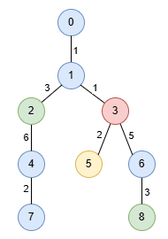
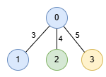

3486. Longest Special Path II

You are given an undirected tree rooted at node `0`, with `n` nodes numbered from `0` to `n - 1`. This is represented by a 2D array `edges` of length `n - 1`, where `edges[i] = [ui, vi, lengthi]` indicates an edge between nodes `ui` and `vi` with length `lengthi`. You are also given an integer array `nums`, where `nums[i]` represents the value at node `i`.

A **special path** is defined as a **downward** path from an ancestor node to a descendant node in which all node values are distinct, except for at most one value that may appear twice.

Return an array `result` of size `2`, where `result[0]` is the **length** of the **longest** special path, and `result[1]` is the **minimum** number of nodes in all possible **longest** special paths.

 

**Example 1:**
```
Input: edges = [[0,1,1],[1,2,3],[1,3,1],[2,4,6],[4,7,2],[3,5,2],[3,6,5],[6,8,3]], nums = [1,1,0,3,1,2,1,1,0]

Output: [9,3]

Explanation:

In the image below, nodes are colored by their corresponding values in nums.
```

```
The longest special paths are 1 -> 2 -> 4 and 1 -> 3 -> 6 -> 8, both having a length of 9. The minimum number of nodes across all longest special paths is 3.
```

**Example 2:**
```
Input: edges = [[1,0,3],[0,2,4],[0,3,5]], nums = [1,1,0,2]

Output: [5,2]

Explanation:
```

```
The longest path is 0 -> 3 consisting of 2 nodes with a length of 5.
```
 

**Constraints:**

* `2 <= n <= 5 * 104`
* `edges.length == n - 1`
* `edges[i].length == 3`
* `0 <= ui, vi < n`
* `1 <= lengthi <= 10^3`
* `nums.length == n`
* `0 <= nums[i] <= 5 * 10^4`
* The input is generated such that `edges` represents a valid tree.

# Submissions
---
**Solution 1: (Sliding Window in tree)**
```
Runtime: 2325 ms, Beats 5.88%
Memory: 281.22 MB, Beats 58.82%
```
```c++
class Solution {
    int valueCount[50001];
    vector<int>path,pathLengths;
    int maxLength,minNodes;
    void dfs(int node, int parent, int pathPointer, int pathLength, int nodes,int duplicates, vector<vector<pair<int,int>>> &g, vector<int>& nums) 
    {
        path.push_back(nums[node]);
        valueCount[nums[node]]++;
        if(valueCount[nums[node]]>1)
           duplicates++;    
        nodes++;   
        int oldPointer=pathPointer;
        while(duplicates>1) {
            nodes--;
            pathLength-=pathLengths[pathPointer];
            valueCount[path[pathPointer]]--;
            if(valueCount[path[pathPointer]]>=1)
                duplicates--;
            pathPointer++;    
        }   
        if(pathLength>maxLength || (pathLength==maxLength && minNodes>nodes)) {
            minNodes=nodes;
            maxLength=pathLength;
        }
        for(auto &next:g[node]) {
            if(next.first==parent)
               continue;
            pathLengths.push_back(next.second);  
            dfs(next.first,node,pathPointer,pathLength+next.second,nodes,duplicates,g,nums); 
            pathLengths.pop_back();  
        }
        path.pop_back();
        valueCount[nums[node]]--;
        while(oldPointer<pathPointer)
           valueCount[path[oldPointer++]]++;
    }
public:
    vector<int> longestSpecialPath(vector<vector<int>>& edges, vector<int>& nums) {
        int n=nums.size();
        maxLength=0,minNodes=0;
        memset(valueCount, 0, sizeof(valueCount));
        vector<vector<pair<int,int>>>g(n);
        for(auto &edge:edges) {
            g[edge[0]].push_back({edge[1], edge[2]});
            g[edge[1]].push_back({edge[0], edge[2]});
        }
        dfs(0,-1,0,0,0,0,g,nums);
        return {maxLength, minNodes};
    }
};
```
