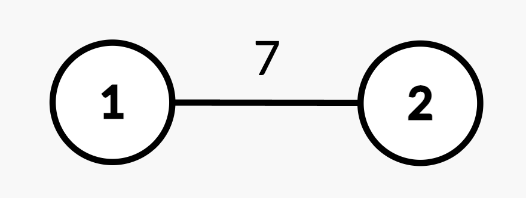
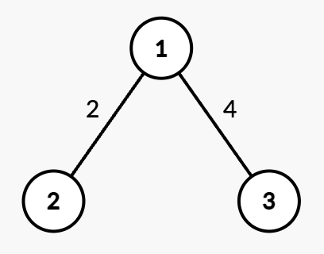
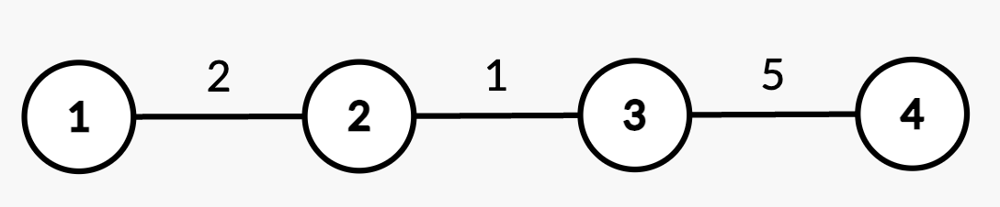

3515. Shortest Path in a Weighted Tree

You are given an integer `n` and an undirected, weighted tree rooted at node 1 with `n` nodes numbered from 1 to `n`. This is represented by a 2D array `edges` of length `n - 1`, where `edges[i] = [ui, vi, wi]` indicates an undirected edge from node `ui` to `vi` with weight `wi`.

You are also given a 2D integer array `queries` of length `q`, where each `queries[i]` is either:

* `[1, u, v, w']` – **Update** the weight of the edge between nodes `u` and `v` to `w'`, where `(u, v)` is guaranteed to be an edge present in `edges`.
* `[2, x]` – **Compute** the **shortest** path distance from the root node 1 to node `x`.

Return an integer array `answer`, where `answer[i]` is the **shortest** path distance from node 1 to `x` for the `i`th query of `[2, x]`.

 

**Example 1:**
```
Input: n = 2, edges = [[1,2,7]], queries = [[2,2],[1,1,2,4],[2,2]]

Output: [7,4]

Explanation:
```

```
Query [2,2]: The shortest path from root node 1 to node 2 is 7.
Query [1,1,2,4]: The weight of edge (1,2) changes from 7 to 4.
Query [2,2]: The shortest path from root node 1 to node 2 is 4.
```

**Example 2:**
```
Input: n = 3, edges = [[1,2,2],[1,3,4]], queries = [[2,1],[2,3],[1,1,3,7],[2,2],[2,3]]

Output: [0,4,2,7]

Explanation:
```

```
Query [2,1]: The shortest path from root node 1 to node 1 is 0.
Query [2,3]: The shortest path from root node 1 to node 3 is 4.
Query [1,1,3,7]: The weight of edge (1,3) changes from 4 to 7.
Query [2,2]: The shortest path from root node 1 to node 2 is 2.
Query [2,3]: The shortest path from root node 1 to node 3 is 7.
```

**Example 3:**
```
Input: n = 4, edges = [[1,2,2],[2,3,1],[3,4,5]], queries = [[2,4],[2,3],[1,2,3,3],[2,2],[2,3]]

Output: [8,3,2,5]

Explanation:
```

```
Query [2,4]: The shortest path from root node 1 to node 4 consists of edges (1,2), (2,3), and (3,4) with weights 2 + 1 + 5 = 8.
Query [2,3]: The shortest path from root node 1 to node 3 consists of edges (1,2) and (2,3) with weights 2 + 1 = 3.
Query [1,2,3,3]: The weight of edge (2,3) changes from 1 to 3.
Query [2,2]: The shortest path from root node 1 to node 2 is 2.
Query [2,3]: The shortest path from root node 1 to node 3 consists of edges (1,2) and (2,3) with updated weights 2 + 3 = 5.
```

**Constraints:**

* `1 <= n <= 10^5`
* `edges.length == n - 1`
* `edges[i] == [ui, vi, wi]`
* `1 <= ui, vi <= n`
* `1 <= wi <= 10^4`
* The input is generated such that edges represents a valid tree.
* `1 <= queries.length == q <= 10^5`
* `queries[i].length == 2 or 4`
* `queries[i] == [1, u, v, w'] or,`
* `queries[i] == [2, x]`
* `1 <= u, v, x <= n`
* `(u, v)` is always an edge from edges.
* `1 <= w' <= 104`

# Submissions
---
**Solution 1: (Euler Tour + Segment Tree)**

__Intuition__
We're given a rooted tree (undirected, weighted, and acyclic) and need to handle two types of operations efficiently:

Update the weight of an edge.

Query the shortest path from the root to any node.

Since the tree has no cycles and is rooted at node 1, the shortest path to any node is unique and defined by the sum of edge weights along the path from the root.

A naive Dijkstra or DFS per query/update would be too slow, so we need a clever data structure to:

Apply updates fast.

Query prefix sums on a path from the root quickly.

That’s where Euler Tour + Segment Tree with Range Updates comes into play.

__Approach__
Step 1: Build the Tree
We store the tree using an adjacency list:
unordered_map<int, vector<pair<int, int>>> graph;
Step 2: Euler Tour Technique
We perform an Euler Tour on the tree and record:

st[node] = index when we first enter the node.

ed[node] = index when we exit the subtree.

currParent[node] = its parent in DFS.

value[node] = edge weight from its parent.
This flattens the tree into an array-like structure for easy range queries.

Step 3: Segment Tree
We build a Segment Tree (SegTree) that:

Supports point/range updates.

Stores the prefix sum of weights from the root to any node.

Step 4: Handling Queries

Type 1 [1, u, v, w'] → update the edge (u,v) to weight w':

We identify the child in this edge.

Update the segment tree at st[child] by delta = newWeight - oldWeight.

Subtract the same delta from ed[child]+1 (range reversal).

Type 2 [2, x] → return query(0, st[x]) → total path weight from root to node x.

__Complexity__
Time complexity:

Preprocessing (Euler Tour): O(n)

Segment Tree Build: O(n)

Each update/query: O(logn)

Total for all queries: O(q⋅logn)

Space complexity:

Graph, segment tree, and auxiliary arrays: O(n)

```
Runtime: 310 ms, Beats 57.14%
Memory: 352.32 MB, Beats 50.00%
```
```c++
class Solution {
    // (Strikingly similar to this problem) - Path Queries
    // https://cses.fi/problemset/task/1138/

    unordered_map<int,vector<pair<int,int>>> graph;
    vector<int> st, ed, currParent, value;

    void EulerTour(int node,int par,int &idx){
        st[node]=idx;
        currParent[node]=par;
        for(auto &[nbr,wt]:graph[node]){
            if(nbr==par) continue;
            idx++;
            value[nbr]=wt;
            EulerTour(nbr,node,idx);
        }
        ed[node]=idx;
    }
 
    struct SegTree {
    public:
    
        SegTree (int _n) : n (_n) {
            tree.resize(4*n, 0);
        }
        
        int query (int x, int y) {
            return query (x, y, 0, n-1, 0);
        }
        
        void update (int ind, int val) {
            update (ind, val, 0, n-1, 0);
        }
    
    private:
        
        vector<int> tree;
        int n;
        
        int query (int x, int y, int l, int r, int i) {
            if (r < x || l > y) return 0;
            if (l >= x && r <= y) return tree[i];
            
            int m = (l+r) >> 1;
            return (
                query (x, y, l, m, i*2+1) +
                query (x, y, m+1, r, i*2+2)
            );
        }
        
        void update (int ind, int val, int l, int r, int i) {
            if (l == r) {
                tree[i] += val;
                return;
            }
            
            int m = (l+r) >> 1;
            if (m >= ind) update (ind, val, l, m, i*2+1);
            else update (ind, val, m+1, r, i*2+2);
            
            tree[i] = tree[i*2+1] + tree[i*2+2];
        }
    };
public:
    vector<int> treeQueries(int n, vector<vector<int>>& edges, vector<vector<int>>& queries) {
        st.resize(n); ed.resize(n); currParent.resize(n); value.resize(n,0);
        for(auto &edge:edges){
            int u=edge[0], v=edge[1], wt=edge[2];
            u--; v--;
            graph[u].push_back({v,wt});
            graph[v].push_back({u,wt});
        }

        int idx=0;
        EulerTour(0,-1,idx); // tree is rooted at node 1

        SegTree tree(idx+2);

        for(int i=1;i<n;++i){
            int stIdx=st[i], edIdx=ed[i];
            tree.update(stIdx,value[i]);
            if(edIdx+1<=idx) tree.update(edIdx+1,-value[i]);
        }

        vector<int> ans;

        for(auto &q:queries){
            int type=q[0];
            if(type==1){ // update
                int u=q[1], v=q[2], newWt=q[3];
                u--; v--;
                if(currParent[v]==u){
                    swap(u,v); // we're assuming that v will be parent of u
                }
                // Range Update in Segment Tree , the change in "weight"
                // delta = q[3] - value[st[child]] 
                // we add this value at st[child]
                // and subtract at ed[child] + 1 
                int stIdx=st[u], edIdx=ed[u], currWt=value[u];
                tree.update(stIdx,newWt-currWt);
                tree.update(edIdx+1,currWt-newWt);
                value[u]=newWt;
            }
            else{ // answer
                int node=q[1];
                node--;
                ans.push_back(tree.query(0,st[node]));
            }
        }

        return ans;
    }
};
```
