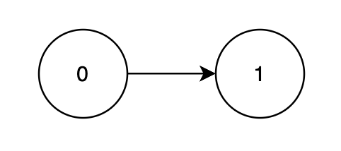
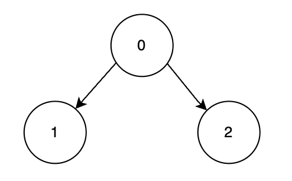

3530. Maximum Profit from Valid Topological Order in DAG

You are given a **Directed Acyclic Graph (DAG)** with `n` nodes labeled from `0` to `n - 1`, represented by a 2D array `edges`, where `edges[i] = [ui, vi]` indicates a directed edge from node `ui` to `vi`. Each node has an associated score given in an array `score`, where `score[i]` represents the score of node `i`.

You must process the nodes in a **valid** topological order. Each node is assigned a **1-based position** in the processing order.

The **profit** is calculated by summing up the product of each node's score and its position in the ordering.

Return the **maximum** possible profit achievable with an optimal topological order.

A **topological order** of a DAG is a linear ordering of its nodes such that for every directed edge `u → v`, node `u` comes before `v` in the ordering.

 

**Example 1:**
```
Input: n = 2, edges = [[0,1]], score = [2,3]

Output: 8

Explanation:
```

```
Node 1 depends on node 0, so a valid order is [0, 1].

Node	Processing Order	Score	Multiplier	Profit Calculation
0	1st	2	1	2 × 1 = 2
1	2nd	3	2	3 × 2 = 6
The maximum total profit achievable over all valid topological orders is 2 + 6 = 8.
```

**Example 2:**
```
Input: n = 3, edges = [[0,1],[0,2]], score = [1,6,3]

Output: 25

Explanation:
```

```
Nodes 1 and 2 depend on node 0, so the most optimal valid order is [0, 2, 1].

Node	Processing Order	Score	Multiplier	Profit Calculation
0	1st	1	1	1 × 1 = 1
2	2nd	3	2	3 × 2 = 6
1	3rd	6	3	6 × 3 = 18
The maximum total profit achievable over all valid topological orders is 1 + 6 + 18 = 25.
```
 

**Constraints:**

* `1 <= n == score.length <= 22`
* `1 <= score[i] <= 105`
* `0 <= edges.length <= n * (n - 1) / 2`
* `edges[i] == [ui, vi]` denotes a directed edge from `ui` to `vi`.
* `0 <= ui, vi < n`
* `ui != vi`
* The input graph is guaranteed to be a **DAG**.
* There are no duplicate edges.

# Submissions
---
**Solution 1: (DP Top-Down)**
```
Runtime: 1154 ms, Beats 8.33%
Memory: 204.50 MB, Beats 16.67%
```
```c++
class Solution {
    int recursion(int mask, int n, vector<int> &indegree, vector<vector<int>> &graph, vector<int> &score, vector<int> &dp) {
        if(mask == (1LL << n) - 1) return 0;  

        if(dp[mask] != -1) {
            return dp[mask];
        }  

        // __builtin_popcount(mask) returns the total number of set bits in mask, which represents the current position in the ordering.
        int count = __builtin_popcount(mask) + 1;

        int ans = 0;
        for(int i = 0; i < n; i++) {
            // If the current node has not been visited and its indegree is 0 (following Kahn's Algorithm for Topological Sort), 
            // We then decrease the indegree of each of its child nodes by one.
            if(!(1 & (mask >> i)) && indegree[i] == 0) {
                int newMask = mask | (1LL << i);
                
                for(auto &child: graph[i]) {
                    indegree[child]--;
                }
                
                ans = max(ans, count * score[i] + recursion(newMask, n, indegree, graph, score, dp));

                // Using backtracking and again incrementing the indegree of each of its child nodes by one.
                for(auto &child: graph[i]) {
                    indegree[child]++;
                }
            }
        }

        return dp[mask] = ans;
    }
public:
    int maxProfit(int n, vector<vector<int>>& edges, vector<int>& score) {
        int m = edges.size();
        
        vector<vector<int>> graph(n);
        vector<int> indegree(n);
        for(int i = 0; i < m; i++) {
            graph[edges[i][0]].push_back(edges[i][1]);
            indegree[edges[i][1]]++;
        }
        
        vector<int> dp((1LL << n), -1);
        return recursion(0, n, indegree, graph, score, dp);
    }
};
```
