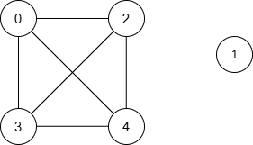
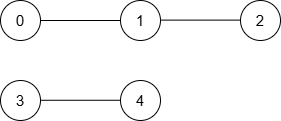

3534. Path Existence Queries in a Graph II

You are given an integer `n` representing the number of nodes in a graph, labeled from 0 to `n - 1`.

You are also given an integer array `nums` of length `n` and an integer `maxDiff`.

An **undirected edge** exists between nodes `i` and `j` if the absolute difference between `nums[i]` and `nums[j]` is at most `maxDiff` (i.e., `|nums[i] - nums[j]| <= maxDiff`).

You are also given a 2D integer array queries. For each queries[i] = [ui, vi], find the **minimum** distance between nodes `ui` and `vi`. If no path exists between the two nodes, return `-1` for that query.

Return an array `answer`, where `answer[i]` is the result of the `i`h query.

**Note**: The edges between the nodes are unweighted.

 

**Example 1:**
```
Input: n = 5, nums = [1,8,3,4,2], maxDiff = 3, queries = [[0,3],[2,4]]

Output: [1,1]

Explanation:

The resulting graph is:
```

```
Query	Shortest Path	Minimum Distance
[0, 3]	0 → 3	1
[2, 4]	2 → 4	1
Thus, the output is [1, 1].
```

**Example 2:**
```
Input: n = 5, nums = [5,3,1,9,10], maxDiff = 2, queries = [[0,1],[0,2],[2,3],[4,3]]

Output: [1,2,-1,1]

Explanation:

The resulting graph is:
```

```
Query	Shortest Path	Minimum Distance
[0, 1]	0 → 1	1
[0, 2]	0 → 1 → 2	2
[2, 3]	None	-1
[4, 3]	3 → 4	1
Thus, the output is [1, 2, -1, 1].
```

**Example 3:**
```
Input: n = 3, nums = [3,6,1], maxDiff = 1, queries = [[0,0],[0,1],[1,2]]

Output: [0,-1,-1]

Explanation:

There are no edges between any two nodes because:

Nodes 0 and 1: |nums[0] - nums[1]| = |3 - 6| = 3 > 1
Nodes 0 and 2: |nums[0] - nums[2]| = |3 - 1| = 2 > 1
Nodes 1 and 2: |nums[1] - nums[2]| = |6 - 1| = 5 > 1
Thus, no node can reach any other node, and the output is [0, -1, -1].
```
 

**Constraints:**

`1 <= n == nums.length <= 10^5`
`0 <= nums[i] <= 10^5`
`0 <= maxDiff <= 10^5`
`1 <= queries.length <= 10^5`
`queries[i] == [ui, vi]`
`0 <= ui, vi < n`

# Submissions
---
**Solution 1: (Binary Jump & Divide node group)**

__Intuition__
Based on 3532 concept, we can sort the nums first. Then, use a hash vector newInd to record the mapping between the new indices and the original indices.

The below is different concept with 3532.
Since we need to find the minimum distance between q[0] and q[1], walking step-by-step from q[0] would be too slow.
Therefore, we need to precompute a dp[i][node] 2D vector to record the position after jumping 2^i steps from node.

__Approach__
Preporcessing step:
Use a pair vector numWithInd to record {nums[i], i} and then sort the pair vector.
Get a hash vector newInd to get the mapping between the new indices and the original indices.
Divide the node into different groups. If the distance of two adjacent nodes is bigger than maxDiff, we can split them into two groups. (Same concept as 3532)
DP step:
DP[i][j] represents the destination node we reach when starting from node j and jumping 2^i steps.
Therefore, dp[i][j] = dp[i-1][dp[i-1][j].
Because jump 2^i steps is equal to jump 2^i-1 + 2^i-1 steps.
Query step:
Translate the old indices to new indices.
Each time jump 2^i step, if we cannot arrive the target, then we jump it and add the step.
But if we can arrive the target, we should not jump, because we might over it. Example: for each segment end points, jump 1 or 2 or 4 steps will always at end points.
Finally, We can find a step value that is closest to the target. And add one to arrive the target.
Q: Why add 1 can arrive the target.
A: If the step is 0b00010111 (in binary representation), we can know that a jump of 2^3 steps can reach the target because the third bit is 0.
Therefore, if we add 1 on step, step will be 0b00011000. The third bit (the first zero bit) will change to 1. It is the valid result.

__Complexity__
Time complexity:
O((n + q) * log(max Value))

Space complexity:
O(n* log(max Value))

```
Runtime: 178 ms, Beats 67.54%
Memory: 350.62 MB, Beats 68.28%
```
```c++
class Solution {
    vector<int> newInd;
    vector<int> group;
    // step used
    vector<vector<int>> dp;
    vector<int> steps;
public:
    vector<int> pathExistenceQueries(int n, vector<int>& nums, int maxDiff, vector<vector<int>>& queries) {
        // Preprocessing
        vector<pair<int, int>> numWithInd; 
        for(int i=0; i<n; ++i){
            numWithInd.push_back({nums[i], i});
        }
        sort(numWithInd.begin(), numWithInd.end());
        // Old ind => NewInd ind
        newInd.resize(n);
        for(int i=0; i<n; ++i){
            newInd[numWithInd[i].second] = i;
        }

        // All use new index to operation
        int g = 0;
        group.resize(n);
        for(int i=1; i<n; ++i){
            if(numWithInd[i].first - numWithInd[i-1].first > maxDiff) 
                ++g;
            group[i] = g;
        }

        // Find the each node can go to where after 2^row steps, 2^16 = 65536
        dp.resize(17, vector<int>(n, 0));
        steps.resize(17);
        steps[0] = 1;
        int r = 0;
        for(int i=0; i<n; ++i){
            while(r < n && numWithInd[r].first - numWithInd[i].first <= maxDiff){
                ++r;
            }
            dp[0][i] = r-1; 
        }
        for(int row = 1; row < 17; ++row){
            steps[row] = steps[row-1] * 2;
            for(int i=0; i<n; ++i){
                dp[row][i] = dp[row-1][dp[row-1][i]];
            }
        }

        // Finally, get result
        vector<int> result;
        result.reserve(queries.size());
        for(auto& q : queries){
            if( group[newInd[q[0]]] != group[newInd[q[1]]])
                result.push_back(-1);
            else{
                int ind1 = newInd[q[0]];
                int ind2 = newInd[q[1]];
                if(ind2 < ind1) swap(ind1, ind2); // always ind1 < ind2
                if(ind1 == ind2){
                    result.push_back(0);
                    continue;
                }
                int step = 0;
                int cur = ind1;
                for(int i=16; i>=0; --i){
                    // try to add 2^i steps
                    if(dp[i][cur] < ind2){
                        cur = dp[i][cur];
                        step += steps[i];
                    }
                }
                // Explain why need to add 1 in approach part fourth paragraph.
                result.push_back(step+1);
            }
        }
        return result;
    }
};
```
