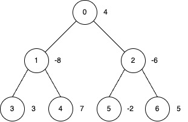
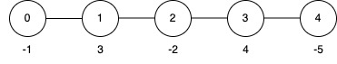

3544. Subtree Inversion Sum

You are given an undirected tree rooted at node `0`, with `n` nodes numbered from 0 to `n - 1`. The tree is represented by a 2D integer array `edges` of length `n - 1`, where `edges[i] = [ui, vi]` indicates an edge between nodes `ui` and `vi`.

You are also given an integer array `nums` of length `n`, where `nums[i]` represents the value at node `i`, and an integer `k`.

You may perform **inversion operations** on a subset of nodes subject to the following rules:

* **Subtree Inversion Operation**:

    * When you invert a node, every value in the **subtree** rooted at that node is multiplied by `-1`.

* **Distance Constraint on Inversions**:

    * You may only invert a node if it is "sufficiently far" from any other inverted node.

    * Specifically, if you invert two nodes `a` and `b` such that one is an ancestor of the other (i.e., if `LCA(a, b) = a` or `LCA(a, b) = b`), then the distance (the number of edges on the unique path between them) must be at least `k`.

Return the **maximum** possible **sum** of the tree's node values after applying **inversion operations**.

 

**Example 1:**
```
Input: edges = [[0,1],[0,2],[1,3],[1,4],[2,5],[2,6]], nums = [4,-8,-6,3,7,-2,5], k = 2

Output: 27

Explanation:
```

```
Apply inversion operations at nodes 0, 3, 4 and 6.
The final nums array is [-4, 8, 6, 3, 7, 2, 5], and the total sum is 27.
```

**Example 2:**
```
Input: edges = [[0,1],[1,2],[2,3],[3,4]], nums = [-1,3,-2,4,-5], k = 2

Output: 9

Explanation:
```

```
Apply the inversion operation at node 4.
The final nums array becomes [-1, 3, -2, 4, 5], and the total sum is 9.
```

**Example 3:**
```
Input: edges = [[0,1],[0,2]], nums = [0,-1,-2], k = 3

Output: 3

Explanation:

Apply inversion operations at nodes 1 and 2.
```
 

**Constraints:**

* `2 <= n <= 5 * 10^4`
* `edges.length == n - 1`
* `edges[i] = [ui, vi]`
* `0 <= ui, vi < n`
* `nums.length == n`
* `-5 * 10^4 <= nums[i] <= 5 * 10^4`
* `1 <= k <= 50`
* The input is generated such that `edges` represents a valid tree.

# Submissions
---
**Solution 1: (DP Top-Down)**
```
Runtime: 1597 ms, Beats 33.33%
Memory: 632.91 MB, Beats 8.33%
```
```c++
class Solution {
    int n;
    vector<vector<int>> adj;
    // dp[i][j][k] mean the max sum of (ith node subtree) with at least j times no inverse
    // k = 0 => min , k = 1 => max
    vector<vector<vector<long long>>> dp;
    void dfs(int cur, int parent, int k, vector<int>& nums){
        if(cur != 0 && adj[cur].size() == 1){ // leaf, base case
            dp[cur][0][0] = min(-nums[cur], nums[cur]);
            dp[cur][0][1] = max(-nums[cur], nums[cur]);
            for(int j=0; j<2; ++j){
                for(int i=1; i<k; ++i) dp[cur][i][j] = nums[cur];
            }
            return;
        }
        // postorder
        for(auto child : adj[cur]){
            if(child != parent){
                dfs(child, cur, k, nums);
            }
        }
        // for max
        for(int i=1; i<k; ++i){
            dp[cur][i][1] = nums[cur];
            for(auto child : adj[cur]){
                if(child != parent){
                    dp[cur][i][1] += dp[child][i-1][1];
                }
            }
        }
        // for min
        for(int i=1; i<k; ++i){
            dp[cur][i][0] = nums[cur];
            for(auto child : adj[cur]){
                if(child != parent){
                    dp[cur][i][0] += dp[child][i-1][0];
                }
            }
        }
        // for at least 0 distance
        long long noinv[2] = {nums[cur], nums[cur]};
        long long inv[2] = {-nums[cur], -nums[cur]};
        for(auto child : adj[cur]){
            if(child != parent){
                noinv[0] += dp[child][0][1];
                noinv[1] += dp[child][0][0];
                inv[0] -= dp[child][k-1][1];
                inv[1] -= dp[child][k-1][0]; 
            }
        }
        dp[cur][0][1] = max(max(noinv[0], noinv[1]), max(inv[0], inv[1]));
        dp[cur][0][0] = min(min(noinv[0], noinv[1]), min(inv[0], inv[1]));
    }
public:
    long long subtreeInversionSum(vector<vector<int>>& edges, vector<int>& nums, int k) {
        n = nums.size();
        adj.resize(n);
        for(auto& e : edges){
            adj[e[0]].push_back(e[1]);
            adj[e[1]].push_back(e[0]);
        }
        dp.resize(n, vector<vector<long long>>(k, vector<long long>(2)));
        dfs(0, -1, k, nums);
        return dp[0][0][1];
    }
};
```
