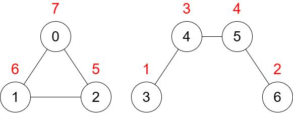
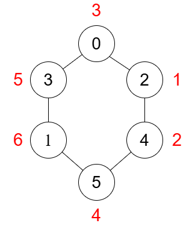

3547. Maximum Sum of Edge Values in a Graph

You are given an undirected graph of `n` nodes, numbered from `0` to `n - 1`. Each node is connected to at most 2 other nodes.

The graph consists of `m` edges, represented by a 2D array edges, where `edges[i] = [ai, bi]` indicates that there is an edge between nodes `ai` and `bi`.

You have to assign a **unique** value from `1` to `n` to each node. The value of an edge will be the product of the values assigned to the two nodes it connects.

Your score is the sum of the values of all edges in the graph.

Return the **maximum** score you can achieve.

 

**Example 1:**


```
Input: n = 7, edges = [[0,1],[1,2],[2,0],[3,4],[4,5],[5,6]]

Output: 130

Explanation:

The diagram above illustrates an optimal assignment of values to nodes. The sum of the values of the edges is: (7 * 6) + (7 * 5) + (6 * 5) + (1 * 3) + (3 * 4) + (4 * 2) = 130.
```

**Example 2:**


```
Input: n = 6, edges = [[0,3],[4,5],[2,0],[1,3],[2,4],[1,5]]

Output: 82

Explanation:

The diagram above illustrates an optimal assignment of values to nodes. The sum of the values of the edges is: (1 * 2) + (2 * 4) + (4 * 6) + (6 * 5) + (5 * 3) + (3 * 1) = 82.
```
 

**Constraints:**

* `1 <= n <= 5 * 104`
* `m == edges.length`
* `1 <= m <= n`
* `edges[i].length == 2`
* `0 <= ai, bi < n`
* `ai != bi`
* There are no repeated edges.
* Each node is connected to at most 2 other nodes.

# Submissions
---
**Solution 1: (Connected Component)**
```
Runtime: 288 ms, Beats 52.34%
Memory: 193.47 MB, Beats 74.14%
```
```c++
class Solution {
    using ll = long long;
    vector<bool> v; 

    bool dfs(int n, int p, vector<vector<int>> &G, int &cnt, int a) {
        v[n] = true;
        cnt++;
        for (int x : G[n]) {
            if (!v[x]) {
                if (dfs(x, n, G, cnt, a)) return true;
            } else if (x != p) return true;
        }
        return false; 
    }
public:
    long long maxScore(int n, vector<vector<int>>& edges) {
        int val = n;
        vector<vector<int>> G(n + 1);
        for (auto &it : edges) {
            G[it[0]].push_back(it[1]);
            G[it[1]].push_back(it[0]); 
        }

        v = vector<bool>(n + 1, false);
        vector<pair<int, int>> c, nc; // cyclic and noncyclic -> {size, startnode}

        for (int i = 0; i < n; i++) {
            if (!v[i]) {
                int cnt = 0;
                if (dfs(i, -1, G, cnt, i)) {
                    c.push_back({cnt, i});
                } else {
                    nc.push_back({cnt, i});
                }
            }
        }

        // sorting in decending order
        sort(c.rbegin(), c.rend());
        sort(nc.rbegin(), nc.rend());

        ll anss = 0;
        v = vector<bool>(n + 1, false);
        val = n;

// first priority cyclic component
        for (auto &i : c) {
            int s = i.first; // size
            vector<ll> a(s);
            int st = val - s + 1, e = val; 
            int j = 0;

            for( j = 0; j < s / 2; j++){
                a[j] = st++, a[s - j - 1] = st++;
            }

            if(s % 2)
                a[j] = st; 

            for(int i = 1; i < s; i++)
                anss += (a[i] * a[i - 1]);
            anss += a.back() * a.front(); // cycle thats why
            val = val - s;
        }
// Acyclic
        for (auto &i : nc) {
            int s = i.first;
            vector<ll> a(s);
            int st = val - s + 1, e = val;

            int j = 0;
            for( j = 0; j < s / 2; j++){
                a[j] = st++, a[s - j - 1] = st++;
            }
            if(s % 2)
                a[j] = st;

            cout << endl; 
// theree is no cycle
            for(int i = 1; i < s; i++)
                anss += (a[i] * a[i - 1]);

            val = val - s;
        } 
        return anss;
    }
};
```
