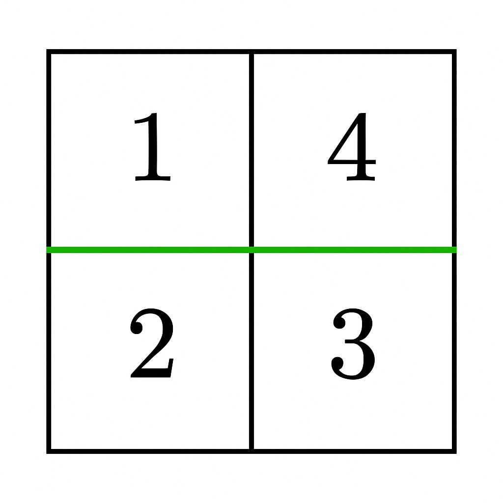

3548. Equal Sum Grid Partition II

You are given an `m x n` matrix `grid` of positive integers. Your task is to determine if it is possible to make **either one horizontal or one vertical cut** on the grid such that:

* Each of the two resulting sections formed by the cut is **non-empty**.
* The sum of elements in both sections is equal, or can be made **equal** by discounting at most one single cell in total (from either section).
* If a cell is discounted, the rest of the section must **remain connected**.

Return `true` if such a partition exists; otherwise, return `false`.

**Note**: A section is **connected** if every cell in it can be reached from any other cell by moving up, down, left, or right through other cells in the section.

 

**Example 1:**
```
Input: grid = [[1,4],[2,3]]

Output: true

Explanation:
```

```
A horizontal cut after the first row gives sums 1 + 4 = 5 and 2 + 3 = 5, which are equal. Thus, the answer is true.
```

**Example 2:**
```
Input: grid = [[1,2],[3,4]]

Output: true

Explanation:
```

```
A vertical cut after the first column gives sums 1 + 3 = 4 and 2 + 4 = 6.
By discounting 2 from the right section (6 - 2 = 4), both sections have equal sums and remain connected. Thus, the answer is true.
```

**Example 3:**
```
Input: grid = [[1,2,4],[2,3,5]]

Output: false

Explanation:
```

```
A horizontal cut after the first row gives 1 + 2 + 4 = 7 and 2 + 3 + 5 = 10.
By discounting 3 from the bottom section (10 - 3 = 7), both sections have equal sums, but they do not remain connected as it splits the bottom section into two parts ([2] and [5]). Thus, the answer is false.
```

**Example 4:**
```
Input: grid = [[4,1,8],[3,2,6]]

Output: false

Explanation:

No valid cut exists, so the answer is false.
```
 

**Constraints:**

* `1 <= m == grid.length <= 10^5`
* `1 <= n == grid[i].length <= 10^5`
* `2 <= m * n <= 10^5`
* `1 <= grid[i][j] <= 10^5`

# Submissions
---
**Solution 1: (Frequency Counter)**
```
Runtime: 408 ms, Beats 86.33%
Memory: 319.62 MB, Beats 63.35%
```
```c++
class Solution {
    bool isBoundaryElement(int r1,int r2,int c1,int c2,vector<vector<int>> &grid,long long d){
        int n=grid.size(),m=grid[0].size();
        if(r1>r2 || c1>c2)
            return false;
        return grid[r1][c1]==d || grid[r1][c2]==d
            || grid[r2][c1]==d || grid[r2][c2]==d;
    }
public:
    bool canPartitionGrid(vector<vector<int>>& grid) {
        int n=grid.size(),m=grid[0].size();
        vector<long long> rowSum(n),colSum(m);
        vector<long long> firstHalfElementsCnt(100001),secondHalfElementsCnt(100001);
        for(int i=0;i<n;i++)
            for(int j=0;j<m;j++){
                rowSum[i]+=grid[i][j];
                colSum[j]+=grid[i][j];
                secondHalfElementsCnt[grid[i][j]]++;
            }
        for(int i=1;i<n;i++)
            rowSum[i]+=rowSum[i-1];
        for(int j=1;j<m;j++)
            colSum[j]+=colSum[j-1];
        
        for(int i=0;i<n;i++){
            long long curSum=rowSum[i];
            long long remSum=rowSum[n-1]-rowSum[i];
            for(int j=0;j<m;j++){
                firstHalfElementsCnt[grid[i][j]]++;
                secondHalfElementsCnt[grid[i][j]]--;
            }
            if(curSum==remSum)
                return true;
            long long diff = remSum-curSum;
            if(curSum<remSum && diff<=100000 && secondHalfElementsCnt[diff] && isBoundaryElement(i+1,n-1,0,m-1,grid,diff)){
                return true;
            }
            diff = curSum-remSum;
            if(curSum>remSum && diff<=100000 && firstHalfElementsCnt[diff] && isBoundaryElement(0,i,0,m-1,grid,diff)){
                return true;
            }
        }
        for(int j=0;j<m;j++){
            long long curSum=colSum[j];
            long long remSum=colSum[m-1]-colSum[j];
            for(int i=0;i<n;i++){
                firstHalfElementsCnt[grid[i][j]]--;
                secondHalfElementsCnt[grid[i][j]]++;
            }
            if(curSum==remSum)
                return true;
            long long diff = remSum-curSum;
            if(curSum<remSum && diff<=100000 && firstHalfElementsCnt[remSum-curSum] && isBoundaryElement(0,n-1,j+1,m-1,grid,diff)){
                return true;
            }
            diff = curSum-remSum;
            if(curSum>remSum && diff<=100000 && secondHalfElementsCnt[curSum-remSum] && isBoundaryElement(0,n-1,0,j,grid,diff)){
                return true;
            }
        }
        return false;
    }
};
```
