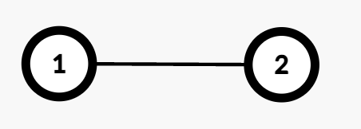

3559. Number of Ways to Assign Edge Weights II

There is an undirected tree with `n` nodes labeled from 1 to `n`, rooted at node 1. The tree is represented by a 2D integer array `edges` of length `n - 1`, where `edges[i] = [ui, vi]` indicates that there is an edge between nodes `ui` and `vi`.

Initially, all edges have a weight of 0. You must assign each edge a weight of either **1** or **2**.

The **cost** of a path between any two nodes `u` and `v` is the total weight of all edges in the path connecting them.

You are given a 2D integer array `queries`. For each `queries[i] = [ui, vi]`, determine the number of ways to assign weights to edges in the **path** such that the cost of the path between `ui` and `vi` is **odd**.

Return an array `answer`, where `answer[i]` is the number of valid assignments for `queries[i]`.

Since the answer may be large, apply **modulo** `10^9 + 7` to each answer[i].

**Note**: For each query, disregard all edges not in the path between node `ui` and `vi`.

 

**Example 1:**


```
Input: edges = [[1,2]], queries = [[1,1],[1,2]]

Output: [0,1]

Explanation:

Query [1,1]: The path from Node 1 to itself consists of no edges, so the cost is 0. Thus, the number of valid assignments is 0.
Query [1,2]: The path from Node 1 to Node 2 consists of one edge (1 → 2). Assigning weight 1 makes the cost odd, while 2 makes it even. Thus, the number of valid assignments is 1.
```

**Example 2:**


```
Input: edges = [[1,2],[1,3],[3,4],[3,5]], queries = [[1,4],[3,4],[2,5]]

Output: [2,1,4]

Explanation:

Query [1,4]: The path from Node 1 to Node 4 consists of two edges (1 → 3 and 3 → 4). Assigning weights (1,2) or (2,1) results in an odd cost. Thus, the number of valid assignments is 2.
Query [3,4]: The path from Node 3 to Node 4 consists of one edge (3 → 4). Assigning weight 1 makes the cost odd, while 2 makes it even. Thus, the number of valid assignments is 1.
Query [2,5]: The path from Node 2 to Node 5 consists of three edges (2 → 1, 1 → 3, and 3 → 5). Assigning (1,2,2), (2,1,2), (2,2,1), or (1,1,1) makes the cost odd. Thus, the number of valid assignments is 4.
```

**Constraints:**

* `2 <= n <= 10^5`
* `edges.length == n - 1`
* `edges[i] == [ui, vi]`
* `1 <= queries.length <= 105`
* `queries[i] == [ui, vi]`
* `1 <= ui, vi <= n`
* `edges` represents a valid tree.

# Submissions
---
**Solution 1: (DFS)**

Intuition
We are given a tree rooted at node 1 and need to answer multiple queries of the form (u, v), asking how many ways we can assign weights (1 or 2) to the edges in the path from u to v such that the total cost is odd.

The key insight is that for any path of length d (number of edges), the number of ways to assign weights 1 or 2 such that the sum is odd is exactly (2^{d-1}). This is because each edge can independently be 1 or 2, so there are (2^d) total combinations, and exactly half of them will be odd.

Approach
Construct the tree from the given edges.
Use DFS to calculate:
Level of each node.
First ancestor (for LCA prep).
Precompute the LCA table using binary lifting.
For each query:
Compute the distance (number of edges) between u and v.
If the distance is 0, return 0 (no path).
Otherwise, return (2^{d-1} % (10^9+7)).
Count the number of binary strings of length d using weights 1 and 2 such that their sum is odd.
Let’s say:
k of the d edges are assigned 1, and
d - k are assigned 2
Then total cost = 1 * k + 2 * (d - k) = 2 * d - k, and you want this to be odd.
That means 2 * d - k is odd ⇒ k is odd.
So, the answer is : Number of ways to choose an odd number of edges out of d to assign weight 1.
Σ (C(d, k)) for all odd k in [1, d]
Each edge can be 1 or 2 ⇒ total (2^d) combinations.
Half of them will result in an odd total ⇒ Answer is (2^{d-1}).
Complexity
Time complexity:

Preprocessing DFS: O(n)
LCA table initialization: O(n * log n)
Each query: O(log n)
Total: O(n * log n + q * log n)
Space complexity:

O(n * log n) for LCA table and graph.

```
Runtime: 394 ms, Beats 47.62%
Memory: 391.52 MB, Beats 71.43%
```
```c++
const int MOD = 1e9 + 7;

class Solution {
    void dfs(int u, int par, int lvl, vector<int> &levels, vector<vector<int>> &graph, vector<vector<int>> &LCA) {
        levels[u] = lvl;
        LCA[u][0] = par;

        for(auto &v: graph[u]) {
            if(v != par) {
                dfs(v, u, lvl + 1, levels, graph, LCA);
            }
        }
    }

    void init(int n, int maxN, vector<vector<int>> &LCA) {
        for(int i = 1; i <= maxN; i++) {
            for(int j = 0; j < n; j++) {
                if(LCA[j][i - 1] != -1) {
                    int par = LCA[j][i - 1];
                    LCA[j][i] = LCA[par][i - 1];
                }
            }
        }
    }

    int findLCA(int a, int b, int maxN, vector<int> &levels, vector<vector<int>> &LCA) {
        if(levels[a] > levels[b]) swap(a, b);

        int d = levels[b] - levels[a];
        while(d > 0) {
            int jump = log2(d);
            b = LCA[b][jump];
            d -= (1LL << jump);
        }

        if(a == b) return a;

        for(int i = maxN; i >= 0; i--) {
            if(LCA[a][i] != -1 && LCA[a][i] != LCA[b][i]) {
                a = LCA[a][i], b = LCA[b][i];
            }
        }

        return LCA[a][0];
    }

    int getDistance(int u, int v, int maxN, vector<int> &levels, vector<vector<int>> &LCA) {
        int lca = findLCA(u, v, maxN, levels, LCA);
        return levels[u] + levels[v] - 2 * levels[lca];
    }

    long long powerMod(long long x, long long y, int mod) {
        long long result = 1;
        while (y > 0) {
            if (y % 2) {
                result = (result * x) % mod;
            }
            x = (x * x) % mod;
            y /= 2;
        }
        return result;
    }
public:
    vector<int> assignEdgeWeights(vector<vector<int>>& edges, vector<vector<int>>& queries) {
        int n = edges.size() + 1, m = queries.size();

        vector<vector<int>> graph(n);
        for(auto &edge: edges) {
            graph[edge[0] - 1].push_back(edge[1] - 1);
            graph[edge[1] - 1].push_back(edge[0] - 1);
        }

        int maxN = log2(n);
        vector<int> levels(n);
        vector<vector<int>> LCA(n, vector<int> (maxN + 1, -1));
        
        dfs(0, -1, 0, levels, graph, LCA);
        init(n, maxN, LCA);     

        vector<int> ans(m);
        for(int i = 0; i < m; i++) {
            int u = queries[i][0] - 1, v = queries[i][1] - 1;
            int dist = getDistance(u, v, maxN, levels, LCA);

            if(dist == 0) {
                ans[i] = 0;
                continue;
            }
            
            ans[i] = powerMod(2, dist - 1, MOD);
        }
        
        return ans;
    }
};
```
