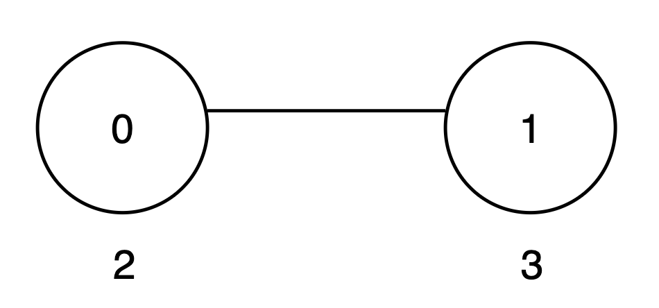
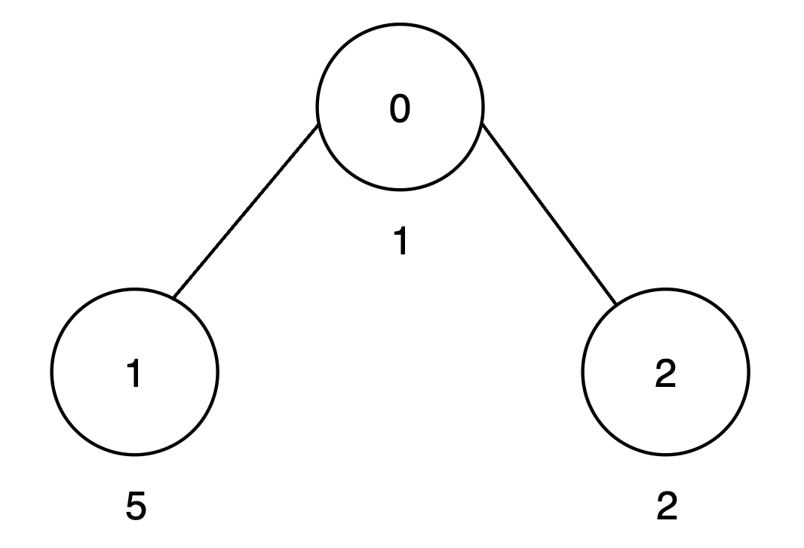
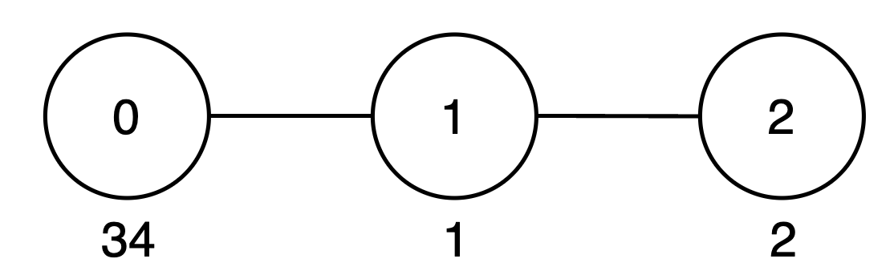

3575. Maximum Good Subtree Score

You are given an undirected tree rooted at node 0 with `n` nodes numbered from 0 to `n - 1`. Each node `i` has an integer value `vals[i]`, and its parent is given by `par[i]`.

A subset of nodes within the subtree of a node is called **good** if every digit from 0 to 9 appears **at most** once in the decimal representation of the values of the selected nodes.

The **score** of a good subset is the sum of the values of its nodes.

Define an array `maxScore` of length `n`, where `maxScore[u]` represents the maximum possible sum of values of a good subset of nodes that belong to the subtree rooted at node `u`, including `u` itself and all its descendants.

Return the sum of all values in `maxScore`.

Since the answer may be large, return it modulo `10^9 + 7`.

 

**Example 1:**
```
Input: vals = [2,3], par = [-1,0]

Output: 8

Explanation:
```

```
The subtree rooted at node 0 includes nodes {0, 1}. The subset {2, 3} is good as the digits 2 and 3 appear only once. The score of this subset is 2 + 3 = 5.
The subtree rooted at node 1 includes only node {1}. The subset {3} is good. The score of this subset is 3.
The maxScore array is [5, 3], and the sum of all values in maxScore is 5 + 3 = 8. Thus, the answer is 8.
```

**Example 2:**
```
Input: vals = [1,5,2], par = [-1,0,0]

Output: 15

Explanation:
```

```
The subtree rooted at node 0 includes nodes {0, 1, 2}. The subset {1, 5, 2} is good as the digits 1, 5 and 2 appear only once. The score of this subset is 1 + 5 + 2 = 8.
The subtree rooted at node 1 includes only node {1}. The subset {5} is good. The score of this subset is 5.
The subtree rooted at node 2 includes only node {2}. The subset {2} is good. The score of this subset is 2.
The maxScore array is [8, 5, 2], and the sum of all values in maxScore is 8 + 5 + 2 = 15. Thus, the answer is 15.
```

**Example 3:**
```
Input: vals = [34,1,2], par = [-1,0,1]

Output: 42

Explanation:
```

```
The subtree rooted at node 0 includes nodes {0, 1, 2}. The subset {34, 1, 2} is good as the digits 3, 4, 1 and 2 appear only once. The score of this subset is 34 + 1 + 2 = 37.
The subtree rooted at node 1 includes node {1, 2}. The subset {1, 2} is good as the digits 1 and 2 appear only once. The score of this subset is 1 + 2 = 3.
The subtree rooted at node 2 includes only node {2}. The subset {2} is good. The score of this subset is 2.
The maxScore array is [37, 3, 2], and the sum of all values in maxScore is 37 + 3 + 2 = 42. Thus, the answer is 42.
```

**Example 4:**
```
Input: vals = [3,22,5], par = [-1,0,1]

Output: 18

Explanation:

The subtree rooted at node 0 includes nodes {0, 1, 2}. The subset {3, 22, 5} is not good, as digit 2 appears twice. Therefore, the subset {3, 5} is valid. The score of this subset is 3 + 5 = 8.
The subtree rooted at node 1 includes nodes {1, 2}. The subset {22, 5} is not good, as digit 2 appears twice. Therefore, the subset {5} is valid. The score of this subset is 5.
The subtree rooted at node 2 includes {2}. The subset {5} is good. The score of this subset is 5.
The maxScore array is [8, 5, 5], and the sum of all values in maxScore is 8 + 5 + 5 = 18. Thus, the answer is 18.
```

**Constraints:**

* `1 <= n == vals.length <= 500`
* `1 <= vals[i] <= 10^9`
* `par.length == n`
* `par[0] == -1`
* `0 <= par[i] < n for i in [1, n - 1]`
* The input is generated such that the parent array `par` represents a valid tree.

# Submissions
---
**Solution 1: (DP, Trie)**

__Intuition__
For each Node try to get all the vals of the childs node

Approach
do a dfs call and for each node try to get all the vals value in a vector so that out of n values you can take some 'x' values where digit 0 - 9 appear at most once and their sum is maximum;
To get maximum Sum we use Dp of take and not take idea
since to track 0 - 9 digit since we cant store the freq in Dp table we will think some other way where come the Mask .
when constrains like num <= 15 are given you can think of mask.
remaing code is self explanatory

__Complexity__
Time complexity:
Space complexity:

```
Runtime: 584 ms, Beats 48.84%
Memory: 409.12 MB, Beats 6.98%
```
```c++
class Solution {
    int mod = 1e9 + 7;
    int ans = 0;
    // int dp[1501][1024];
    bool check(int n , int freq){
        while(n){
            int x = n%10;
            if(freq & 1<<x) return 0;
            freq |= 1<<x;
            n/=10;
        }
        return 1;
    }
   int give(int i ,vector<int>&nums,int freq,vector<vector<int>>&dp){
       if(i >= nums.size()) return 0;
       if(dp[i][freq] != -1) return dp[i][freq];
       int nottake = give(i+1,nums,freq,dp);
       int take = 0;
       if(check(nums[i],freq)){
           int newFreq = freq;
           int x = nums[i];
           while(x){
               int y = x%10;
               newFreq |= 1<<y;
               x/=10;
           }
           take = nums[i] + give(i+1,nums,newFreq,dp);
       }
       return dp[i][freq] = max(take,nottake);
   }
    vector<int> dfs(int node , vector<int>&v,vector<int>&vals,vector<vector<int>>&adj){
        vector<int>togive;
        for(auto i:adj[node]){
            vector<int> child = dfs(i,v,vals,adj);
            togive.insert(togive.end() , child.begin() , child.end());
        }
        togive.push_back(vals[node]);
        // v.push_back(vals[node]);
         vector<vector<int>> dp(togive.size()+1, vector<int>(1025, -1));
        int temp = give(0,togive,0,dp);
        ans += temp;
        ans %= mod;
        return togive;
    }
public:
    int goodSubtreeSum(vector<int>& vals, vector<int>& par) {
        int n = par.size();
        // memset(dp,-1,sizeof(dp));
        vector<vector<int>>adj(n);
        for(int i=1;i<n;i++){
            adj[par[i]].push_back(i);
        }
        unordered_map<int,int>mp;
        vector<int>v;
         dfs(0,v,vals,adj);
        return ans;
    }
};
```
