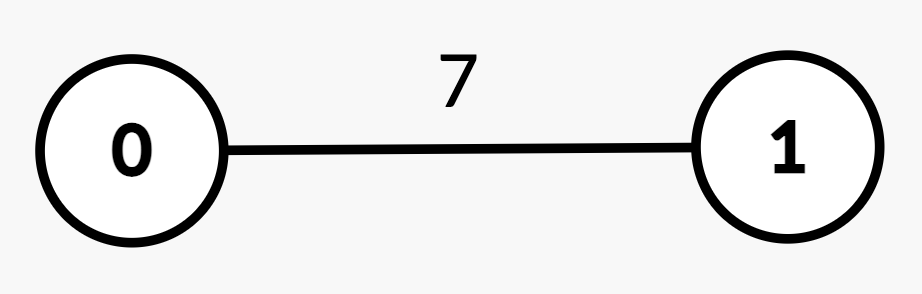
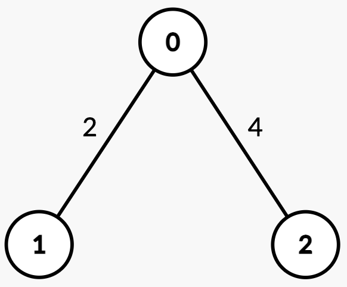
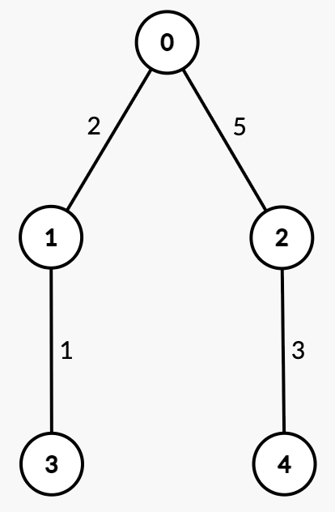

3585. Find Weighted Median Node in Tree

You are given an integer `n` and an **undirected, weighted** tree rooted at node 0 with n nodes numbered from 0 to `n - 1`. This is represented by a 2D array `edges` of length `n - 1`, where `edges[i] = [ui, vi, wi]` indicates an edge from node `ui` to `vi` with weight `wi`.

The weighted median node is defined as the first node `x` on the path from `ui` to `vi` such that the sum of edge weights from `ui` to `x` is **greater than or equal to half** of the total path weight.

You are given a 2D integer array `queries`. For each `queries[j] = [uj, vj]`, determine the weighted median node along the path from `uj` to `vj`.

Return an array `ans`, where `ans[j]` is the node index of the weighted median for `queries[j]`.

 

**Example 1:**
```
Input: n = 2, edges = [[0,1,7]], queries = [[1,0],[0,1]]

Output: [0,1]

Explanation:
```

```
Query | Path | Edge Weights | Total Path Weight | Half | Explanation | Answer
------|------|--------------|-------------------|------|-------------|-------
[1, 0] |1 → 0 | [7] | 7 | 3.5 | Sum from 1 → 0 = 7 >= 3.5, median is node 0. | 0
[0, 1] |0 → 1 | [7] | 7 | 3.5 | Sum from 0 → 1 = 7 >= 3.5, median is node 1. | 1
```

**Example 2:**
```
Input: n = 3, edges = [[0,1,2],[2,0,4]], queries = [[0,1],[2,0],[1,2]]

Output: [1,0,2]

Explanation:
```

```
Query | Path | Edge Weights | Total Path Weight | Half | Explanation | Answer
------|------|--------------|-------------------|------|-------------|------
[0, 1] | 0 → 1 | [2] | 2 | 1 | Sum from 0 → 1 = 2 >= 1, median is node 1. | 1
[2, 0] | 2 → 0 | [4] | 4 | 2 | Sum from 2 → 0 = 4 >= 2, median is node 0. | 0
[1, 2] | 1 → 0 → 2 | [2, 4] | 6 | 3 | Sum from 1 → 0 = 2 < 3.                            | 2
       |           |        |   |   | Sum from 1 → 2 = 2 + 4 = 6 >= 3, median is node 2. |
```

**Example 3:**
```
Input: n = 5, edges = [[0,1,2],[0,2,5],[1,3,1],[2,4,3]], queries = [[3,4],[1,2]]

Output: [2,2]

Explanation:
```

```
Query | Path | Edge Weights | Total Path Weight | Half | Explanation | Answer
------|------|--------------|-------------------|------|-------------|------------------------------------------
[3, 4]| 3 → 1 → 0 → 2 → 4 | [1, 2, 5, 3] | 11 | 5.5 | Sum from 3 → 1 = 1 < 5.5.                              | 2
      |                   |              |    |     | Sum from 3 → 0 = 1 + 2 = 3 < 5.5.                      |
      |                   |              |    |     | Sum from 3 → 2 = 1 + 2 + 5 = 8 >= 5.5, median is node 2|	
[1, 2]| 1 → 0 → 2         | [2, 5]       | 7  | 3.5 | Sum from 1 → 0 = 2 < 3.5.                              | 2
      |                   |              |    |     | Sum from 1 → 2 = 2 + 5 = 7 >= 3.5, median is node 2.   |
```

**Constraints:**

* `2 <= n <= 10^5`
* `edges.length == n - 1`
* `edges[i] == [ui, vi, wi]`
* `0 <= ui, vi < n`
* `1 <= wi <= 10^9`
* `1 <= queries.length <= 10^5`
* `queries[j] == [uj, vj]`
* `0 <= uj, vj < n`
* The input is generated such that `edges` represents a valid tree.

# Submissions
---
**Solution 1: (Math, Binary Search)**

__Intuition__
Approach
Do Binary Search on Distance b/w given nodes and find optimal node.

__Prerequisites :__
1. how to find Lca of two node.
2. Distance b/w two nodes
3. sum of weights b/w two nodes (Required : Binary Lifting)
4. kth node from node a in path from node a to node b
5. kth Parent of node 

__Complexity__
Time complexity:
O(N * Log(N)^2)

Space complexity:

```
Runtime: 643 ms, Beats 25.00%
Memory: 417.10 MB, Beats 25.00%
```
```c++
#define ll long long
#define vi vector<int>
#define vll vector<long long>
#define vpii vector<pair<int,int>>
#define vpll vector<pair<long long,long long>>
#define pii pair<int,int>
#define pll pair<long long,long long>
#define mod1 1000000007
#define mod2 998244353
#define INF 1e18
#define pb push_back
#define ppb pop_back
#define mp make_pair
#define ff first
#define ss second
#define sz(x) ((ll)(x).size())
#define all(x) (x).begin(), (x).end()
#define rep(i,a,b) for(ll i=(a) ; i<(b) ; i++)
#define all(x) (x).begin(), (x).end()
#define yes cout<<"YES\n"
#define no cout<<"NO\n"
#define nl '\n'
#define read(a) for(auto &it : a) cin>>it;
#define printv(nums) for(int i=0;i<nums.size();i++) cout<<nums[i]<<" "; cout<<"\n";

const int M = 25;
vector<vpll> adj;
vector<int> dep; 
vector<vll>Par , Sum; 

void dfs(int cur, int parent) {
    if(parent != -1) dep[cur] = dep[parent] + 1;
    if(parent != -1) Par[0][cur] = parent;
    for(auto &ne : adj[cur])
    {
        if(ne.ff == parent) 
        {
            Sum[0][cur] = ne.ss;
            break;
        }
    }
    for (int j = 1; j < M; j++) 
    {
        int y = Par[j-1][cur];
        Par[j][cur] = Par[j - 1][y];
        Sum[j][cur] = Sum[j-1][cur] + Sum[j-1][y];
    }
    for (auto x : adj[cur]) if (x.ff != parent)  dfs(x.ff, cur);
}
 
int LCA(int u, int v) {
    if (u == v) return u;
    if (dep[u] < dep[v]) swap(u, v);
 
    int diff = dep[u] - dep[v];
    for (int j = M - 1; j >= 0; j--) {
        if ((diff >> j) & 1) u = Par[j][u];
    }
 
    for (int j = M - 1; j >= 0; j--) {
        if (Par[j][u] != Par[j][v]) {
            u = Par[j][u];
            v = Par[j][v];
        }
    }
 
    return (u != v ? Par[0][u] : u);
}
int kthParent(int k,int x)
{
    for(int bit=M-1;bit>=0;bit--)
    {
        int value = (k>>bit)&1;
        if(value)
        {
            x = Par[bit][x];
            if(x==-1) return x;
        }
    }
    return x;
}
ll Wt(int a,int b,int lca)
{
    int dep1 = dep[a] - dep[lca] , dep2 = dep[b] - dep[lca];
    ll Node = a;
    ll tot = 0;
    for(int bit=M-1;bit>=0;bit--)
    {
        int value = (dep1 >> bit) & 1ll;
        if(value)
        {
            tot += Sum[bit][Node];
            Node = Par[bit][Node];
        }
    }
    Node = b;
    for(int bit=M-1;bit>=0;bit--)
    {
        int value = (dep2 >> bit) & 1ll;
        if(value)
        {
            tot += Sum[bit][Node];
            Node = Par[bit][Node];
        }
    }
    return tot;
}
ll dist(int a,int b,int lca)
{
    return dep[a] + dep[b] - 2LL * dep[lca];
}
pll get(int a,int k,int b,ll req,int lca)
{
    int dep1 = dep[a] - dep[lca] , dep2 = dep[b] - dep[lca];
    if(k > dep1) 
    {
        k-=dep1;
        ll node = kthParent(dep2 - k,b);
        return {Wt(b,lca,lca) + Wt(a,lca,lca) - Wt(b,node,node) ,node};
    }
    ll node = kthParent(k,a);   
    return {Wt(a,node,node),node};
}

class Solution {
public:
    vector<int> findMedian(int n, vector<vector<int>>& edges, vector<vector<int>>& queries) {
        adj.assign(n,vpll());
        Par.assign(M,vll(n));
        Sum.assign(M,vll(n));
        dep.assign(n,0);

        for(int i=0;i<n-1;i++) 
        {
            ll x = edges[i][0] , y = edges[i][1] , w = edges[i][2];
            adj[x].pb({y,w});
            adj[y].pb({x,w});
        }
        dfs(0,-1);
        int q = queries.size();
        vi ans(q);
        for(int i=0;i<q;i++)
        {
            int a = queries[i][0] , b = queries[i][1];
            int lca = LCA(a,b); 
            ll totWt = Wt(a,b,lca);
            ll distance = dist(a,b,lca);
            ll req = (totWt + 1) / 2;
            ll s = 0 , e = distance;
            ll node = -1;
            while(s <= e)
            {
                ll mid = (s + e) / 2;
                pll sum = get(a,mid,b,req,lca);
                if(sum.ff >= req)
                {
                    node = sum.ss;
                    e = mid - 1;
                }
                else s = mid + 1;   
            }
            ans[i] = node;
        }
        return ans;
    }
};
```
