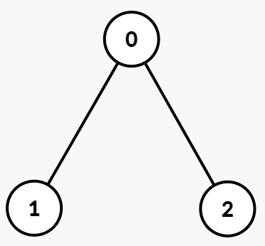
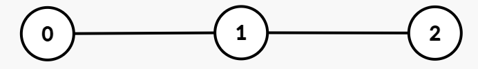

3590. Kth Smallest Path XOR Sum

You are given an undirected tree rooted at node 0 with `n` nodes numbered from 0 to `n - 1`. Each node `i` has an integer value `vals[i]`, and its parent is given by `par[i]`.

The **path XOR sum** from the root to a node `u` is defined as the bitwise XOR of all `vals[i]` for nodes `i` on the path from the root node to node `u`, inclusive.

You are given a 2D integer array `queries`, where `queries[j] = [uj, kj]`. For each query, find the `kj`th smallest distinct path XOR sum among all nodes in the **subtree** rooted at `uj`. If there are fewer than `kj` distinct path XOR sums in that subtree, the answer is `-1`.

Return an integer array where the `j`th element is the answer to the `j`th query.

In a rooted tree, the subtree of a node `v` includes `v` and all nodes whose path to the root passes through `v`, that is, `v` and its descendants.

 

**Example 1:**
```
Input: par = [-1,0,0], vals = [1,1,1], queries = [[0,1],[0,2],[0,3]]

Output: [0,1,-1]

Explanation:
```

```
Path XORs:

Node 0: 1
Node 1: 1 XOR 1 = 0
Node 2: 1 XOR 1 = 0
Subtree of 0: Subtree rooted at node 0 includes nodes [0, 1, 2] with Path XORs = [1, 0, 0]. The distinct XORs are [0, 1].

Queries:

queries[0] = [0, 1]: The 1st smallest distinct path XOR in the subtree of node 0 is 0.
queries[1] = [0, 2]: The 2nd smallest distinct path XOR in the subtree of node 0 is 1.
queries[2] = [0, 3]: Since there are only two distinct path XORs in this subtree, the answer is -1.
Output: [0, 1, -1]
```

**Example 2:**
```
Input: par = [-1,0,1], vals = [5,2,7], queries = [[0,1],[1,2],[1,3],[2,1]]

Output: [0,7,-1,0]

Explanation:
```

```
Path XORs:

Node 0: 5
Node 1: 5 XOR 2 = 7
Node 2: 5 XOR 2 XOR 7 = 0
Subtrees and Distinct Path XORs:

Subtree of 0: Subtree rooted at node 0 includes nodes [0, 1, 2] with Path XORs = [5, 7, 0]. The distinct XORs are [0, 5, 7].
Subtree of 1: Subtree rooted at node 1 includes nodes [1, 2] with Path XORs = [7, 0]. The distinct XORs are [0, 7].
Subtree of 2: Subtree rooted at node 2 includes only node [2] with Path XOR = [0]. The distinct XORs are [0].
Queries:

queries[0] = [0, 1]: The 1st smallest distinct path XOR in the subtree of node 0 is 0.
queries[1] = [1, 2]: The 2nd smallest distinct path XOR in the subtree of node 1 is 7.
queries[2] = [1, 3]: Since there are only two distinct path XORs, the answer is -1.
queries[3] = [2, 1]: The 1st smallest distinct path XOR in the subtree of node 2 is 0.
Output: [0, 7, -1, 0]
```
 

**Constraints:**

* `1 <= n == vals.length <= 5 * 10^4`
* `0 <= vals[i] <= 10^5`
* `par.length == n`
* `par[0] == -1`
* `0 <= par[i] < n for i in [1, n - 1]`
* `1 <= queries.length <= 5 * 10^4`
* `queries[j] == [uj, kj]`
* `0 <= uj < n`
* `1 <= kj <= n`
* The input is generated such that the parent array par represents a valid tree.

# Submissions
---
**Solution 1: (Trie)**
```
Runtime: 192 ms, Beats 100.00%
Memory: 208.80 MB, Beats 77.78%
```
```c++
class BinaryTrie {
    struct Node {
        int c[2];
        int cnt;
        bool leaf;
        Node() {
            c[0] = c[1] = 0;
            cnt = 0;
            leaf = false;
        }
    };

public:
    static vector<Node> T;
    int m;
    int root;

    BinaryTrie(int maxBits) : m(maxBits) {
        root = newNode();
    }

    int newNode() {
        T.push_back(Node());
        return (int)T.size() - 1;
    }

    void insert(long long num) {
        dfsInsert(root, num, m - 1);
    }

    void dfsInsert(int curr, long long num, int bit) {
        if (bit == -1) {
            T[curr].cnt = 1;
            T[curr].leaf = true;
            return;
        }
        int b = (num >> bit) & 1;
        if (!T[curr].c[b]) {
            T[curr].c[b] = newNode();
        }
        int nxt = T[curr].c[b];
        dfsInsert(nxt, num, bit - 1);
        int other = T[curr].c[b ^ 1];
        T[curr].cnt = T[nxt].cnt + (other ? T[other].cnt : 0);
    }

    void merge(BinaryTrie& other) {
        root = mergeRoot(root, other.root);
        other.root = 0;
    }

    int mergeRoot(int u, int v) {
        if (u == 0) return v;
        if (v == 0) return u;
        for (int b = 0; b < 2; b++) {
            int cu = T[u].c[b];
            int cv = T[v].c[b];
            if (!cu) {
                T[u].c[b] = cv;
            } else {
                T[u].c[b] = mergeRoot(cu, cv);
            }
        }
        int z = T[u].c[0], o = T[u].c[1];
        T[u].cnt = (z ? T[z].cnt : 0) + (o ? T[o].cnt : 0) + (T[u].leaf ? 1 : 0);
        return u;
    }

    long long kth_xor(int k) {
        long long res = 0;
        int curr = root;
        if (T[curr].cnt < k) return -1;
        for (int i = m - 1; i >= 0; i--) {
            int zero = T[curr].c[0];
            int one  = T[curr].c[1];
            int cnt0 = zero ? T[zero].cnt : 0;
            if (cnt0 >= k) {
                curr = zero;
            } else {
                k -= cnt0;
                if (one && T[one].cnt >= k) {
                    res |= (1LL << i);
                    curr = one;
                } else {
                    return -1;
                }
            }
            if (!curr) return -1;
        }
        return res;
    }
};

vector<BinaryTrie::Node> BinaryTrie::T;

class Solution {
public:
    vector<int> kthSmallest(vector<int>& par, vector<int>& vals, vector<vector<int>>& queries) {
        int n = par.size();
        vector<vector<int>> graph(n);
        for (int i = 1; i < n; i++) {
            graph[par[i]].push_back(i);
        }

        int q = queries.size();
        vector<vector<pair<int,int>>> Q(n);
        for (int i = 0; i < q; i++) {
            Q[queries[i][0]].push_back({queries[i][1], i});
        }

        BinaryTrie::T.clear();
        vector<int> prefix(vals);
        vector<int> ans(q);

        auto dfs = [&](auto& dfs, int node) -> BinaryTrie {
            BinaryTrie tree(17);
            for (int nei : graph[node]) {
                prefix[nei] ^= prefix[node];
                BinaryTrie childTree = dfs(dfs, nei);
                tree.merge(childTree);
            }
            tree.insert(prefix[node]);
            for (auto& [k, idx] : Q[node]) {
                ans[idx] = (int)tree.kth_xor(k);
            }
            return tree;
        };

        dfs(dfs, 0);
        return ans;
    }
};
```
