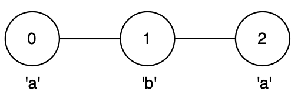
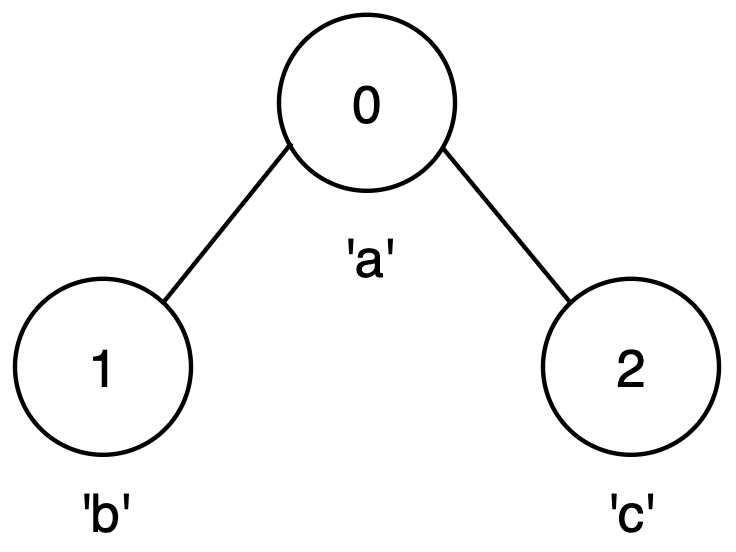
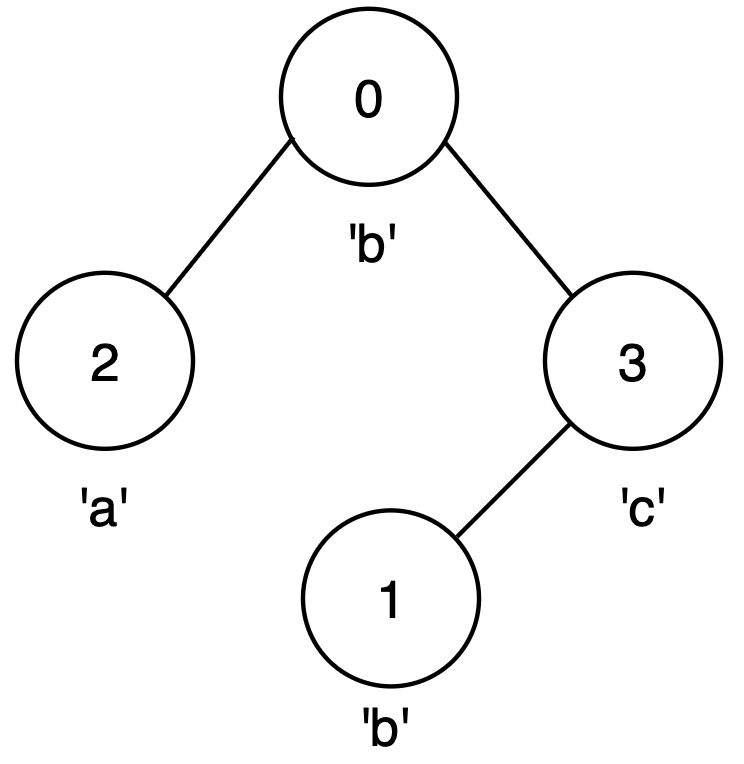

3615. Longest Palindromic Path in Graph

You are given an integer n and an undirected graph with n nodes labeled from 0 to n - 1 and a 2D array edges, where edges[i] = [ui, vi] indicates an edge between nodes ui and vi.

You are also given a string label of length n, where label[i] is the character associated with node i.

You may start at any node and move to any adjacent node, visiting each node at most once.

Return the maximum possible length of a palindrome that can be formed by visiting a set of unique nodes along a valid path.

 

**Example 1:**
```
Input: n = 3, edges = [[0,1],[1,2]], label = "aba"

Output: 3

Explanation:
```

```
The longest palindromic path is from node 0 to node 2 via node 1, following the path 0 → 1 → 2 forming string "aba".
This is a valid palindrome of length 3.
```

**Example 2:**
```
Input: n = 3, edges = [[0,1],[0,2]], label = "abc"

Output: 1

Explanation:
```

```
No path with more than one node forms a palindrome.
The best option is any single node, giving a palindrome of length 1.
```

**Example 3:**
```
Input: n = 4, edges = [[0,2],[0,3],[3,1]], label = "bbac"

Output: 3

Explanation:
```

```
The longest palindromic path is from node 0 to node 1, following the path 0 → 3 → 1, forming string "bcb".
This is a valid palindrome of length 3.
```

**Constraints:**

* `1 <= n <= 14`
* `n - 1 <= edges.length <= n * (n - 1) / 2`
* `edges[i] == [ui, vi]`
* `0 <= ui, vi <= n - 1`
* `ui != vi`
* `label.length == n`
* `label` consists of lowercase English letters.
* There are no duplicate `edges`.

# Submissions
---
**Solution 1: (DP Top-Down, Build From Center (2 ^ n))**

__Intuition__
Brute-force DFS, even with memoization, will result in TLE. Instead, we need to only explore valid palindromes by building from the center in two directions.

Even better: when we build a valid palindrome using a set of nodes, the order in which we attached those nodes does not matter - it could be any palindromic permutation.

Approach
We try each node as a center (odd-sized palindromes), or two connected nodes with the same label (even-sized palindromes).

We track explored nodes in mask, and use it for memoisation. We do not need to track the current node or palindrome, thanks for the intuition above.

__Complexity:__

Time: 2^n
 
Memory: 2^n

```
Runtime: 30 ms, Beats 98.00%
Memory: 23.99 MB, Beats 97.60%
```
```c++
class Solution {
    int res = 0;
    bool dp[16384] = {};
    void dfs(int i, int j, vector<unordered_set<int>>& al, const string& l, uint mask, vector<bool> &visited) {
        mask |= (1 << i) | (1 << j);
        if (exchange(dp[mask], true))
            return;
        visited[i] = visited[j] = true;
        res = max(res, popcount(mask));
        for (int x : al[i])
            if (!visited[x])
                for (int y : al[j])
                    if (!visited[y] && x != y && l[x] == l[y])
                        dfs(x, y, al, l, mask, visited);
        visited[i] = visited[j] = false;
    }
public:
    int maxLen(int n, vector<vector<int>>& edges, string label) {
        vector<unordered_set<int>> al(n);
        for (const auto& e : edges) {
            al[e[0]].insert(e[1]);
            al[e[1]].insert(e[0]);
        }
        for (int i = 0; i < n; ++i) {
            dfs(i, i, al, label, 0, vector<bool>(n) = {});
            for (int j : al[i])
                if (i < j && label[i] == label[j])
                    dfs(i, j, al, label, 0, vector<bool>(n) = {});
        }
        return res;
    }
};
```
