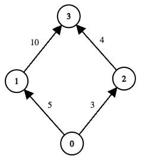

3620. Network Recovery Pathways

You are given a directed acyclic graph of `n` nodes numbered from 0 to `n − 1`. This is represented by a 2D array `edges` of length `m`, where `edges[i] = [ui, vi, costi]` indicates a one‑way communication from node `ui` to node `vi` with a recovery cost of `costi`.

Some nodes may be offline. You are given a boolean array `online` where `online[i] = true` means node i is online. Nodes 0 and `n − 1` are always online.

A path from 0 to `n − 1` is valid if:

* All intermediate nodes on the path are online.
* The total recovery cost of all edges on the path does not exceed `k`.
* For each valid path, define its score as the **minimum** edge‑cost along that path.

Return the **maximum** path score (i.e., the largest **minimum**-edge cost) among all valid paths. If no valid path exists, return -1.

 

**Example 1:**
```
Input: edges = [[0,1,5],[1,3,10],[0,2,3],[2,3,4]], online = [true,true,true,true], k = 10

Output: 3

Explanation:
```

```
The graph has two possible routes from node 0 to node 3:

Path 0 → 1 → 3

Total cost = 5 + 10 = 15, which exceeds k (15 > 10), so this path is invalid.

Path 0 → 2 → 3

Total cost = 3 + 4 = 7 <= k, so this path is valid.

The minimum edge‐cost along this path is min(3, 4) = 3.

There are no other valid paths. Hence, the maximum among all valid path‐scores is 3.
```

**Example 2:**
```
Input: edges = [[0,1,7],[1,4,5],[0,2,6],[2,3,6],[3,4,2],[2,4,6]], online = [true,true,true,false,true], k = 12

Output: 6

Explanation:
```

```
Node 3 is offline, so any path passing through 3 is invalid.

Consider the remaining routes from 0 to 4:

Path 0 → 1 → 4

Total cost = 7 + 5 = 12 <= k, so this path is valid.

The minimum edge‐cost along this path is min(7, 5) = 5.

Path 0 → 2 → 3 → 4

Node 3 is offline, so this path is invalid regardless of cost.

Path 0 → 2 → 4

Total cost = 6 + 6 = 12 <= k, so this path is valid.

The minimum edge‐cost along this path is min(6, 6) = 6.

Among the two valid paths, their scores are 5 and 6. Therefore, the answer is 6.
```
 

**Constraints:**

* `n == online.length`
* `2 <= n <= 5 * 10^4`
* `0 <= m == edges.length <= min(10^5, n * (n - 1) / 2)`
* `edges[i] = [ui, vi, costi]`
* `0 <= ui, vi < n`
* `ui != vi`
* `0 <= costi <= 10^9`
* `0 <= k <= 5 * 10^13`
* `online[i]` is either `true` or `false`, and both `online[0]` and `online[n − 1]` are `true`.
* The given graph is a directed acyclic graph.

# Submissions
---
**Solution 1: (Dijkstra)**
```
Runtime: 83 ms, Beats 98.99%
Memory: 259.61 MB, Beats 50.00%
```
```c++
class Solution {
public:
    int findMaxPathScore(vector<vector<int>>& edges, vector<bool>& online, long long k) {
        int n = online.size(), nw;
        if (n == 0) {
            return -1;
        }
        vector<vector<array<int,2>>> g(n);
        priority_queue<tuple<int,long long,int>> pq;
        for (auto &e: edges) {
            if (online[e[0]] && online[e[1]]) {
                g[e[0]].push_back({e[1], e[2]});
            }
        }
        pq.push({INT_MAX, 0, 0});
        while (pq.size()) {
            auto [w, t, u] = pq.top();
            pq.pop();
            if (u == n-1) {
                return w;
            }
            for (auto &[v, dw]: g[u]) {
                nw = min(w, dw);
                if (t + dw <= k) {
                    pq.push({nw, t + dw, v});
                }
            }
        }
        return -1;
    }
};
```

**Solution 2: (Binary Search, Dijkstra)**
```
Runtime: 558 ms, Beats 51.32%
Memory: 362.26 MB, Beats 66.57%
```
```c++
class Solution {
    bool check(vector<vector<pair<int, int>>>& g, vector<bool> &online, long long mid, long long k){
        int n = g.size();
        vector<long long> dist(n, LLONG_MAX);
        dist[0] = 0;
        priority_queue<pair<long long, int> , vector<pair<long long, int>>, greater<>> pq;
        pq.push({0,0});
        while (!pq.empty()){
            auto [w, u] = pq.top();
            pq.pop();
            if (w > dist[u]) {
                continue;
            }
            if (online[u] == false) {
                continue;
            }
            for (auto [v, dw] : g[u]){
                if (dw < mid) {
                    continue;
                }
                if (online[v] == false) {
                    continue;
                }
                long long nw = w + dw;
                if (nw > k) {
                    continue;
                }
                if (nw < dist[v]){
                    pq.push({nw , v});
                    dist[v] = nw;
                }
            }
        }
        return dist.back() <= k;
    }
public:
    int findMaxPathScore(vector<vector<int>>& edges, vector<bool>& online, long long k) {
        int n = online.size(), low = 0, high = -1, ans = -1;
        vector<vector<pair<int, int>>> graph(n);
        for (int i = 0; i < edges.size(); i++) {
            graph[edges[i][0]].push_back({edges[i][1], edges[i][2]});
            high = max(high, edges[i][2]);
        }
        while (low <= high){
            long long mid = (low + high) / 2;
            if (check(graph, online, mid, k)) {
                ans = mid;
                low = mid + 1;
            } else {
                high = mid - 1;
            }
        }
        return ans;
    }
};
```
