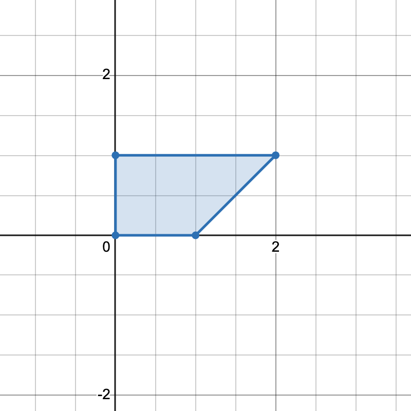

3625. Count Number of Trapezoids II

You are given a 2D integer array `points` where `points[i] = [xi, yi]` represents the coordinates of the `i`th point on the Cartesian plane.

Return the number of unique trapezoids that can be formed by choosing any four distinct points from `points`.

A **trapezoid** is a convex quadrilateral with **at least one pair** of parallel sides. Two lines are parallel if and only if they have the same slope.

 

**Example 1:**
```
Input: points = [[-3,2],[3,0],[2,3],[3,2],[2,-3]]

Output: 2

Explanation:
```


```
There are two distinct ways to pick four points that form a trapezoid:

The points [-3,2], [2,3], [3,2], [2,-3] form one trapezoid.
The points [2,3], [3,2], [3,0], [2,-3] form another trapezoid.
```

**Example 2:**
```
Input: points = [[0,0],[1,0],[0,1],[2,1]]

Output: 1

Explanation:
```

```
There is only one trapezoid which can be formed.
```
 

**Constraints:**

* `4 <= points.length <= 500`
* `–1000 <= xi, yi <= 1000`
* All points are pairwise distinct.

# Submissions
---
**Solution 1: (No Floating point number solutions, Nested Map)**
```
Runtime: 2933 ms, Beats 88.89%
Memory: 572.97 MB, Beats 11.11%
```
```c++
class Solution {
    int hashSlope(int a,int b){
        return a*4003+b;
    }
public:
    int countTrapezoids(vector<vector<int>>& points) {
        int n= points.size();
        unordered_map<int,unordered_map<int,int>> m;
        unordered_map<int,unordered_map<int,map<int,int>>> m2; //slope,c,len
        // for every point pair calculate parameter (a,b,c) for equation ax+by=c,and put into our map for counting
        // to make sure every slope(floating point value -b/a) correspond to a unique pair of (a,b) apply some constrain:
        //      if a or b is 0, it is a line parallel to x-axis or y-axis, convert another value to 1
        //      otherwise a,b are both non-zero integer. and we can require a is positive and a,b has no common divider greator than 1
        //      In this way, we use integer pair (a,b) to represent a slope and no floating point number is needed.
        for(int i=0;i<n;i++){
           int x0=points[i][0],y0=points[i][1];
           for(int j=i+1;j<n;j++){
               int x1=points[j][0],y1=points[j][1];
               int a =y1-y0,b=x0-x1;
               int len = a*a+b*b;
               int c=0;
               if(a<0)
                   a=-a,b=-b;
               if(a*b==0){
                   if(a==0){
                       b=1;
                   }else{
                       a=1;
                   }
               }else{
                   int g =gcd(abs(a),abs(b));
                   a/=g,b/=g;
               }
               c= a*x0+b*y0;
               
               int hash =hashSlope(a,b);
               m[hash][c]++;
               m2[hash][c][len]++;
           }
           
        }
        int total=0;
        for(auto& [slope,counts]:m){
            int prev=0;
            for(auto& [c,count]:counts){
                total+=count*prev;
                prev+=count;
            }
        }
        int sameCount=0;
        // we need to substract count of parallelogram since they have been counted twice in the calculation above
        // the sufficient condition of  parallelogram is that it has two parallel sides with same length. we can use m2 to calculate counts
        for(auto& [slope,counts]:m2){
            map<int,int> prev;
            for(auto& [c,countLen]:counts){
                for(auto& [len,count]:countLen){
                    sameCount+=count*prev[len];
                    prev[len]+=count;
                }
                
            }
        }
        return total-sameCount/2;
    }
};
```

**Solution 2: (Hash Table + Geometry Mathematics)**
```
Runtime: 1004 ms, Beats 94.08%
Memory: 309.88 MB, Beats 93.49%
```
```c++
class Solution {
public:
    int countTrapezoids(vector<vector<int>>& points) {
        int n = points.size();
        int inf = 1e9 + 7;
        unordered_map<float, vector<float>> slopeToIntercept;
        unordered_map<int, vector<float>> midToSlope;
        int ans = 0;
        for (int i = 0; i < n; i++) {
            int x1 = points[i][0];
            int y1 = points[i][1];
            for (int j = i + 1; j < n; j++) {
                int x2 = points[j][0];
                int y2 = points[j][1];
                int dx = x1 - x2;
                int dy = y1 - y2;
                float k, b;
                if (x2 == x1) {
                    k = inf;
                    b = x1;
                } else {
                    k = (float)(y2 - y1) / (x2 - x1);
                    b = (float)(y1 * dx - x1 * dy) / dx;
                }
                int mid = (x1 + x2) * 10000 + (y1 + y2);
                slopeToIntercept[k].push_back(b);
                midToSlope[mid].push_back(k);
            }
        }
        for (auto& [_, sti] : slopeToIntercept) {
            if (sti.size() == 1) {
                continue;
            }
            map<float, int> cnt;
            for (float b : sti) {
                cnt[b]++;
            }
            int sum = 0;
            for (auto& [_, count] : cnt) {
                ans += sum * count;
                sum += count;
            }
        }
        for (auto& [_, mts] : midToSlope) {
            if (mts.size() == 1) {
                continue;
            }
            map<float, int> cnt;
            for (float k : mts) {
                cnt[k]++;
            }
            int sum = 0;
            for (auto& [_, count] : cnt) {
                ans -= sum * count;
                sum += count;
            }
        }
        return ans;
    }
};
```
