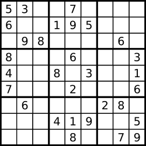

37. Sudoku Solver

Write a program to solve a Sudoku puzzle by filling the empty cells.

A sudoku solution must satisfy **all of the following rules**:

* Each of the digits `1-9` must occur exactly once in each row.
* Each of the digits `1-9` must occur exactly once in each column.
* Each of the the digits `1-9` must occur exactly once in each of the 9 `3x3` sub-boxes of the grid.

Empty cells are indicated by the character `'.'`.



A sudoku puzzle...


...and its solution numbers marked in red.

**Note:**

* The given board contain only digits `1-9` and the character `'.'`.
* You may assume that the given Sudoku puzzle will have a single unique solution.
* The given board size is always `9x9`.

# Submissions
---
**Solution 1: (Backtracking)**
```
Runtime: 420 ms
Memory Usage: 13.8 MB
```
```python
class Solution:
    def solveSudoku(self, board: List[List[str]]) -> None:
        """
        Do not return anything, modify board in-place instead.
        """
        # get a list of (row, col) of empty cells
        def get_vacant_positions(board):
            res = []
            for i in range(9):
                for j in range(9):
                    if board[i][j] == '.':
                        res.append((i, j))
            return res
        
        # get valid candidates that can be filled at (row, col)
        def get_candidates(board, row, col):
            res = set()
            for i in range(1, 10):
                res.add(str(i))
              
            # check row and col
            for i in range(9):
                if board[row][i] in res:
                    res.remove(board[row][i])
                if board[i][col] in res:
                    res.remove(board[i][col])
            
            # check box
            sr = (row // 3) * 3
            sc = (col // 3) * 3
            for i in range(sr, sr+3):
                for j in range(sc, sc+3):
                    if board[i][j] in res:
                        res.remove(board[i][j])
            
            return list(res)
        
        # fill using backtracking
        def solve(board, pos):
            if len(pos) == 0: # no more vacant positions to fill
                return True
            
            r, c = pos[0]
            candidates = get_candidates(board, r, c)
            
            if len(candidates) == 0: # no candidates, reject this path, backtrack
                return False
            
            for num in candidates:
                board[r][c] = num
                if solve(board, pos[1:]):
                    return True
                board[r][c] = '.'
            
            return False

        positions = get_vacant_positions(board)
        solve(board, positions)
```

**Solution 2: (Backtracking, try all value in all cell, O(9! * 9))**
```
Runtime: 311 ms, Beats 63.81%
Memory: 8.86 MB, Beats 27.06%
```
```c++
class Solution {
    bool check(int i2, int j2, char a, vector<vector<char>> &board) {
        int r, c, i = i2 / 3 * 3, j = j2 / 3 * 3;
        for (r = 0; r < 9; r++) {
            if (board[r][j2] == a) {
                return false;
            }
        }
        for (c = 0; c < 9; c++) {
            if (board[i2][c] == a) {
                return false;
            }
        }
        for (r = i; r < i + 3; r++) {
            for (c = j; c < j + 3; c++) {
                if (board[r][c] == a) {
                    return false;
                }
            }
        }
        return true;
    }
    bool bt(int i, int j, vector<vector<char>> &board) {
        if (i == 9) {
            return true;
        }
        if (j == 9) {
            return bt(i + 1, 0, board);
        }
        if (board[i][j] != '.') {
            return bt(i, j + 1, board);
        }
        for (char a = '1'; a <= '9'; a ++) {
            if (check(i, j, a, board)) {
                board[i][j] = a;
                if (bt(i, j + 1, board)){
                    return true;
                }
                
            }
        }
        board[i][j] = '.';
        return false;
    }
public:
    void solveSudoku(vector<vector<char>>& board) {
        bt(0, 0, board);
    }
};
```
