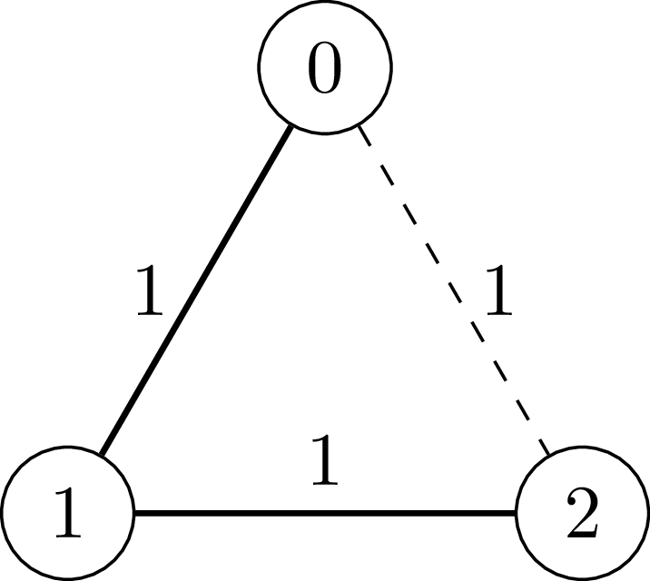
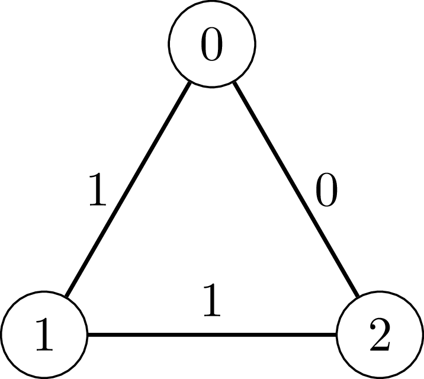

3887. Incremental Even-Weighted Cycle Queries

You are given a positive integer `n`.

There is an **undirected** graph with `n` nodes labeled from 0 to `n - 1`. Initially, the graph has no edges.

You are also given a 2D integer array `edges`, where `edges[i] = [ui, vi, wi]` represents an edge between nodes `ui` and `vi` with weight `wi`. The weight `wi` is either 0 or 1.

Process the edges in `edges` in the given order. For each edge, add it to the graph only if, after adding it, the sum of the weights of the edges in every cycle in the resulting graph is **even**.

Return an integer denoting the number of edges that are successfully added to the graph.

 

**Example 1:**
```
Input: n = 3, edges = [[0,1,1],[1,2,1],[0,2,1]]

Output: 2

Explanation:
```

```
[0, 1, 1]: We add the edge between vertex 0 and vertex 1 with weight 1.
[1, 2, 1]: We add the edge between vertex 1 and vertex 2 with weight 1.
[0, 2, 1]: The edge between vertex 0 and vertex 2 (the dashed edge in the diagram) is not added because the cycle 0 - 1 - 2 - 0 has total edge weight 1 + 1 + 1 = 3, which is an odd number.
```

**Example 2:**
```
Input: n = 3, edges = [[0,1,1],[1,2,1],[0,2,0]]

Output: 3

Explanation:
```

```
[0, 1, 1]: We add the edge between vertex 0 and vertex 1 with weight 1.
[1, 2, 1]: We add the edge between vertex 1 and vertex 2 with weight 1.
[0, 2, 0]: We add the edge between vertex 0 and vertex 2 with weight 0.
Note that the cycle 0 - 1 - 2 - 0 has total edge weight 1 + 1 + 0 = 2, which is an even number.
```

**Constraints:**

* `3 <= n <= 5 * 10^4`
* `1 <= edges.length <= 5 * 10^4`
* `edges[i] = [ui, vi, wi]`
* `0 <= ui < vi < n`
* All edges are distinct.
* `wi = 0 or wi = 1`

# Submissions
---
**Solution 1: (Union Find)**

__Intuition__
We are adding edges one by one, but we must avoid creating any cycle whose total weight is odd.
Since each weight is either 0 or 1, the only thing that matters is:

Whether the sum of weights in a cycle is even or odd

So we don’t care about exact sums - only parity.

__Key Observation__
For any cycle:
sum of weights is even ==> sum % 2 == 0

Now in modulo 2 arithmetic:
addition is equal to XOR

Why?

a	b	a + b (mod 2)	a ^ b
0	0	    0	           0
0	1	    1	           1
1	0	    1              1
1	1	    0              0
So:
sum of weights mod 2 = XOR of weights

Reformulating the Problem
Instead of:
Cycle sum must be even

We enforce:
XOR of weights in every cycle must be 0

DSU Customization (Core Idea)
We augment DSU with:
parity[x] = XOR of weights from node x - root
This allows us to compute XOR between any two nodes in the same component.

XOR Between Two Nodes

If u and v are in the same component:
XOR(u → v) = parity[u] ^ parity[v]

Why this works (proof)

Let root = r

parity[u] = XOR(u → r)
parity[v] = XOR(v → r)

Now:
u → v = (u → r) XOR (v → r)

Because common path cancels out:
(u → r) ^ (v → r) = u → v
When Adding Edge (u, v, w)
We consider two cases:

Case 1: u and v are in different components
No cycle is formed
We can safely add the edge
We merge components

But we must set parity correctly

Case 2: u and v are already connected
Adding this edge forms a cycle.

Cycle XOR:
(existing path u -> v) ^ new edge weight = (parity[u] ^ parity[v]) ^ w

Valid Cycle Condition

We need:
cycle XOR = 0

So:
(parity[u] ^ parity[v] ^ w) == 0
Rearranging:

parity[u] ^ parity[v] == w
This is the key condition

Union Logic (VV Important)
When merging two components:

We want to enforce:

XOR(u -> v) = w

We already know:

parity[u] = XOR(u → root_u)
parity[v] = XOR(v → root_v)
After merging root_v -> root_u, we must assign:

parity[root_v] = XOR(root_v -> root_u)

To maintain consistency:

parity[u] ^ parity[v] ^ parity[root_v] = w

So:
parity[root_v] = parity[u] ^ parity[v] ^ w

__Final Approach__
Initialize DSU with:
parent,size, parity

For each edge (u, v, w):
Find (root_u, parity_u)
Find (root_v, parity_v)

If roots are same:
Check:
parity_u ^ parity_v == w

If true -> accept
Else ->  reject


If roots are different:
Merge using size

Set:
parity[root_v] = parity_u ^ parity_v ^ w

```
Runtime: 21 ms, Beats 93.85%
Memory: 299.74, MB Beats 69.71%
```
```c++
class Solution {
    vector<int> parent, size, parity;

    pair<int,int> find(int x) {
        if (parent[x] == x)
            return {x, 0};

        auto [root, par] = find(parent[x]);
        parent[x] = root;
        parity[x] ^= par;

        return {parent[x], parity[x]};
    }

    bool unite(int u, int v, int w) {
        auto [pu, xu] = find(u);
        auto [pv, xv] = find(v);

        if (pu == pv) {
            // check if adding edge keeps cycle even
            return ((xu ^ xv) == w);
        }

        // unite by size
        if (size[pu] < size[pv]) {
            swap(pu, pv);
            swap(xu, xv);
        }

        parent[pv] = pu;

        // set parity
        parity[pv] = xu ^ xv ^ w;

        size[pu] += size[pv];

        return true;
    }
public:
    int numberOfEdgesAdded(int n, vector<vector<int>>& edges) {
        parent.resize(n);
        size.resize(n, 1);
        parity.resize(n, 0);

        for (int i = 0; i < n; i++)
            parent[i] = i;

        int count = 0;

        for (auto &e : edges) {
            int u = e[0], v = e[1], w = e[2];

            if (unite(u, v, w))
                count++;
        }

        return count;
    }
};
```
