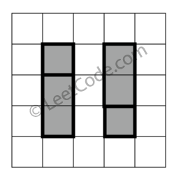

391. Perfect Rectangle

Given N axis-aligned rectangles where N > 0, determine if they all together form an exact cover of a rectangular region.

Each rectangle is represented as a bottom-left point and a top-right point. For example, a unit square is represented as [1,1,2,2]. (coordinate of bottom-left point is (1, 1) and top-right point is (2, 2)).


**Example 1:**


```
rectangles = [
  [1,1,3,3],
  [3,1,4,2],
  [3,2,4,4],
  [1,3,2,4],
  [2,3,3,4]
]

Return true. All 5 rectangles together form an exact cover of a rectangular region.
```

**Example 2:**


```
rectangles = [
  [1,1,2,3],
  [1,3,2,4],
  [3,1,4,2],
  [3,2,4,4]
]

Return false. Because there is a gap between the two rectangular regions.
```

**Example 3:**


```
rectangles = [
  [1,1,3,3],
  [3,1,4,2],
  [1,3,2,4],
  [3,2,4,4]
]

Return false. Because there is a gap in the top center.
```

**Example 4:**


```
rectangles = [
  [1,1,3,3],
  [3,1,4,2],
  [1,3,2,4],
  [2,2,4,4]
]

Return false. Because two of the rectangles overlap with each other.
```

# Submissions
---
**Solution 1: (Greedy)**
```
Runtime: 376 ms
Memory Usage: 19.7 MB
```
```python
class Solution:
    def isRectangleCover(self, rectangles: List[List[int]]) -> bool:
        corners = set()
        area = 0
        for x1, y1, x2, y2 in rectangles:
            p1 = (x1, y1)
            p2 = (x1, y2)
            p3 = (x2, y1)
            p4 = (x2, y2)
            for p in [p1, p2, p3, p4]:
                if p in corners:
                    corners.remove(p)
                else:
                    corners.add(p)
            area += (x2 - x1) * (y2 - y1)
        if len(corners) != 4:
            return False
        corners = sorted(list(corners))
        p1, p4 = corners[0], corners[-1]
        return area == (p4[0] - p1[0]) * (p4[1] - p1[1])
```