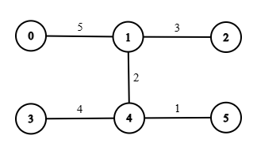
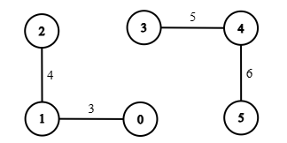
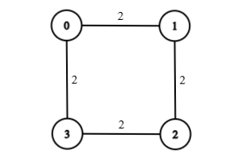

3924. Minimum Threshold Path With Limited Heavy Edges

There is an undirected weighted graph with `n` nodes labeled from 0 to `n - 1`.

The graph is represented by a 2D integer array `edges`, where each edge `edges[i] = [ui, vi, wi]` indicates that there is an undirected edge between nodes `ui` and `vi` with weight `wi`.

You are also given integers `source`, `target` and `k`.

A `threshold` value determines whether an edge is considered light or heavy:

An edge is **light** if its weight is **less than** or **equal** to `threshold`.

An edge is **heavy** if its weight is **greater than** `threshold`.

A path from `source` to `target` is **valid** if it contains **at most** `k` heavy edges.

Return the **minimum** integer `threshold` such that **at least** one **valid** path exists from `source` to `target`. If no such path exists, return `-1`.

 

**Example 1:**


```
Input: n = 6, edges = [[0,1,5],[1,2,3],[3,4,4],[4,5,1],[1,4,2]], source = 0, target = 3, k = 1

Output: 4

Explanation:

The minimum threshold such that a path from node 0 to node 3 uses at most 1 heavy edge is 4.

Light edges: [1, 2, 3], [3, 4, 4], [4, 5, 1], [1, 4, 2]

Heavy edges: [0, 1, 5]

A valid path is 0 → 1 → 4 → 3. It uses only 1 heavy edge ([0, 1, 5]), which satisfies the limit k = 1.

Any smaller threshold would make it impossible to reach node 3 without exceeding 1 heavy edge.
```

**Example 2:**


```
Input: n = 6, edges = [[0,1,3],[1,2,4],[3,4,5],[4,5,6]], source = 0, target = 4, k = 1

Output: -1

Explanation:

There is no path from node 0 to node 4. Since the target cannot be reached, the output is -1.
```

**Example 3:**


```
Input: n = 4, edges = [[0,1,2],[1,2,2],[2,3,2],[3,0,2]], source = 0, target = 0, k = 0

Output: 0

Explanation:

The source and target are the same node. No edges need to be traversed, so the minimum threshold is 0.
```
 

**Constraints:**

* `1 <= n <= 10^3`
* `0 <= edges.length <= 10^3`
* `edges[i] = [ui, vi, wi]`
* `0 <= ui, vi <= n - 1`
* `1 <= wi <= 10^9`
* `0 <= source, target <= n - 1`
* `0 <= k <= edges.length`

# Submissions
---
**Solution 1: (Binary Search, Binary Search on Answer and 0-1 BFS)**
```
Runtime: 214 ms, Beats 42.88%
Memory: 193.05 MB, Beats 30.03%
```
```c++
class Solution {
    vector<vector<int>> edges;
    int source;
    int target;
    int k;
    int n;
    vector<vector<vector<int>>> adj;

    bool check(int mid) {

        vector<int> dist(n, 1e9);
        dist[source] = 0;
        // 0-1 BFS uses a deque
        deque<int> dq;
        dq.push_back(source);

        while (!dq.empty()) {
            int u = dq.front();
            dq.pop_front();

            for (auto &e : adj[u]) {
                int v = e[0];
                // check heavy or light according to threshold
                // light: 0 and heavy: 1
                int len = (e[1] > mid ? 1 : 0);
                if (dist[u] + len < dist[v]) {
                    dist[v] = dist[u] + len;
                    // front the deque as this would be the lowest distance till now
                    if (len == 0)
                        dq.push_front(v);
                    else
                        dq.push_back(v);
                }
            }
        }

        // check if we can reach by using atmost k heavy edges
        return dist[target] <= k;
    }
public:
    int minimumThreshold(int n, vector<vector<int>>& edges, int source, int target, int k) {
        int low = 0;
        int high = 1e9 + 1;

        this->n = n;
        this->edges = edges;
        this->source = source;
        this->target = target;
        this->k = k;

        adj = vector<vector<vector<int>>> (n);

        // build the graph from edges
        for (auto &e : edges) {
            int u = e[0], v = e[1];
            int len = e[2];
            adj[u].push_back({v, len});
            adj[v].push_back({u, len});
        }

        // check for each threshold
        int res = -1;
        while (low <= high) {
            int mid = low + (high - low) / 2;
            if (check(mid)) {
                // if possible, find better(lower threshold)
                res = mid;
                high = mid - 1;
            } else {
                low = mid + 1;
            }
        }

        return res;
    }
};
```
