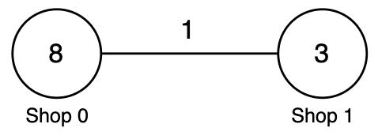
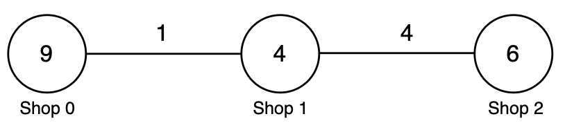
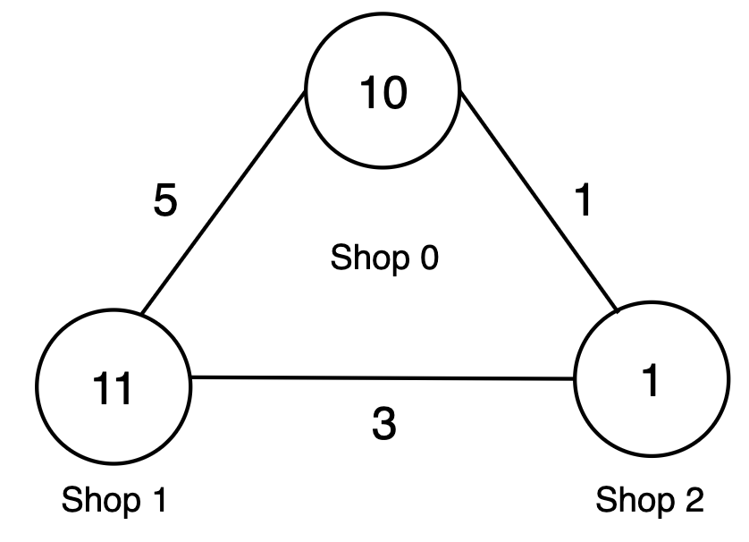

3928. Minimum Cost to Buy Apples II

You are given an integer `n` and an integer array `prices` of length `n`, where `prices[i]` is the price of apples at shop `i`.

You are also given a 2D integer array `roads`, where `roads[i] = [ui, vi, costi, taxi]` represents a bidirectional road:

* `ui` and `vi` are the shops connected by the road.
* `costi` is the cost to travel the road without carrying apples.
* `taxi` is the multiplier applied to `costi` when traveling with apples.

For each shop `i`, you can either:

* Buy apples locally at shop `i` for `prices[i]`.
* Travel empty to any shop `j` using any number of roads, buy apples for `prices[j]`, and return to shop `i` while carrying apples, paying `cost * tax` on each road used for the return trip.

The forward path, where you travel empty, and the return path may be **different**.

Return an integer array `ans` of length `n`, where `ans[i]` is the minimum total cost to buy apples starting from shop `i`.

 

**Example 1:**
```
Input: n = 2, prices = [8,3], roads = [[0,1,1,2]]

Output: [6,3]

Explanation:
```

```
Shop i	prices[i]	Shop j	prices[j]	costi	taxi	Travel cost	Return cost	Total	Minimum
0	8	1	3	1	2	1	1 * 2 = 2	1 + 2 + 3 = 6	min(8, 6) = 6
1	3	0	8	1	2	1	1 * 2 = 2	1 + 2 + 8 = 11	min(3, 11) = 3
Thus, the answer is [6, 3].
```

**Example 2:**
```
Input: n = 3, prices = [9,4,6], roads = [[0,1,1,3],[1,2,4,2]]

Output: [8,4,6]

Explanation:
```

```
Shop i	prices[i]	Shop j	prices[j]	costi	taxi	Travel cost	Return cost	Total	Minimum
0	9	1	4	1	3	1	1 * 3 = 3	1 + 3 + 4 = 8	min(9, 8) = 8
1	4	2	6	4	2	4	4 * 2 = 8	4 + 8 + 6 = 18	min(4, 18) = 4
2	6	1	4	4	2	4	4 * 2 = 8	4 + 8 + 4 = 16	min(6, 16) = 6
Thus, the answer is [8, 4, 6].
```

**Example 3:**
```
Input: n = 3, prices = [10,11,1], roads = [[0,2,1,3],[1,2,3,4],[0,1,5,2]]

Output: [5,11,1]

Explanation:
```

```
Shop i	prices[i]	Shop j	prices[j]	costi	taxi	Travel cost	Return cost	Total	Minimum
0	10	2	1	1	3	1	1 * 3 = 3	1 + 3 + 1 = 5	min(10, 5) = 5
1	11	2	1	3	4	3	3 * 4 = 12	3 + 12 + 1 = 16	min(11, 16) = 11
2	1	0	10	1	3	1	1 * 3 = 3	1 + 3 + 10 = 14	min(1, 14) = 1
Thus, the answer is [5, 11, 1].
```
 

**Constraints:**

* `1 <= n <= 1000`
* `prices.length == n`
* `1 <= prices[i] <= 10^9`
* `0 <= roads.length <= min(n × (n - 1) / 2, 2000)`
* `roads[i] = [ui, vi, costi, taxi]`
* `0 <= ui, vi <= n - 1`
* `ui != vi`
* `1 <= costi <= 10^9`
* `1 <= taxi <= 100`
* There are no repeated edges.

# Submissions
---
**Solution 1: (Dijkstra)**
```
Runtime: 1727 ms, Beats 90.41%
Memory: 262.55 MB, Beats 96.67%
```
```c++
class Solution {
    using ll = long long;
    using P = pair<ll,int>;

    const ll INF = 2e18;
public:
    vector<int> minCost(int n, vector<int>& prices, vector<vector<int>>& roads) {
        // normal travel graph
        vector<vector<pair<int,int>>> emptyGraph(n);

        // carrying apples graph
        vector<vector<pair<int,ll>>> carryGraph(n);

        for(auto &e : roads) {

            int u = e[0];
            int v = e[1];
            int cost = e[2];
            int taxi = e[3];

            emptyGraph[u].push_back({v, cost});
            emptyGraph[v].push_back({u, cost});

            carryGraph[u].push_back({v, 1LL * cost * taxi});

            carryGraph[v].push_back({u, 1LL * cost * taxi});
        }

        vector<int> ans(n);

        // distance arrays
        vector<ll> emptyDist(n);
        vector<ll> carryDist(n);

        for(int src = 0; src < n; src++) {

            // EMPTY TRAVEL
            fill(emptyDist.begin(),emptyDist.end(),INF);
            priority_queue<P,vector<P>,greater<P>> pq;

            emptyDist[src] = 0;
            pq.push({0, src});

            while(!pq.empty()) {
                auto [d, u] = pq.top();
                pq.pop();

                if(d > emptyDist[u])continue;

                for(auto &[v, w] : emptyGraph[u]) {
                    if(emptyDist[v] > d + w) {
                        emptyDist[v] = d + w;
                        pq.push({emptyDist[v], v});
                    }
                }
            }

            // CARRYING APPLES
            fill(carryDist.begin(),carryDist.end(),INF);
            carryDist[src] = 0;
            pq.push({0, src});

            while(!pq.empty()) {
                auto [d, u] = pq.top();
                pq.pop();

                if(d > carryDist[u]) continue;

                for(auto &[v, w] : carryGraph[u]) {
                    if(carryDist[v] > d + w) {
                        carryDist[v] = d + w;
                        pq.push({carryDist[v], v});
                    }
                }
            }

            // FIND BEST SHOP
            ll best = prices[src];

            for(int shop = 0;shop < n;shop++) {
                if(emptyDist[shop] == INF ||carryDist[shop] == INF)continue;
                ll total = emptyDist[shop] + carryDist[shop] + prices[shop];
                best = min(best, total);
            }

            ans[src] = (int)best;
        }

        return ans;
    }
};
```
