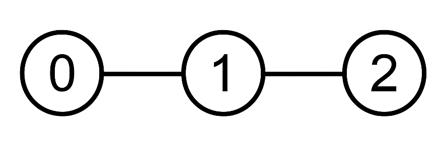
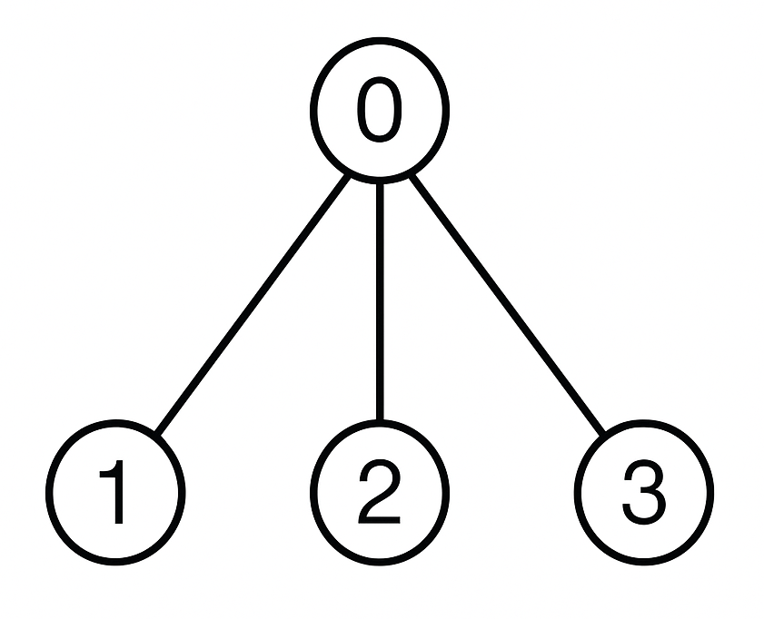

3939. Count Non Adjacent Subsets in a Rooted Tree

You are given a rooted tree with `n` nodes labeled from 0 to `n - 1`, represented by an integer array `parent` of length `n`, where:

* `parent[0] = -1` (node 0 is the root).
* For each `1 <= i < n`, `parent[i]` is the parent of node `i` (`0 <= parent[i] < i`).

You are also given an integer array nums of length `n`, where `nums[i]` is the value of node `i`, and an integer `k`.

A non-empty subset of nodes is called **valid** if:

* The sum of the values of the selected nodes is **divisible** by `k`.
* No two selected nodes are **adjacent** in the tree (no node and its direct parent are both included in the subset).

Return the number of valid subsets modulo `10^9 + 7`.

 

**Example 1:**
```
Input: parent = [-1,0,1], nums = [1,2,3], k = 3

Output: 1

Explanation:
```

```
The only valid subset is {2}. It contains node 2 with value 3, which is divisible by 3.
```

**Example 2:**
```
Input: parent = [-1,0,0,0], nums = [2,1,2,1], k = 3

Output: 2

Explanation:
```

```
The valid subsets are:

{1, 2}: Nodes 1 and 2 are both children of node 0 and not directly connected to each other. Their values sum to 1 + 2 = 3, which is divisible by 3.
{2, 3}: Nodes 2 and 3 are also non-adjacent. Their values sum to 2 + 1 = 3, which is divisible by 3.
No other subset satisfies both conditions. Therefore, the answer is 2.
```
 

**Constraints:**

* `n == parent.length == nums.length`
* `1 <= n <= 1000`
* `parent[0] == -1`
* For all `1 <= i < n`:
* `0 <= parent[i] < i`
* `1 <= nums[i] <= 10^9`
* `1 <= k <= 100`
* parent describes a valid rooted tree.

# Submissions
---
**Solution 1: (DP Top-Down, Tree, Take/Not-take)**

Intuition
Here, for any subtree(u), we need to find the number of subsets of node such that the sum%k==0 and no adjacent nodes are selected.

To counter the adjacent constraint, we can think it as a knapsack problem where we need to find sum of non consecutive elements.
Thus, for node u, we have 2 choices to take or not take. If we take u, then we cannot take any of its child, but if we do not take u, then we can take or not take the children of u.

Approach
We maintain a dp array where dp[u][i][s]-> no of subsets for subtree(u) having sum%k =s and value of u is added if i==1 else i==0.

Now, we take all possible mod values for the parent and find the number of ways for the child and then we get the total no of subsets by multiplying the ways.
(Refer code for better understanding).

```
Runtime: 1956 ms, Beats 5.19%
Memory: 101.02 MB, Beats 47.56%
```
```c++
class Solution {
    vector<vector<int>>adj;
    vector<vector<vector<long long>>> dp;
    const int mod =1e9+7;
    //dp[u][take][sum%k]
    void dfs(int u,vector<int>&nums,int k){

        dp[u][0][0]=1; // u not taken
        dp[u][1][nums[u]%k]=1; // u taken

        for(auto v:adj[u]){
            dfs(v,nums,k);

            vector<vector<long long>> dp2(2,vector<long long>(k,0));
            //u not taken
            for(int a=0;a<k;++a){
                for(int b=0;b<k;++b){
                    //2 choices for child
                    long long x= (dp[v][0][b]%mod+dp[v][1][b]%mod)%mod;
                    dp2[0][(a+b)%k] = (dp2[0][(a+b)%k]%mod+(dp[u][0][a]*x)%mod)%mod;
                }
            }
            //u taken
            for(int a=0;a<k;++a){
                for(int b=0;b<k;++b){
                    //only 1 choice for child
                    dp2[1][(a+b)%k] = (dp2[1][(a+b)%k]%mod+(dp[u][1][a]*dp[v][0][b])%mod)%mod;
                }
            }
            dp[u]=dp2;
        }
    }
public:
    int countValidSubsets(vector<int>& parent, vector<int>& nums, int k) {
        int n=parent.size();
        adj.resize(n,{});
       
        for(int i=0;i<n;++i){
            if(parent[i]!=-1){
                adj[parent[i]].push_back(i);
            }
        }
        dp.resize(n,vector<vector<long long>>(2,vector<long long>(k,0)));
        
        dfs(0,nums,k);
        //dp[0][0][0]-> when node 0 is not taken and sum%k==0
        //dp[0][1][0]-> when node 0 is taken and sum%k==0
        // we subtract 1 as we do not want an empty set
        long long ans=(dp[0][0][0]+dp[0][1][0]-1+mod)%mod;
        return ans;
    }
};
```
