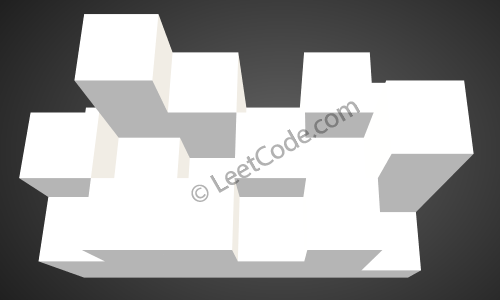

407. Trapping Rain Water II

Given an `m x n` matrix of positive integers representing the height of each unit cell in a 2D elevation map, compute the volume of water it is able to trap after raining.

 

**Note:**

* Both `m` and `n` are less than `110`. The height of each unit cell is greater than `0` and is less than `20,000`.

 

**Example:**
```
Given the following 3x6 height map:
[
  [1,4,3,1,3,2],
  [3,2,1,3,2,4],
  [2,3,3,2,3,1]
]

Return 4.
```



The above image represents the elevation map `[[1,4,3,1,3,2],[3,2,1,3,2,4],[2,3,3,2,3,1]]` before the rain.


After the rain, water is trapped between the blocks. The total volume of water trapped is `4`.

# Submissions
---
**Solution 1: (Heap)**

* Visit boundary first
    * append( height[x][y] (x, y) ) to a list
* heapify the list and start from the point with smallest height to check its neighbor.
    * If neighbor has height higher than start point water_top, then this neighbor cannot hold water with water_top as its height
    * Otherwise the neighbor holds the same amount of water with the same water_top as start point.
        * Add the water the neighbor can hold to results.
        * Append the visited neighbor to heap.
* Return final results when heap is empty

* Time: O(nlogn), n is the total size of heightMap
* Space: O(n)

```
Runtime: 200 ms
Memory Usage: 15.5 MB
```
```python
class Solution:
    def trapRainWater(self, heightMap: List[List[int]]) -> int:
        if not heightMap or not heightMap[0] or len(heightMap)<3 or len(heightMap[0])<3:
            return 0
        
        R, C = len(heightMap), len(heightMap[0])
        height_dict = {}
        water_top_heap = []
        # Check bondary first
        for c in range(C):
            # Top boundary
            water_top_heap.append( (heightMap[0][c], (0, c)) )
            height_dict[(0, c)] = (heightMap[0][c])
            # Bottom boundary
            water_top_heap.append( (heightMap[R - 1][c], (R - 1, c)) )
            height_dict[(R - 1, c)] = (heightMap[R - 1][c])
        for r in range(R):
            if (r, 0) not in height_dict:
                # Left boundary
                water_top_heap.append( (heightMap[r][0], (r, 0)) )
                height_dict[(r, 0)] = (heightMap[r][0])
            if (r, C-1) not in height_dict:
                # Right boundary
                water_top_heap.append( (heightMap[r][C - 1], (r, C - 1)) )
                height_dict[(r, C - 1)] = (heightMap[r][C - 1])
        heapq.heapify(water_top_heap)
    
        res = 0
        dr, dc = [0, 1, 0, -1], [1, 0, -1, 0]
        while water_top_heap:
            cur_height, cur_pos = heapq.heappop(water_top_heap)
            for i in range(4):
                nr, nc = cur_pos[0] + dr[i], cur_pos[1] + dc[i]
                if 0 <= nr < R and 0 <= nc < C and (nr, nc) not in height_dict:
                    if heightMap[nr][nc] > height_dict[cur_pos]: 
                        height_dict[(nr, nc)] = heightMap[nr][nc]
                    else:
                        height_dict[(nr, nc)] = height_dict[cur_pos]
                    res += height_dict[(nr, nc)] - heightMap[nr][nc]
                    heapq.heappush(water_top_heap, (heightMap[nr][nc], (nr, nc)) )
        return res
```

**Solution 2: (Heap)**
```
Runtime: 36 ms
Memory Usage: 22.6 MB
```
```c
typedef struct Data{
    int value;
    int *coor;    
}dNode, *dLinklist;

typedef struct Heap{
    dNode *data;
    int size;
    int capacity;
}hNode, *hLinklist;

hLinklist CreateHeap(int r, int c){
    hLinklist h=(hLinklist)malloc(sizeof(hNode));
    h->data=(dLinklist)malloc((r*c)*sizeof(dNode));
    h->size=0;
    h->capacity=r*c;
    h->data[0].value=-9999;
    return h;
}

bool isFull(hLinklist h){
    return (h->size == h->capacity);
}

bool isEmpty(hLinklist h){
    return (h->size==0);
}

bool insert(hLinklist h, int a, int b, int c){    
    if(isFull(h)){
        printf("\n!!!!!!!!!!!堆满!!!!!!!!!!\n");
        return false;
    }
    int i;
    dNode data;
    data.value=a;
    data.coor=(int*)malloc(8);
    data.coor[0]=b;
    data.coor[1]=c;
    i=++h->size;
    for(;h->data[i/2].value>data.value;i/=2){
        h->data[i]=h->data[i/2];
    }
    h->data[i]=data;
    return true;
}

dNode deleteMin(hLinklist h){
    int p,c;
    dNode min,x;
    if(isEmpty(h)){
        printf("\n!!!!!!!!!!堆空!!!!!!!!!\n");
        min.value=-9999;
        return min;
    }
    min=h->data[1];
    x=h->data[h->size--];
    for(p=1;p*2<=h->size;p=c){
        c=2*p;
        if(c!=h->size)
            if(h->data[c].value > h->data[c+1].value)
                c++;
        if(x.value<=h->data[c].value)break;
            else h->data[p]=h->data[c];
    }
    h->data[p]=x; 
    return min;
}

void percDown( hLinklist h, int a){
    int p, c;
    dNode x=h->data[a]; 
    for(p=a;p*2<=h->size;p=c){
        c=2*p;
        if(c!=h->size)
            if(h->data[c].value>h->data[c+1].value)
                c++;
        if(x.value<=h->data[c].value)break;
            else h->data[p]=h->data[c];
    }
    h->data[p]=x;
}

void buildHeap(hLinklist h){
    int i;
    for(i=h->size/2;i>0;i--)
        percDown(h,i);
}

void Do(int **s,hLinklist h, int i, int j, int k){
    h->data[k].coor=(int*)malloc(8);
    h->data[k].value=s[i][j];
    h->data[k].coor[0]=i;
    h->data[k].coor[1]=j;
    h->size++;
    s[i][j]=-1;     
}

void outerWall(hLinklist h, int **s, int r, int c){
    int i=0,j=0,k=1;
    for(s[i][j++]=-1;j<c-1;j++)
        Do(s,h,i,j,k++);          
    for(s[i++][j]=-1;i<r-1;i++)
        Do(s,h,i,j,k++); 
    for(s[i][j--]=-1;j>0;j--)
        Do(s,h,i,j,k++); 
    for(s[i--][j]=-1;i>0;i--)
        Do(s,h,i,j,k++); 
}

void SearchAround(int **s,hLinklist h, int i, int j, int r, int c, int *dimension, int *level);

void DO(int **s,hLinklist h, int i, int j, int r, int c, int *dimension, int *level){
    if(s[i][j]>*level){
        insert(h,s[i][j],i,j);
        s[i][j]=-1;
    }
    else{       
//      printf("i=%d,j=%d,高度为%d,水位为%d,蓄水量%d\n",i,j,s[i][j],*level,*level-s[i][j]);
        (*dimension)+=(*level)-s[i][j];
        s[i][j]=-1;
        SearchAround(s,h,i,j,r,c,dimension,level);           
    }    
}

void SearchAround(int **s,hLinklist h, int i, int j, int r, int c, int *dimension, int *level){
    if(i!=0 && s[i-1][j]!=-1)       
        DO(s,h,i-1,j,r,c,dimension,level); 
    if(i<r-1 && s[i+1][j]!=-1)
        DO(s,h,i+1,j,r,c,dimension,level);
    if(j!=0 && s[i][j-1]!=-1)
        DO(s,h,i,j-1,r,c,dimension,level); 
    if(j<c-1 && s[i][j+1]!=-1)        
        DO(s,h,i,j+1,r,c,dimension,level);
}

void Search(int **s,hLinklist h, int r, int c,int*level,int*dimension){
    int i,j;
    dNode t;
    for(;;){
        t=deleteMin(h);
        if(t.value<0)break;
        (*level)=t.value;
  //    printf("level=%d\n",*level);   
        i=t.coor[0];
        j=t.coor[1];
        SearchAround(s,h,i,j,r,c,dimension,level);
    }   
}

int trapRainWater(int** heightMap, int heightMapSize, int* heightMapColSize){
    if(heightMapSize<3||(*heightMapColSize)<3)return 0;
    int r=heightMapSize, c=*heightMapColSize;
    hLinklist h=CreateHeap(r,c);   
    int i,j,k,a,b;    
    int *level=(int*)calloc(1,4);
    int *dimension=(int*)calloc(1,4);
    outerWall(h,heightMap,r,c);
    buildHeap(h);
    Search(heightMap,h,r,c,level,dimension);   
    return *dimension;
}
```

**Solution 3: (Heap, greedy min step from border)**
```
Runtime: 28 ms
Memory: 19.31 MB
```
```c++
class Solution {
    int dr[4] = {-1, 0, 1, 0};
    int dc[4] = {0, -1, 0, 1};
public:
    int trapRainWater(vector<vector<int>>& heightMap) {
        int m = heightMap.size(), n = heightMap[0].size();
        priority_queue<tuple<int, int, int>, vector<tuple<int, int, int>>, greater<tuple<int, int, int>>> pq;
        vector<vector<int>> vis(m, vector<int>(n));
        for (int i = 0; i < m; i++){
            vis[i][0] = 1;
            vis[i][n-1] = 1;
            pq.push({heightMap[i][0], i, 0});
            pq.push({heightMap[i][n-1], i, n-1});
        }
        for (int  i = 0; i < n; i++){
            vis[0][i] = 1;
            vis[m-1][i] = 1;
            pq.push({heightMap[0][i], 0, i});
            pq.push({heightMap[m-1][i], m-1, i});
        }
        int ans = 0;
        while (!pq.empty()) {
            auto [h, r, c] = pq.top();
            pq.pop();
            for (int i = 0; i < 4; i++) {
                int nr = r + dr[i];
                int nc = c + dc[i];
                if (nr >= 0 && nr < m && nc >= 0 && nc < n && !vis[nr][nc]){
                    ans += max(0, h-heightMap[nr][nc]);
                    pq.push({max(h, heightMap[nr][nc]), nr, nc});
                    vis[nr][nc] = 1;
                }
            }
        }
        return ans;
    }
};
```
