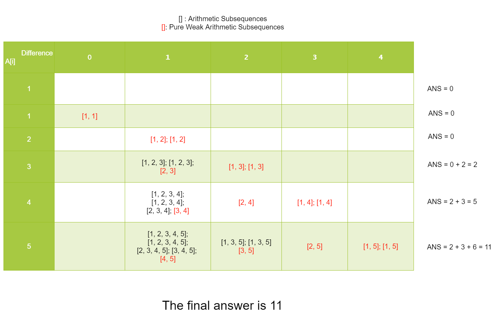

446. Arithmetic Slices II - Subsequence

A sequence of numbers is called arithmetic if it consists of at least three elements and if the difference between any two consecutive elements is the same.

For example, these are arithmetic sequences:
```
1, 3, 5, 7, 9
7, 7, 7, 7
3, -1, -5, -9
```
The following sequence is not arithmetic.
```
1, 1, 2, 5, 7
```
A zero-indexed array A consisting of N numbers is given. A **subsequence** slice of that array is any sequence of integers (P0, P1, ..., Pk) such that 0 ≤ P0 < P1 < ... < Pk < N.

A **subsequence** slice (P0, P1, ..., Pk) of array A is called arithmetic if the sequence A[P0], A[P1], ..., A[Pk-1], A[Pk] is arithmetic. In particular, this means that k ≥ 2.

The function should return the number of arithmetic subsequence slices in the array A.

The input contains N integers. Every integer is in the range of -231 and 231-1 and 0 ≤ N ≤ 1000. The output is guaranteed to be less than 231-1.

 
**Example:**
```
Input: [2, 4, 6, 8, 10]

Output: 7

Explanation:
All arithmetic subsequence slices are:
[2,4,6]
[4,6,8]
[6,8,10]
[2,4,6,8]
[4,6,8,10]
[2,4,6,8,10]
[2,6,10]
```

# Solution
---
## Approach #1 Brute Force [Time Limit Exceeded]
**Intuition**

Enumerate all possible subsequences to see if they are arithmetic sequences.

**Algorithm**

We can use depth-first search to generate all subsequences. We can check a Subsequence is arithmetic or not by its definition.

**C++**
```c++
#define LL long long
class Solution {
public:
    int n;
    int ans;
    void dfs(int dep, vector<int>& A, vector<LL> cur) {
        if (dep == n) {
            if (cur.size() < 3) {
                return;
            }
            for (int i = 1; i < cur.size(); i++) {
                if (cur[i] - cur[i - 1] != cur[1] - cur[0]) {
                    return;
                }
            }
            ans ++;
            return;
        }
        dfs(dep + 1, A, cur);
        cur.push_back(A[dep]);
        dfs(dep + 1, A, cur);
    }
    int numberOfArithmeticSlices(vector<int>& A) {
        n = A.size();
        ans = 0;
        vector<LL> cur;
        dfs(0, A, cur);
        return (int)ans;
    }
};

```

**Java**
```java

class Solution {
    private int n;
    private int ans;
    private void dfs(int dep, int[] A, List<Long> cur) {
        if (dep == n) {
            if (cur.size() < 3) {
                return;
            }
            long diff = cur.get(1) - cur.get(0);
            for (int i = 1; i < cur.size(); i++) {                
                if (cur.get(i) - cur.get(i - 1) != diff) {
                    return;
                }
            }
            ans ++;
            return;
        }
        dfs(dep + 1, A, cur);
        cur.add((long)A[dep]);
        dfs(dep + 1, A, cur);
        cur.remove((long)A[dep]);
    }
    public int numberOfArithmeticSlices(int[] A) {
        n = A.length;
        ans = 0;
        List<Long> cur = new ArrayList<Long>();
        dfs(0, A, cur);
        return (int)ans;        
    }
}
```

**Complexity Analysis**

* Time complexity : $O(2^n)$. For each element in the array, it can be in or outside the subsequence. So the time complexity is $O(2^n)$.

* Space complexity : $O(n)$. We only need the space to store the array.

## Approach #2 Dynamic Programming [Accepted]
**Intuition**

To determine an arithmetic sequence, we need at least two parameters: the first (or last) element of the sequence, and the common difference.

**Algorithm**

Starting from this point, we can easily figure out that one state representation that may work:

> f[i][d] denotes the number of arithmetic subsequences that ends with A[i] and its common difference is d.

Let's try to find the state transitions based on the representation above. Assume we want to append a new element `A[i]` to existing arithmetic subsequences to form new subsequences. We can append `A[i]` to an existing arithmetic subsequence, only if the difference between the sequence's last element and `A[i]` is equal to the sequence's common difference.

Thus, we can define the state transitions for the element `A[i]` intuitively :

> for all j < i, f[i][A[i] - A[j]] += f[j][A[i] - A[j]].

This demonstrates the appending process above to form new arithmetic subsequences.

But here comes the problem. Initially all `f[i][d]` are set to be `0`, but how can we form a new arithmetic subsequence if there are no existing subsequences before?

In the original definition of arithmetic subsequences, the length of the subsequence must be at least `3`. This makes it hard to form new subsequences if only two indices `i` and `j` are given. How about taking the subsequences of length `2` into account?

We can define `weak arithmetic subsequences` as follows:

> **Weak arithmetic subsequences** are subsequences that consist of at least two elements and if the difference between any two consecutive elements is the same.

There are two properties of weak arithmetic subsequences that are very useful:

* For any pair `i, j` (`i != j`), `A[i]` and `A[j]` can always form a weak arithmetic subsequence.

* If we can append a new element to a weak arithmetic subsequence and keep it arithmetic, then the new subsequence must be an arithmetic subsequence.

The second property is quite trival, because the only difference between arithmetic subsequences and weak arithmetic subsequences is their length.

Thus we can change the state representations accordingly:

> `f[i][d]` denotes the number of weak arithmetic subsequences that ends with `A[i]` and its common difference is `d`.

Now the state transitions are quite straightforward:

> for all `j < i`, `f[i][A[i] - A[j]] += (f[j][A[i] - A[j]] + 1)`.

The 1 appears here because of the property one, we can form a new weak arithmetic subsequence for the pair `(i, j)`.

Now the number of all weak arithmetic subsequences is the sum of all `f[i][d]`. But how can we get the number of arithmetic subsequences that are not weak?

There are two ways:

* First, we can count the number of pure weak arithmetic subsequences directly. The pure weak arithmetic subsequences are the arithmetic subsequences of length `2`, so the number of pure weak arithmetic subsequences should be equal to the number of pairs `(i, j)`, which is $\binom{n}{2} = \frac{n * (n - 1)}{2}$.

* Second, for the summation `f[i][A[i] - A[j]] += (f[j][A[i] - A[j]] + 1)`, `f[j][A[i] - A[j]]` is the number of existing weak arithmetic subsequences, while `1` is the new subsequence built with `A[i]` and `A[j]`. Based on property two, when we are appending new elements to existing weak arithmetic subsequences, we are forming arithmetic subsequences. So the first part, `f[j][A[i] - A[j]]` is the number of new formed arithmetic subsequences, and can be added to the answer.

We can use the following example to illustrate the process:
```
[1, 1, 2, 3, 4, 5]
```
We need to count the answer for the above sequence.

* For the first element `1`, there is no element in front of it, the answer remains `0`.

* For the second element `1`, the element itself with the previous `1` can form a pure weak arithmetic subsequence with common difference `0 : [1, 1]`.

* For the third element `2`, it cannot be appended to the only weak arithmetic subsequence `[1, 1]`, so the answer remains `0`. Similar to the second element, it can form new weak arithmetic subsequences `[1, 2]` and `[1, 2]`.

* For the forth element `3`, if we append it to some arithmetic subsequences ending with `2`, these subsequences must have a common difference of `3 - 2 = 1`. Indeed there are two: `[1, 2]` and `[1, 2]`. So we can append 3 to the end of these subsequences, and the answer is added by `2`. Similar to above, it can form new weak arithmetic subsequences `[1, 3], [1, 3]` and `[2, 3]`.

* The other elements are the same, we can view the process in the figure below. The red bracket indicates the weak arithmetic subsequence of length `2`, and the black bracket indicates the arithmetic subsequence. The answer should be the total number of black brackets.



**C++**
```c++

#define LL long long
class Solution {
public:
    int numberOfArithmeticSlices(vector<int>& A) {
        int n = A.size();
        LL ans = 0;
        vector<map<LL, int>> cnt(n);
        for (int i = 1; i < n; i++) {
            for (int j = 0; j < i; j++) {
                LL delta = (LL)A[i] - (LL)A[j];
                int sum = 0;
                if (cnt[j].find(delta) != cnt[j].end()) {
                    sum = cnt[j][delta];
                }
                cnt[i][delta] += sum + 1;
                ans += sum;
            }
        }

        return (int)ans;
    }
};
```

**Java**
```java

class Solution {
    public int numberOfArithmeticSlices(int[] A) {
        int n = A.length;
        long ans = 0;
        Map<Integer, Integer>[] cnt = new Map[n];
        for (int i = 0; i < n; i++) {
            cnt[i] = new HashMap<>(i);
            for (int j = 0; j < i; j++) {
                long delta = (long)A[i] - (long)A[j];
                if (delta < Integer.MIN_VALUE || delta > Integer.MAX_VALUE) {
                    continue;
                }
                int diff = (int)delta;
                int sum = cnt[j].getOrDefault(diff, 0);
                int origin = cnt[i].getOrDefault(diff, 0);
                cnt[i].put(diff, origin + sum + 1);
                ans += sum;
            }
        }
        return (int)ans;        
    }
}
```

**Complexity Analysis**

* Time complexity : $O(n ^ 2)$. We can use double loop to enumerate all possible states.

* Space complexity : $O(n ^ 2)$. For each `i`, we need to store at most `n` distinct common differences, so the total space complexity is $O(n ^ 2)$.

# Submissions
---
**Solution 1: (Brute Force, Time Limit Exceeded)**
```python
class Solution:
    def numberOfArithmeticSlices(self, A: List[int]) -> int:
        N = len(A)
        ans = 0
        cur = []
        
        def dfs(dep, cur):
            nonlocal ans
            if dep == N:
                if len(cur) < 3:
                    return
                diff = cur[1] - cur[0]
                for i in range(1, len(cur)):            
                    if cur[i] - cur[i - 1] != diff:
                        return
                ans += 1
                return
            dfs(dep + 1, cur)
            cur += [A[dep]]
            dfs(dep + 1, cur)
            cur.remove(A[dep])
        
        dfs(0, cur);
        return ans        
```

**Solution 2: (DP Bottom-Up)**

Anytime a question is on substring or subsequences, a DP approach might be a good to take since there might be overlapping subproblems.

In cases of subsequences, there seem to be 2 general ways to solve this:  
1). via a 2D/1D array  
2). Via a array of hashmaps

In general, I think the 2nd approach is more often taken when you don't need every piece of information right before it. Only the ones that are revelant. Ie, for this problem, you only need to keep the info on specific value differences between subsequences.

For each index, we look through the prior indexes before it and check the length of the subsequence up to the prior index. Let us call our current index, i and our prev index j. At index i, we check if the difference between A[i] and A[j] exists in the dictionary for A[j]. We add A[j][difference] to our result. For example, if the difference exists in j, that means it is at least of length 2 (becuase we need 2 values in order to have a subsequence with a specific difference). If the difference between the values at i and j is the same, that means we have at least one

```
Runtime: 628 ms
Memory Usage: 52.1 MB
```
```python
class Solution:
    def numberOfArithmeticSlices(self, A: List[int]) -> int:
        dp = [collections.defaultdict(int) for _ in A]
        ans = 0
        for i, n in enumerate(A[1:],1):
            for j in range(i):
                diff = A[i] - A[j]
                if diff in dp[j]:
                    ans += dp[j][diff]
                    dp[i][diff] += dp[j][diff] + 1
                else:
                    dp[i][diff] += 1
                        
        return ans
```

**Solution 2: (DP Bottom-Up)**
```
Runtime: 1041 ms
Memory: 52.5 MB
```
```python
class Solution:
    def numberOfArithmeticSlices(self, nums: List[int]) -> int:
        total, n = 0, len(nums)
        dp = [Counter() for _ in nums]
        for j in range(n):
            for i in range(j):
                dp[j][nums[j] - nums[i]] += (dp[i][nums[j] - nums[i]] + 1)      
            total += sum(dp[j].values())
          
        return total - (n-1)*n//2   # total - sequence length 2 number
```
