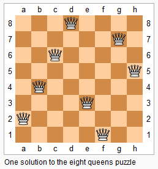

51. N-Queens

The n-queens puzzle is the problem of placing n queens on an n×n chessboard such that no two queens attack each other.



Given an integer `n`, return all distinct solutions to the n-queens puzzle.

Each solution contains a distinct board configuration of the n-queens' placement, where `'Q'` and `'.'` both indicate a queen and an empty space respectively.

**Example:**
```
Input: 4
Output: [
 [".Q..",  // Solution 1
  "...Q",
  "Q...",
  "..Q."],

 ["..Q.",  // Solution 2
  "Q...",
  "...Q",
  ".Q.."]
]
Explanation: There exist two distinct solutions to the 4-queens puzzle as shown above.
```

# Submissions
---
**Solution 1: (Backtracking)**

* Time: O(N!)
* Space: O(N^2)

```
Runtime: 144 ms
Memory Usage: 14 MB
```
```python
class Solution:
    def solveNQueens(self, n: int) -> List[List[str]]:
        queens = []
        grid = [['.' for i1 in range(n)] for i2 in range(n)]
        solution = []
        
        def isValid(location):
            row, col = location
            for queen in queens:
                x, y = queen
                if abs(row - x) == abs(col - y):
                    return False
                if row == x or col == y:
                    return False
            return True

        def solve(col):
            if col >= n:
                solution.append([''.join(row) for row in grid])
                return

            for r in range(n):
                if isValid((r, col)):
                    grid[r][col] = 'Q'
                    queens.append((r, col))
                    solve(col + 1)
                    grid[r][col] = '.'
                    queens.remove((r, col))
        
        solve(0)
        return solution
```

**Solution 2: (Backtracking)**
```
Runtime: 3 ms
Memory Usage: 7.3 MB
```
```c++
class Solution {
    bool isvalid(vector<string> &cur, int row, int col,int n)
    {
         for(int r = row-1; r >= 0; r--)
         {
             if(cur[r][col]=='Q')
                 return false;
         }
         //diagonal right
        int r = row - 1, c = col + 1;
        while(r >= 0 && c < n){
            if(cur[r][c]=='Q')
                return false;
            r -= 1; c+=1;
        }
        //diagonal left
        r = row - 1, c = col - 1;
        while(r >= 0 && c >= 0){
            if(cur[r][c]=='Q')
                return false;
            r -= 1; c -= 1;
        }
        //cell is valid to place the queen 
        return true;
        
    }
    bool placequeen(vector<vector<string>> &ans, vector<string> &cur, int r, int n)
    {
        if(r == n)//if successfully traversed all rows
        {
            ans.push_back(cur);
            return false;
        }
        //placing queens for ith row and jth column
        for(int c = 0; c < n; c ++)
        {
            if(isvalid(cur, r, c, n))
            {
                cur[r][c]='Q';
                if(!placequeen(ans, cur, r+1,n))
                    cur[r][c]='.';
            }
        }
        return false;
    }
public:
    vector<vector<string>> solveNQueens(int n) {
        vector<vector<string>> ans;
        vector<string> cur(n, string(n, '.'));
        bool val=placequeen(ans, cur, 0, n);
        return ans;
    }
};
```

**Solution 3: (Backtracking, level by level)**
```
Runtime: 1 ms, Beats 78.51%
Memory: 10.16 MB, Beats 75.54%
```
```c++
class Solution {
    bool check(int i, int j, vector<string> &path, int n) {
        int r, c;
        for (r = i - 1; r >= 0; r--) {
            if (path[r][j] == 'Q') {
                return false;
            }
        }
        r = i - 1, c = j + 1;
        while (r >= 0 && c < n) {
            if (path[r][c] == 'Q') {
                return false;
            }
            r -= 1;
            c += 1;
        }
        r = i - 1, c = j - 1;
        while (r >= 0 && c >= 0) {
            if (path[r][c] == 'Q') {
                return false;
            }
            r -= 1;
            c -= 1;
        }
        return true;
    }
    void bt (int r, vector<string> &path, vector<vector<string>> &ans, int n) {
        if (r == n) {
            ans.push_back(path);
            return;
        }
        for (int c = 0; c < n; c ++) {
            if (check(r, c, path, n)) {
                path[r][c] = 'Q';
                bt(r + 1, path, ans, n);
                path[r][c] = '.';
            }
        }
    }
public:
    vector<vector<string>> solveNQueens(int n) {
        vector<vector<string>> ans;
        vector<string> path(n, string(n, '.'));
        bt(0, path, ans, n);
        return ans;
    }
};
```
