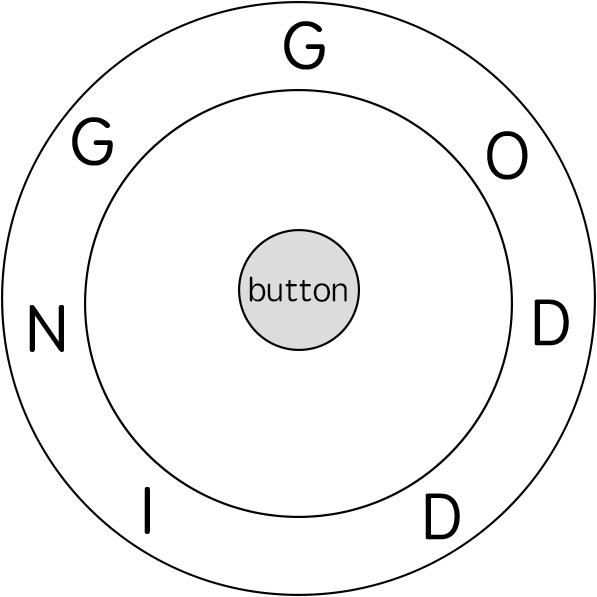

514. Freedom Trail

In the video game Fallout 4, the quest "Road to Freedom" requires players to reach a metal dial called the "Freedom Trail Ring", and use the dial to spell a specific keyword in order to open the door.

Given a string ring, which represents the code engraved on the outer **ring** and another string **key**, which represents the keyword needs to be spelled. You need to find the **minimum** number of steps in order to spell all the characters in the keyword.

Initially, the first character of the ring is aligned at 12:00 direction. You need to spell all the characters in the string **key** one by one by rotating the **ring** clockwise or anticlockwise to make each character of the string **key** aligned at 12:00 direction and then by pressing the center button.

At the stage of rotating the ring to spell the key character **key[i]**:

1. You can rotate the **ring** clockwise or anticlockwise **one place**, which counts as 1 step. The final purpose of the rotation is to align one of the string ring's characters at the 12:00 direction, where this character must equal to the character **key[i]**.
1. If the character **key[i]** has been aligned at the 12:00 direction, you need to press the center button to spell, which also counts as 1 step. After the pressing, you could begin to spell the next character in the key (next stage), otherwise, you've finished all the spelling.

**Example:**


```
Input: ring = "godding", key = "gd"
Output: 4
Explanation:
For the first key character 'g', since it is already in place, we just need 1 step to spell this character. 
For the second key character 'd', we need to rotate the ring "godding" anticlockwise by two steps to make it become "ddinggo".
Also, we need 1 more step for spelling.
So the final output is 4.
```

**Note:**

* Length of both ring and **key** will be in range 1 to 100.
* There are only lowercase letters in both strings and might be some duplcate characters in both strings.
* It's guaranteed that string **key** could always be spelled by rotating the string **ring**.

# Solution
---
**Solution 1: (DP Top-down, DFS, Hash Table)**
```
Runtime: 164 ms
Memory Usage: 13.6 MB
```
```python
import functools
class Solution:
    def findRotateSteps(self, ring: str, key: str) -> int:
        ring_pos = [[] for _ in range(26)]
        for i, ch in enumerate(ring):
            if ch not in key: continue
            ring_pos[ord(ch) - ord('a')].append(i)
            
        @functools.lru_cache(None)
        def dfs(pos, idx):
            if pos == 0: 
                return min(idx, len(ring) - idx) + 1
            steps = float('inf')
            for nxt in ring_pos[ord(key[pos - 1]) - ord('a')]:
                steps = min(steps, dfs(pos - 1, nxt) + min(abs(idx - nxt), len(ring) - abs(idx - nxt)) + 1)
            return steps
        
        ans = float('inf')
        for idx in ring_pos[ord(key[-1]) - ord('a')]: 
            ans = min(ans, dfs(len(key) - 1, idx))
            
        return ans
```

**Solution 2: (DP Bottom-Uo)**
```
Runtime: 20 ms
Memory: 14.65 MB
```
```c++
class Solution {
public:
    int findRotateSteps(string ring, string key) {
        int m = ring.size(), n = key.size();
        vector<vector<int> > dp(n+1, vector<int>(m, INT_MAX));
        dp[0][0] = 0;
        for (int i = 0; i < n; i ++){
            for (int j = 0; j < m; j ++){
                if(dp[i][j] == INT_MAX)
                    continue;
                for (int k = 0; k < m; k ++){
                    if (ring[k] == key[i]){
                        int tmp = abs(j-k);
                        dp[i+1][k] = min(dp[i+1][k], dp[i][j] + min(tmp, m-tmp));
                    }
                }
            }
        }
        int ans = INT_MAX;
        for (int j = 0; j < m; j ++)
            ans = min(ans, dp[n][j]);
        return ans + n;
    }
};
```

**Solution 2: (DP Bottom-Uo 1-D)**
```
Runtime: 14 ms
Memory: 11.30 MB
```
```c++
class Solution {
public:
    int findRotateSteps(string ring, string key) {
        key = ring[0] + key;
        int m = ring.size(), n = key.size();
        vector<vector<int>> mp(26);
        for (int i = 0; i < m; i ++) {
            mp[ring[i]-'a'].push_back(i);
        }
        vector<int> pre, dp;
        pre.push_back(0);
        int level, cur;
        for (int i = 1; i < n; i ++) {
            dp = vector<int>();
            for (int j = 0; j < mp[key[i]-'a'].size(); j ++) {
                level = INT_MAX;
                for (int k = 0; k < pre.size(); k ++) {
                    cur = abs(mp[key[i]-'a'][j] - mp[key[i-1]-'a'][k]);
                    cur = min(cur, m - cur);
                    cur += pre[k];
                    level = min(level, cur);
                }
                dp.push_back(level + 1);
            }
            pre = dp;
        }
        return *min_element(dp.begin(), dp.end());
    }
};
```

**Solution 3: (Dijkstra, O(RK * log(RK)))**
```
Runtime: 17 ms
Memory: 12.04 MB
```
```c++
class Solution {
public:
    int findRotateSteps(string ring, string key) {
        unordered_map<char, vector<int>> m;
        for (int i = 0; i < ring.size(); i++) {
            m[ring[i]].push_back(i);
        }
        int dist[102][102] = {};
        for (auto &dv: dist) {
            for (auto &d: dv) {
                d = INT_MAX;
            }
        }
        priority_queue<tuple<int,int,int>, vector<tuple<int,int,int>>, greater<tuple<int,int,int>>> pq; // distance, pos, index
        for (auto i: m[key[0]]) {
            pq.push({1 + min(i, (int)ring.length()-i), i, 0});
        }
        while (!pq.empty()){
            auto [d, t, i] = pq.top();
            pq.pop();
            if (i == key.size()-1) {
                return d;
            }
            for (auto j: m[key[i+1]]) {
                int steps = 1 + min({abs(t-j), t + (int)ring.length()-j, (int)ring.length() - t + j});
                if (d+steps < dist[i+1][j]){
                    dist[i+1][j] = d + steps;
                    pq.push({d + steps, j, i+1});
                }
            }
        }
        return -1; 
    }
};
```

**Solution 4: (Dijkstra, O(RK * log(RK)))**
```
Runtime: 27 ms, Beats 37.18%
Memory: 18.38 MB, Beats 26.44%
```
```c++
class Solution {
public:
    int findRotateSteps(string ring, string key) {
        int n = key.size(), m = ring.size(), i;
        unordered_map<char, vector<int>> g;
        for (i = 0; i < m; i ++) {
            g[ring[i]].push_back(i);
        }
        vector<vector<int>> dist(n, vector<int>(m, INT_MAX));
        priority_queue<array<int, 3>, vector<array<int, 3>>, greater<>> pq;
        for (auto j: g[key[0]]) {
            pq.push({1 + min(j, m - j), j, 0});
        }
        while (pq.size()) {
            auto [w, ri, kj] = pq.top();
            pq.pop();
            if (kj == n - 1) {
                return w;
            }
            for (auto nri: g[key[kj + 1]]) {
                int dw = 1 + min({abs(ri - nri), ri + m - nri, m - ri + nri});
                if (w + dw < dist[kj + 1][nri]) {
                    dist[kj + 1][nri] = w + dw;
                    pq.push({w + dw, nri, kj + 1});
                }
            }
        }
        return -1;
    }
};```
