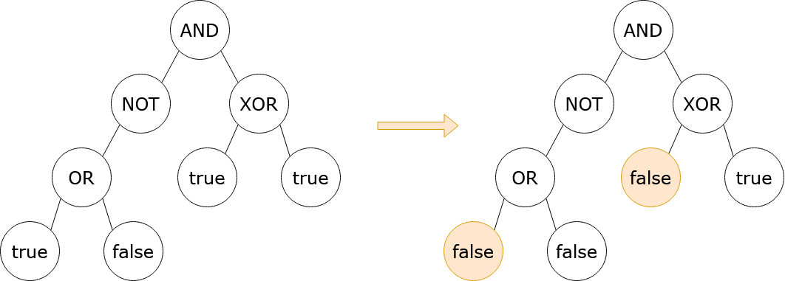

2313. Minimum Flips in Binary Tree to Get Result

You are given the root of a binary tree with the following properties:

* **Leaf nodes** have either the value `0` or `1`, representing `false` and `true` respectively.
* **Non-leaf nodes** have either the value `2`, `3`, `4`, or `5`, representing the boolean operations `OR`, `AND`, `XOR`, and `NOT`, respectively.

You are also given a boolean `result`, which is the desired result of the evaluation of the root node.

The evaluation of a node is as follows:

* If the node is a leaf node, the evaluation is the **value** of the node, i.e. `true` or `false`.
* Otherwise, evaluate the node's children and **apply** the boolean operation of its value with the children's evaluations.

In one operation, you can **flip** a leaf node, which causes a false node to become true, and a true node to become false.

Return the minimum number of operations that need to be performed such that the evaluation of `root` yields `result`. It can be shown that there is always a way to achieve `result`.

A **leaf node** is a node that has zero children.

Note: `NOT` nodes have either a left child or a right child, but other non-leaf nodes have both a left child and a right child.

 

**Example 1:**


```
Input: root = [3,5,4,2,null,1,1,1,0], result = true
Output: 2
Explanation:
It can be shown that a minimum of 2 nodes have to be flipped to make the root of the tree
evaluate to true. One way to achieve this is shown in the diagram above.
```

**Example 2:**
```
Input: root = [0], result = false
Output: 0
Explanation:
The root of the tree already evaluates to false, so 0 nodes have to be flipped.
```

**Constraints:**

* The number of nodes in the tree is in the range `[1, 10^5]`.
* `0 <= Node.val <= 5`
* `OR`, `AND`, and `XOR` nodes have 2 children.
* NOT nodes have 1 child.
* Leaf nodes have a value of `0` or `1`.
* Non-leaf nodes have a value of `2`, `3`, `4`, or `5`.

# Submissions
---
**Solution 1: (DFS)**

     or {0: 1 l[f]+r[f], 1: min(l[t], r[t])}
    /  \
   t   f
  {5:0} {t:1}
  {f:1} {f:0}

    and {0: l[0]+ r[0], 1: l[1]+r[1]}
    / \
   t   f

    not {0: c[t], 1:c[f]}
    /

    xor {0: l[1], r[1], 1: min(l[t] + r[f], )}
    / \

               and {0:1, 1:2}
          /          \
        not [0:0,1:1]  xor  [0:0, 1:1]
        /             /  \
     or [0:1,1:0]    t    t
    /  \             [0:1,1:0]
   t    f                 [0:1,1:0]
   [0:1,1:0]
        [0:0,1:0]

```
Runtime: 1604 ms, Beats 8.48%
Memory: 224.02 MB, Beats 74.58%
```c++
/**
 * Definition for a binary tree node.
 * struct TreeNode {
 *     int val;
 *     TreeNode *left;
 *     TreeNode *right;
 *     TreeNode() : val(0), left(nullptr), right(nullptr) {}
 *     TreeNode(int x) : val(x), left(nullptr), right(nullptr) {}
 *     TreeNode(int x, TreeNode *left, TreeNode *right) : val(x), left(left), right(right) {}
 * };
 */
class Solution {
    pair<int,int> dfs(TreeNode *node) {
        if (!node) {
            return {0, 0};
        }
        if (!node->left && !node->right) {
            if (node->val) {
                return {1, 0};
            } else {
                return {0, 1};
            }
        }
        auto [l0, l1] = dfs(node->left);
        auto [r0, r1] = dfs(node->right);
        if (node->val == 2) {  // or
            return {l0 + r0, min(l1, r1)};
        } else if (node->val == 3) {  // and
            return {min({l0+r0, l0+r1, l1+r0}), l1+r1};
        } else if (node->val == 4) {  // xor
            return {min(l0+r0, l1+r1), min(l0+r1, l1+r0)};
        } else {  // not
            if (node->left) {
                return {l1, l0};
            } else {
                return {r1, r0};
            }
        }
    }
public:
    int minimumFlips(TreeNode* root, bool result) {
        auto [a, b] = dfs(root);
        if (result) {
            return b;
        } else {
            return a;
        }
    }
};
````

**Solution 2: (DFS)**
```
Runtime: 16 ms, Beats 81.36%
Memory: 212.41 MB, Beats 74.58%
```
```c++
/**
 * Definition for a binary tree node.
 * struct TreeNode {
 *     int val;
 *     TreeNode *left;
 *     TreeNode *right;
 *     TreeNode() : val(0), left(nullptr), right(nullptr) {}
 *     TreeNode(int x) : val(x), left(nullptr), right(nullptr) {}
 *     TreeNode(int x, TreeNode *left, TreeNode *right) : val(x), left(left), right(right) {}
 * };
 */
class Solution {
    bool eval(TreeNode* n) {
        if (n == nullptr)
            return false;
        bool val = n->val, ev_l = eval(n->left), ev_r = eval(n->right);
        if (n->val > 1) // OR || AND || XOR || NOT
            val = n->val == 2 ? ev_l || ev_r : n->val == 3 ? ev_l && ev_r : 
                n->val == 4 ? ev_l ^ ev_r : n->left != nullptr ? !ev_l : !ev_r;
        n->val += val << 4;
        return val;
    }
    int dfs(TreeNode* n, bool res) {
        if (n == nullptr || res == (n->val >> 4)) // "no-flip" value from eval.
            return 0;
        int lt = dfs(n->left, true), lf = dfs(n->left, false);
        int rt = dfs(n->right, true), rf = dfs(n->right, false);
        switch(n->val & 7) {
            case 0:
            case 1:
                return 1;
            case 2: // OR
                return res ? min(lt, rt) : lf + rf;
            case 3: // AND
                return res ? lt + rt : min(lf, rf);
            case 4: // XOR
                return res ? min(lt + rf, lf + rt) : min(lt + rt, lf + rf);
            default: // NOT
                return n->left != nullptr ? (res ? lf : lt) : (res ? rf : rt);
        }
    }
public:
    int minimumFlips(TreeNode* root, bool result) {
        eval(root);
        return dfs(root, result);
    }
};
```
