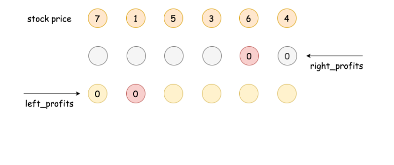

123. Best Time to Buy and Sell Stock III

Say you have an array for which the ith element is the price of a given stock on day i.

Design an algorithm to find the maximum profit. You may complete at most two transactions.

Note: You may not engage in multiple transactions at the same time (i.e., you must sell the stock before you buy again).

**Example 1:**
```
Input: [3,3,5,0,0,3,1,4]
Output: 6
Explanation: Buy on day 4 (price = 0) and sell on day 6 (price = 3), profit = 3-0 = 3.
             Then buy on day 7 (price = 1) and sell on day 8 (price = 4), profit = 4-1 = 3.
```

**Example 2:**
```
Input: [1,2,3,4,5]
Output: 4
Explanation: Buy on day 1 (price = 1) and sell on day 5 (price = 5), profit = 5-1 = 4.
             Note that you cannot buy on day 1, buy on day 2 and sell them later, as you are
             engaging multiple transactions at the same time. You must sell before buying again.
```

**Example 3:**
```
Input: [7,6,4,3,1]
Output: 0
Explanation: In this case, no transaction is done, i.e. max profit = 0.
```

# Solution
---
## Overview
First of all, as one should know, this is one of the problems from the series of Best Time to Buy and Sell Stock problem. One could start from the first problem in the series and progress one by one from easy to hard.

If there is ever a God of the stock market, who knows the price of stock at any moment, then the strategies to gain the maximum profits from the stock market is actually surprisingly intuitive, which also depends on the number of transactions that one can make.

>If one can only make one transaction (i.e. buy and sell once), then better to make this one bet count. The best strategy would be to buy at the lowest price and then sell at the highest price. To put it simple, buy low sell high.


Let us look at a concrete example as shown in the above graph, given a list of prices, the task becomes to find maximal difference between a latter stock price and an earlier one, which would be the maximal profits that we could gain, if only one transaction is allowed.

In the above example, the best moment to buy the stock would be the timestamp t1, and the best moment to sell the stock would be the timestamp t9.

The above strategy is actually the solution to the first problem of the series, i.e. Best Time to Buy and Sell Stock.

>On the other hand, if one can make as many transactions as one would like, then in order to gain the maximal profits, one must capture each augmentation and avoid each plunging of stock price.

Specifically, given a list of prices, for any two adjacent time points with stock prices p1 and p2, the above best strategies can be broke down into the following two cases:

* If later the price augments, i.e. `p2 > p1`, then a good trader should buy at `p1` and then sell at `p2`, seizing this moment to make profits.

* If later the price stays the same or even plunges, i.e. `p2 <= p1`, then a good trader should just hold the money in the pocket, neither to buy nor sell any stock.

With the above strategies, as one can see, we would perfectly capitalize at each right moment, meanwhile avoiding any loss. At the end, the accumulative profits that we gain over the time would reach the maximum.


With the same example above, we would buy at the moment of `t1` and sell it at the moment of `t2`. Similarly, we would also buy at the moment of `t2` and sell the moment of `t3`. As one might notice, the profits we gain from these two transactions are equivalent to the single transaction of buying at the moment of `t1` and selling at the moment of `t3`.

The above strategy would be the solution for the second problem of series, i.e. Best Time to Buy and Sell Stock II where there is no limit on the number of transactions.

## Approach 1: Bidirectional Dynamic Programming
**Intuition**

The only difference between this problem and the previous two problems is that in this problem we are allowed to make at most two transactions.

Additionally, there is a constraint on the order of transactions stated in the problem description as follows:

>You may not engage in multiple transactions at the same time, (i.e. you must sell the stock before you buy again).

We could interpret this constraint as that there would be no overlapping in the sequence of transactions.


In other words, the two transactions that we should make would situate in two different subsequences of the stock prices, without any overlapping, which we illustrate in the above graph.

>That being said, we can solve the problem in a divide-and-conquer manner, where we divide the original sequence of prices into two subsequences and then we calculate the maximum profit that we could gain from making a single transaction in each subsequence.

The total profits would be the sum of profits from each subsequence. If we enumerate all possible divisions (or we could consider them as combinations of subsequences), we could find the maximum total profits among them, which is also the desired result of the problem.


So we divide this problem into two subproblems, and each subproblem is actually of the same problem of Best Time to Buy and Sell Stock as we discussed in the overview section.

**Algorithm**

A naive implementation of the above idea would be to divide the sequences into two and then enumerate each of the subsequences, though this is definitely not the most optimized solution.

For a sequence of length $N$, we would have $N$ possible divisions (including no division), each of the elements would be visited once in each division. As a result, the overall time complexity of this naive implementation would be $\mathcal{O}(N^2)$.

We could do better than the naive $\mathcal{O}(N^2)$ implementation. Regarding the algorithms of divide-and-conquer, one common technique that we can apply in order to optimize the time complexity is called dynamic programming (DP) where we trade less repetitive calculation with some extra space.

In dynamic programming algorithms, normally we create an array of one or two dimensions to keep the intermediate optimal results. In this problem though, we would use two arrays, with one array keeping the results of sequence from left to right and the other array keeping the results of sequence from right to left. For the sake of name, we could call it **bidirectional dynamic programming**.


First, we denote a sequence of prices as `Prices[i]`, with index starting from `0` to `N-1`. Then we define two arrays, namely `left_profits[i]` and `right_profits[i]`.

* As suggested by the name, each element in the `left_profits[i]` array would hold the maximum profits that one can gain from doing one single transaction on the left subsequence of prices from the index zero to `i`, (i.e. `Prices[0], Prices[1], ... Prices[i]`). For instance, for the subsequences of `[7, 1, 5]`, the corresponding `left_profits[2]` would be `4`, which is to buy the price of `1` and sell it at the price of `5`.

* And each element in the `right_profits[i]` array would hold the maximum profits that one can gain from doing one single transaction on the right subsequence of the prices from the index `i` up to `N-1`, (i.e. `Prices[i], Prices[i+1], ... Prices[N-1]`). For example, for the right subsequence of `[3, 6, 4]`, the corresponding `right_profits[3]` would be `3`, which is to buy at the price of `3` and then sell it at the price of `6`.

Now, if we divide the sequence of prices around the element at the index `i`, into two subsequences, with left subsequences as `Prices[0], Prices[1], ... Prices[i]` and the right subsequence as `Prices[i+1], ... Prices[N-1]`, then the total maximum profits that we obtain from this division (denoted as `max_profits[i]`) can be expressed as follows: $\text{max_profits[i]} = \text{left_profits[i]} + \text{right_profits[i+1]}$

Then if we exhaust all possible divisions, i.e. we place the two transactions in all possible combinations of subsequences, we would then obtain the global maximum profits that we could gain from this sequence of stock prices, which can be expressed as follows: $\max_{i=[0, N)}{(\text{max_profits[i]})}$

We demonstrate how the DP arrays are calculated in the following animation.





Following the above idea, Here are some sample implementations.

```c++
class Solution {
  public:
  int maxProfit(vector<int>& prices) {
    int length = prices.size();
    if (length <= 1) return 0;

    int leftMin = prices[0];
    int rightMax = prices[length - 1];

    vector<int> leftProfits(length, 0);
    // pad the right DP array with an additional zero for convenience.
    vector<int> rightProfits(length + 1, 0);

    // construct the bidirectional DP array
    for (int l = 1; l < length; ++l) {
      leftProfits[l] = max(leftProfits[l - 1], prices[l] - leftMin);
      leftMin = min(leftMin, prices[l]);

      int r = length - 1 - l;
      rightProfits[r] = max(rightProfits[r + 1], rightMax - prices[r]);
      rightMax = max(rightMax, prices[r]);
    }

    int maxProfit = 0;
    for (int i = 0; i < length; ++i) {
      maxProfit = max(maxProfit, leftProfits[i] + rightProfits[i + 1]);
    }
    return maxProfit;
  }
};
```

```python
class Solution(object):
    def maxProfit(self, prices):
        """
        :type prices: List[int]
        :rtype: int
        """
        if len(prices) <= 1:
            return 0

        left_min = prices[0]
        right_max = prices[-1]

        length = len(prices)
        left_profits = [0] * length
        # pad the right DP array with an additional zero for convenience.
        right_profits = [0] * (length + 1)

        # construct the bidirectional DP array
        for l in range(1, length):
            left_profits[l] = max(left_profits[l-1], prices[l] - left_min)
            left_min = min(left_min, prices[l])

            r = length - 1 - l
            right_profits[r] = max(right_profits[r+1], right_max - prices[r])
            right_max = max(right_max, prices[r])

        max_profit = 0
        for i in range(0, length):
            max_profit = max(max_profit, left_profits[i] + right_profits[i+1])

        return max_profit
```

In the above implementations, we refined the code a bit to make it a bit more concise and hopefully more intuitive. Here are some tweaks that we applied.

* Rather than constructing the two DP arrays in two separate loops, we do the calculation in a single loop (two birds with one stone).

* We pad the `right_profits[i]` array with an additional zero, which indicates the maximum profits that we can gain from an empty right subsequence, so that we can compare the result of having only one transaction (i.e. `left_profits[N-1]`) with the profits gained from doing two transactions.

By the way, one can try the above algorithm on another problem called Sliding Window Maximum.

**Complexity**

* Time Complexity: $\mathcal{O}(N)$ where $N$ is the length of the input sequence, since we have two iterations of length $N$.

* Space Complexity: $\mathcal{O}(N)$ for the two arrays that we keep in the algorithm.

## Approach 2: One-pass Simulation
**Intuition**

Just when we think that the space complexity of $\mathcal{O}(N)$ is the best we can get for this problem, many users in the Discussion forum proposed a more optimized solution that reduced the space complexity to $O(1)$, (just to name a few of them @weijiac, @shetty4l). The idea is quite brilliant, and requires only a single iteration without the additional DP arrays.

The intuition is that we can consider the problem as a game, and we as agent could make at most two transactions in order to gain the maximum points (profits) from the game.

The two transactions be decomposed into 4 actions: "buy of transaction #1", "sell of transaction #1", "buy of transaction #2" and "sell of transaction #2".

>To solve the game, we simply run a simulation along the sequence of prices, at each time step, we calculate the potential outcomes for each of our actions. At the end of the simulation, the outcome of the final action "sell of transaction #2" would be the desired output of the problem.


**Algorithm**

Overall, we run an iteration over the sequence of prices.

Over the iteration, we calculate 4 variables which correspond to the costs or the profits of each action respectively, as follows:

* `t1_cost`: the minimal cost of buying the stock in transaction #1. The minimal cost to acquire a stock would be the minimal price value that we have seen so far at each step.

* `t1_profit`: the maximal profit of selling the stock in transaction #1. Actually, at the end of the iteration, this value would be the answer for the first problem in the series, i.e. Best Time to Buy and Sell Stock.

* `t2_cost`: the minimal cost of buying the stock in transaction #2, while taking into account the profit gained from the previous transaction #1. One can consider this as the cost of reinvestment. Similar with `t1_cost`, we try to find the lowest price so far, which in addition would be partially compensated by the profits gained from the first transaction.

* `t2_profit`: the maximal profit of selling the stock in transaction #2. With the help of `t2_cost` as we prepared so far, we would find out the maximal profits with at most two transactions at each step.

```c++
class Solution {
  public:
  int maxProfit(vector<int>& prices) {
    int t1Cost = INT_MAX, 
        t2Cost = INT_MAX;
    int t1Profit = 0,
        t2Profit = 0;

    for (int price : prices) {
        // the maximum profit if only one transaction is allowed
        t1Cost = min(t1Cost, price);
        t1Profit = max(t1Profit, price - t1Cost);
        // re-invest the gained profit in the second transaction
        t2Cost = min(t2Cost, price - t1Profit);
        t2Profit = max(t2Profit, price - t2Cost);
    }

    return t2Profit;
  }
};
```

```python
class Solution(object):
    def maxProfit(self, prices):
        """
        :type prices: List[int]
        :rtype: int
        """
        t1_cost, t2_cost = float('inf'), float('inf')
        t1_profit, t2_profit = 0, 0

        for price in prices:
            # the maximum profit if only one transaction is allowed
            t1_cost = min(t1_cost, price)
            t1_profit = max(t1_profit, price - t1_cost)
            # reinvest the gained profit in the second transaction
            t2_cost = min(t2_cost, price - t1_profit)
            t2_profit = max(t2_profit, price - t2_cost)

        return t2_profit
```

**Complexity**

* Time Complexity: $\mathcal{O}(N)$, where $N$ is the length of the input sequence.

* Space Complexity: $\mathcal{O}(1)$, only constant memory is required, which is invariant from the input sequence.

# Submissions
---
**Solution 1: (Bidirectional Dynamic Programming)**
```
Runtime: 92 ms
Memory Usage: 15.1 MB
```
```python
class Solution:
    def maxProfit(self, prices: List[int]) -> int:
        if len(prices) <= 1:
            return 0

        left_min = prices[0]
        right_max = prices[-1]

        length = len(prices)
        left_profits = [0] * length
        # pad the right DP array with an additional zero for convenience.
        right_profits = [0] * (length + 1)

        # construct the bidirectional DP array
        for l in range(1, length):
            left_profits[l] = max(left_profits[l-1], prices[l] - left_min)
            left_min = min(left_min, prices[l])

            r = length - 1 - l
            right_profits[r] = max(right_profits[r+1], right_max - prices[r])
            right_max = max(right_max, prices[r])

        max_profit = 0
        for i in range(0, length):
            max_profit = max(max_profit, left_profits[i] + right_profits[i+1])

        return max_profit
```

**Solution 2: (One-pass Simulation)**
```
Runtime: 72 ms
Memory Usage: 15.2 MB
```
```python
class Solution:
    def maxProfit(self, prices: List[int]) -> int:
        t1_cost, t2_cost = float('inf'), float('inf')
        t1_profit, t2_profit = 0, 0

        for price in prices:
            # the maximum profit if only one transaction is allowed
            t1_cost = min(t1_cost, price)
            t1_profit = max(t1_profit, price - t1_cost)
            # reinvest the gained profit in the second transaction
            t2_cost = min(t2_cost, price - t1_profit)
            t2_profit = max(t2_profit, price - t2_cost)

        return t2_profit
```

**Solution 3: (DP Bottom-Up)**
```
Runtime: 84 ms
Memory Usage: 14.7 MB
```
```python
class Solution:
    def maxProfit(self, prices: List[int]) -> int:
        N = len(prices)
        if N == 0:
            return 0
        sell, buy = [0]*N, [float('-inf')]*N
        sell2, buy2 = [0]*N, [float('-inf')]*N
        buy[0], buy2[0] = -prices[0], -prices[0]
        for day in range(1, len(prices)):
            buy[day] = max(buy[day-1], -prices[day])
            sell[day] = max(sell[day-1], buy[day-1] + prices[day])
            buy2[day] = max(buy2[day-1], sell[day-1] - prices[day])
            sell2[day] = max(sell2[day-1], buy2[day-1] + prices[day])
            
        return sell2[-1]
```

**Solution 4: (DP Bottom-Up 1-D)**
```
Runtime: 80 ms
Memory Usage: 14 MB
```
```python
class Solution:
    def maxProfit(self, prices: List[int]) -> int:
        if not prices:
            return 0
        sell, sell2, buy, buy2 = 0, 0, -float('inf'), -float('inf')
        for i in range(len(prices)):
            buy = max(buy, -prices[i])
            sell = max(sell, buy + prices[i])
            buy2 = max(buy2, sell - prices[i])
            sell2 = max(sell2, buy2 + prices[i])
        return sell2
```
