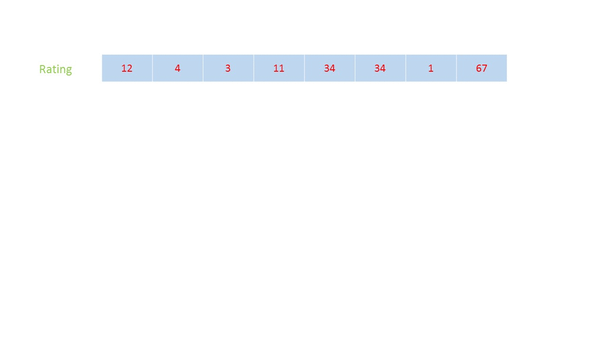
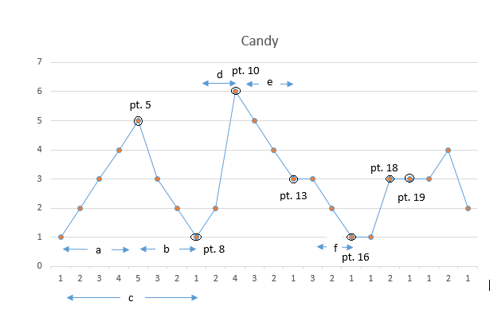

135. Candy

There are N children standing in a line. Each child is assigned a rating value.

You are giving candies to these children subjected to the following requirements:

* Each child must have at least one candy.
* Children with a higher rating get more candies than their neighbors.

What is the minimum candies you must give?

**Example 1:**
```
Input: [1,0,2]
Output: 5
Explanation: You can allocate to the first, second and third child with 2, 1, 2 candies respectively.
```

**Example 2:**
```
Input: [1,2,2]
Output: 4
Explanation: You can allocate to the first, second and third child with 1, 2, 1 candies respectively.
             The third child gets 1 candy because it satisfies the above two conditions.
```

# Solution
---
## Approach 1: Brute Force
The simplest approach makes use of a 1-d array, $candies$ to keep a track of the candies given to the students. Firstly, we give 1 candy to each student. Then, we start scanning the array from left-to-right. At every element encountered, firstly, if the current element's ratings, $ratings[i]$, is larger than the previous element $ratings[i-1]$ and $candies[i]<=candies[i-1]$, then we update $candies[i]$ as $candies[i]=candies[i-1] + 1$. Thus, now the candy distribution for these two elements $candies[i-1]$ and $candies[i]$ becomes correct for the time being(locally). In the same step, we also check if the current element's ratings, $ratings[i]$, is larger than the next element's ratings, i.e. $ratings[i]>ratings[i+1]$. If so, we again update $candies[i]=candies[i+1] + 1$. We continue this process for the whole $ratings$ array. If in any traversal, no updation of the $candies$ array occurs, it means we've reached at the final required distribution of the candies and we can stop the traversals. To keep a track of this we make use of a $flag$ which is set to $\text{True}$ if any updation occurs in a traversal.

At the end, we can sum up all the elements of the $candies$ array to obtain the required minimum number of candies.

```java
public class Solution {
    public int candy(int[] ratings) {
        int[] candies = new int[ratings.length];
        Arrays.fill(candies, 1);
        boolean flag = true;
        int sum = 0;
        while (flag) {
            flag = false;
            for (int i = 0; i < ratings.length; i++) {
                if (i != ratings.length - 1 && ratings[i] > ratings[i + 1] && candies[i] <= candies[i + 1]) {
                    candies[i] = candies[i + 1] + 1;
                    flag = true;
                }
                if (i > 0 && ratings[i] > ratings[i - 1] && candies[i] <= candies[i - 1]) {
                    candies[i] = candies[i - 1] + 1;
                    flag = true;
                }
            }
        }
        for (int candy : candies) {
            sum += candy;
        }
        return sum;
    }
}
```

**Complexity Analysis**

* Time complexity : $O(n^2)$. We need to traverse the array at most $n$ times.

* Space complexity : $O(n)$. One $candies$ array of size $n$ is used.

## Approach 2: Using two arrays
**Algorithm**

In this approach, we make use of two 1-d arrays $left2right$ and $right2left$. The $left2right$ array is used to store the number of candies required by the current student taking care of the distribution relative to the left neighbours only. i.e. Assuming the distribution rule is: The student with a higher ratings than its left neighbour should always get more candies than its left neighbour. Similarly, the $right2left$ array is used to store the number of candies candies required by the current student taking care of the distribution relative to the right neighbours only. i.e. Assuming the distribution rule to be: The student with a higher ratings than its right neighbour should always get more candies than its right neighbour. To do so, firstly we assign 1 candy to each student in both $left2right$ and $right2left$ array. Then, we traverse the array from left-to-right and whenever the current element's ratings is larger than the left neighbour we update the current element's candies in the $left2right$ array as $left2right[i] = left2right[i-1] + 1$, since the current element's candies are always less than or equal candies than its left neighbour before updation. After the forward traversal, we traverse the array from left-to-right and update $right2left[i]$ as $right2left[i] = right2left[i + 1] + 1$, whenever the current ( $i^{th}$ ) element has a higher ratings than the right ( $(i+1)^{th}$ ) element.

Now, for the $i^{th}$ student in the array, we need to give $\text{max}(left2right[i], right2left[i])$ to it, in order to satisfy both the left and the right neighbour relationship. Thus, at the end, we obtain the minimum number of candies required as:

$\text{minimum_candies}=\sum_{i=0}^{n-1} \text{max}(left2right[i], right2left[i]), \text{where } n = \text{length of the ratings array.}$

The following animation illustrates the method:



```java
public class Solution {
    public int candy(int[] ratings) {
        int sum = 0;
        int[] left2right = new int[ratings.length];
        int[] right2left = new int[ratings.length];
        Arrays.fill(left2right, 1);
        Arrays.fill(right2left, 1);
        for (int i = 1; i < ratings.length; i++) {
            if (ratings[i] > ratings[i - 1]) {
                left2right[i] = left2right[i - 1] + 1;
            }
        }
        for (int i = ratings.length - 2; i >= 0; i--) {
            if (ratings[i] > ratings[i + 1]) {
                right2left[i] = right2left[i + 1] + 1;
            }
        }
        for (int i = 0; i < ratings.length; i++) {
            sum += Math.max(left2right[i], right2left[i]);
        }
        return sum;
    }
}
```

**Complexity Analysis**

* Time complexity : $O(n)$. $left2right$ and $right2left$ arrays are traversed thrice.

* Space complexity : $O(n)$. Two arrays $left2right$ and $right2left$ of size nn are used.

## Approach 3: Using one array
**Algorithm**

In the previous approach, we used two arrays to keep track of the left neighbour and the right neighbour relation individually and later on combined these two. Instead of this, we can make use of a single array $candies$ to keep the count of the number of candies to be allocated to the current student. In order to do so, firstly we assign 1 candy to each student. Then, we traverse the array from left-to-right and distribute the candies following only the left neighbour relation i.e. whenever the current element's ratings is larger than the left neighbour and has less than or equal candies than its left neighbour, we update the current element's candies in the $candies$ array as $candies[i] = candies[i-1] + 1$. While updating we need not compare $candies[i]$ and $candies[i - 1]$, since $candies[i] \leq candies[i - 1]$ before updation. After this, we traverse the array from right-to-left. Now, we need to update the $i^{th}$ element's candies in order to satisfy both the left neighbour and the right neighbour relation. Now, during the backward traversal, if $ratings[i]>ratings[i + 1]$, considering only the right neighbour criteria, we could've updated $candies[i]$ as $candies[i] = candies[i + 1] + 1$. But, this time we need to update the $candies[i]$ only if $candies[i] \leq candies[i + 1]$. This happens because, this time we've already altered the $candies$ array during the forward traversal and thus $candies[i]$ isn't necessarily less than or equal to $candies[i + 1]$. Thus, if $ratings[i] > ratings[i + 1]$, we can update $candies[i]$ as $candies[i] = \text{max}(candies[i], candies[i + 1] + 1)$, which makes $candies[i]$ satisfy both the left neighbour and the right neighbour criteria.

Again, we need sum up all the elements of the $candies$ array to obtain the required result.

$\text{minimum_candies} = \sum_{i=0}^{n-1} candies[i], \text{where } n = \text{length of the ratings array.}$

```java
public class Solution {
    public int candy(int[] ratings) {
        int[] candies = new int[ratings.length];
        Arrays.fill(candies, 1);
        for (int i = 1; i < ratings.length; i++) {
            if (ratings[i] > ratings[i - 1]) {
                candies[i] = candies[i - 1] + 1;
            }
        }
        int sum = candies[ratings.length - 1];
        for (int i = ratings.length - 2; i >= 0; i--) {
            if (ratings[i] > ratings[i + 1]) {
                candies[i] = Math.max(candies[i], candies[i + 1] + 1);
            }
            sum += candies[i];
        }
        return sum;
    }
}
```

**Complexity Analysis**

* Time complexity : $O(n)$. The array $candies$ of size nn is traversed thrice.

* Space complexity : $O(n)$. An array $candies$ of size nn is used.

## Approach 4: Single Pass Approach with Constant Space
**Algorithm**

This approach relies on the observation(as demonstrated in the figure below as well) that in order to distribute the candies as per the given criteria using the minimum number of candies, the candies are always distributed in terms of increments of 1. Further, while distributing the candies, the local minimum number of candies given to a student is 1. Thus, the sub-distributions always take the form: $\text{1, 2, 3, ..., n}$ or $\text{n,..., 2, 1}$, whose sum is simply given by $n(n+1)/2$.

Now, we can view the given $rankings$ as some rising and falling slopes. Whenever the slope is rising, the distribution takes the form: $\text{1, 2, 3, ..., m}$. Similarly, a falling slope takes the form: $\text{k,..., 2, 1}$. An issue that arises now is that the local peak point can be included in only one of the slopes. Whether to include the local peak point($\text{n}$) in the rising slope or the falling slope?

In order to decide it, we can observe that in order to satisfy both the right neighbour and the left neighbour criteria, the peak point's count needs to be the max. of the counts determined by the rising and the falling slopes. Thus, in order to determine the number of candies required, the peak point needs to be included in the slope which contains more number of points. The local valley point can also be included in only one of the slopes, but this issue can be resolved easily, since the local valley point will always be assigned a candy count of 1(which can be subtracted from the next slope's count calculations).

Coming to the implementation, we maintain two variables $old\_slope$ and $new\_slope$ to determine the occurence of a peak or a valley. We also use $up$ and $down$ variables to keep a track of the count of elements on the rising slope and on the falling slope respectively(without including the peak element). We always update the total count of $candies$ at the end of a falling slope following a rising slope (or a mountain). The leveling of the points in $rankings$ also works as the end of a mountain. At the end of the mountain, we determine whether to include the peak point in the rising slope or in the falling slope by comparing the $up$ and $down$ variables up to that point. Thus, the count assigned to the peak element becomes: $\text{max}(up, down) + 1$. At this point, we can reset the $up$ and $down$ variables indicating the start of a new mountain.

The following figure shows the cases that need to be handled for this example:

rankings: [1 2 3 4 5 3 2 1 2 6 5 4 3 3 2 1 1 3 3 3 4 2]



From this figure, we can see that the candy distributions in the subregions always take the form $\text{1, 2, ...n}$ or $\text{n, ..., 2, 1}$. For the first mountain comprised by the regions $a$ and $b$, while assigning candies to the local peak point ($pt. 5$), it needs to be included in $a$ to satisfy the left neighbour criteria. The local valley point at the end of region $b$ ($pt. 8$) marks the end of the first mountain (region $c$). While performing the calculations, we can include this point in either the current or the following mountain. The $pt. 13$ marks the end of the second mountain due to levelling of the $pt. 13$ and $pt. 14$. Since, region $e$ has more points than region $d$, the local peak ($pt. 10$) needs to be included in region $e$ to satisfy the right neighbour criteria. Now, the third mountain $f$ can be considered as a mountian with no rising slope ($up=0$) but only a falling slope. Similarly, $pt. 16, 18, 19$ also act as the mountain ends due to the levelling of the points.

```java
public class Solution {
    public int count(int n) {
        return (n * (n + 1)) / 2;
    }
    public int candy(int[] ratings) {
        if (ratings.length <= 1) {
            return ratings.length;
        }
        int candies = 0;
        int up = 0;
        int down = 0;
        int old_slope = 0;
        for (int i = 1; i < ratings.length; i++) {
            int new_slope = (ratings[i] > ratings[i - 1]) ? 1 : (ratings[i] < ratings[i - 1] ? -1 : 0);
            if ((old_slope > 0 && new_slope == 0) || (old_slope < 0 && new_slope >= 0)) {
                candies += count(up) + count(down) + Math.max(up, down);
                up = 0;
                down = 0;
            }
            if (new_slope > 0)
                up++;
            if (new_slope < 0)
                down++;
            if (new_slope == 0)
                candies++;

            old_slope = new_slope;
        }
        candies += count(up) + count(down) + Math.max(up, down) + 1;
        return candies;
    }
}
```

**Complexity Analysis**

* Time complexity : $O(n)$. We traverse the $rankings$ array once only.

* Space complexity : $O(1)$. Constant Extra Space is used.

# Submissions
---
**Solution 1: (2 Pass)**
```
Runtime: 244 ms
Memory Usage: 16.6 MB
```
```python
class Solution:
    def candy(self, ratings: List[int]) -> int:
        # Concept - Just do what the problem is saying, we can 
        # fill our result array with one, now the first requirement
        # is fulfilled and for 2nd requirement, there will be 2 cases
        # 1 - Rating at i is greater than at i-1 --> Forward Pass
        # 2 - Rating at i is greater than i + 1 --> Backward Pass
        
        
        # Condition-1 Fulfilled as we gave 1 candy to everyone
        candies = [1] * len(ratings)
        
        # Calculate the candies needed to fulfill left condition     
        # We drop the 0th element as nothing is located left to it
        for i in range(1, len(ratings)):
            if ratings[i] > ratings[i-1]:
                candies[i] = candies[i-1] + 1
        
        # Calculate the candies needed to fulfill right condition  
        # We drop the last element as nothing is located right to it
        for i in range(len(ratings)-2, -1, -1):
            if ratings[i] > ratings[i+1]:
                candies[i] = max(candies[i], candies[i+1] + 1)
        
        # Take the summation --> Minimum candies
        return sum(candies)
```

**Solution 2: (1 Pass)**

Set the candy at 1 at first.

1. For path with upward ratings, just increment candy and add it to the answer.
1. For path with downward ratings, initially assume 1 candy is enough. As lower ratings coming in, increase the previous candies on downward path by 1 and add a new candy for the new entry. One catcha is that once candies immediately after the peak hits the peak, one needs to add one candy to the peak as well.
1. For path that is neither upward nor downward, just add 1 candy to answer (enough for upward path; to be adjusted for downward path; enough for constant path).

```
Runtime: 168 ms
Memory Usage: 16.4 MB
```
```python
class Solution:
    def candy(self, ratings: List[int]) -> int:
        ans = down = up = 0
        for i in range(len(ratings)):
            if not i or ratings[i-1] < ratings[i]:
                if down: down, up = 0, 1
                up += 1
                ans += up
            elif ratings[i-1] == ratings[i]: 
                down, up = 0, 1
                ans += 1
            else:
                down += 1
                ans += down if down < up else down+1
        return ans
```

**Solution 3: (left right scan)**
```
Runtime: 34 ms
Memory Usage: 18.3 MB
```
```c++
class Solution {
public:
    int candy(vector<int>& ratings) {
        int ans = 0, n= ratings.size();
        
        // it take care about student get more candies than its left neighbor
        vector<int>L_candy(n,1);
        for(int i=1; i<n; i++){
            if(ratings[i]>ratings[i-1] )
                L_candy[i]=L_candy[i-1]+1;
        }
        
        // it take care about student get more candies than its right neighbor
        vector<int> R_candy(n,1);
        for(int i=n-2; i>=0; i--){
            if(ratings[i]>ratings[i+1] )
                R_candy[i] = R_candy[i+1]+1;
        }
        
        // here we take the maximum value which satisfy both the left and the right neighbor condition 
        for(int i=0; i<n; i++){
            ans += max(L_candy[i], R_candy[i]);
        }
        return ans;
    }
};
```
