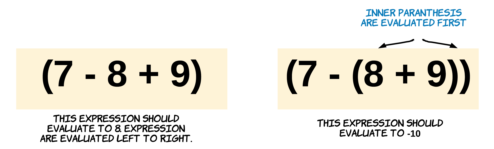
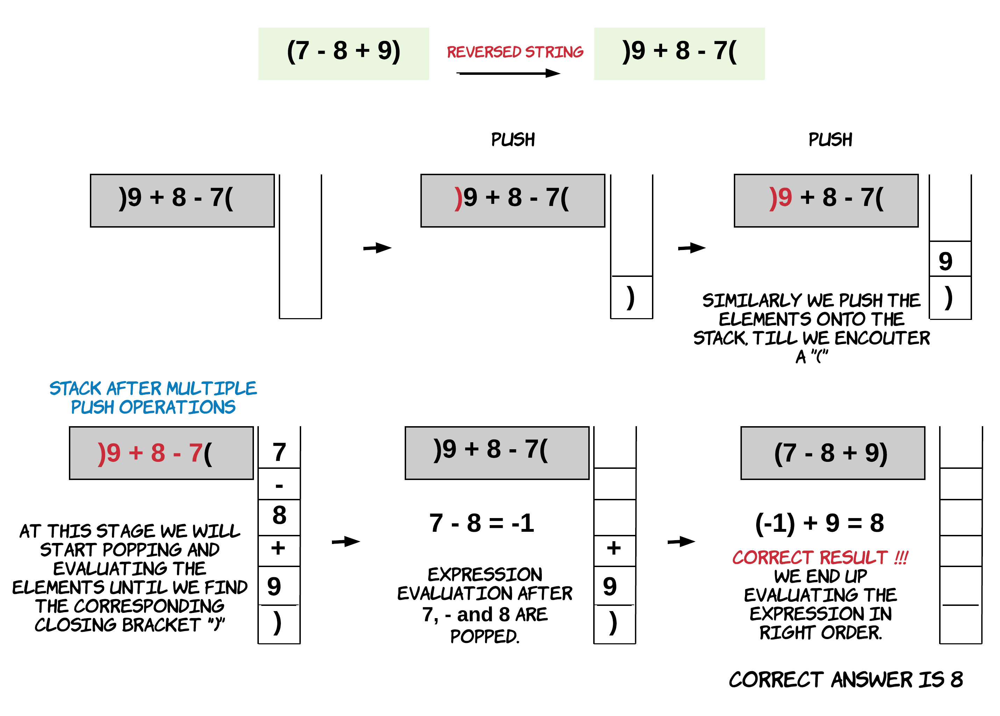
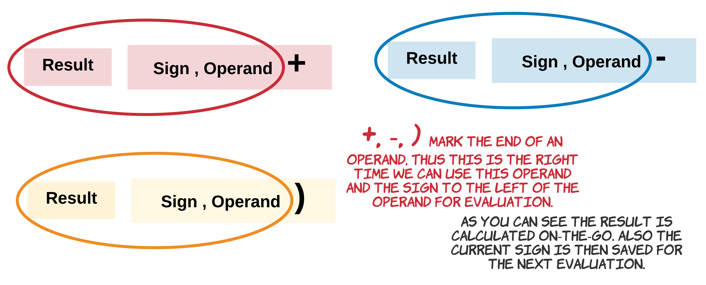

224. Basic Calculator

Implement a basic calculator to evaluate a simple expression string.

The expression string may contain open `(` and closing parentheses `)`, the plus `+` or minus sign `-`, non-negative integers and empty spaces ` `.

**Example 1:**
```
Input: "1 + 1"
Output: 2
```

**Example 2:**
```
Input: " 2-1 + 2 "
Output: 3
```

**Example 3:**
```
Input: "(1+(4+5+2)-3)+(6+8)"
Output: 23
```

**Note:**

* You may assume that the given expression is always valid.
* **Do not** use the `eval` built-in library function.

# Solution
---
This problem is all about understanding the following:

* Input always contains valid strings
* The rules of addition and subtraction
* Implication of precedence by parenthesis
* Spaces do not affect the evaluation of the input expression



## Approach 1: Stack and String Reversal
**Intuition**

This question qualifies really well for a stack question. Since the expression might have parenthesis, we can use a stack to find the value for each sub-expression within a parenthesis. Essentially, we need to delay processing the main expression until we are done evaluating the interim sub-expressions within parenthesis and to introduce this delay, we use a stack.

We push the elements of the expression one by one onto the stack until we get a closing bracket `)`. Then we pop the elements from the stack one by one and evaluate the expression on-the-go. This is done till we find the corresponding `(` opening bracket. This kind of evaluation is very common when using the stack data structure. However, if you notice the way we calculate the final answer, you will realize that we actually process the values from right to left whereas it should be the other way around.


From the above example we realize that following the simple stack push and pop methodology will not help us here. We need to understand how `+` and `-` work. + follows the associative property. For the expression $A+B+C$, we have $(A+B)+C = A+(B+C)$, $(A+B)+C=A+(B+C)$. However, `-` does not follow this rule which is the root cause of all the problems in this approach.

If we use a stack and read the elements of the expression from left to right, we end up evaluating the expression from right-to-left. This means we are expecting $(A-B)-C$ to be equal to $(C-B)-A$ which is not correct. Subtraction is neither associative nor commutative.

This problem could be solved very easily by reversing the string and then using basic drill using a stack. Reversing a string helps since we now put the elements of the expression into the stack from right to left and evaluation for the expression is done correctly from left to right.



**Algorithm**

1. Iterate the expression string in reverse order one character at a time. Since we are reading the expression character by character, we need to be careful when we are reading digits and non-digits.

1. The operands could be formed by multiple characters. A string `"123"` would mean a numeric `123`, which could be formed as: `123 >> 120 + 3 >> 100 + 20 + 3`. Thus, if the character read is a digit we need to form the operand by multiplying a power of `10` to the current digit and adding it to the overall operand. We do this since we are processing the string in the reverse order.

1. The operands could be formed by multiple characters. We need to keep track of an on-going operand. This part is a bit tricky since in this case the string is reversed. Once we encounter a character which is not a digit, we push the operand onto the stack.

1. When we encounter an opening parenthesis `(`, this means an expression just ended. Recall we have reversed the expression. So an opening bracket would signify the end of the an expression. This calls for evaluation of the expression by popping operands and operators off the stack till we pop corresponding closing parenthesis. The final result of the expression is pushed back onto the stack.

>Note: We are evaluating all the sub-expressions within the main expression. The sub-expressions on the right get evaluated first but the main expression itself is evaluated from left to right when all its components are resolved, which is very important for correct results.

For eg. For expression $A - (B+C) + (D+E-F)$, $D+E-F$ is evaluated before $B+C$. While evaluating $D+E-F$ the order is from left to right. Similarly for the parent expression, all the child components are evaluated and stored on the stack so that final evaluation is left to right.

1. Push the other non-digits onto to the stack.

1. Do this until we get the final result. It's possible that we don't have any more characters left to process but the stack is still non-empty. This would happen when the main expression is not enclosed by parenthesis. So, once we are done evaluating the entire expression, we check if the stack is non-empty. If it is, we treat the elements in it as one final expression and evaluate it the same way we would if we had encountered an opening bracket.

We can also cover the original expression with a set of parenthesis to avoid this extra call.

```python
class Solution:

    def evaluate_expr(self, stack):

        res = stack.pop() if stack else 0

        # Evaluate the expression till we get corresponding ')'
        while stack and stack[-1] != ')':
            sign = stack.pop()
            if sign == '+':
                res += stack.pop()
            else:
                res -= stack.pop()
        return res       

    def calculate(self, s: str) -> int:

        stack = []
        n, operand = 0, 0

        for i in range(len(s) - 1, -1, -1):
            ch = s[i]

            if ch.isdigit():

                # Forming the operand - in reverse order.
                operand = (10**n * int(ch)) + operand
                n += 1

            elif ch != " ":
                if n:
                    # Save the operand on the stack
                    # As we encounter some non-digit.
                    stack.append(operand)
                    n, operand = 0, 0

                if ch == '(':         
                    res = self.evaluate_expr(stack)
                    stack.pop()        

                    # Append the evaluated result to the stack.
                    # This result could be of a sub-expression within the parenthesis.
                    stack.append(res)

                # For other non-digits just push onto the stack.
                else:
                    stack.append(ch)

        # Push the last operand to stack, if any.
        if n:
            stack.append(operand)

        # Evaluate any left overs in the stack.
        return self.evaluate_expr(stack)
```

**Complexity Analysis**

* Time Complexity: $O(N)$, where N is the length of the string.

* Space Complexity: $O(N)$, where N is the length of the string.

## Approach 2: Stack and No String Reversal
**Intuition**

A very easy way to solve the problem of associativity for `-` we tackled in the previous approach, is to use `-` operator as the magnitude for the operand to the right of the operator. Once we start using `-` as a magnitude for the operands, we just have one operator left which is addition and `+` is associative.

for e.g. $A - B - C$ could be re-written as $A + (-B) + (-C)$.

>The re-written expression would follow associativity rule. Thus evaluating the expression from right or left, won't change the result.

What we need to keep in mind is that the expressions given would be complicated, i.e. there would be expressions nested within other expressions. Even if we have something like `(A - (B - C))` we need to associate the negative sign outside of `B-C` with the result of `B-C` instead of just with `B`.

We can solve this problem by following the basic drill before and associating the sign with the expression to the right of it. However, the approach that we will instead take has a small twist to it in that we will be evaluating most of the expression on-the-go. This reduces the number of push and pop operations.


Follow the below steps closely. This algorithm is inspired from discussion post by southpenguin.

**Algorithm**

* Iterate the expression string one character at a time. Since we are reading the expression character by character, we need to be careful when we are reading digits and non-digits.
* The operands could be formed by multiple characters. A string `"123"` would mean a numeric `123`, which could be formed as: `123 >> 120 + 3 >> 100 + 20 + 3`. Thus, if the character read is a digit we need to form the operand by multiplying `10` to the previously formed continuing operand and adding the digit to it.
* Whenever we encounter an operator such as `+` or `-` we first evaluate the expression to the left and then save this `sign` for the next evaluation.



* If the character is an opening parenthesis `(`, we just push the result calculated so far and the `sign` on to the stack (the sign and the magnitude) and start a fresh as if we are calculating a new expression.
* If the character is a closing parenthesis `)`, we first calculate the expression to the left. The result from this would be the result of the expression within the set of parenthes is that just concluded. This result is then multiplied with the sign, if there is any on top of the stack. Remember we saved the `sign` on top of the stack when we had encountered an open parenthesis? This sign is associated with the parenthesis that started then, thus when the expression ends or concludes, we pop the `sign` and multiply it with result of the expression. It is then just added to the next element on top of the stack.

```python
class Solution:
    def calculate(self, s: str) -> int:

        stack = []
        operand = 0
        res = 0 # For the on-going result
        sign = 1 # 1 means positive, -1 means negative  

        for ch in s:
            if ch.isdigit():

                # Forming operand, since it could be more than one digit
                operand = (operand * 10) + int(ch)

            elif ch == '+':

                # Evaluate the expression to the left,
                # with result, sign, operand
                res += sign * operand

                # Save the recently encountered '+' sign
                sign = 1

                # Reset operand
                operand = 0

            elif ch == '-':

                res += sign * operand
                sign = -1
                operand = 0

            elif ch == '(':

                # Push the result and sign on to the stack, for later
                # We push the result first, then sign
                stack.append(res)
                stack.append(sign)

                # Reset operand and result, as if new evaluation begins for the new sub-expression
                sign = 1
                res = 0

            elif ch == ')':

                # Evaluate the expression to the left
                # with result, sign and operand
                res += sign * operand

                # ')' marks end of expression within a set of parenthesis
                # Its result is multiplied with sign on top of stack
                # as stack.pop() is the sign before the parenthesis
                res *= stack.pop() # stack pop 1, sign

                # Then add to the next operand on the top.
                # as stack.pop() is the result calculated before this parenthesis
                # (operand on stack) + (sign on stack * (result from parenthesis))
                res += stack.pop() # stack pop 2, operand

                # Reset the operand
                operand = 0

        return res + sign * operand
```

**Complexity Analysis**

* Time Complexity: $O(N)$, where N is the length of the string. The difference in time complexity between this approach and the previous one is that every character in this approach will get processed exactly once. However, in the previous approach, each character can potentially get processed twice, once when it's pushed onto the stack and once when it's popped for processing of the final result (or a subexpression). That's why this approach is faster.

* Space Complexity: $O(N)$, where N is the length of the string.

# Submissions
---

**Solution 1: (Stack and String Reversal)**
```
Runtime: 120 ms
Memory Usage: 15.4 MB
```
```python
class Solution:
    
    def evaluate_expr(self, stack):

        res = stack.pop() if stack else 0

        # Evaluate the expression till we get corresponding ')'
        while stack and stack[-1] != ')':
            sign = stack.pop()
            if sign == '+':
                res += stack.pop()
            else:
                res -= stack.pop()
        return res
    
    def calculate(self, s: str) -> int:        

        stack = []
        n, operand = 0, 0

        for i in range(len(s) - 1, -1, -1):
            ch = s[i]

            if ch.isdigit():

                # Forming the operand - in reverse order.
                operand = (10**n * int(ch)) + operand
                n += 1

            elif ch != " ":
                if n:
                    # Save the operand on the stack
                    # As we encounter some non-digit.
                    stack.append(operand)
                    n, operand = 0, 0

                if ch == '(':         
                    res = self.evaluate_expr(stack)
                    stack.pop()        

                    # Append the evaluated result to the stack.
                    # This result could be of a sub-expression within the parenthesis.
                    stack.append(res)

                # For other non-digits just push onto the stack.
                else:
                    stack.append(ch)

        # Push the last operand to stack, if any.
        if n:
            stack.append(operand)

        # Evaluate any left overs in the stack.
        return self.evaluate_expr(stack)
```

**Solution 2: (Stack and No String Reversal)**
```
Runtime: 68 ms
Memory Usage: 15.5 MB
```
```python
class Solution:
    def calculate(self, s: str) -> int:        

        stack = []
        operand = 0
        res = 0 # For the on-going result
        sign = 1 # 1 means positive, -1 means negative  

        for ch in s:
            if ch.isdigit():

                # Forming operand, since it could be more than one digit
                operand = (operand * 10) + int(ch)

            elif ch == '+':

                # Evaluate the expression to the left,
                # with result, sign, operand
                res += sign * operand

                # Save the recently encountered '+' sign
                sign = 1

                # Reset operand
                operand = 0

            elif ch == '-':

                res += sign * operand
                sign = -1
                operand = 0

            elif ch == '(':

                # Push the result and sign on to the stack, for later
                # We push the result first, then sign
                stack.append(res)
                stack.append(sign)

                # Reset operand and result, as if new evaluation begins for the new sub-expression
                sign = 1
                res = 0

            elif ch == ')':

                # Evaluate the expression to the left
                # with result, sign and operand
                res += sign * operand

                # ')' marks end of expression within a set of parenthesis
                # Its result is multiplied with sign on top of stack
                # as stack.pop() is the sign before the parenthesis
                res *= stack.pop() # stack pop 1, sign

                # Then add to the next operand on the top.
                # as stack.pop() is the result calculated before this parenthesis
                # (operand on stack) + (sign on stack * (result from parenthesis))
                res += stack.pop() # stack pop 2, operand

                # Reset the operand
                operand = 0

        return res + sign * operand
```

**Solution 3: (Stack)**

    1 + 1
        ^
op 1  1
cur 1   1
stk 1,1
---------------
     2-1 + 2
           ^
op 1  -1 1
cur  201
stk  1,3
-------------------------
    (1+(4+5+2)-3)+(6+8)
                     ^
op 1  11 1 1 -1  1
cur  10 405 2  3   6
stk 1,0 1,1 1,4
              9
              11
            x
          12
          9
         x
      9
        1,6

```
Runtime: 0 ms, Beats 100.00%
Memory: 10.95 MB, Beats 36.50%
```
```c++
class Solution {
public:
    int calculate(string s) {
        int n = s.length(), i, op = 1;
        long long cur = 0;
        stack<pair<int, long long>> stk;
        stk.push({1, 0});
        for (i = 0; i < n; i ++) {
            if (s[i] == ' ') {
                stk.top().second += op*cur;
                cur = 0;
            } else if (s[i] == '+' || s[i] == '-') {
                stk.top().second += op*cur;
                cur = 0;
                op = s[i] == '+' ? 1 : -1;
            } else if (isdigit(s[i])) {
                cur = cur*10 + s[i]-'0';
                if (i == n-1) {
                    stk.top().second += op*cur;
                }
            } else if (s[i] == '(') {
                stk.push({op, 0});
                op = 1;
            } else {
                auto [pop, pa] = stk.top();
                pa += op*cur;
                stk.pop();
                stk.top().second += pop*pa;
                op = 1;
                cur = 0;
            }
        }
        return stk.top().second;
    }
};
```

**Solution 4: (Stack)**
```
Runtime: 3 ms, Beats 45.05%
Memory: 11.56 MB, Beats 23.88%
```
```c++
class Solution {
public:
    int calculate(string s) {
        int k = 1;
        long long a = 0;
        s += '#';
        stack<array<int,2>> stk;
        stk.push({0, 0});
        for (auto &c: s) {
            if (c == ' ') {
                continue;
            } else if (isdigit(c)) {
                a = a*10 + c -'0';
            } else if (c == '+' || c == '-') {
                stk.top()[1] += k*a;
                a = 0;
                if (c == '+') {
                    k = 1;
                } else {
                    k = -1;
                }
            } else if (c == '(') {
                stk.push({k, 0});
                k = 1;
                a = 0;
            } else if (c == ')') {
                stk.top()[1] += k*a;
                k = 1;
                a = 0;
                auto [ck, ca] = stk.top();
                stk.pop();
                stk.top()[1] += ck*ca;
            } else {
                stk.top()[1] += k*a;
            }
        }
        return stk.top()[1];
    }
};
```
