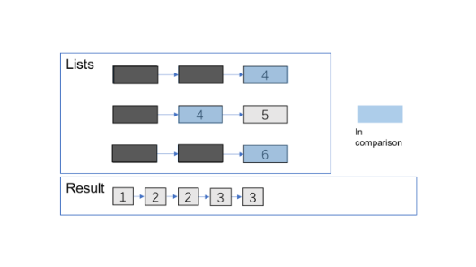

23. Merge k Sorted Lists

Merge k sorted linked lists and return it as one sorted list. Analyze and describe its complexity.

**Example:**
```
Input:
[
  1->4->5,
  1->3->4,
  2->6
]
Output: 1->1->2->3->4->4->5->6
```

# Solution
---
## Approach 1: Brute Force
**Intuition & Algorithm**

* Traverse all the linked lists and collect the values of the nodes into an array.
* Sort and iterate over this array to get the proper value of nodes.
* Create a new sorted linked list and extend it with the new nodes.

As for sorting, you can refer here for more about sorting algorithms.

```python
class Solution(object):
    def mergeKLists(self, lists):
        """
        :type lists: List[ListNode]
        :rtype: ListNode
        """
        self.nodes = []
        head = point = ListNode(0)
        for l in lists:
            while l:
                self.nodes.append(l.val)
                l = l.next
        for x in sorted(self.nodes):
            point.next = ListNode(x)
            point = point.next
        return head.next
```

**Complexity Analysis**

* Time complexity : $O(N\log N)$ where $N$ is the total number of nodes.

    * Collecting all the values costs $O(N)$ time.
    * A stable sorting algorithm costs $O(N\log N)$ time.
    * Iterating for creating the linked list costs $O(N)$ time.
* Space complexity : $O(N)$.

    * Sorting cost $O(N)$ space (depends on the algorithm you choose).
    * Creating a new linked list costs $O(N)$ space.

## Approach 2: Compare one by one

**Algorithm**

* Compare every $\text{k}k$ nodes (head of every linked list) and get the node with the smallest value.
* Extend the final sorted linked list with the selected nodes.





**Complexity Analysis**

* Time complexity : $O(kN)$ where $\text{k}$ is the number of linked lists.

    * Almost every selection of node in final linked costs $O(k)$ $(\text{k-1}$ times comparison).
    * There are $N$ nodes in the final linked list.
* Space complexity :

    * $O(n)$ Creating a new linked list costs $O(n)$ space.
    * $O(1)$ It's not hard to apply in-place method - connect selected nodes instead of creating new nodes to fill the new linked list.
    
## Approach 3: Optimize Approach 2 by Priority Queue
**Algorithm**

Almost the same as the one above but optimize the **comparison process** by **priority queue**. You can refer here for more information about it.

```python
from Queue import PriorityQueue

class Solution(object):
    def mergeKLists(self, lists):
        """
        :type lists: List[ListNode]
        :rtype: ListNode
        """
        head = point = ListNode(0)
        q = PriorityQueue()
        for l in lists:
            if l:
                q.put((l.val, l))
        while not q.empty():
            val, node = q.get()
            point.next = ListNode(val)
            point = point.next
            node = node.next
            if node:
                q.put((node.val, node))
        return head.next
```

**Complexity Analysis**

* Time complexity : $O(N\log k)$ where $\text{k}$ is the number of linked lists.

    * The comparison cost will be reduced to $O(\log k)$ for every pop and insertion to priority queue. But finding the node with the smallest value just costs $O(1)$ time.
    * There are $N$ nodes in the final linked list.

* Space complexity :

    * $O(n)$ Creating a new linked list costs $O(n)$ space.
    * $O(k)$ The code above present applies in-place method which cost $O(1)$ space. And the priority queue (often implemented with heaps) costs $O(k)$ space (it's far less than $N$ in most situations).
    
## Approach 4: Merge lists one by one
**Algorithm**

Convert merge $\text{k}$ lists problem to merge 2 lists ($\text{k-1}$) times. Here is the merge 2 lists problem page.

**Complexity Analysis**

* Time complexity : $O(kN)$ where $\text{k}$ is the number of linked lists.

    * We can merge two sorted linked list in $O(n)$ time where $n$ is the total number of nodes in two lists.
Sum up the merge process and we can get: $O(\sum_{i=1}^{k-1} (i*(\frac{N}{k}) + \frac{N}{k})) = O(kN)$.

* Space complexity : $O(1)$

    * We can merge two sorted linked list in $O(1)$ space.
    
## Approach 5: Merge with Divide And Conquer
**Intuition & Algorithm**

This approach walks alongside the one above but is improved a lot. We don't need to traverse most nodes many times repeatedly

* Pair up $\text{k}$ lists and merge each pair.
* After the first pairing, $\text{k}$ lists are merged into $k/2$ lists with average $2N/k$ length, then $k/4$, $k/8$ and so on.
* Repeat this procedure until we get the final sorted linked list.

Thus, we'll traverse almost $N$ nodes per pairing and merging, and repeat this procedure about $\log_{2}{k}$ times.


```python
class Solution(object):
    def mergeKLists(self, lists):
        """
        :type lists: List[ListNode]
        :rtype: ListNode
        """
        amount = len(lists)
        interval = 1
        while interval < amount:
            for i in range(0, amount - interval, interval * 2):
                lists[i] = self.merge2Lists(lists[i], lists[i + interval])
            interval *= 2
        return lists[0] if amount > 0 else lists

    def merge2Lists(self, l1, l2):
        head = point = ListNode(0)
        while l1 and l2:
            if l1.val <= l2.val:
                point.next = l1
                l1 = l1.next
            else:
                point.next = l2
                l2 = l1
                l1 = point.next.next
            point = point.next
        if not l1:
            point.next=l2
        else:
            point.next=l1
        return head.next
```

**Complexity Analysis**

* Time complexity : $O(N\log k)$ where $\text{k}$ is the number of linked lists.

    * We can merge two sorted linked list in $O(n)$ time where $n$ is the total number of nodes in two lists.
    * Sum up the merge process and we can get: $O\big(\sum_{i=1}^{log_{2}{k}}N \big)= O(N\log k)$

* Space complexity : $O(1)$

    * We can merge two sorted linked lists in $O(1)$ space.
    
# Submissions
---
**Solution: (Merge with Divide And Conquer)**
```
Runtime: 120 ms
Memory Usage: 16.2 MB
```
```python
# Definition for singly-linked list.
# class ListNode:
#     def __init__(self, x):
#         self.val = x
#         self.next = None

class Solution:
    def mergeKLists(self, lists: List[ListNode]) -> ListNode:
        amount = len(lists)
        interval = 1
        while interval < amount:
            for i in range(0, amount - interval, interval * 2):
                lists[i] = self.merge2Lists(lists[i], lists[i + interval])
            interval *= 2
        return lists[0] if amount > 0 else None

    def merge2Lists(self, l1, l2):
        head = point = ListNode(0)
        while l1 and l2:
            if l1.val <= l2.val:
                point.next = l1
                l1 = l1.next
            else:
                point.next = l2
                l2 = l1
                l1 = point.next.next
            point = point.next
        if not l1:
            point.next=l2
        else:
            point.next=l1
        return head.next
```

**Solution 2: (Priority Queue)**
```
Runtime: 104 ms
Memory Usage: 16.3 MB
```
```python
# Definition for singly-linked list.
# class ListNode:
#     def __init__(self, x):
#         self.val = x
#         self.next = None

class Solution:
    def mergeKLists(self, lists: List[ListNode]) -> ListNode:
        hq = [(l.val, idx) for idx, l in enumerate(lists) if l]
        heapq.heapify(hq)
        head = cur = ListNode(None)
        while hq:
            val, idx = heapq.heappop(hq)
            cur.next = ListNode(val)
            cur = cur.next
            node = lists[idx] = lists[idx].next
            if node:
                heapq.heappush(hq, (node.val, idx))
        return head.next
```

**Solution 3: (Merge Sort)**
```
Runtime: 25 ms
Memory Usage: 8.5 MB
```
```c
/**
 * Definition for singly-linked list.
 * struct ListNode {
 *     int val;
 *     struct ListNode *next;
 * };
 */
struct ListNode* mergeTwoLists(struct ListNode* l1, struct ListNode* l2) {
    if (l1 == NULL) {
        return l2;
    }else if (l2 == NULL){
        return l1;
    }else if (l1->val < l2->val){
        l1->next = mergeTwoLists(l1->next, l2);
        return l1;
    }else{
        l2->next = mergeTwoLists(l1, l2->next);
        return l2;
    }
}

struct ListNode* mergeKLists(struct ListNode** lists, int listsSize){
    if (listsSize == 0)  {
        return NULL;
    }
    if (listsSize == 1)   {
        return lists[0];
    }
    for (int i = 0,j = listsSize - 1; i < j; i++, j--) {
        lists[i] = mergeTwoLists(lists[i], lists[j]);
        listsSize--;
    }
    return mergeKLists(lists, listsSize);
}
```
