32. Longest Valid Parentheses

Given a string containing just the characters '(' and ')', find the length of the longest valid (well-formed) parentheses substring.

**Example 1:**
```
Input: "(()"
Output: 2
Explanation: The longest valid parentheses substring is "()"
```

**Example 2:**
```
Input: ")()())"
Output: 4
Explanation: The longest valid parentheses substring is "()()"
```

# Summary
---
We need to determine the length of the largest valid substring of parentheses from a given string.

# Solution
---
## Approach 1: Brute Force
**Algorithm**

In this approach, we consider every possible non-empty even length substring from the given string and check whether it's a valid string of parentheses or not. In order to check the validity, we use the Stack's Method.

Every time we encounter a $\text{‘(’}$, we push it onto the stack. For every $\text{‘)’}$ encountered, we pop a $\text{‘(’}$ from the stack. If $\text{‘(’}$ isn't available on the stack for popping at anytime or if stack contains some elements after processing complete substring, the substring of parentheses is invalid. In this way, we repeat the process for every possible substring and we keep on storing the length of the longest valid string found so far.

```
Example:
"((())"

(( --> invalid
(( --> invalid
() --> valid, length=2
)) --> invalid
((()--> invalid
(())--> valid, length=4
maxlength=4
```

```java
public class Solution {
    public boolean isValid(String s) {
        Stack<Character> stack = new Stack<Character>();
        for (int i = 0; i < s.length(); i++) {
            if (s.charAt(i) == '(') {
                stack.push('(');
            } else if (!stack.empty() && stack.peek() == '(') {
                stack.pop();
            } else {
                return false;
            }
        }
        return stack.empty();
    }
    public int longestValidParentheses(String s) {
        int maxlen = 0;
        for (int i = 0; i < s.length(); i++) {
            for (int j = i + 2; j <= s.length(); j+=2) {
                if (isValid(s.substring(i, j))) {
                    maxlen = Math.max(maxlen, j - i);
                }
            }
        }
        return maxlen;
    }
}
```

**Complexity Analysis**

* Time complexity : $O(n^3)$. Generating every possible substring from a string of length $n$ requires $O(n^2)$. Checking validity of a string of length nn requires $O(n)$.

* Space complexity : $O(n)$. A stack of depth nn will be required for the longest substring.

## Approach 2: Using Dynamic Programming
**Algorithm**

This problem can be solved by using Dynamic Programming. We make use of a $\text{dp}$ array where $i$th element of $\text{dp}$ represents the length of the longest valid substring ending at $i$th index. We initialize the complete $\text{dp}$ array with 0's. Now, it's obvious that the valid substrings must end with $\text{‘)’}$. This further leads to the conclusion that the substrings ending with $\text{‘(’}$ will always contain '0' at their corresponding $\text{dp}$ indices. Thus, we update the $\text{dp}$ array only when $\text{‘)’}$ is encountered.

To fill $\text{dp}$ array we will check every two consecutive characters of the string and if

$\text{s}[i] = \text{‘)’}$ and $\text{s}[i - 1] = \text{‘(’}$, i.e. string looks like $``.......()" \Rightarrow$

$\text{dp}[i]=\text{dp}[i-2]+2$

We do so because the ending "()" portion is a valid substring anyhow and leads to an increment of 2 in the length of the just previous valid substring's length.

$\text{s}[i] = \text{‘)’}$ and $\text{s}[i - 1] = \text{‘)’}$, i.e. string looks like $``.......))" \Rightarrow$

if $\text{s}[i - \text{dp}[i - 1] - 1] = \text{‘(’}$ then

$\text{dp}[i]=\text{dp}[i-1]+\text{dp}[i-\text{dp}[i-1]-2]+2$

The reason behind this is that if the 2nd last $\text{‘)’}$ was a part of a valid substring (say $sub_s$), for the last $\text{‘)’}$ to be a part of a larger substring, there must be a corresponding starting $\text{‘(’}$ which lies before the valid substring of which the 2nd last $\text{‘)’}$ is a part (i.e. before $sub_s$). Thus, if the character before $sub_s$ happens to be $\text{‘(’}$, we update the $\text{dp}[i]$ as an addition of $2$ in the length of $sub_s$ which is $\text{dp}[i-1]$. To this, we also add the length of the valid substring just before the term "(,sub_s,)" , i.e. $\text{dp}[i-\text{dp}[i-1]-2]$.

For better understanding of this method, see this example:

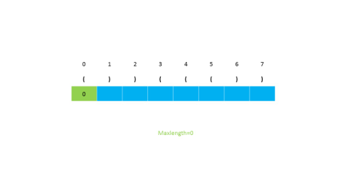
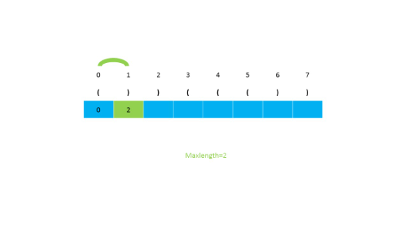
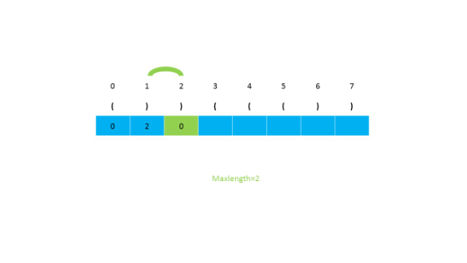
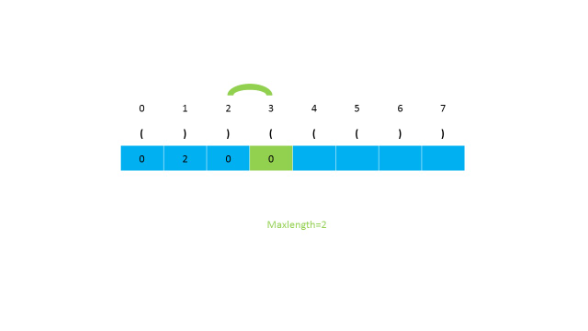
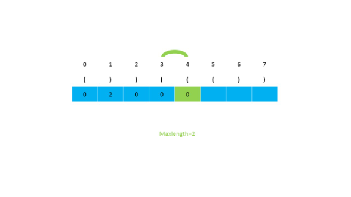
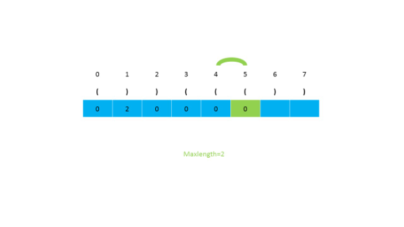
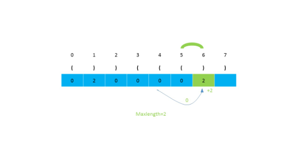
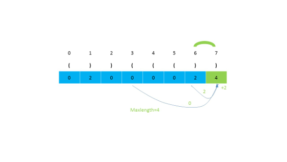

```java
public class Solution {
    public int longestValidParentheses(String s) {
        int maxans = 0;
        int dp[] = new int[s.length()];
        for (int i = 1; i < s.length(); i++) {
            if (s.charAt(i) == ')') {
                if (s.charAt(i - 1) == '(') {
                    dp[i] = (i >= 2 ? dp[i - 2] : 0) + 2;
                } else if (i - dp[i - 1] > 0 && s.charAt(i - dp[i - 1] - 1) == '(') {
                    dp[i] = dp[i - 1] + ((i - dp[i - 1]) >= 2 ? dp[i - dp[i - 1] - 2] : 0) + 2;
                }
                maxans = Math.max(maxans, dp[i]);
            }
        }
        return maxans;
    }
}
```

**Complexity Analysis**

* Time complexity : $O(n)$. Single traversal of string to fill dp array is done.

* Space complexity : $O(n)$. dp array of size nn is used.

## Approach 3: Using Stack
**Algorithm**

Instead of finding every possible string and checking its validity, we can make use of stack while scanning the given string to check if the string scanned so far is valid, and also the length of the longest valid string. In order to do so, we start by pushing $-1$ onto the stack.

For every $\text{‘(’}$ encountered, we push its index onto the stack.

For every $\text{‘)’}$ encountered, we pop the topmost element and subtract the current element's index from the top element of the stack, which gives the length of the currently encountered valid string of parentheses. If while popping the element, the stack becomes empty, we push the current element's index onto the stack. In this way, we keep on calculating the lengths of the valid substrings, and return the length of the longest valid string at the end.

See this example for better understanding.

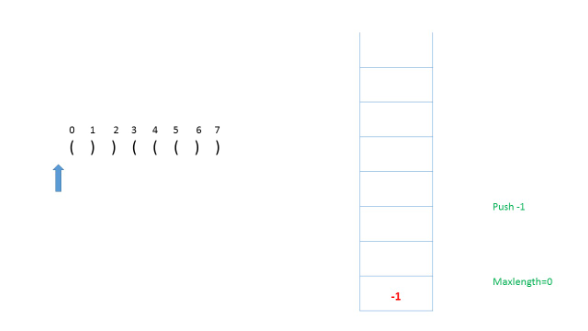
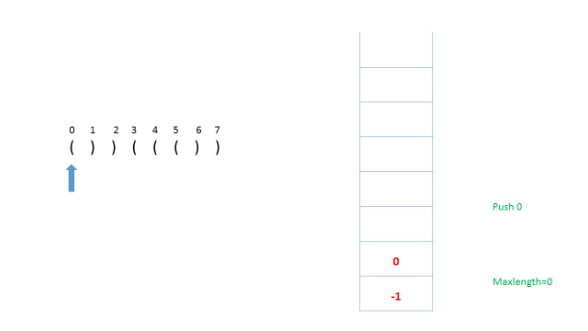
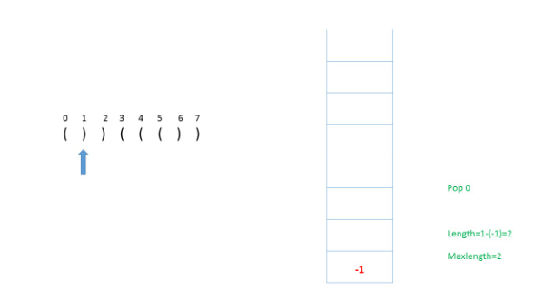
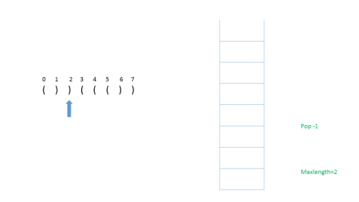
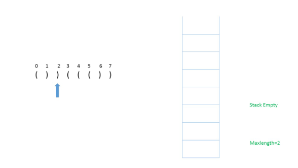

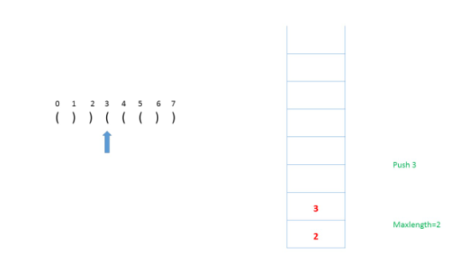
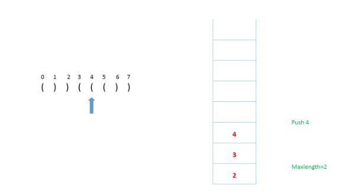
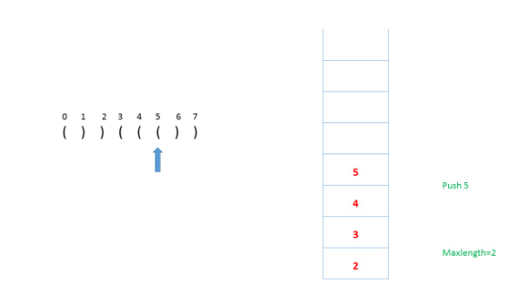
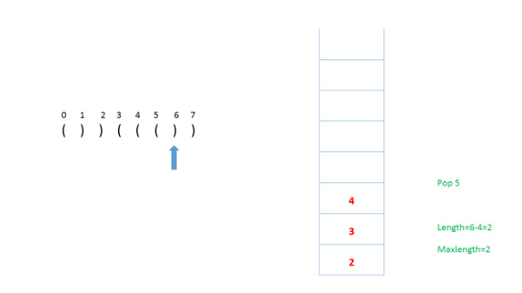
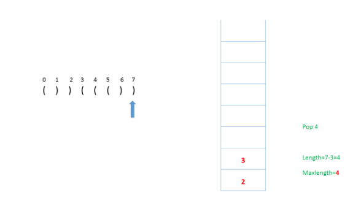

```java
public class Solution {

    public int longestValidParentheses(String s) {
        int maxans = 0;
        Stack<Integer> stack = new Stack<>();
        stack.push(-1);
        for (int i = 0; i < s.length(); i++) {
            if (s.charAt(i) == '(') {
                stack.push(i);
            } else {
                stack.pop();
                if (stack.empty()) {
                    stack.push(i);
                } else {
                    maxans = Math.max(maxans, i - stack.peek());
                }
            }
        }
        return maxans;
    }
}
```

**Complexity Analysis**

* Time complexity : $O(n)$. $n$ is the length of the given string..

* Space complexity : $O(n)$. The size of stack can go up to $n$.

## Approach 4: Without extra space
**Algorithm**

In this approach, we make use of two counters $left$ and $right$. First, we start traversing the string from the left towards the right and for every $\text{‘(’}$ encountered, we increment the $left$ counter and for every $\text{‘)’}$ encountered, we increment the $right$ counter. Whenever $left$ becomes equal to $right$, we calculate the length of the current valid string and keep track of maximum length substring found so far. If $right$ becomes greater than $left$ we reset $left$ and $right$ to $0$.

Next, we start traversing the string from right to left and similar procedure is applied.

Example of this approach:


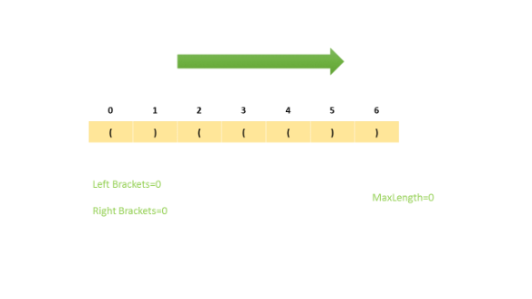
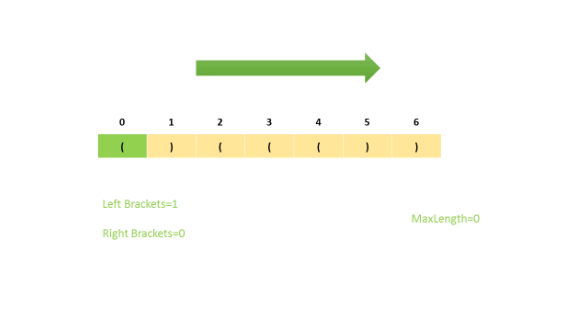

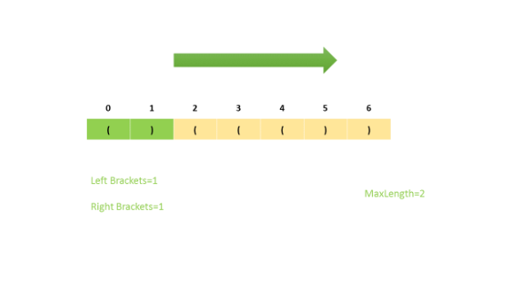
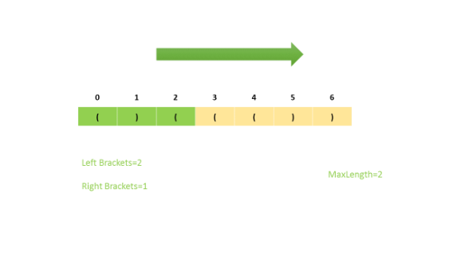
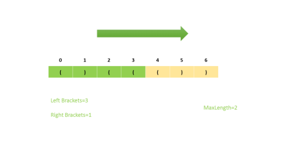
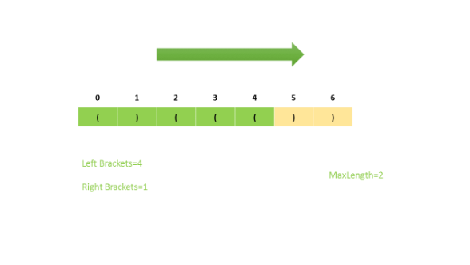
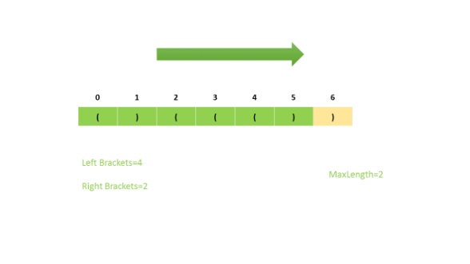
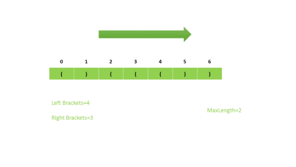
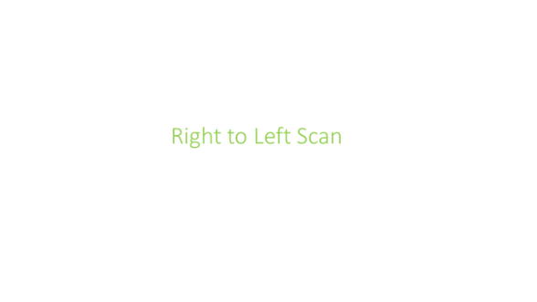
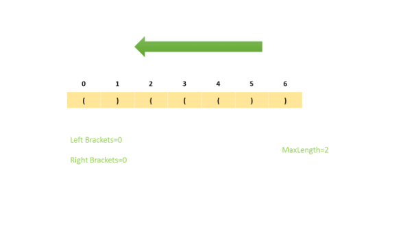
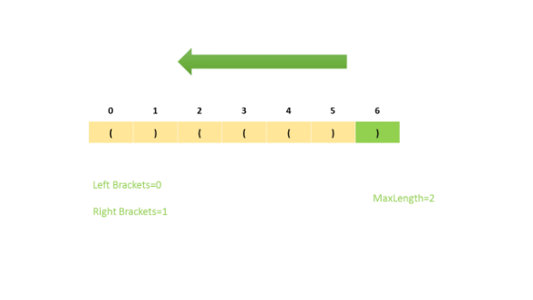
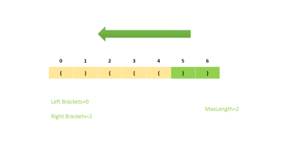
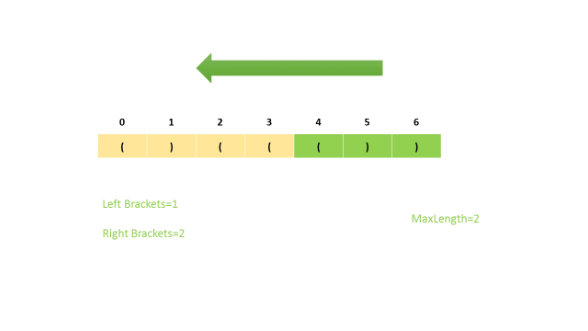
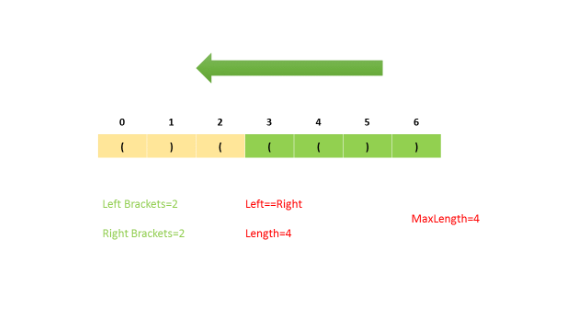
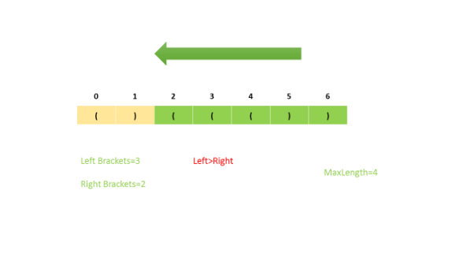
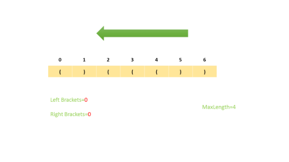
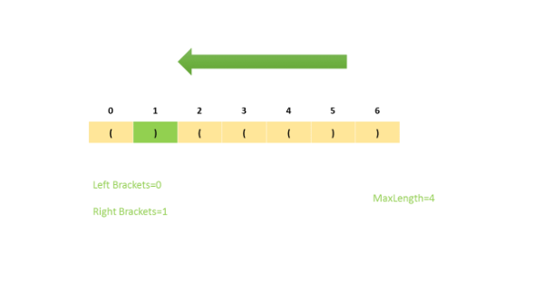
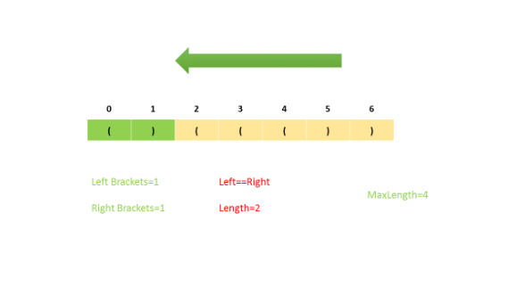
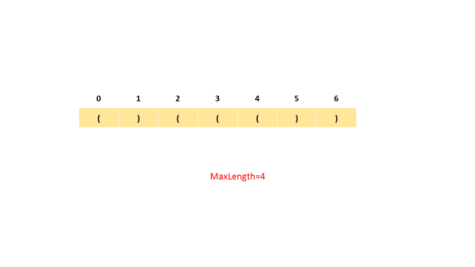

```java
public class Solution {
    public int longestValidParentheses(String s) {
        int left = 0, right = 0, maxlength = 0;
        for (int i = 0; i < s.length(); i++) {
            if (s.charAt(i) == '(') {
                left++;
            } else {
                right++;
            }
            if (left == right) {
                maxlength = Math.max(maxlength, 2 * right);
            } else if (right >= left) {
                left = right = 0;
            }
        }
        left = right = 0;
        for (int i = s.length() - 1; i >= 0; i--) {
            if (s.charAt(i) == '(') {
                left++;
            } else {
                right++;
            }
            if (left == right) {
                maxlength = Math.max(maxlength, 2 * left);
            } else if (left >= right) {
                left = right = 0;
            }
        }
        return maxlength;
    }
}
```
**Complexity Analysis**

* Time complexity : $O(n)$. Two traversals of the string.

* Space complexity : $O(1)$. Only two extra variables $left$ and $right$ are needed.

# Submissions
---
**Solution 1: (Brute Force, Time Limit Exceeded)**
```python
class Solution:
    def longestValidParentheses(self, s: str) -> int:
        
        def isValid(s):
            stack = []
            for i in range(len(s)):
                if s[i] == '(':
                    stack += '('
                elif stack and stack[-1] == '(':
                    stack.pop()
                else:
                    return False
            return not stack
        
        maxlen = 0
        for i in range(len(s)):
            for j in range(i+2, len(s)+1, 2):
                if isValid(s[i:j]):
                    maxlen = max(maxlen, j - i)
        return maxlen
```

**Solution 2: (Using Dynamic Programming Bottom-Up)**
```
Runtime: 48 ms
Memory Usage: 13 MB
```
```python
class Solution:
    def longestValidParentheses(self, s: str) -> int:
        maxans = 0
        dp = [0]*len(s)
        for i in range(1, len(s)):
            if s[i] == ')':
                if s[i - 1] == '(':
                    dp[i] = (dp[i - 2] if i >= 2 else 0) + 2
                elif i - dp[i - 1] > 0 and s[i - dp[i - 1] - 1] == '(':
                    dp[i] = dp[i - 1] + (dp[i - dp[i - 1] - 2] if (i - dp[i - 1]) >= 2 else 0) + 2
                maxans = max(maxans, dp[i])

        return maxans
```

**Solution 3: (Using Stack)**
```
Runtime: 36 ms
Memory Usage: 13.6 MB
```
```python
class Solution:
    def longestValidParentheses(self, s: str) -> int:
        maxans = 0
        stack = [-1]
        for i in range(len(s)):
            if s[i] == '(':
                stack += [i]
            else:
                stack.pop()
                if not stack:
                    stack += [i]
                else:
                    maxans = max(maxans, i - stack[-1])

        return maxans
```

**Solution 4: (Without extra space)**
```
Runtime: 44 ms
Memory Usage: 13.1 MB
```
```python
class Solution:
    def longestValidParentheses(self, s: str) -> int:
        left, right, maxlength = 0, 0, 0
        for i in range(len(s)):
            if s[i] == '(':
                left += 1
            else:
                right += 1
            if left == right:
                maxlength = max(maxlength, 2 * right)
            elif right >= left:
                left = right = 0
        left = right = 0
        for i in range(len(s) - 1, -1, -1):
            if s[i] == '(':
                left += 1
            else:
                right += 1
            if left == right:
                maxlength = max(maxlength, 2 * left)
            elif left >= right:
                left = right = 0

        return maxlength
```