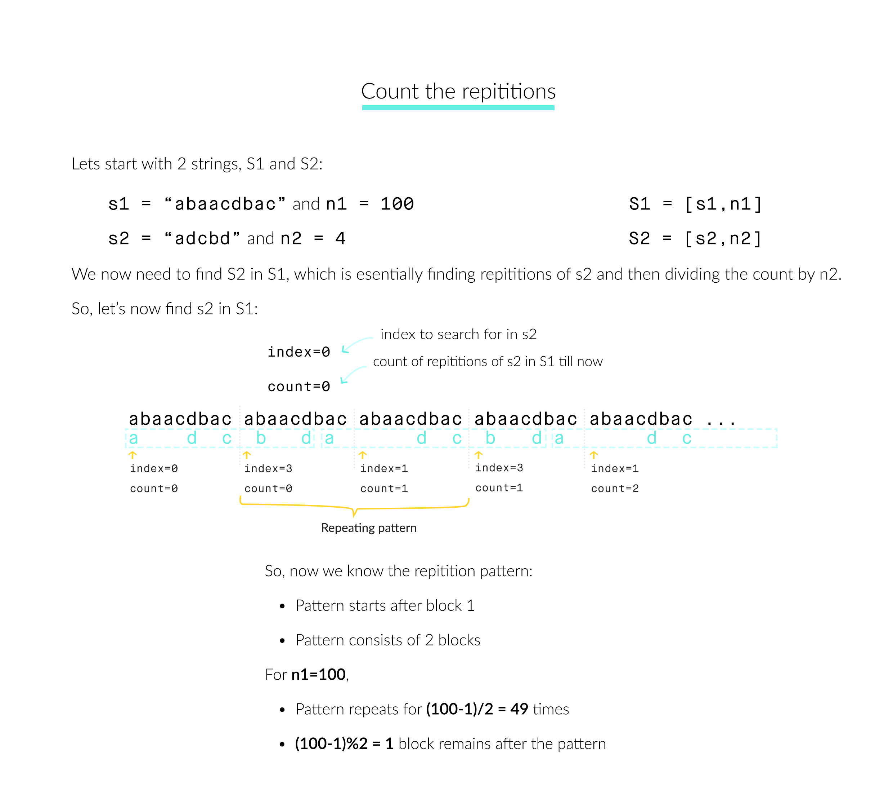

466. Count The Repetitions

Define `S = [s,n]` as the string `S` which consists of `n` connected strings `s`. For example, `["abc", 3]` =`"abcabcabc"`.

On the other hand, we define that string `s1` can be obtained from string `s2` if we can remove some characters from `s2` such that it becomes `s1`. For example, `“abc”` can be obtained from `“abdbec”` based on our definition, but it can not be obtained from `“acbbe”`.

You are given two non-empty strings `s1` and `s2` (each at most 100 characters long) and two integers `0 ≤ n1 ≤ 106` and `1 ≤ n2 ≤ 106`. Now consider the strings `S1` and `S2`, where `S1=[s1,n1]` and `S2=[s2,n2]`. Find the maximum integer `M` such that `[S2,M]` can be obtained from `S1`.

**Example:**
```
Input:
s1="acb", n1=4
s2="ab", n2=2

Return:
2
```

# Solution
---
## Approach #1 Brute force [Time Limit Exceeded]
**Intuition**

According to the question, we need to find $m$ such that $[S2,m]$ is the largest subsequence that can be found in $S1$. $S2$ is essentially $[s2,n2]$ and $S1$ is $[s1,n1]$ and so, we can find the number of times $s2$ repeats in $[s1,n1]$, say $\text{repeat_count}$. And the number of times $S2$ repeats in $S1$ is therefore $\text{(repeat_count/n2)}$. Simple.

**Algorithm**

* Initialize $\text{index=0}$ and $\text{repeat_count=0}$. $\text{index}$ represents the current index in $s2$ to be checked against $s1$ and $\text{repeat_count}$ represents the number of times $s2$ repeats in $S1$.
* Iterate over the variable $i$ from $0$ to $n1-1$:
    * Iterate over the variable $j$ from $0$ to $\text{size(s1)}-1$
        * If $\text{s1[j] }$  is equal to $\text{s2[index]}$, increment $\text{index}$.
        * If $index$ is equal to $size(s2)$, this implies that $s2$ has completed one repartition and hence set $\text{index=0}$ and increment the $\text{repeat_count}$.
* Return $\text{(repeat_count / n2)}$ since, $S2$ is $\text{[s2,n2]}$.

**c++**
```C++
int getMaxRepetitions(string s1, int n1, string s2, int n2)
{
    int index = 0, repeat_count = 0;
    int s1_size = s1.size(), s2_size = s2.size();
    for (int i = 0; i < n1; i++) {
        for (int j = 0; j < s1_size; j++) {
            if (s1[j] == s2[index])
                ++index;
            if (index == s2_size) {
                index = 0;
                ++repeat_count;
            }
        }
    }
    return repeat_count / n2;
}
```

**Complexity Analysis**

* Time complexity: $O(n1*size(s1))$.

We iterate over the entire length of string $s1$ for $n1$ times.

* Space complexity: $O(1)$ extra space for $\text{index}$ and $\text{repeat_count}$.

## Approach #2 A better brute force [Accepted]
**Intuition**

In Approach #1, we simply checked for repetition over the entire $[s1,n1]$. However, $n1$ could be quiet large and thus, is inefficient to iterate over complete $S1$. We can take advantage of the fact that $s1$ is repeating and hence, we could find a pattern of repetition of $s2$ in $S1$. Once, we get the repetition pattern, we can easy calculate how many times the pattern repeats in $n2$ in $O(1)$.

But what's the pattern!

In approach #1, we kept $\text{index}$ which tells the index to search in $s2$. We try to see in the below illustration if this $\text{index}$ repeats itself after some fixed iterations of $s1$ or not and if so, then how can we leverage it.



After finding the repitition pattern, we can calculate the sum of repeating pattern, part before repitition and part left after repitition as the result in $O(1)$.

But will this repitition always take place?

Yes! By Pigeonhole principle, which states that if $n$ items are put into $m$ containers, with $n > m$, then at least one container must contain more than one item. So, according to this, we are sure to find 2 same $index$ after scanning at max $\text{size(s2)}$ blocks of $s1$.

**Algorithm**

* Intialize $count=0$ and $index=0$, which are same as in Approach #1.
* Initialize 2 arrays, say $\text{indexr}$ and $\text{countr}$ of size $(\text{size(s2)}+1)$, initialized with 0. The size $(\text{size(s2)}+1)$ is based on the Pigeonhole principle as discussed above. The 2 arrays specifies the $\text{index}$ and $\text{count}$ at the start of each $s1$ block.
* Iterate over ii from $0$ to $n1-1$:
    * Iterate over $j$ from $0$ to $\text{size(s1)}-1$:

        * If $\text{s1[j]} == \text{s2[index]}$, increment $\text{index}$.
        * If $\text{index}$ is equal to $\text{size(s2)}$, set $\text{index} = 0$ and increment $\text{count}$.
    * Set $\text{countr[i]}=\text{count}$ and $\text{indexr[i]}=\text{index}$

    * Iterate over $k$ from $0$ to $i-1$:

        * If we find the repitition, i.e. current $\text{index} = \text{indexr[k]}$, we calculate the count for block before the repitition starts, the repeating block and the block left after repitition pattern, which can be calculated as:
        
        $\begin{align} \text{prev_count} &= \text{countr}[k] \\ \text{pattern_count} &= (\text{countr}[i] - \text{countr}[k]) * \frac{n1 - 1 - k}{i - k} \\ \text{remain_count} &= \text{countr}\left[k + \left(n1 - 1 - k\right) \% \left(i - k \right)\right] - \text{countr}[k] \end{align}$
        
        * Sum the 3 counts and return the sum divided by $n2$, since $\text{S2 = [s2,n2]}$

* If no repetition is found, return $\text{countr[n1-1]/n2}$.

**C++**
```c++
int getMaxRepetitions(string s1, int n1, string s2, int n2)
{
    if (n1 == 0)
        return 0;
    int indexr[s2.size() + 1] = { 0 }; // index at start of each s1 block
    int countr[s2.size() + 1] = { 0 }; // count of repititions till the present s1 block
    int index = 0, count = 0;
    for (int i = 0; i < n1; i++) {
        for (int j = 0; j < s1.size(); j++) {
            if (s1[j] == s2[index])
                ++index;
            if (index == s2.size()) {
                index = 0;
                ++count;
            }
        }
        countr[i] = count;
        indexr[i] = index;
        for (int k = 0; k < i; k++) {
            if (indexr[k] == index) {
                int prev_count = countr[k];
                int pattern_count = (countr[i] - countr[k]) * (n1 - 1 - k) / (i - k);
                int remain_count = countr[k + (n1 - 1 - k) % (i - k)] - countr[k];
                return (prev_count + pattern_count + remain_count) / n2;
            }
        }
    }
    return countr[n1 - 1] / n2;
}
```

**Complexity analysis**

* Time complexity: $\text{O(size(s1)*size(s2))}$.

According to the Pigeonhole principle, we need to iterate over s1s1 only $(\text{size(s2)+1})$ times at max.

* Space complexity: $O(\text{size(s2)})$ extra space for $\text{indexr}$ and $\text{countr}$ string.

# Submissions
---
**Solution 1: (Brute force, Time Limit Exceeded)**
```python
class Solution:
    def getMaxRepetitions(self, s1: str, n1: int, s2: str, n2: int) -> int:
        index, repeat_count = 0, 0;
        s1_size, s2_size = len(s1), len(s2)
        for i in range(n1):
            for j in range(s1_size):
                if s1[j] == s2[index]:
                    index += 1
                if index == s2_size:
                    index = 0
                    repeat_count += 1
                    
        return repeat_count // n2
```

**Solution 2: (finding a cycle)**

The idea is to find the number of occurences of s2 in S1 and to find a cycle in s1.
Here is the code:

```
Runtime: 44 ms
Memory Usage: 12.7 MB
```
```python
class Solution:
    def getMaxRepetitions(self, s1: str, n1: int, s2: str, n2: int) -> int:
        m, n, M = len(s1), len(s2), len(s1) * n1
        # Maps from idx in s1 to 
        #   (num characters from begin, num occurences of s2)
        numChars = { 0: (0, 0) } 
        i, j = 0, 0
        s2Cnt = 0
        cntr = 10002
        while cntr and i < M:
            cntr -= 1
            idxi, idxj = i % m, j % n
            if s2[idxj] == s1[idxi]:
                j += 1
                if j % n == 0: s2Cnt += 1
            i += 1
            idxi, idxj = i % m, j % n
            if j and idxj == 0:
                if idxi not in numChars:
                    # save the current idx of occurence of s2
                    numChars[idxi] = (i, s2Cnt)
                else:
                    # found a cycle
                    charsInCycle, occurencesBefore = i - numChars[idxi][0], numChars[idxi][1]
                    numberOfCycles = (M - i) // charsInCycle
                    s2Cnt += (s2Cnt - occurencesBefore) * numberOfCycles
                    i += numberOfCycles * charsInCycle
                    # go till end normally
                    while i < M:
                        if s1[i % m]==s2[j % n]:
                            j += 1
                            if j % n == 0:
                                s2Cnt += 1
                        i += 1
                    return s2Cnt // n2
        return s2Cnt // n2
```

**Solution 3: (finding a cycle, DP Bottom-Up)**
```
Runtime: 2 ms, Beats 58.31%
Memory: 8.45 MB, Beats 68.60%
```
```c++
class Solution {
public:
    int getMaxRepetitions(string s1, int n1, string s2, int n2) {
        int len1 = s1.size();  // Length of s1
        int len2 = s2.size();  // Length of s2
        
        // A map to store the index of s2 and corresponding (s1_count, s2_count)
        unordered_map<int, pair<int, int>> memo;
        
        int s1Count = 0;  // Number of times s1 has been concatenated
        int s2Count = 0;  // Number of times s2 has been fully matched
        int index = 0;    // Current index in s2
        
        while (s1Count < n1) {  // Loop until we use s1 n1 times
            for (char c : s1) {  // Traverse through each character in s1
                if (c == s2[index]) {  // If characters match
                    index++;
                    if (index == len2) {  // If we have matched the entire s2
                        s2Count++;
                        index = 0;  // Reset index for the next round
                    }
                }
            }
            s1Count++;  // Increment the count of s1 used
            
            // Check if we have seen this index of s2 before
            if (memo.find(index) != memo.end()) {
                auto& prev = memo[index];
                int prev_s1Count = prev.first;
                int prev_s2Count = prev.second;

                // Calculate the cycle length and the number of cycles
                int cycleLen = s1Count - prev_s1Count;
                int cycleCount = (n1 - prev_s1Count) / cycleLen;

                // Fast forward through the cycles
                s1Count = prev_s1Count + cycleCount * cycleLen;
                s2Count = prev_s2Count + cycleCount * (s2Count - prev_s2Count);
            }
            
            // Store the current state in the map
            memo[index] = {s1Count, s2Count};
        }
        
        // Calculate the final result by dividing s2Count by n2
        return s2Count / n2;
    }
};
```
