493. Reverse Pairs

Given an array `nums`, we call `(i, j)` an **important reverse pair** if `i < j` and `nums[i] > 2*nums[j]`.

You need to return the number of important reverse pairs in the given array.

**Example1:**
```
Input: [1,3,2,3,1]
Output: 2
```

**Example2:**
```
Input: [2,4,3,5,1]
Output: 3
```

**Note:**

* The length of the given array will not exceed `50,000`.
* All the numbers in the input array are in the range of `32`-bit integer.

# Solution
---
## Approach 1: Brute Force
**Intuition**

Do as directed in the question. We can simply check all the pairs if they are important reverse pairs or not.

**Algorithm**

* Iterate over $i$ from $0$ to $\text{size} - 1$
    * Iterate over $j$ from $0$ to $i - 1$
        * If $\text{nums[j]} > 2 * \text{nums[i]}$, increment $\text{count}$

C++
```c++
int reversePairs(vector<int>& nums)
{
    int n = nums.size();
    int count = 0;
    for (int i = 0; i < n; i++) {
        for (int j = 0; j < i; j++) {
            if (nums[j] > nums[i] * 2LL)
                count++;
        }
    }
    return count;
}
```

**Complexity Analysis**

* Time complexity: $O(n^2)$

    * We iterate over all the possible pairs wherein (i<ji<j) in the array which is $O(n^2)$

* Space complexity: $O(1)$ only constant extra space is required for $n$, countcount etc.

Trivia

The above code can be expressed as one-liner in Python:
```python
def reversePairs(self, nums):
  return sum([nums[j] > 2 * nums[i] for i in range(len(nums)) for j in range(0 , i)])
```

## Approach 2: Binary Search Tree
**Intuition**

In Approach 1, for each element $i$, we searched the subarray $[0,i)$ for elements such that their value is greater than $2*\text{nums[i]}$. In the previous approach, the search is linear. However, we need to make the process efficient. Maybe, memoization can help, but since, we need to compare the elements, we cannot find a linear DP solution.

Observe that the indices of the elements in subarray $[0,i)$ don't matter as we only require the count. So, we can sort the elements and perform binary search on the subarray. But, since the subarray keeps growing as we iterate to the next element, we need a data structure to store the previous result as well as to allow efficient searching(preferably $O(\log n)$ - Binary Search Tree(BST) could be a good bet.

Refreshing BST

BST is a rooted binary tree, wherein each node is associated with a value and has 2 distinguishable sub-trees namely $left$ and $right$ subtree. The left subtree contains only the nodes with lower values than the parent's value, while the right subtree conatins only the nodes with greater values than the parent's value.

Voila!

This is exactly what is required. So, if we store our elements in BST, then we can search the larger elements thus eliminating the search on smaller elements altogether.

**Algorithm**

Define the $\text{Node}$ of BST that stores the $\text{val}$ and pointers to the $\text{left}l$ and $\text{right}$. We also need a count of elements(say $\text{count\_ge}$) in the subtree rooted at the current node that are greater than or equal to the current node's $\text{val}$. $\text{count\_ge}$ is initialized to 1 for each node and $\text{left}$, $\text{right}$ pointers are set to $\text{NULL}$.

We define the $\text{insert}$ routine that recursively adds the given $\text{val}$ as an appropriate leaf node based on comparisons with the $Node.val$. Each time, the given valval is smaller than $Node.val$, we increment the $\text{count\_ge}$ and move the valval to the right subtree. While, if the valval is equal to the current $Node$, we simply increment the $\text{count\_ge}$ and exit. While, we move to the left subtree in case $(\text{val}<\text{Node.val})$.

We also require the $search$ routine that gives the count of number of elements greater than or equal to the $\text{target}$. In the $\text{search}$ routine, if the $head$ is NULL, return 0. Otherwise, if $\text{target}==\text{head.val}$, we know the count of values greater than or equal to the $\text{target}$, hence simply return $\text{head.count\_ge}$. In case, $\text{target}<\text{head.val}$, the ans is calculated by adding $\text{Node.count\_ge}$ and recursively calling the $\text{search}$ routine with $\text{head.left}$. And if $\text{target}>\text{head.val}$, ans is obtained by recursively calling the $\text{search}$ routine with $\text{head.right}$.

Now, we can get to our main logic:

* Iterate over $i$ from $0$ to $(size-1)$ of $\text{nums}$ :
    * Search the existing BST for $\text{nums[i]} * 2 + 1$ and add the result to $\text{count}$
    * Insert $\text{nums[i]}$ to the BST, hence updating the $\text{count\_ge}$ of the previous nodes
        
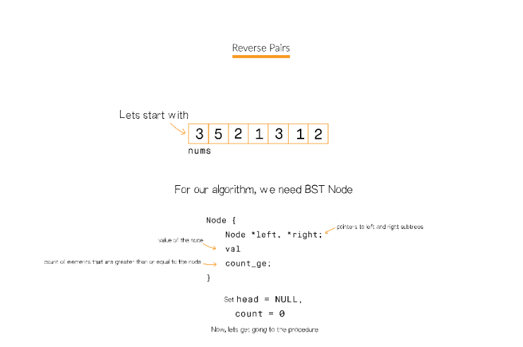
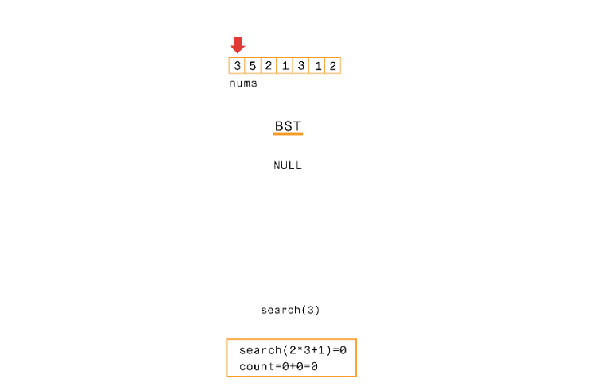
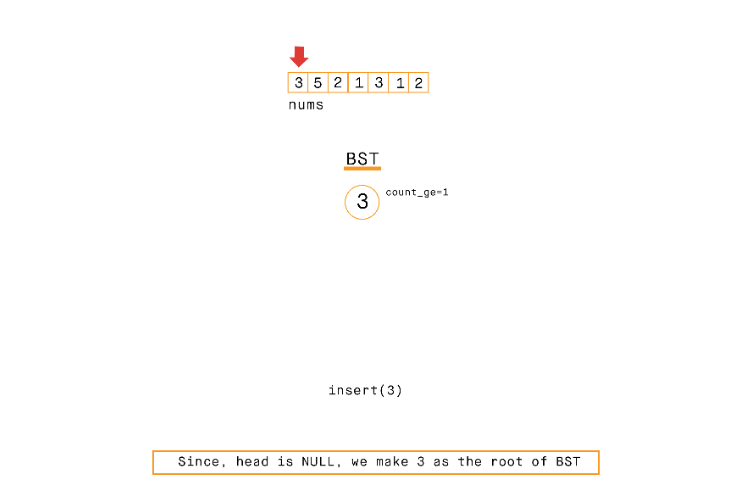
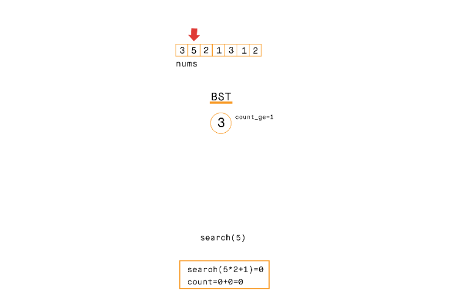

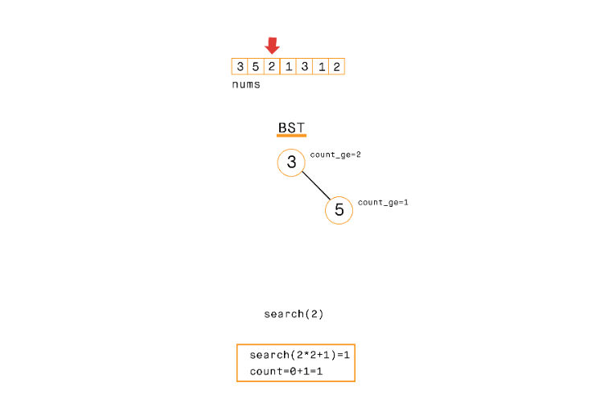
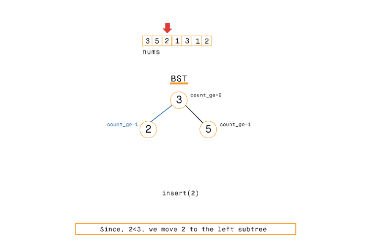
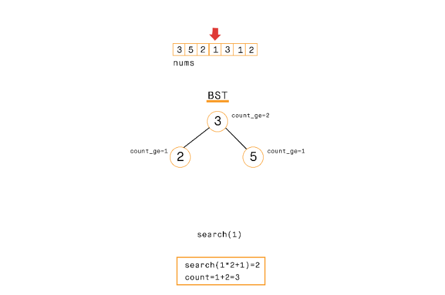
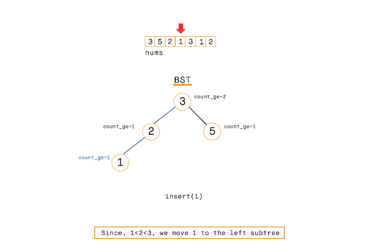
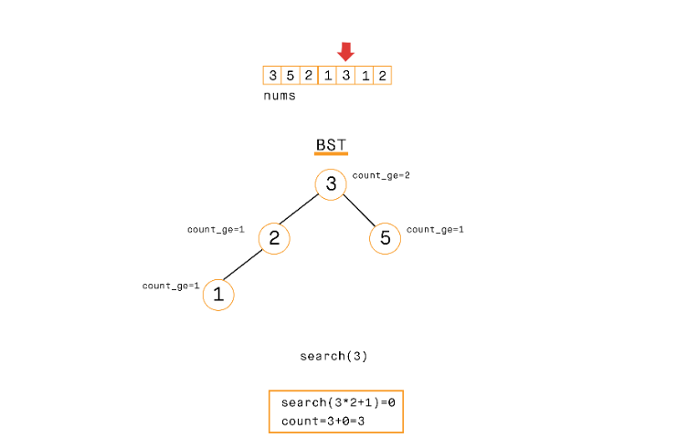
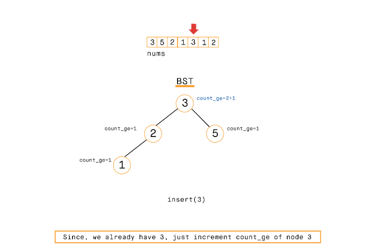
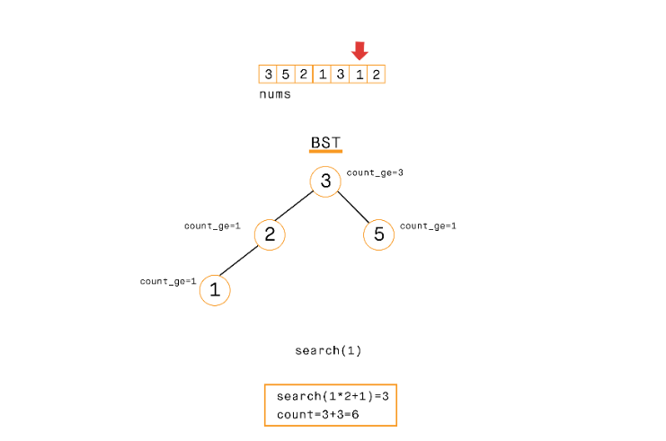
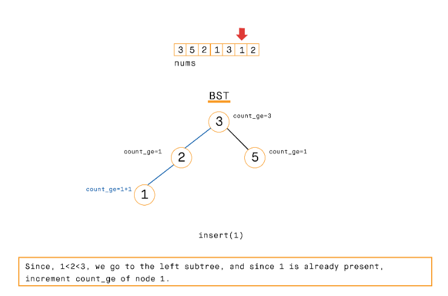
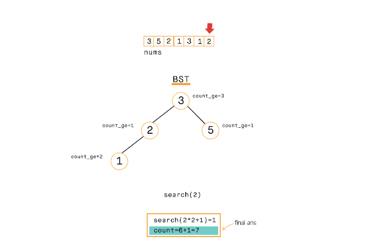
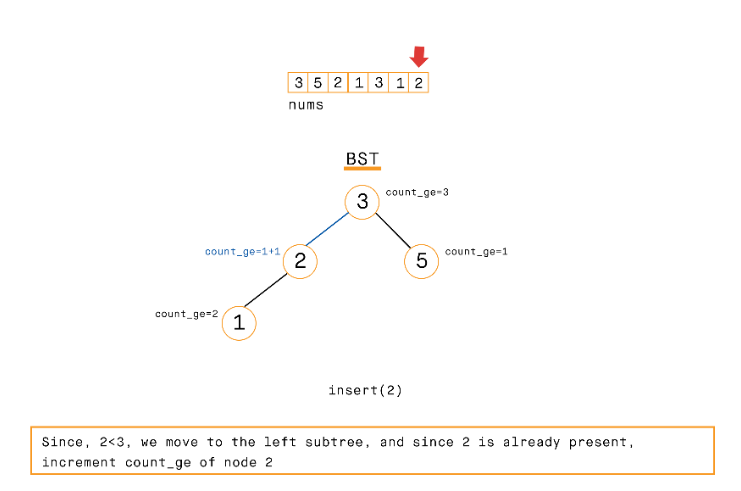

C++
```c++
class Node {
public:
    Node *left, *right;
    int val;
    int count_ge;
    Node(int val)
    {
        this->val = val;
        this->count_ge = 1;
        this->left = NULL;
        this->right = NULL;
    }
};

Node* insert(Node* head, int val)
{
    if (head == NULL)
        return new Node(val);
    else if (val == head->val)
        head->count_ge++;
    else if (val < head->val)
        head->left = insert(head->left, val);
    else {
        head->count_ge++;
        head->right = insert(head->right, val);
    }
    return head;
}

int search(Node* head, long long target)
{
    if (head == NULL)
        return 0;
    else if (target == head->val)
        return head->count_ge;
    else if (target < head->val)
        return head->count_ge + search(head->left, target);
    else
        return search(head->right, target);
}

int reversePairs(vector<int>& nums)
{
    Node* head = NULL;
    int n = nums.size();
    int count = 0;
    for (int i = 0; i < n; i++) {
        count += search(head, nums[i] * 2LL + 1);
        head = insert(head, nums[i]);
    }
    return count;
}
```

**Complexity analysis**

* Time complexity: $O(n^2)$

    * The best case complexity for BST is $O(\log n)$ for search as well as insertion, wherein, the tree formed is complete binary tree
    * Whereas, in case like `[1,2,3,4,5,6,7,8,...]`, insertion as well as search for an element becomes $O(n)$in time, since, the tree is skewed in only one direction, and hence, is no better than the array
    * So, in worst case, for searching and insertion over n items, the complexity is $O(n*n)$

* Space complexity: $O(n)$ extra space for storing the BST in $\text{Node}$ class.

## Approach 3: BIT
**Intuition**

The problem with BST is that the tree can be skewed hence, making it $O(n^2)$ in complexity. So, need a data structure that remains balanced. We could either use a Red-black or AVL tree to make a balanced BST, but the implementation would be an overkill for the solution. We can use BIT (Binary Indexed Tree, also called Fenwick Tree) to ensure that the complexity is $O(n\log n)$ with only 12-15 lines of code.

BIT Overview:

Fenwick Tree or BIT provides a way to represent an array of numbers in an array(can be visualized as tree), allowing prefix/suffix sums to be calculated efficiently(O(\log n)O(logn)). BIT allows to update an element in $O(\log n)$ time.

We recommend having a look at BIT from the following links before getting into details:

* https://www.youtube.com/watch?v=CWDQJGaN1gY
* https://www.topcoder.com/community/data-science/data-science-tutorials/binary-indexed-trees/
So, BIT is very useful to accumulate information from front/back and hence, we can use it in the same way we used BST to get the count of elements that are greater than or equal to $2 * \text{nums[i]} + 1$ in the existing tree and then adding the current element to the tree.

**Algorithm**

First, lets review the BIT $\text{query}$ and $\text{update}$ routines of BIT. According to the convention, $\text{query}$ routine goes from $\text{index}$ to $0$, i.e., $\text{BIT[i]}$ gives the sum for the range $[0,index]$, and $\text{update}$ updates the values from current $\text{index}$ to the end of array. But, since, we require to find the numbers greater than the given index, as and when we update an index, we update all the ancestors of the node in the tree, and for $\text{search}$, we go from the node to the end.

The modified $\text{update}$ algorithm is:
```
update(BIT,index, val):
  while(index<0):
    BIT[index]+=val
    index-=(index&(-index))
```
Herein, we find get the next index using: \text{index-=index&(-index)}, which is essentially subtracting the rightmost 1 from the \text{index}index binary representation. We update the previous indices since, if an element is greater than the index

And the modified \text{query}query algorithm is:
```
query(BIT,index):
  sum=0
  while(index<BIT.size):
    sum+=BIT[index]
    index+=(index&(-index))
```
Herein, we find get the next index using: $\text{index+=index&(-index)}$. This gives the suffix sum from indexindex to the end.

So, the main idea is to count the number of elements greater than $2*\text{nums[i]}$ in range $[0,i)$ as we iterate from $0$ to $\text{size-1}$. The steps are as follows:

* Create a copy of $\text{nums}$, say $\text{nums\_copy}$ ans sort $\text{nums\_copy}$. This array is actually used for creating the Binary indexed tree
* Initialize $\text{count}=0$ and $\text{BIT}$ array of size $\text{size(nums)} + 1$ to store the BIT
* Iterate over $i$ from $0$ to $\text{size(nums)}-1$:
    * Search the index of element not less than $2*\text{nums[i]}+1$ in $\text{nums\_copy}$ array. $\text{query}$ the obtained index+1 in the $\text{BIT}$, and add the result to $\text{count}$
    * Search for the index of element not less than $nums[i]$ in $\text{nums\_copy}$. We need to $\text{update}$ the BIT for this index by 1. This essentially means that 1 is added to this index(or number of elements greater than this index is incremented). The effect of adding $1$ to the index is passed to the ancestors as shown in $\text{update}$ algorithm

C++
```c++
void update(vector<int>& BIT, int index, int val)
{
    while (index > 0) {
        BIT[index] += val;
        index -= index & (-index);
    }
}

int query(vector<int>& BIT, int index)
{
    int sum = 0;
    while (index < BIT.size()) {
        sum += BIT[index];
        index += index & (-index);
    }
    return sum;
}
int reversePairs(vector<int>& nums)
{
    int n = nums.size();
    vector<int> nums_copy(nums);

    sort(nums_copy.begin(), nums_copy.end());

    vector<int> BITS(n + 1, 0);
    int count = 0;
    for (int i = 0; i < n; i++) {
        count += query(BITS, lower_bound(nums_copy.begin(), nums_copy.end(), 2LL * nums[i] + 1) - nums_copy.begin() + 1);
        update(BITS, lower_bound(nums_copy.begin(), nums_copy.end(), nums[i]) - nums_copy.begin() + 1, 1);
    }
    return count;
}
```

**Complexity analysis**

* Time complexity: $O(n\log n)$
    * In $\text{query}$ and $\text{update}$ operations, we see that the loop iterates at most the number of bits in $\text{index}$ which can be at most nn. Hence, the complexity of both the operations is $O(\log n)$(Number of bits in nn is $\log n$)
    * The in-built operation $\text{lower\_bound}$ is binary search hence $O(\log n)$
    * We perform the operations for nn elements, hence the total complexity is $O(n\log n)$

* Space complexity: $O(n)$. Additional space for $\text{BITS}$ array

## Approach 4: Modified Merge Sort
**Intuition**

In BIT and BST, we iterate over the array, dividing the array into 3 sections: already visited and hence added to the tree, current node and section to be visited. Another approach could be divide the problem into smaller subproblems, solving them and combining these problems to get the final result - Divide and conquer. We see that the problem has a great resemblance to the merge sort routine. The question is to find the inversions such that $\text{nums[i]}>2 * \text{nums[j]}$ and $i<j$. So, we can easily modify the merge sort to count the inversions as required.

Mergesort

Mergesort is a divide-and-conquer based sorting technique that operates in $O(n\log n)$ time. The basic idea to divide the array into several sub-arrays until each sub-array is single element long and merging these sublists recursively that results in the final sorted array.

**Algorithm**

We define $\text{mergesort\_and\_count}$ routine that takes parameters an array say $A$ and $\text{start}$ and $\text{end}$ indices:

* If $\text{start}$>=$\text{end}$ this implies that elements can no longer be broken further and hence we return 0
* Otherwise, set $\text{mid}=(\text{start} + \text{end})/2$
* Store countcount by recursively calling \text{mergesort\_and\_count}mergesort_and_count on range \text{[start,mid]}[start,mid] and $\text{[mid+1,end]}$ and adding the results. This is the divide step on our routine, breaking it into the 2 ranges, and finding the results for each range separately
* Now, we that we have separately calculated the results for ranges \text{[start,mid]}[start,mid] and \text{[mid+1,end]}[mid+1,end], but we still have to count the elements in $\text{[start,mid]}$ that are greater than 2 * elements in \text{[mid+1,end]}[mid+1,end]. Count all such elements and add the result to $\text{count}$
* Finally, \text{merge}merge the array from $\text{start}$ to $\text{end}$
    * Make 2 array : $L$ from elements in range $\text{[start,mid]}$ and RR from elements in range $\text{R[mid+1,end]}$
    * Keep pointers $i$ and $j$ to $L$ and $R$ respectively both initialized to start to the arrays
    * Iterate over $k$ from $\text{start}$ to $\text{end}$ and set $\text{A[k]}$ to the smaller of $\text{L[i]}$ or $\text{R[j]}$ and increment the respective index
    
C++
```c++
void merge(vector<int>& A, int start, int mid, int end)
{
    int n1 = (mid - start + 1);
    int n2 = (end - mid);
    int L[n1], R[n2];
    for (int i = 0; i < n1; i++)
        L[i] = A[start + i];
    for (int j = 0; j < n2; j++)
        R[j] = A[mid + 1 + j];
    int i = 0, j = 0;
    for (int k = start; k <= end; k++) {
        if (j >= n2 || (i < n1 && L[i] <= R[j]))
            A[k] = L[i++];
        else
            A[k] = R[j++];
    }
}

int mergesort_and_count(vector<int>& A, int start, int end)
{
    if (start < end) {
        int mid = (start + end) / 2;
        int count = mergesort_and_count(A, start, mid) + mergesort_and_count(A, mid + 1, end);
        int j = mid + 1;
        for (int i = start; i <= mid; i++) {
            while (j <= end && A[i] > A[j] * 2LL)
                j++;
            count += j - (mid + 1);
        }
        merge(A, start, mid, end);
        return count;
    }
    else
        return 0;
}

int reversePairs(vector<int>& nums)
{
    return mergesort_and_count(nums, 0, nums.size() - 1);
}
```

**Complexity analysis**

* Time complexity: $O(n\log n)$

    * In each step we divide the array into 2 sub-arrays, and hence, the maximum times we need to divide is equal to $O(\log n)$
    * Additional $O(n)$ work needs to be done to count the inversions and to merge the 2 sub-arrays after sorting. Hence total time complexity is $O(n\log n)$
* Space complexity: $O(n)$. Additional space for storing $L$ and $R$ arrays

# Submissions
---
**Solution 1: (Modified Merge Sort, Divide and Conquer)**
```
Runtime: 3032 ms
Memory Usage: 25.3 MB
```
```python
class Solution:
    def reversePairs(self, nums: List[int]) -> int:
        def merge(start, mid, end):
            n1 = (mid - start + 1)
            n2 = (end - mid)
            L = [0]*n1
            R = [0]*n2
            for i in range(n1):
                L[i] = nums[start + i]
            for j in range(n2):
                R[j] = nums[mid + 1 + j]
            i, j = 0, 0
            for k in range(start, end+1):
                if j >= n2 or (i < n1 and L[i] <= R[j]):
                    nums[k] = L[i]
                    i += 1
                else:
                    nums[k] = R[j]
                    j += 1
        
        def mergesort_and_count(start, end):
            if start < end:
                mid = (start + end) // 2;
                count = mergesort_and_count(start, mid) + mergesort_and_count(mid + 1, end)
                j = mid + 1;
                for i in range(start, mid+1):
                    while j <= end and nums[i] > nums[j] * 2:
                        j += 1
                    count += j - (mid + 1)
                merge(start, mid, end)
                return count
            else:
                return 0
            
        return mergesort_and_count(0, len(nums) - 1)
```