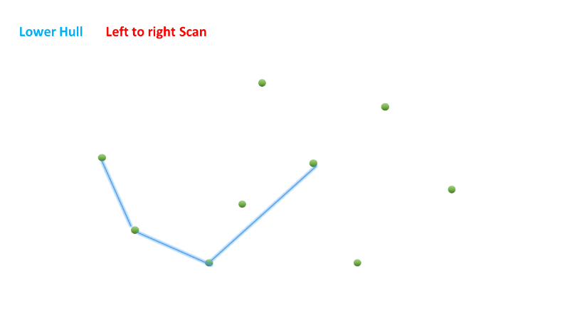

587. Erect the Fence

There are some trees, where each tree is represented by (x,y) coordinate in a two-dimensional garden. Your job is to fence the entire garden using the **minimum length** of rope as it is expensive. The garden is well fenced only if all the trees are enclosed. Your task is to help find the coordinates of trees which are exactly located on the fence perimeter.

 

**Example 1:**
```
Input: [[1,1],[2,2],[2,0],[2,4],[3,3],[4,2]]
Output: [[1,1],[2,0],[4,2],[3,3],[2,4]]
Explanation:
```


**Example 2:**
```
Input: [[1,2],[2,2],[4,2]]
Output: [[1,2],[2,2],[4,2]]
Explanation:

Even you only have trees in a line, you need to use rope to enclose them. 
```


**Note:**

* All trees should be enclosed together. You cannot cut the rope to enclose trees that will separate them in more than one group.
* All input integers will range from `0` to `100`.
* The garden has at least one tree.
* All coordinates are distinct.
* Input points have NO order. No order required for output.
* input types have been changed on April 15, 2019. Please reset to default code definition to get new method signature.

# Solution
---
## Approach 1: Jarvis Algorithm
**Algorithm**

The idea behind Jarvis Algorithm is really simple. We start with the leftmost point among the given set of points and try to wrap up all the given points considering the boundary points in counterclockwise direction.

This means that for every point $p$ considered, we try to find out a point $q$, such that this point $q$ is the most counterclockwise relative to $p$ than all the other points. For checking this, we make use of `orientation()` function in the current implementation. This function takes three arguments $p$, the current point added in the hull; $q$, the next point being considered to be added in the hull; $r$, any other point in the given point space. This function returns a negative value if the point $q$ is more counterclockwise to $p$ than the point $r$.

The following figure shows the concept. The point $q$ is more counterclockwise to $p$ than the point $r$.


From the above figure, we can observe that in order for the points $p$, $q$ and $r$ need to be traversed in the same order in a counterclockwise direction, the cross product of the vectors $\vec{pq}$ and $\vec{qr}$ should be in a direction out of the plane of the screen i.e. it should be positive.

$\vec{pq}$x$\vec{qr}$ > 0

$\begin{vmatrix} (q_x-p_x) & (q_y-p_y) \\ (r_x-q_x) & (r_y-q_y) \end{vmatrix} > 0$

$(q_x - p_x) * (r_y - q_y) - (q_y - p_y) * (r_x - q_x) > 0$

$(q_y - p_y) * (r_x - q_x) - (r_y - q_y) * (q_x - p_x) < 0$

The above result is being calculated by the `orientation()` function.

Thus, we scan over all the points $r$ and find out the point $q$ which is the most counterclockwise relative to $p$ and add it to the convex hull. Further, if there exist two points(say $i$ and $j$) with the same relative orientation to $p$, i.e. if the points $i$ and $j$ are collinear relative to $p$, we need to consider the point $i$ which lies in between the two points $p$ and $j$. For considering such a situation, we've made use of a function `inBetween()` in the current implementation. Even after finding out a point $q$, we need to consider all the other points which are collinear to $q$ relative to $p$ so as to be able to consider all the points lying on the boundary.

Thus, we keep on including the points in the hull till we reach the beginning point.

The following animation depicts the process for a clearer understanding.


**Java**
```java
public class Solution {
    public int orientation(int[] p, int[] q, int[] r) {
        return (q[1] - p[1]) * (r[0] - q[0]) - (q[0] - p[0]) * (r[1] - q[1]);
    }

    public boolean inBetween(int[] p, int[] i, int[] q) {
        boolean a = i[0] >= p[0] && i[0] <= q[0] || i[0] <= p[0] && i[0] >= q[0];
        boolean b = i[1] >= p[1] && i[1] <= q[1] || i[1] <= p[1] && i[1] >= q[1];
        return a && b;
    }

    public int[][] outerTrees(int[][] points) {
        HashSet<int[]> hull = new HashSet<> ();
        if (points.length < 4) {
            for (int[] p: points)
                hull.add(p);
            return hull.toArray(new int[hull.size()][]);
        }
        int left_most = 0;
        for (int i = 0; i < points.length; i++)
            if (points[i][0] < points[left_most][0])
                left_most = i;
        int p = left_most;
        do {
            int q = (p + 1) % points.length;
            for (int i = 0; i < points.length; i++) {
                if (orientation(points[p], points[i], points[q]) < 0) {
                    q = i;
                }
            }
            for (int i = 0; i < points.length; i++) {
                if (i != p && i != q && orientation(points[p], points[i], points[q]) == 0 && inBetween(points[p], points[i], points[q])) {
                    hull.add(points[i]);
                }
            }
            hull.add(points[q]);
            p = q;
        }
        while (p != left_most);
        return hull.toArray(new int[hull.size()][]);
    }
}
```

**Complexity Analysis**

* Time complexity : $O(m * n)$. For every point on the hull we examine all the other points to determine the next point. Here `n` is number of input points and `m` is number of output or hull points ($m \leq n$).

* Space complexity : $O(m)$. List $hull$ grows upto size $m$.

## Approach 2: Graham Scan
**Algorithm**

Graham Scan Algorithm is also a standard algorithm for finding the convex hull of a given set of points. Consider the animation below to follow along with the discussion.


The method works as follows. Firsly we select an initial point(bmbm) to start the hull with. This point is chosen as the point with the lowest y-coordinate. In case of a tie, we need to choose the point with the lowest x-coordinate, from among all the given set of points. This point is indicated as point 0 in the animation. Then, we sort the given set of points based on their polar angles formed w.r.t. a vertical line drawn throught the intial point.

This sorting of the points gives us a rough idea of the way in which we should consider the points to be included in the hull while considering the boundary in counter-clockwise order. In order to sort the points, we make use of `orientation` function which is the same as discussed in the last approach. The points with a lower polar angle relative to the vertical line come first in the sorted array. In case, if the orientation of two points happens to be the same, the points are sorted based on their distance from the beginning point(bmbm). Later on we'll be considering the points in the sorted array in the same order. Because of this, we need to do the sorting based on distance for points collinear relative to bmbm, so that all the collinear points lying on the hull are included in the boundary.

But, we need to consider another important case. In case, the collinear points lie on the closing(last) edge of the hull, we need to consider the points such that the points which lie farther from the initial point bmbm are considered first. Thus, after sorting the array, we traverse the sorted array from the end and reverse the order of the points which are collinear and lie towards the end of the sorted array, since these will be the points which will be considered at the end while forming the hull and thus, will be considered at the end. Thus, after these preprocessing steps, we've got the points correctly arranged in the way that they need to be considered while forming the hull.

Now, as per the algorithm, we start off by considering the line formed by the first two points(0 and 1 in the animation) in the sorted array. We push the points on this line onto a stackstack. After this, we start traversing over the sorted pointspoints array from the third point onwards. If the current point being considered appears after taking a left turn(or straight path) relative to the previous line(line's direction), we push the point onto the stack, indicating that the point has been temporarily added to the hull boundary.

This checking of left or right turn is done by making use of `orientation` again. An orientation greater than 0, considering the points on the line and the current point, indicates a counterclockwise direction or a right turn. A negative orientation indicates a left turn similarly.

If the current point happens to be occuring by taking a right turn from the previous line's direction, it means that the last point included in the hull was incorrect, since it needs to lie inside the boundary and not on the boundary(as is indicated by point 4 in the animation). Thus, we pop off the last point from the stack and consider the second last line's direction with the current point.

Thus, the same process continues, and the popping keeps on continuing till we reach a state where the current point can be included in the hull by taking a right turn. Thus, in this way, we ensure that the hull includes only the boundary points and not the points inside the boundary. After all the points have been traversed, the points lying in the stack constitute the boundary of the convex hull.

The below code is inspired by @yuxiangmusic solution.

**Java**
```java
public class Solution {
    public int orientation(int[] p, int[] q, int[] r) {
        return (q[1] - p[1]) * (r[0] - q[0]) - (q[0] - p[0]) * (r[1] - q[1]);
    }
    public int distance(int[] p, int[] q) {
        return (p[0] - q[0]) * (p[0] - q[0]) + (p[1] - q[1]) * (p[1] - q[1]);
    }

    private static int[] bottomLeft(int[][] points) {
        int[] bottomLeft = points[0];
        for (int[] p: points)
            if (p[1] < bottomLeft[1])
                bottomLeft = p;
        return bottomLeft;
    }
    public int[][] outerTrees(int[][] points) {
        if (points.length <= 1)
            return points;
        int[] bm = bottomLeft(points);
        Arrays.sort(points, new Comparator<int[]> () {
            public int compare(int[] p, int[] q) {
                double diff = orientation(bm, p, q) - orientation(bm, q, p);
                if (diff == 0)
                    return distance(bm, p) - distance(bm, q);
                else
                    return diff > 0 ? 1 : -1;
            }
        });
        int i = points.length - 1;
        while (i >= 0 && orientation(bm, points[points.length - 1], points[i]) == 0)
            i--;
        for (int l = i + 1, h = points.length - 1; l < h; l++, h--) {
            int[] temp = points[l];
            points[l] = points[h];
            points[h] = temp;
        }
        Stack<int[]> stack = new Stack< > ();
        stack.push(points[0]);
        stack.push(points[1]);
        for (int j = 2; j < points.length; j++) {
            int[] top = stack.pop();
            while (orientation(stack.peek(), top, points[j]) > 0)
                top = stack.pop();
            stack.push(top);
            stack.push(points[j]);
        }
        return stack.toArray(new int[stack.size()][]);
    }
}
```

**Complexity Analysis**

* Time complexity : $O\big(n \log n\big)$. Sorting the given points takes $O\big(n \log n\big)$ time. Further, after sorting the points can be considered in two cases, while being pushed onto the stackstack or while popping from the stackstack. Atmost, every point is touched twice(both push and pop) taking $2n$($O(n)$) time in the worst case.

* Space complexity : $O(n)$. Stack size grows upto nn in worst case.

## Approach 3: Monotone Chain
**Algorithm**

The idea behing Monotone Chain Algorithm is somewhat similar to Graham Scan Algorithm. It mainly differs in the order in which the points are considered while being included in the hull. Instead of sorting the points based on their polar angles as in Graham Scan, we sort the points on the basis of their x-coordinate values. If two points have the same x-coordinate values, the points are sorted based on their y-coordinate values. The reasoning behind this will be explained soon.

In this algorithm, we consider the hull as being comprised of two sub-boundaries- The upper hull and the lower hull. We form the two portions in a slightly different manner.

We traverse over the sorted pointspoints array after adding the initial two points in the hull temporarily(which are pushed over the stack $hull$). For every new point considered, we check if the current point lies in the counter-clockwise direction relative to the last two points. If so, the current point is staightaway pushed onto $hull$. If not(indicated by a positive `orientation`), we again get the inference that the last point on the $hull$ needs to lie inside the boundary and not on the boundary. Thus, we keep on popping the points from $hull$ till the current point lies in a counterclockwise direction relative to the top two points on the $hull$.

Note that this time, we need not consider the case of collinear points explicitly, since the points have already been sorted based on their x-coordinate values. So, the collinear points, if any, will implicitly be considered in the correct order.

Doing so, we reach a state such that we reach the point with the largest x-coordinate. But, the hull isn't complete yet. The portion of the hull formed till now constitutes the lower poriton of the hull. Now, we need to form the upper portion of the hull.

Thus, we continue the process of finding the next counterclockwise points and popping in case of a conflict, but this time we consider the points in the reverse order of their x-coordinate values. For this, we can simply traverse over the sorted pointspoints array in the reverse order. We append the new upper hull values obtained to the previous $hull$ itself. At the end, $hull$ gives the points on the required boundary.

The following animation depicts the process for a better understanding of the process:





**Java**
```java
public class Solution {
    public int orientation(int[] p, int[] q, int[] r) {
        return (q[1] - p[1]) * (r[0] - q[0]) - (q[0] - p[0]) * (r[1] - q[1]);
    }
    public int[][] outerTrees(int[][] points) {
        Arrays.sort(points, new Comparator<int[]> () {
            public int compare(int[] p, int[] q) {
                return q[0] - p[0] == 0 ? q[1] - p[1] : q[0] - p[0];
            }
        });
        Stack<int[]> hull = new Stack<>();
        for (int i = 0; i < points.length; i++) {
            while (hull.size() >= 2 && orientation(hull.get(hull.size() - 2), hull.get(hull.size() - 1), points[i]) > 0)
                hull.pop();
            hull.push(points[i]);
        }
        hull.pop();
        for (int i = points.length - 1; i >= 0; i--) {
            while (hull.size() >= 2 && orientation(hull.get(hull.size() - 2), hull.get(hull.size() - 1), points[i]) > 0)
                hull.pop();
            hull.push(points[i]);
        }
        // remove redundant elements from the stack
        HashSet<int[]> ret = new HashSet<>(hull);
        return ret.toArray(new int[ret.size()][]);
    }
}
```

**Complexity Analysis**

* Time complexity : $O\big(n \log n\big)$. Sorting the given points takes $O\big(n \log n\big)$ time. Further, after sorting the points can be considered in two cases, while being pushed onto the $hull$ or while popping from the $hull$. Atmost, every point is touched twice(both push and pop) taking $2n$($O(n)$) time in the worst case.

* Space complexity : $O(n)$. $hull$ stack can grow upto size $n$.

# Submissions
---
**Solution 1: (Jarvis Algorithm)**
```
Runtime: 1320 ms
Memory Usage: 13.3 MB
```
```python
class Solution:
    def outerTrees(self, points: List[List[int]]) -> List[List[int]]:
        
        def orientation(p, q, r):
            return (q[1] - p[1]) * (r[0] - q[0]) - (q[0] - p[0]) * (r[1] - q[1])

        def inBetween(p, i, q):
            a = i[0] >= p[0] and i[0] <= q[0] or i[0] <= p[0] and i[0] >= q[0]
            b = i[1] >= p[1] and i[1] <= q[1] or i[1] <= p[1] and i[1] >= q[1]
            return a and b
        
        hull = set()
        if len(points) < 4:
            return points
        left_most = 0
        for i in range(len(points)):
            if points[i][0] < points[left_most][0]:
                left_most = i
        p = left_most
        while True:
            q = (p + 1) % len(points)
            for i in range(len(points)):
                if orientation(points[p], points[i], points[q]) < 0:
                    q = i
            for i in range(len(points)):
                if i != p and i != q and orientation(points[p], points[i], points[q]) == 0 and inBetween(points[p], points[i], points[q]):
                    hull.add(tuple(points[i]))
            hull.add(tuple(points[q]))
            p = q
            if p == left_most:
                break

        return list(hull)
```

**Solution 2: (Graham Scan)**
```
Runtime: 380 ms
Memory Usage: 13.5 MB
```
```python
class Solution:
    def outerTrees(self, points: List[List[int]]) -> List[List[int]]:
        if len(points) <= 3:
            return points
        
        def graham_scan(ref, keep_turn):
            stack = [ref, points[0]]
            for p in points[1:]:
                while len(stack) >= 2 and keep_turn(stack[-2], stack[-1], p):
                    stack.pop()
                stack.append(p)
            return stack

        def reference_point():
            ref = min(points)
            points.pop(points.index(ref))
            return ref

        def sort_by_slopes(ref, order):
            points.sort(key=lambda p: (order * slope(ref, p), -p[1]))

        def slope(ref, p):
            if ref[0] == p[0]:
                return float('inf')
            else:
                return (p[1] - ref[1]) / (p[0] - ref[0])

        def is_turn_right(p1, p2, p3):
            return cross_product(direction(p1, p2), direction(p1, p3)) < 0

        def is_turn_left(p1, p2, p3):
            return cross_product(direction(p1, p2), direction(p1, p3)) > 0

        def direction(x, y):
            return [y[0] - x[0], y[1] - x[1]]

        def cross_product(x, y):
            return x[0] * y[1] - x[1] * y[0]

        points = [tuple(p) for p in points]
        ref = reference_point()
        sort_by_slopes(ref, 1)
        frontier = set(graham_scan(ref, is_turn_right))
        sort_by_slopes(ref, -1)
        frontier |= set(graham_scan(ref, is_turn_left))
        
        return list(frontier)
```

**Solution 3: (Graham scan)**
```
Runtime: 224 ms
Memory Usage: 15.6 MB
```
```python
class Solution:
    def outerTrees(self, trees: List[List[int]]) -> List[List[int]]:
        def cross(p1, p2, p3):
            return (p2[0]-p1[0])*(p3[1]-p1[1])-(p2[1]-p1[1])*(p3[0]-p1[0])

        start = min(trees)
        trees.pop(trees.index(start))
        trees.sort(key=lambda p: (atan2(p[1]-start[1], p[0]-start[0]), -p[1], p[0]))

        ans = [start]
        for p in trees:
            ans.append(p)
            while len(ans) > 2 and cross(*ans[-3:]) < 0:
                ans.pop(-2)
        return ans
```

**Solution 4: (convex hull)**
```
Runtime: 154 ms
Memory Usage: 23 MB
```
```c++
class Solution {
public:
    vector<vector<int>> outerTrees(vector<vector<int>>& trees) {
        vector<vector<int>> points;
        
        sort(trees.begin(), trees.end(), [](auto& a, auto& b) {
            if (a[0] == b[0]) {
                return a[1] > b[1];
            } else {
                return a[0] < b[0];
            }
        });
        
        int n = trees.size();
        
        for (int i = 0; i < n; ++i) {
            while (points.size() >= 2 
                   && orientation(points[points.size() - 2], points[points.size() - 1], trees[i]) > 0) {
                points.pop_back();
            }
            
            points.push_back(trees[i]);
        }
        
        points.pop_back();
        for (int i = n - 1; i >= 0; --i) {
            while (points.size() >= 2 
                   && orientation(points[points.size() - 2], points[points.size() - 1], trees[i]) > 0) {
                points.pop_back();
            }
            
            points.push_back(trees[i]);
        }
        
        sort(points.begin(), points.end());
        
        vector<vector<int>> ans;
        
        for (auto& p : points) {
            if (ans.size() > 0 && p == ans.back()) {
                continue;
            }
            
            ans.push_back(p);
        }
        
        return ans;
    }
    
    int orientation(vector<int>& p, vector<int>& q, vector<int>& r) {
        return (r[1] - p[1]) * (q[0] - p[0]) - (q[1] - p[1]) * (r[0] - p[0]);
    }
};
```
