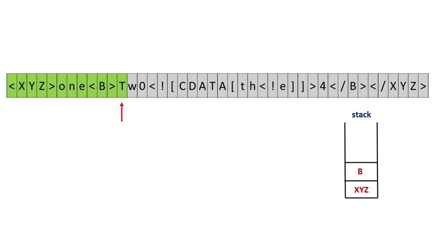
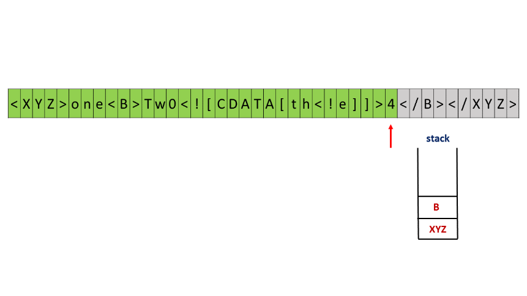
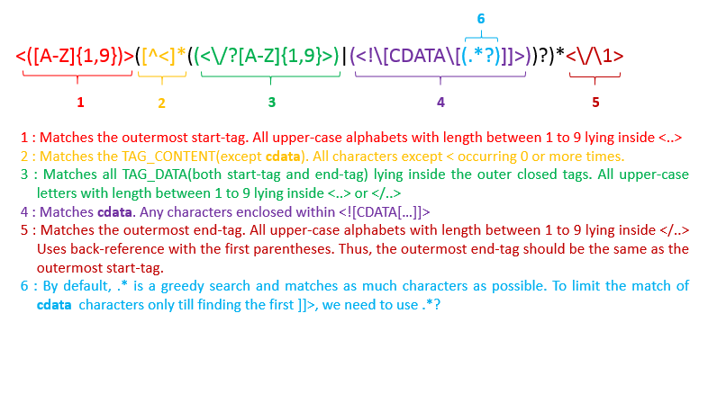

591. Tag Validator

Given a string representing a code snippet, you need to implement a tag validator to parse the code and return whether it is valid. A code snippet is valid if all the following rules hold:

1. The code must be wrapped in a **valid closed tag**. Otherwise, the code is invalid.
1. A **closed tag** (not necessarily valid) has exactly the following format : `<TAG_NAME>TAG_CONTENT</TAG_NAME>`. Among them, `<TAG_NAME>` is the start tag, and `</TAG_NAME>` is the end tag. The TAG_NAME in start and end tags should be the same. A closed tag is **valid** if and only if the TAG_NAME and TAG_CONTENT are valid.
1. A **valid** `TAG_NAME` only contain **upper-case letters**, and has length in range [1,9]. Otherwise, the `TAG_NAME` is **invalid**.
1. A **valid** `TAG_CONTENT` may contain **other valid closed tags**, cdata and any characters (see note1) **EXCEPT** unmatched `<`, unmatched start and end tag, and unmatched or closed tags with invalid `TAG_NAME`. Otherwise, the `TAG_CONTENT` is **invalid**.
1. A start tag is unmatched if no end tag exists with the same `TAG_NAME`, and vice versa. However, you also need to consider the issue of unbalanced when tags are nested.
1. A `<` is unmatched if you cannot find a subsequent `>`. And when you find a `<` or `</`, all the subsequent characters until the next `>` should be parsed as TAG_NAME (not necessarily valid).
1. The cdata has the following format : `<![CDATA[CDATA_CONTENT]]>`. The range of `CDATA_CONTENT` is defined as the characters between `<![CDATA[` and the **first subsequent** `]]>`.
1. `CDATA_CONTENT` may contain **any characters**. The function of cdata is to forbid the validator to parse `CDATA_CONTENT`, so even it has some characters that can be parsed as tag (no matter valid or invalid), you should treat it as **regular characters**.

**Valid Code Examples:**
```
Input: "<DIV>This is the first line <![CDATA[<div>]]></DIV>"

Output: True

Explanation: 

The code is wrapped in a closed tag : <DIV> and </DIV>. 

The TAG_NAME is valid, the TAG_CONTENT consists of some characters and cdata. 

Although CDATA_CONTENT has unmatched start tag with invalid TAG_NAME, it should be considered as plain text, not parsed as tag.

So TAG_CONTENT is valid, and then the code is valid. Thus return true.


Input: "<DIV>>>  ![cdata[]] <![CDATA[<div>]>]]>]]>>]</DIV>"

Output: True

Explanation:

We first separate the code into : start_tag|tag_content|end_tag.

start_tag -> "<DIV>"

end_tag -> "</DIV>"

tag_content could also be separated into : text1|cdata|text2.

text1 -> ">>  ![cdata[]] "

cdata -> "<![CDATA[<div>]>]]>", where the CDATA_CONTENT is "<div>]>"

text2 -> "]]>>]"


The reason why start_tag is NOT "<DIV>>>" is because of the rule 6.
The reason why cdata is NOT "<![CDATA[<div>]>]]>]]>" is because of the rule 7.
```

**Invalid Code Examples:**
```
Input: "<A>  <B> </A>   </B>"
Output: False
Explanation: Unbalanced. If "<A>" is closed, then "<B>" must be unmatched, and vice versa.

Input: "<DIV>  div tag is not closed  <DIV>"
Output: False

Input: "<DIV>  unmatched <  </DIV>"
Output: False

Input: "<DIV> closed tags with invalid tag name  <b>123</b> </DIV>"
Output: False

Input: "<DIV> unmatched tags with invalid tag name  </1234567890> and <CDATA[[]]>  </DIV>"
Output: False

Input: "<DIV>  unmatched start tag <B>  and unmatched end tag </C>  </DIV>"
Output: False
```

**Note:**

* For simplicity, you could assume the input code (including the **any characters** mentioned above) only contain `letters`, `digits`, `'<'`,`'>'`,`'/'`,`'!'`,`'['`,`']'` and `' '`.

# Solution
---
## Approach 1: Stack
Summarizing the given problem, we can say that we need to determine whether a tag is valid or not, by checking the following properties.

1. The code should be wrapped in valid closed tag.

1. The TAG_NAME should be valid.

1. The TAG_CONTENT should be valid.

1. The cdata should be valid.

1. All the tags should be closed. i.e. each start-tag should have a corresponding end-tag and vice-versa and the order of the tags should be correct as well.

In order to check the validity of all these, firstly, we need to identify which parts of the given $code$ string act as which part from the above mentioned categories. To understand how it's done, we'll go through the implementation and the reasoning behind it step by step.

We iterate over the given $code$ string. Whenever a `<` is encountered(unless we are currently inside `<![CDATA[...]]>`), it indicates the beginning of either a `TAG_NAME`(start tag or end tag) or the beginning of cdata as per the conditions given in the problem statement.

If the character immediately following this `<` is an `!`, the characters following this `<` can't be a part of a valid `TAG_NAME`, since only upper-case letters(in case of a start tag) or / followed by upper-case letters(in the case of an end tag). Thus, the choice now narrows down to only **cdata**. Thus, we need to check if the current bunch of characters following `<!`(including it) constitute a valid cdata. For doing this, firstly we find out the first matching `]]>` following the current `<!` to mark the ending of **cdata**. If no such matching `]]>` exists, the $code$ string is considered as invalid. Apart from this, the `<!` should also be immediately followed by `CDATA[` for the **cdata** to be valid. The characters lying inside the `<![CDATA[` and `]]>` do not have any constraints on them.

If the character immediately following the `<` encountered isn't an `!`, this `<` can only mark the beginnning of `TAG_NAME`. Now, since a valid start tag can't contain anything except upper-case letters, if a `/` is found after `<`, the `</` pair indicates the beginning of an end tag. Now, when a `<` refers to the beginning of a `TAG_NAME`(either start-tag or end-tag), we find out the first closing `>` following the `<` to find out the substring(say $s$), that constitutes the `TAG_NAME`. This $s$ should satisfy all the criterion to constitute a valid `TAG_NAME`. Thus, for every such $s$, we check if it contains all upper-case letters and also check its length(It should be between 1 to 9). If any of the criteria isn't fulfilled, ss doesn't constitue a valid `TAG_NAME`. Hence, the codecode string turns out to be invalid as well.

Apart from checking the validity of the `TAG_NAME`, we also need to ensure that the tags always exist in pairs. i.e. for every start-tag, a corresponding end-tag should always exist. Further, we can note that in case of multiple `TAG_NAME`'s, the `TAG_NAME` whose start-tag comes later than the other ones, should have its end-tag appearing before the end-tags of those other `TAG_NAME`'s. i.e. the tag which starts later should end first.

From this, we get the intuition that we can make use of a $stack$ to check the existence of matching start and end-tags. Thus, whenever we find out a valid start-tag, as mentioned above, we push its `TAG_NAME` string onto a $stack$. Now, whenever an end-tag is found, we compare its TAG_NAME with the `TAG_NAME` at the top the $stack$ and remove this element from the $stack$. If the two don't match, this implies that either the current end-tag has no corresponding start-tag or there is a problem with the ordering of the tags. The two need to match for the tag-pair to be valid, since there can't exist an end-tag without a corresponding start-tag and vice-versa. Thus, if a match isn't found, we can conclude that the given $code$ string is invalid.

Now, after the complete $code$ string has been traversed, the $stack$ should be empty if all the start-tags have their corresponding end-tags as well. If the $stack$ isn't empty, this implies that some start-tag doesn't have the corresponding end-tag, violating the closed-tag's validity condition.

Further, we also need to ensure that the given $code$ is completely enclosed within closed tags. For this, we need to ensure that the first **cdata** found is also inside the closed tags. Thus, when we find a possibility of the presence of **cdata**, we proceed further only if we've already found a start tag, indicated by a non-empty stack. Further, to ensure that no data lies after the last end-tag, we need to ensure that the $stack$ doesn't become empty before we reach the end of the given $code$ string, since an empty $stack$ indicates that the last end-tag has been encountered.

The following animation depicts the process.








```java
public class Solution {
    Stack < String > stack = new Stack < > ();
    boolean contains_tag = false;
    public boolean isValidTagName(String s, boolean ending) {
        if (s.length() < 1 || s.length() > 9)
            return false;
        for (int i = 0; i < s.length(); i++) {
            if (!Character.isUpperCase(s.charAt(i)))
                return false;
        }
        if (ending) {
            if (!stack.isEmpty() && stack.peek().equals(s))
                stack.pop();
            else
                return false;
        } else {
            contains_tag = true;
            stack.push(s);
        }
        return true;
    }
    public boolean isValidCdata(String s) {
        return s.indexOf("[CDATA[") == 0;
    }
    public boolean isValid(String code) {
        if (code.charAt(0) != '<' || code.charAt(code.length() - 1) != '>')
            return false;
        for (int i = 0; i < code.length(); i++) {
            boolean ending = false;
            int closeindex;
            if(stack.isEmpty() && contains_tag)
                return false;
            if (code.charAt(i) == '<') {
                if (!stack.isEmpty() && code.charAt(i + 1) == '!') {
                    closeindex = code.indexOf("]]>", i + 1);
                    if (closeindex < 0 || !isValidCdata(code.substring(i + 2, closeindex)))
                        return false;
                } else {
                    if (code.charAt(i + 1) == '/') {
                        i++;
                        ending = true;
                    }
                    closeindex = code.indexOf('>', i + 1);
                    if (closeindex < 0 || !isValidTagName(code.substring(i + 1, closeindex), ending))
                        return false;
                }
                i = closeindex;
            }
        }
        return stack.isEmpty() && contains_tag;
    }
}
```

**Complexity Analysis**

* Time complexity : $O(n)$. We traverse over the given codecode string of length $n$.

* Space complexity : $O(n)$. The stack can grow upto a size of $n/3$ in the worst case. e.g. In case of `<A><B><C><D>`, $n$=12 and number of tags = 12/3 = 4.


## Approach 2: Regex
Instead of manually checking the given codecode string for checking the validity of TAG_NAME, TAG_CONTENT and cdata, we can make use of an inbuilt java fuunctionality known as regular expressions.

A regular expression is a special sequence of characters that helps you match or find other strings or sets of strings, using a specialized syntax held in a pattern. They can be used to search, edit, or manipulate text and data. The most common quantifiers used in regular expressions are listed below. A quantifier after a token (such as a character) or group specifies how often that preceding element is allowed to occur.

`?` The question mark indicates zero or one occurrences of the preceding element. For example, colou?r matches both "color" and "colour".

`*` The asterisk indicates zero or more occurrences of the preceding element. For example, ab*c matches "ac", "abc", "abbc", "abbbc", and so on.

`+` The plus sign indicates one or more occurrences of the preceding element. For example, ab+c matches "abc", "abbc", "abbbc", and so on, but not "ac".

`{n}` The preceding item is matched exactly n times.

`{min,}` The preceding item is matched min or more times.

`{min,max}` The preceding item is matched at least min times, but not more than max times.

`|` A vertical bar separates alternatives. For example, gray|grey can match "gray" or "grey".

`()` Parentheses are used to define the scope and precedence of the operators (among other uses). For example, gray|grey and gr(a|e)y are equivalent patterns which both describe the set of "gray" or "grey".

`[...]` Matches any single character in brackets.

`[^...]` Matches any single character not in brackets.

Thus, by making use of regex, we can directly check the validity of the codecode string directly(except the nesting of the inner tags) by using the regex expression below:
```
<([A-Z]{1,9})>([^<]*((<\/?[A-Z]{1,9}>)|(<!\[CDATA\[(.*?)]]>))?[^<]*)*<\/>
```
The image below shows the portion of the string that each part of the expression helps to match:



But, if we make use of back-referencing as mentioned above, the matching process takes a very large amount of CPU time. Thus, we use the regex only to check the validity of the `TAG_CONTENT`, `TAG_NAME` and the **cdata**. We check the presence of the outermost closed tags by making use of a stackstack as done in the last approach.

The rest of the process remains the same as in the last approach, except that we need not manually check the validity of `TAG_CONTENT`, `TAG_NAME` and the **cdata**, since it is already done by the regex expression. We only need to check the presence of inner closed tags.

Check this link for testing any regular expression on a sample text.

```java
import java.util.regex.*;
public class Solution {
    Stack < String > stack = new Stack < > ();
    boolean contains_tag = false;
    public boolean isValidTagName(String s, boolean ending) {
        if (ending) {
            if (!stack.isEmpty() && stack.peek().equals(s))
                stack.pop();
            else
                return false;
        } else {
            contains_tag = true;
            stack.push(s);
        }
        return true;
    }
    public boolean isValid(String code) {
        String regex = "<[A-Z]{0,9}>([^<]*(<((\\/?[A-Z]{1,9}>)|(!\\[CDATA\\[(.*?)]]>)))?)*";
        if (!Pattern.matches(regex, code))
            return false;
        for (int i = 0; i < code.length(); i++) {
            boolean ending = false;
            if (stack.isEmpty() && contains_tag)
                return false;
            if (code.charAt(i) == '<') {
                if (code.charAt(i + 1) == '!') {
                    i = code.indexOf("]]>", i + 1);
                    continue;
                }
                if (code.charAt(i + 1) == '/') {
                    i++;
                    ending = true;
                }
                int closeindex = code.indexOf('>', i + 1);
                if (closeindex < 0 || !isValidTagName(code.substring(i + 1, closeindex), ending))
                    return false;
                i = closeindex;
            }
        }
        return stack.isEmpty();
    }
}
```

**Complexity Analysis**

* Time complexity : Regular Expressions are/can be implemented in the form of Finite State Machines. Thus, the time complexity is dependent on the internal representation. In case of any suggestions, please comment below.

* Space complexity : $O(n)$. The stack can grow upto a size of $n/3$ in the worst case. e.g. In case of `<A><B><C><D>`, nn=12 and number of tags = 12/3 = 4.

# Submissions
---
**Solution 1: (Stack)**
```
Runtime: 28 ms
Memory Usage: 13.6 MB
```
```python
class Solution:
    def isValid(self, code: str) -> bool:
        if code[0] != '<' or code[-1] != '>': return False
        i, n = 0, len(code)
        stk = []
        while i < n:
            if code[i] == '<':
                if i != 0 and code[i: i + 9] == '<![CDATA[':
                    if not stk: return False
                    j = i + 9
                    while j + 3 <= n and code[j: j + 3] != ']]>': j += 1
                    if code[j: j + 3] == ']]>': i = j + 3
                    else: return False
                else:
                    start = i
                    isend = False
                    i += 1
                    if i >= n: return False
                    if code[i] == r'/':
                        isend = True
                        i += 1
                    if i >= n: return False
                    tag = ''
                    while i < n and code[i] != '>':
                        if not code[i].isupper(): return False
                        tag += code[i]
                        i += 1
                    if i >= n or len(tag) == 0 or len(tag) > 9: return False
                    if isend:
                        if not stk or stk[-1] != tag: return False
                        stk.pop(-1)
                    else:
                        if start != 0 and not stk: return False
                        stk.append(tag)
                    i += 1
            else:
                if not stk: return False
                while i < n and code[i] != '<': i += 1
        return not stk
```

**Solution 2: (Regex)**
```
Runtime: 32 ms
Memory Usage: 13.9 MB
```
```python
class Solution:
    def isValid(self, code: str) -> bool:
        tokens = re.compile(r"(?P<tag_open><[A-Z_]{1,9}>)|"
                            r"(?P<tag_close></[A-Z_]{1,9}>)|"
                            r"(?P<cdata_open><!\[CDATA\[)|"
                            r"(?P<cdata_close>\]\]>)|"
                            r"(?P<unknown>.)")
        
        tags, cdata_open, eol = [], False, False
        
        for match in re.finditer(tokens, code):
            if eol:
                return False
            
            if cdata_open:
                if match.group('cdata_close'):
                    cdata_open = False
            elif match.group('tag_open'):
                tags.append(match.group('tag_open'))
            elif match.group('tag_close'):
                if not tags or tags.pop()[1:] != match.group('tag_close')[2:]:
                    return False
            elif match.group('cdata_open'):
                cdata_open = True
            elif match.group('unknown') == '<':
                return False
            
            eol = not tags
            
        return eol
```

**Solution 3: (String)**
```
Runtime: 3 ms, Beats 16.08%
Memory: 11.46 MB, Beats 6.29%
```
```c++
class Solution {
    bool validTag(string s, int& i) {
        int j = i;
        string tag = parseTagName(s, j);
        if (tag.empty()) return false;
        if (!validContent(s, j)) return false;
        int k = j + tag.size() + 2; // expecting j = pos of "</" , k = pos of '>'
        if (k >= s.size() || s.substr(j, k + 1 - j) != "</" + tag + ">") return false;
        i = k + 1;
        return true;
    }

    string parseTagName(string s, int& i) {
        if (s[i] != '<') return "";
        int j = s.find('>', i);
        if (j == string::npos || j - 1 - i < 1 || 9 < j - 1 - i) return "";
        string tag = s.substr(i + 1, j - 1 - i);
        for (char ch : tag) {
            if (ch < 'A' || 'Z' < ch) return "";
        }
        i = j + 1;
        return tag;
    }

    bool validContent(string s, int& i) {
        int j = i;
        while (j < s.size()) {
            if (!validText(s, j) && !validCData(s, j) && !validTag(s, j)) break;
        }
        i = j;
        return true;
    }

    bool validText(string s, int& i) {
        int j = i;
        while (i < s.size() && s[i] != '<') { i++; }
        return i != j;
    }

    bool validCData(string s, int& i) {
        if (s.find("<![CDATA[", i) != i) return false;
        int j = s.find("]]>", i);
        if (j == string::npos) return false;
        i = j + 3;
        return true;
    }
public:
    bool isValid(string code) {
        int i = 0;
        return validTag(code, i) && i == code.size();
    }
};
```
