600. Non-negative Integers without Consecutive Ones

Given a positive integer n, find the number of non-negative integers less than or equal to n, whose binary representations do NOT contain **consecutive ones**.

**Example 1:**
```
Input: 5
Output: 5
Explanation: 
Here are the non-negative integers <= 5 with their corresponding binary representations:
0 : 0
1 : 1
2 : 10
3 : 11
4 : 100
5 : 101
Among them, only integer 3 disobeys the rule (two consecutive ones) and the other 5 satisfy the rule. 
```

# Solution
---
## Approach #1 Brute Force [Time Limit Exceeded]
The brute force approach is simple. We can traverse through all the numbers from $1$ to $num$. For every current number chosen, we can check all the consecutive positions in this number to check if the number contains two consecutive ones or not. If not, we increment the $count$ of the resultant numbers with no consecutive ones.

To check if a $1$ exists at the position $x$(counting from the LSB side), in the current number $n$, we can proceed as follows. We can shift a binary $1$ $x-1$ times towards the left to get a number $y$ which has a $1$ only at the $x^{th}$ position. Now, logical ANDing of $n$ and $y$ will result in a logical $1$ output only if nn contains $1$ at the $x^{th}$ position.

```java
public class Solution {
    public int findIntegers(int num) {
        int count = 0;
        for (int i = 0; i <= num; i++)
            if (check(i))
                count++;
        return count;
    }
    public boolean check(int n) {
        int i = 31;
        while (i > 0) {
            if ((n & (1 << i)) != 0 && (n & (1 << (i - 1))) != 0)
                return false;
            i--;
        }
        return true;
    }
}
```

**Complexity Analysis**

* Time complexity : $O(32*n)$. We test the 32 consecutive positions of every number from $0$ to $n$. Here, $n$ refers to given number.

* Space complexity : $O(1)$. Constant space is used.

## Approach #2 Better Brute Force [Time Limit Exceeded]
Algorithm

In the last approach, we generated every number and then checked if it contains consecutive ones at any position or not. Instead of this, we can generate only the required kind of numbers. e.g. If we genearte numbers in the order of the number of bits in the current number, if we get a binary number `110` on the way at the step of 3-bit number generation. Now, since this number already contains two consecutive ones, it is useless to generate number with more number of bits with the current bitstream as the suffix(e.g. numbers of the form `1110` and `0110`).

The current approach is based on the above idea. We can start with the LSB position, by placing a `0` and a `1` at the LSB. These two initial numbers correspond to the 1-bit numbers which don't contain any consecutive ones. Now, taking `0` as the initial suffix, if we want to generate two bit numbers with no two consecutive 1's, we can append a `1` and a `0` both in front of the initial 0 generating the numbers `10` and `00` as the two bit numbers ending with a `0` with no two consecutive 1's.

But, when we take `1` as the initial suffix, we can append a `0` to it to generate `01` which doesn't contain any consecutive ones. But, adding a `1` won't satisfy this criteria(11 will be generated). Thus, while generating the current number, we need to keep a track of the point that whether a `1` was added as the last prefix or not. If yes, we can't append a new `1` and only `0` can be appended. If a `0` was appended as the last prefix, both `0` and `1` can be appended in the new bit-pattern without creating a violating number. Thus, we can continue forward with the 3-bit number generation only with `00`, `01` and `10` as the new suffixes in the same manner.

To get a count of numbers lesser than numnum, with no two consecutive 1's, based on the above discussion, we make use of a recursive function `find(i, sum, num, prev)`. This function returns the count of binary numbers with $i$ bits with no two consecutive 1's. Here, $sum$ refers to the binary number generated till now(the prefix obtained as the input). $num$ refers to the given number. $prev$ is a boolean variable that indicates whether the last prefix added was a `1` or a `0`.

If the last prefix was a `0`, we can add both `1` and `0` as the new prefix. Thus, we need to make a function call `find(i + 1, sum, num, false) + find(i + 1, sum + (1 << i), num, true)`. Here, the first sub-part refers to a `0` being added at the $i^{th}$ position. Thus, we pass a `false` as the prefix in this case. The second sub-part refers to a `1` being added at the $i^{th}$ position. Thus, we pass `true` as the prefix in this case.

If the last prefix was a `1`, we can add only a `0` as the new prefix. Thus, only one function call `find(i + 1, sum, num, false)` is made in this case.

Further, we need to stop the number generation whenver the current input number($sum$) exceeds the given number $num$.

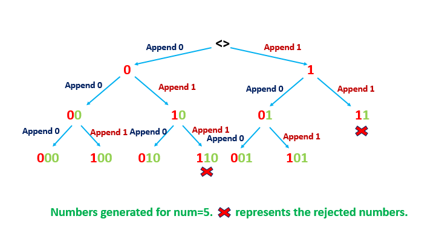

```java
public class Solution {
    public int findIntegers(int num) {
        return find(0, 0, num, false);
    }
    public int find(int i, int sum, int num, boolean prev) {
        if (sum > num)
            return 0;
        if (1<<i > num)
            return 1;
        if (prev)
            return find(i + 1, sum, num, false);
        return find(i + 1, sum, num, false) + find(i + 1, sum + (1 << i), num, true);
    }
}
```

**Complexity Analysis**

* Time complexity : $O(x)$. Only $x$ numbers are generated. Here, $x$ refers to the resultant count to be returned.

* Space complexity : $O(log(max\_int)=32)$. The depth of recursion tree can go upto $32$.

## Approach #3 Using Bit Manipulation [Accepted]
**Algorithm**

Before we discuss the idea behind this approach, we consider another simple idea that will be used in the current approach.

Suppose, we need to find the count of binary numbers with nn bits such that these numbers don't contain consecutive 1's. In order to do so, we can look at the problem in a recursive fashion. Suppose $f[i]$ gives the count of such binary numbers with $i$ bits. In order to determine the value of $f[n]$, which is the requirement, we can consider the cases shown below:

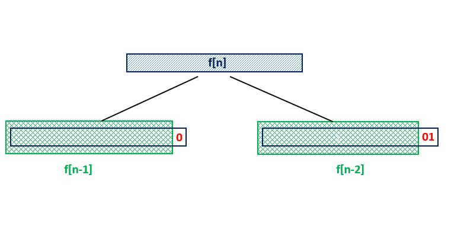

From the above figure, we can see that if we know the value of $f[n-1]$ and $f[n-2]$, in order to generate the required binary numbers with $n$ bits, we can append a `0` to all the binary numbers contained in $f[n-1]$ without creating an invalid number. These numbers give a factor of $f[n-1]$ to be included in $f[n]$. But, we can't append a `1` to all these numbers, since it could lead to the presence of two consecutive ones in the newly generated numbers. Thus, for the currently generated numbers to end with a `1`, we need to ensure that the second last position is always `0`. Thus, we need to fix a `01` at the end of all the numbers contained in $f[n-2]$. This gives a factor of $f[n-2]$ to be included in $f[n]$. Thus, in total, we get $f[n] = f[n-1] + f[n-2]$.

Now, let's look into the current approach. We'll try to understand the idea behind the approach by taking two simple examples. Firstly, we look at the case where the given number doesn't contain any consecutive 1's.Say, $num = \text{1010100}$(7 bit number). Now, we'll see how we can find the numbers lesser than $num$ with no two consecutive 1's. We start off with the MSB of $nums$. If we fix a $\text{0}$ at the MSB position, and find out the count of 6 bit numbers(corresponding to the 6 LSBs) with no two consecutive 1's, these 6-bit numbers will lie in the range $\textbf{0}\text{000000} -> \textbf{0}\text{111111}$. For finding this count we can make use of $f[6]$ which we'll have already calculated based on the discussion above.

But, even after doing this, all the numbers in the required range haven't been covered yet. Now, if we try to fix $\text{1}$ at the MSB, the numbers considered will lie in the range $\textbf{1}\text{000000} -> \textbf{1}\text{111111}$. As we can see, this covers the numbers in the range $\textbf{1}\text{000000} -> \textbf{1}\text{010100}$, but it covers the numbers in the range beyond limit as well. Thus, we can't fix $\text{1}$ at the MSB and consider all the 6-bit numbers at the LSBs.

For covering the pending range, we fix $\text{1}$ at the MSB, and move forward to proceed with the second digit(counting from MSB). Now, since we've already got a $\text{0}$ at this position, we can't substitute a $\text{1}$ here, since doing so will lead to generation of numbers exceeding $num$. Thus, the only option left here is to substitute a $\text{0}$ at the second position. But, if we do so, and consider the 5-bit numbers(at the 5 LSBs) with no two consecutive 1's, these new numbers will fall in the range $\textbf{10}\text{00000} -> \textbf{10}\text{11111}$. But, again we can observe that considering these numbers leads to exceeding the required range. Thus, we can't consider all the 5-bit numbers for the required count by fixing $\text{0}$ at the second position.

Thus, now, we fix $\text{0}$ at the second position and proceed further. Again, we encounter a $\text{1}$ at the third position. Thus, as discussed above, we can fix a $\text{0}$ at this position and find out the count of 4-bit consecutive numbers with no two consecutive 1's(by varying only the 4 LSB bits). We can obtain this value from $f[4]$. Thus, now the numbers in the range $\textbf{100}\text{0000} -> \textbf{100}\text{1111}$ have been covered up.

Again, as discussed above, now we fix a $\text{1}$ at the third position, and proceed with the fourth bit. It is a $\text{0}$. So, we need to fix it as such as per the above discussion, and proceed with the fifth bit. It is a $\text{1}$. So, we fix a $\text{0}$ here and consider all the numbers by varying the two LSBs for finding the required count of numbers in the range $\textbf{10101}\text{00} -> \textbf{10101}\text{11}$. Now, we proceed to the sixth bit, find a $\text{0}$ there. So, we fix \text{0}0 at the sixth position and proceed to the seventh bit which is again \text{0}0. So, we fix a $\text{0}$ at the seventh position as well.

Now, we can see, that based on the above procedure, the numbers in the range $\textbf{1}\text{000000} -> \textbf{1}\text{111111}$, $\textbf{100}\text{0000} -> \textbf{100}\text{1111}$, $\textbf{100}\text{0000} -> \textbf{100}\text{1111}$ have been considered and the counts for these ranges have been obtained as $f[6]$, $f[4]$ and $f[2]$ respectively. Now, only $\text{1010100}$ is pending to be considered in the required count. Since, it doesn't contain any consecutive 1's, we add a 1 to the total count obtained till now to consider this number. Thus, the result returned is $f[6] + f[4] + f[2] + 1$.

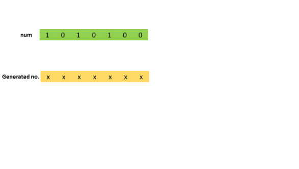


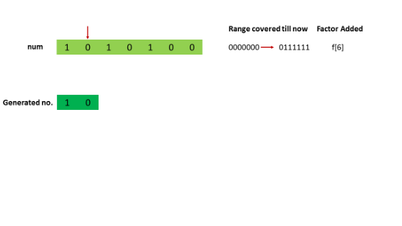
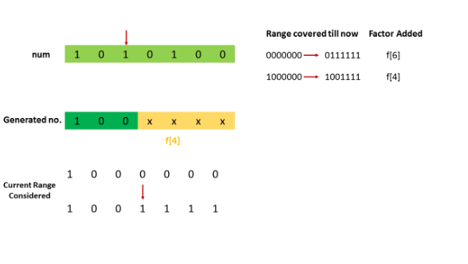

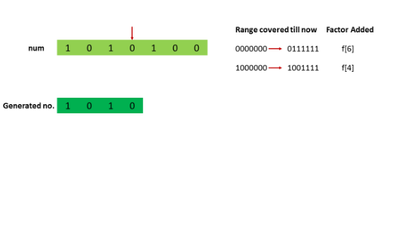
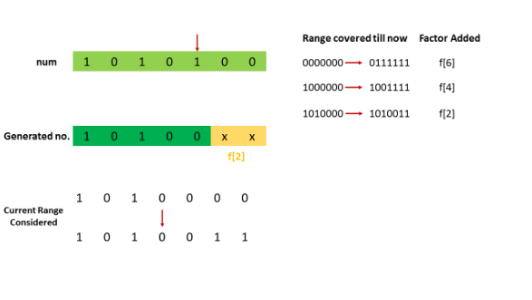
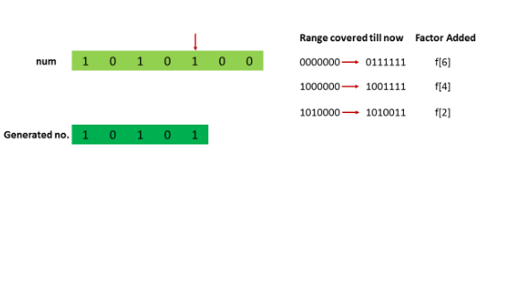

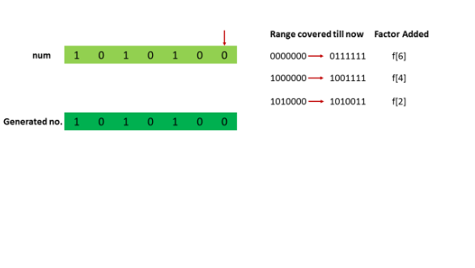
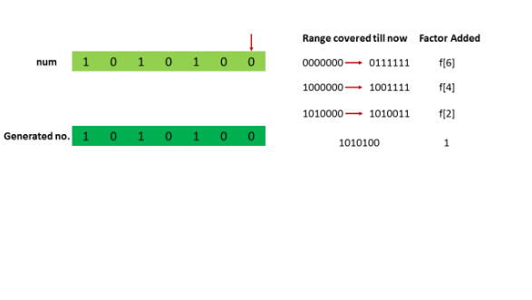

Now, we look at the case, where $num$ contains some consecutive 1's. The idea will be the same as the last example, with the only exception taken when the two consecutive 1's are encountered. Let's say, $num = \text{1011010}$ bit number). Now, as per the last discussion, we start with the MSB. We find a $\text{1}$ at this position. Thus, we initially fix a $\text{0}$ at this position to consider the numbers in the range $\textbf{0}\text{000000} -> \textbf{0}\text{111111}$, by varying the `6` LSB bits only. The count of the required numbers in this range is again given by $f[6]$.

Now, we fix a $\text{1}$ at the MSB and move on to the second bit. It is a $\text{0}$, so we have no choice but to fix $\text{0}$ at this position and to proceed with the third bit. It is a $\text{1}$, so we fix a $\text{0}$ here, considering the numbers in the range $\textbf{100}\text{0000} -> \textbf{100}\text{1111}$. This accounts for a factor of $f[4]$. Now, we fix a $\text{1}$ at the third positon, and proceed with the fourth bit. It is a $\text{1}$(consecutive to the previous $\text{1}$). Now, initially we fix a $\text{0}$ at the fourth position, considering the numbers in the range $\textbf{1010}\text{000} -> \textbf{1010}\text{111}$. This adds a factor of $f[3]$ to the required count.

Now, we can see that till now the numbers in the range $\textbf{0}\text{000000} -> \textbf{0}\text{111111}$, $\textbf{100}\text{0000} -> \textbf{100}\text{1111}$, $\textbf{1010}\text{000} -> \textbf{1010}\text{111}$ have been considered. But, if we try to consider any number larger than $\text{1010111}$, it leads to the presence of two consecutive 1's in the new number at the third and fourth position. Thus, all the valid numbers upto $num$ have been considered with this, giving a resultant count of $f[6] + f[4] + f[3]$.


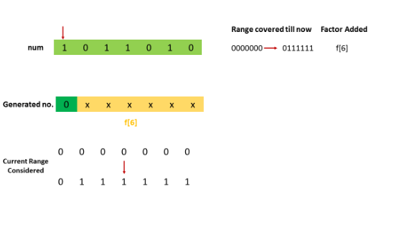
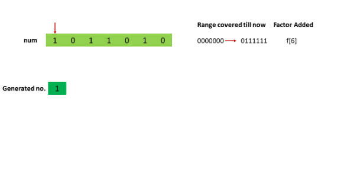

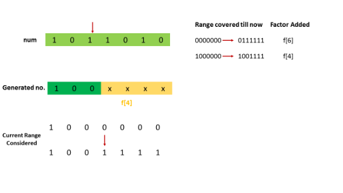
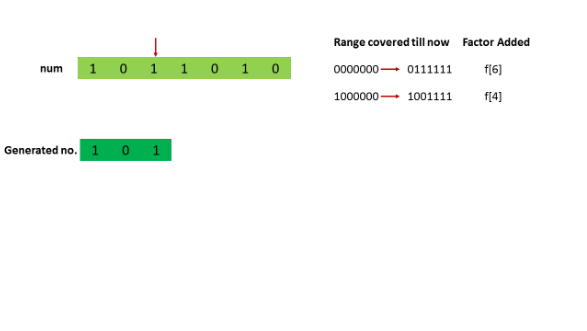
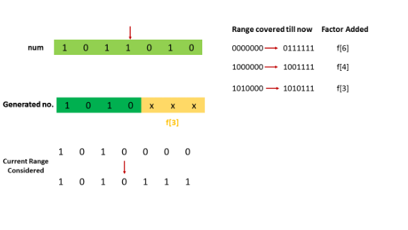


Thus, summarizing the above discussion, we can say that we start scanning the given number $num$ from its MSB. For every `1` encountered at the $i^{th}$ bit position(counting from `0` from LSB), we add a factor of $f[i]$ to the resultant count. For every `0` encountered, we don't add any factor. We also keep a track of the last bit checked. If we happen to find two consecutive 1's at any time, we add the factors for the positions of both the 1's and stop the traversal immediately. If we don't find any two consecutive 1's, we proceed till reaching the LSB and add an extra 1 to account for the given number $num$ as well, since the procedure discussed above considers numbers upto $num$ without including itself.

```java
public class Solution {
    public int findIntegers(int num) {
        int[] f = new int[32];
        f[0] = 1;
        f[1] = 2;
        for (int i = 2; i < f.length; i++)
            f[i] = f[i - 1] + f[i - 2];
        int i = 30, sum = 0, prev_bit = 0;
        while (i >= 0) {
            if ((num & (1 << i)) != 0) {
                sum += f[i];
                if (prev_bit == 1) {
                    sum--;
                    break;
                }
                prev_bit = 1;
            } else
                prev_bit = 0;
            i--;
        }
        return sum + 1;
    }
}
```

**Complexity Analysis**
* Time complexity : $O(log_2(max\_int)=32)$. One loop to fill ff array and one loop to check all bits of $num$.

* Space complexity : $O(log_2(max\_int)=32)$. $f$ array of size 32 is used.

# Submissions
---
**Solution 1: (Better Brute Force, Time Limit Exceeded)**
```python
class Solution:
    def findIntegers(self, num: int) -> int:
        
        def find(i, sum_, prev):
            if sum_ > num:
                return 0
            if 1<<i > num:
                return 1;
            if prev:
                return find(i + 1, sum_, False)
            return find(i + 1, sum_, False) + find(i + 1, sum_ + (1 << i), True)
        
        return find(0, 0, False)
```

**Solution 2: (Using Bit Manipulation)**
```
Runtime: 24 ms
Memory Usage: 13.6 MB
```
```python
class Solution:
    def findIntegers(self, num: int) -> int:
        f = [0]*32
        f[0] = 1
        f[1] = 2
        for i in range(2, len(f)):
            f[i] = f[i - 1] + f[i - 2];
        i, sum_, prev_bit = 30, 0, 0
        while i >= 0:
            if (num & (1 << i)) != 0:
                sum_ += f[i];
                if prev_bit == 1:
                    sum_ -= 1
                    break
                prev_bit = 1
            else:
                prev_bit = 0
            i -= 1

        return sum_ + 1
```

**Solution 3: (DP Bottom-Up)**

Thanks to votrubac's explanation. Here is my understanding:

dp(i) represents result of "i" bits number: "1000...". It means the count of all valid numbers smaller than this "100...", including those starting with "0".  
We can divide this into two sub-problems:
* Results with first bit being "1", can be represented by dp(i-2)
* Results with first bit being "0", can be represented by dp(i-1)

"first" here means the "i"th bit from left to right

So we have:  
dp(i)=dp(i-1)+dp(i-2)  
This is a fibonacci number.

However, this only gives us result of 2^n number. How to find result smaller than any "num"?
* If the "num" starts with "11", then dp(n) is its result.
* If "num" starts with "10", then dp(n-1)+next is its result, where "next" is the result of next sub num starting with "1".

```
Runtime: 28 ms
Memory Usage: 13.6 MB
```
```python
class Solution:
    def findIntegers(self, num: int) -> int:
        num = bin(num+1)[2:]
        n = len(num)
        fibo = [1, 2]
        for _ in range(n-1):
            fibo.append(fibo[-1] + fibo[-2])
        res = 0
        for i in range(n):
            v = num[i:i+2]
            if v == '11':
                res += fibo[n-i]
                break
            elif v == '10':
                res += fibo[n-i-1]
            elif v == '1':
                res += 1
        return res
```

**Solution 4: (DP Top-Down)**
```
Runtime: 60 ms
Memory Usage: 14.3 MB
```
```python
class Solution:
    def findIntegers(self, num: int) -> int:
        
        @lru_cache(None)
        def dfs(num, prev):
            if not num or num == "0":
                return 1
            a = str(int(num))
            if a != num:
                # "000xxx" -> "xxx"
                return dfs(a, 0)
            if not prev:
                # fist num can take 1 or 0
                return dfs(num[1:], 1) + dfs("1" * (len(num)-1), 0)
            else:
                # fist num can take only 0 since previous num is 1
                return dfs("1" * (len(num) - 1), 0)
            
        return dfs(bin(num)[2:], 0)
```