629. K Inverse Pairs Array

Given two integers `n` and `k`, find how many different arrays consist of numbers from `1` to `n` such that there are exactly `k` inverse pairs.

We define an inverse pair as following: For `i`th and `j`th element in the array, if `i < j` and `a[i] > a[j]` then it's an inverse pair; Otherwise, it's not.

Since the answer may be very large, the answer should be modulo 10^9 + 7.

**Example 1:**
```
Input: n = 3, k = 0
Output: 1
Explanation: 
Only the array [1,2,3] which consists of numbers from 1 to 3 has exactly 0 inverse pair.
```

**Example 2:**
```
Input: n = 3, k = 1
Output: 2
Explanation: 
The array [1,3,2] and [2,1,3] have exactly 1 inverse pair.
```

**Note:**

* The integer `n` is in the range `[1, 1000]` and `k` is in the range `[0, 1000]`.

# Solution
---
## Approach 1: Brute Force
The most naive solution is to generate every permutation of the array consisting of numbers from $1$ to $n$. Then, we can find out the number of inverse pairs in every array to determine if it is equal to 1. We can find out the count of permutations with the required number of inverse pairs. But, this solution is very terrible in terms of time complexity. Thus, we move on to the better approaches directly.

**Complexity Analysis**

* Time complexity : $O\big(n! \cdot n \log n\big)$. A total of n!n! permutations will be generated. We need $O\big(n \log n\big)$ time to find the number of inverse pairs in every such permutation, by making use of merge sort. Here, $n$ refers to the given integer $n$.

* Space complexity : $O(n)$. Each array generated during the permutations will require $n$ space.

## Approach 2: Using Recursion with Memoization
Before we discuss the solution, let's look at the idea behind it. Let's say, $n$ represents the given number defining the upper limit of the elements in the arrays being considered and $k$ represents the number of inverse pairs in the current array.

Let's start with a simple example with $n=4$, no $k$ is defined right now. Now, for $k=0$, the only possible arrangement for the given array $a_0$ will be `[1,2,3,4]`, since all the greater elements lie after the smaller elements. Now, in order to generate an arrangement with any arbitrary $k$ value, we need to shift, an arbitrary number of elements(let's say $x$ elements) in the array $a_0$ towards the left, with each displacement(shift) being $s_1, s_2, ...., s_x$, such that the sum of these shifts equals $k$.

To see what we mean by the above statement, let's look at the case for `[1,2,4,3]`. The number of inverse pairs in this array is `1`. This array is obtained by shifting the number `4` by one position towards the left.

Similarly, consider the case for `[2,4,1,3]`. This array can be obtained from $a_0$ by shifting `2` by one position towards the left first and then shifting `4` by 2 positions towards the left. Thus, the total number of displacements is `3`, which is equal to the number of inverse pairs in the new array.

This rule of displacements holds `true` because, whenever a number is shifted $y$ times towards the left starting from the array $a_0$, after the shift, $y$ numbers smaller than it lie towards its right, giving a total of $y$ inverse pairs.

Now, let's say, we start with the one of the arrangements $a_3$ `[2,4,1,3]`, with $k=3$. Now, if we want to add a new number `5` to this array to consider an array with $n=5$, let's say, initially, we append it to the end of $a_3$. Now, the new array will be `[2,4,1,3,5]`. Since, the largest number is added at the end, the new number `5` doesn't add any new inverse pair to the total set of inverse pairs relative to the ones in $a_3$(3).

Now, all the numbers in $a_3$ are smaller than `5`. Thus, if we add `5` at a position $y$ steps from the right, $y$ smaller numbers will lie towards its right. Thus, a total of $y$ inverse pairs will exist with `5` being one of the elements in these pairs.

Thus, adding `5` at $y$ steps from the right adds a total of $y$ inverse pairs to the total set of inverse pairs in $a_3$ giving a total of $3+y$ inverse pairs now.

Looking at the same statement from another point of view, we can say that, if we know the number of inverse pairs(say $x$) in any arbitrary array $b$ with some $n$, we can add a new element $n+1$ to this array $b$ at a position $p$ steps from the right, such that $x+p=k$ to generate an array with a total of $k$ inverse pairs.

Extending this idea further, suppose we know the number of arrangements of an array with $n-1$ elements, with the number of inverse pairs being $0, 1, 2,..., k$, let's say being equal to $count_0, count_1, count_2,.., count_k$. Now, we can determine the number of arrangements of an array with $n$ elements with exactly $k$ inverse pairs easily.

To generate the arrangements with exactly $k$ inverse pairs and $n$ elements, we can add the new number $n$ to all the arrangements with $k$ inverse pairs at the last position. For the arrangements with $k-1$ inverse pairs , we can add $n$ at a position 1 step from the right.

Similarly, for an element with $k-i$ number of inverse pairs, we can add this new number $n$ at a position $i$ steps from the right. Each of these updations to the arrays leads to a new arrangement, each with the number of inverse pairs being equal to $k$.

The following image shows an example of how this is done for n=5 and k=4:

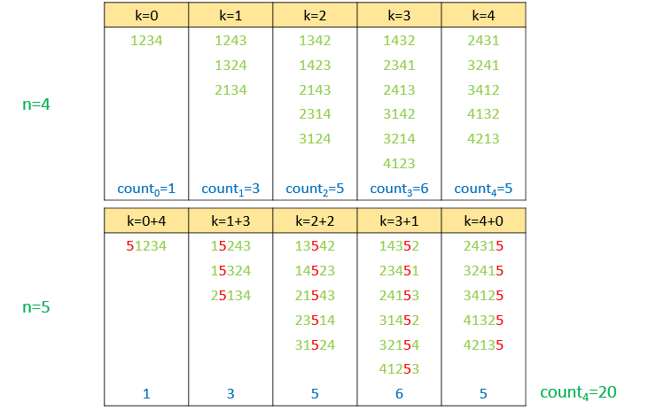

Thus, to obtain the number of arrangements with exactly $k$ inverse pairs and $n$ numbers will be given by $count_0 + count_1 + ... + count_k$.

From the above discussion, we can obtain the recursive formula for finding the number of arrangements with exactly $k$ inverse pairs as follows. Let's say $count(i,j)$ represents the number of arrangements with $i$ elements and exactly $j$ inverse pairs.

1. If $n=0$, no inverse pairs exist. Thus, $count(0,k)=0$.

1. If $k=0$, only one arrangement is possible, which is all numbers sorted in ascending order. Thus, $count(n,0)=1$.

1. Otherwise, $count(n,k) = \sum_{i=0}^{min(k,n-1)} count(n-1, k-i)$.

Note that the upper limit on the summation is $\text{min}(k,n-1)$ This is because for $i>k$, $k-i<0$. No arrangement exists with negative number of inverse pairs. The reason for the other factor can be seen as follows.

To generate a new arrangement adding $k-i$ new inverse pairs after adding the $n^{th}$ number, we need to add this number at the $i^{th}$ position from the right. For an array with size $n$, only $n-1$ maximum shifts are possible.

We need to take the modulus at every step to keep the answer within integral limits.

We can see that a lot of duplicate function calls are made in the normal recursive solution. We can remove this redundancy by making use of a memoization array which stores the result for any function call `kInversePairs(i,j)` in $memo[i][j]$. Thus, whenver a duplicate function call is made again, we can return the result directly from this memoization array. This prunes the search space to a great extent.

```java
public class Solution {
    Integer[][] memo = new Integer[1001][1001];
    public int kInversePairs(int n, int k) {
        if (n == 0)
            return 0;
        if (k == 0)
            return 1;
        if (memo[n][k] != null)
            return memo[n][k];
        int inv = 0;
        for (int i = 0; i <= Math.min(k, n - 1); i++)
            inv = (inv + kInversePairs(n - 1, k - i)) % 1000000007;
        memo[n][k] = inv;
        return inv;
    }
}
```

**Complexity Analysis**

* Time complexity : $O(n^2*k)$. The function `kInversePairs` is called $n^2$ times to fill the $memo$ array of size $n$x$k$. Each function call itself takes $O(n)$ time.

* Space complexity : $O(n)$. $memo$ array of constant size $1001$x$1001$ is used. The depth of recursion tree can go upto $n$.

## Approach 3: Dynamic Programming
**Algorithm**

As we've seen in the discussion above, the solution for if we know the solutions for $count(n-1,0)$, $count(n-1, 1)$..., $count(n-1,k)$, we can directly obtain the solution for $count(n,k)$ as $count(n,k)=\sum_{0}^{min(k,n-1)} count(n-1, k-i)$.

From this, we deduce that we can make use of Dynamic Programming to solve the given problem. To solve the given problem, we make use of a 2-D $dp$, where $dp[i][j]$ is used to store the number of arrangements with $i$ elements and exactly $j$ inverse pairs. Based on the discussions above, the $dp$ updation equations become:

1. If $n=0$, no inverse pairs exist. Thus, $dp[0][k]=0$.

1. If $k=0$, only one arrangement is possible, which is all numbers sorted in ascending order. Thus, $dp[n][0]=1$.

1. Otherwise, $dp[i,j] = \sum_{p=0}^{min(j,i-1)} count(i-1, j-p)$.

Again, the limit $\text{min}(j, i-1)$ is used to account for the cases where the number of inverse pairs needed becomes negative($p>j$) or the case where the new inverse pairs needed by adding the $n^{th}$ number is more than $n-1$ which isn't possible, since the new number can be added at $(n-1)^{th}$ position at most from the right.

We start filling the $dp$ in a row-wise order starting from the first row. At the end, the value of $dp[n][k]$ gives the required result.

The following animation shows how the $dp$ is filled for n=4 and k=5:

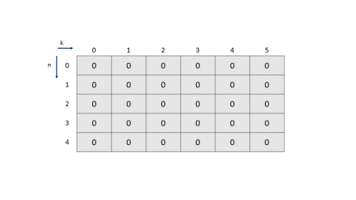
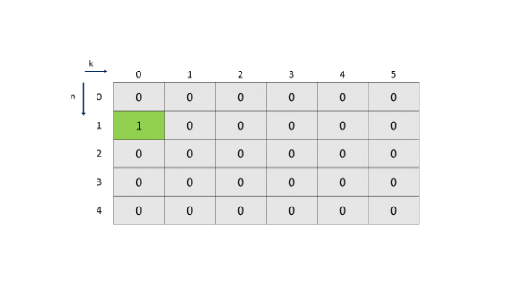
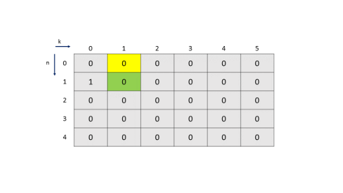
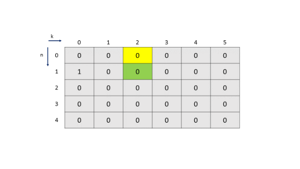
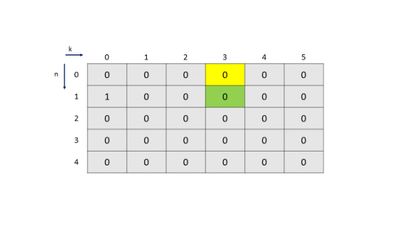
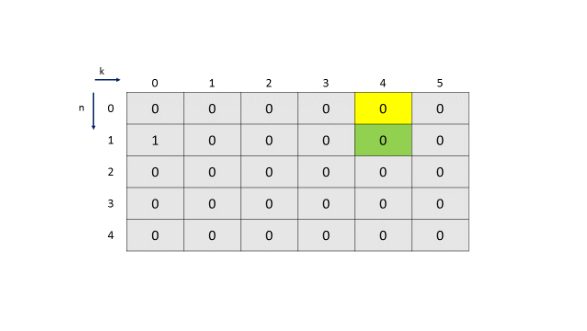
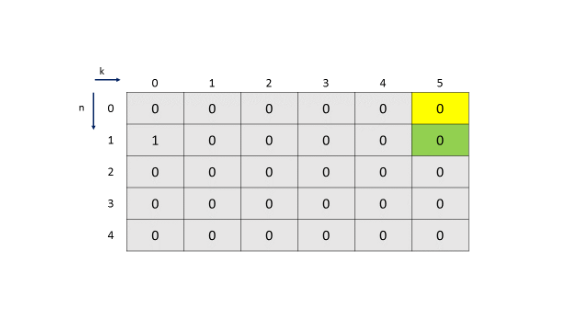
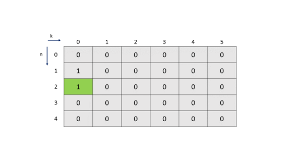
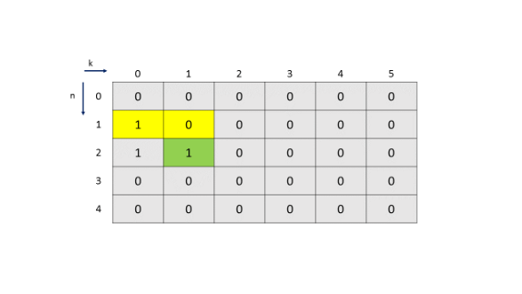
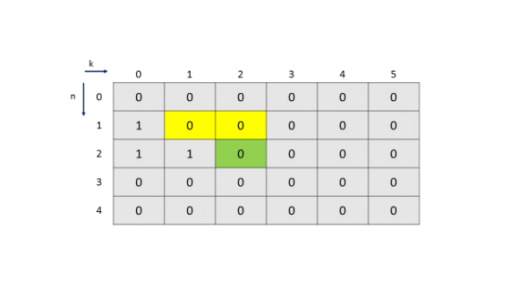
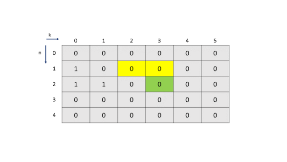
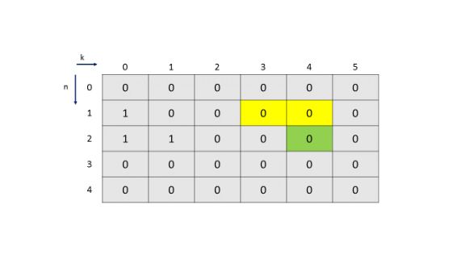
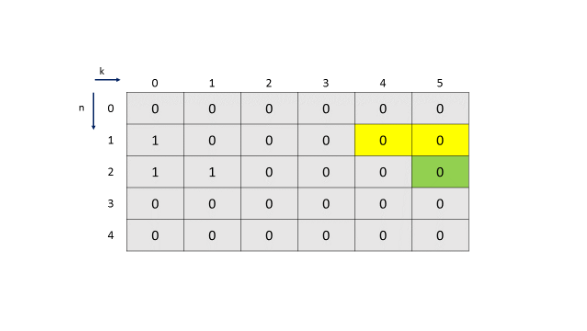
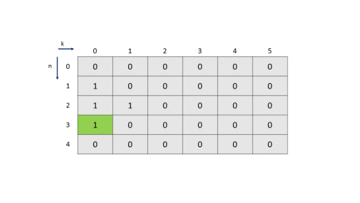
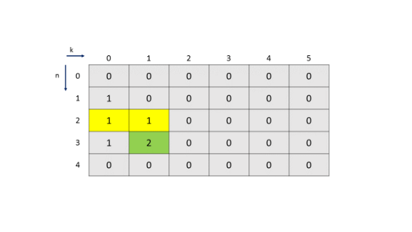
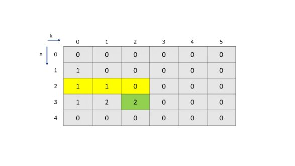
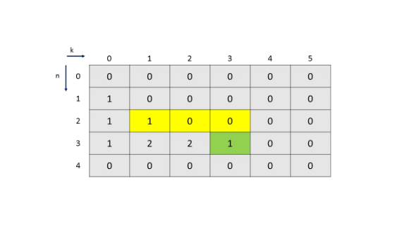
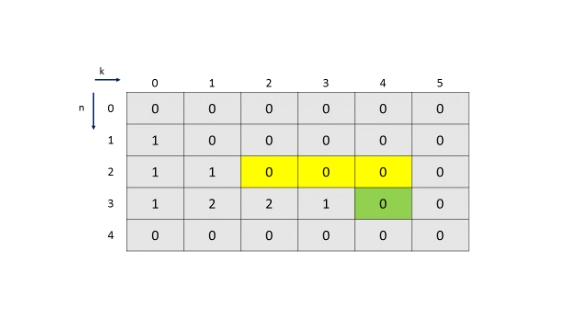
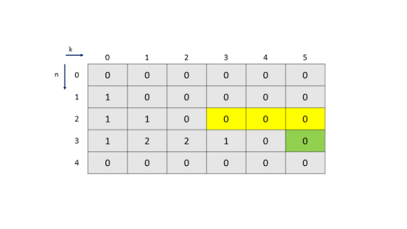
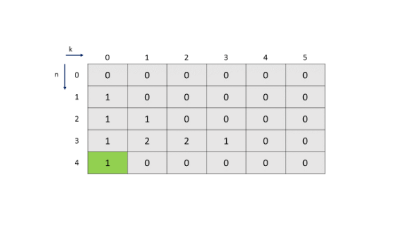
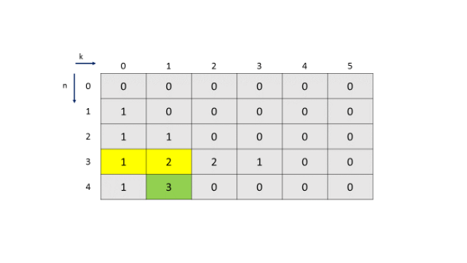
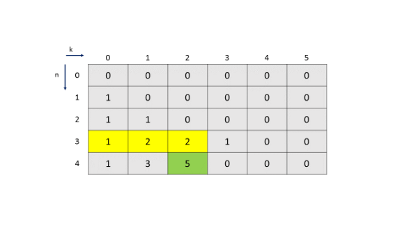
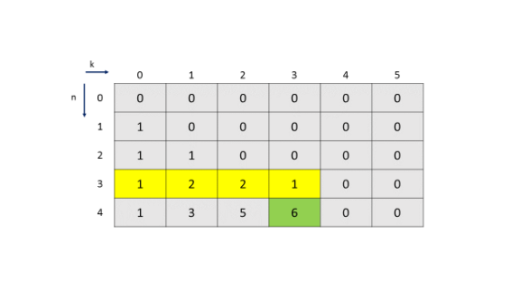
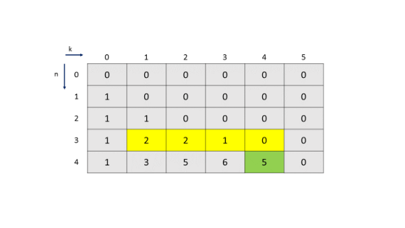
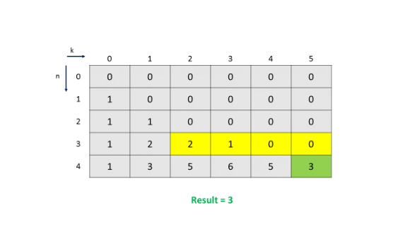

```java
public class Solution {
    public int kInversePairs(int n, int k) {
        int[][] dp = new int[n + 1][k + 1];
        for (int i = 1; i <= n; i++) {
            for (int j = 0; j <= k; j++) {
                if (j == 0)
                    dp[i][j] = 1;
                else {
                    for (int p = 0; p <= Math.min(j, i - 1); p++)
                        dp[i][j] = (dp[i][j] + dp[i - 1][j - p]) % 1000000007;
                }
            }
        }
        return dp[n][k];
    }
}
```

**Complexity Analysis**

* Time complexity : $O(n^2*k)$. $dp$ of size $n$x$k$ is filled once. Filling each $dp$ entry takes $O(n)$ time.

* Space complexity : $O(n*k)$. $dp$ array of size $n$x$k$ is used.

## Approach 4: Dynamic Programming with Cumulative Sum
**Algorithm**

From the last approach, we've observed that we need to traverse back to some limit in the previous row of the $dp$ array to fill in the current $dp$ entry. Instead of doing this traversal to find the sum of the required elements, we can ease the process if we fill the cumulative sum upto the current element in a row in any $dp$ entry, instead of the actual value.

Thus, now, $dp[i][j]=count(i,j)+\sum_{k=0}^{j-1} dp[i][k]$. Here, $count(i,j)$ refers to the number of arrangements with $i$ elements and exactly $j$ inverse pairs. Thus, each entry contains the sum of all the previous elements in the same row along with its own result.

Now, we need to determine the value of $count(i,j)$ to be added to the sum of previous elements in a row, in order to update the $dp[i][j]$ entry. But, we need not traverse back in the previous row , since it contains entries representing the cumulative sums now. Thus, to obtain the sum of elements from $dp[i-1][j-i+1]$ to $dp[i-1][j]$(including both), we can directly use $dp[i-1][j] - dp[i-1][j-i]$.

Now, to reflect the condition $\text{min}(j, i-1)$ used in the previous approaches, we can note that, we need to take the sum of only $i$ elements in the previous row, if $i$ elements exist till we reach the end of the array while traversing backwards. Otherwise, we simply take the sum of all the elements.

Only $i$ elements are considered because for generating $j$ new inverse pairs, by adding $i$ as the new number at the $j^{th}$ position, $j$ could reach only upto $i-1$, as discussed in the last approaches as well. Thus, we need to consider the sum of elements from $dp[i-1][j-(i-1)]$ to $dp[i-1][j]$(including both) using $dp[i-1][j] - dp[i-1][j-i]$ if j-i ≥ 0.

Otherwise, we add all the elements of the previous row upto the current column $j$ being considered. In other words, we can use $dp[i-1][j]$ directly as the required sum.

At the end, while returning the result, we need to return $dp[n][k]-dp[n][k-1]$ to obtain the required result from the cumulative sums.

The following animation illustrates the process of filling the $dp$ array.


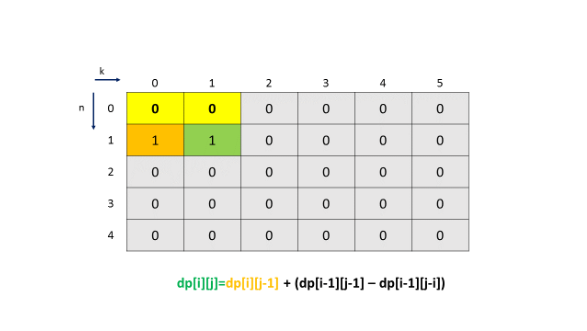
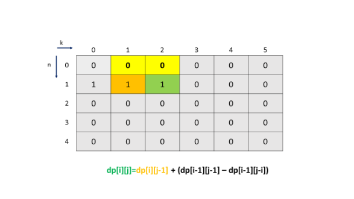
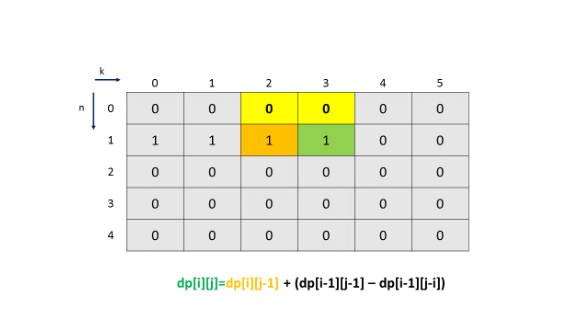
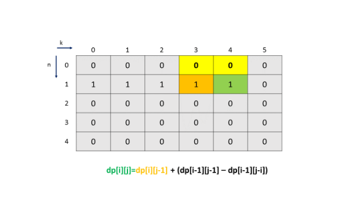
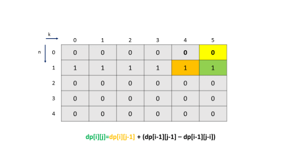


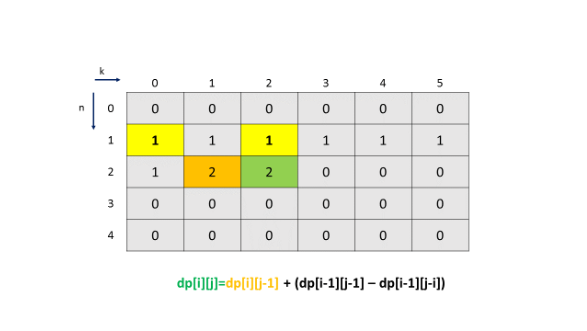
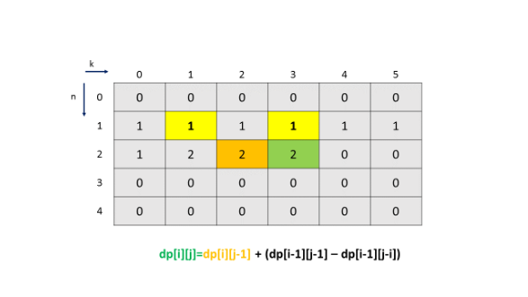
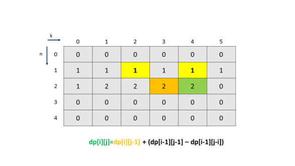
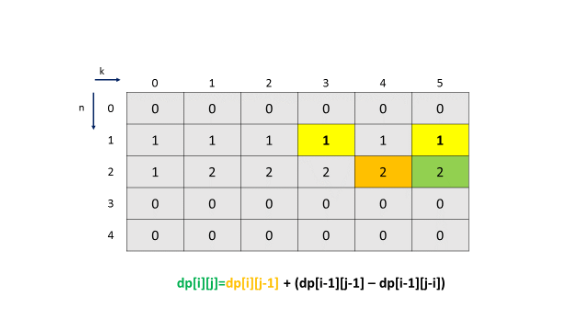
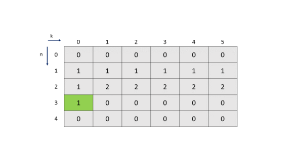

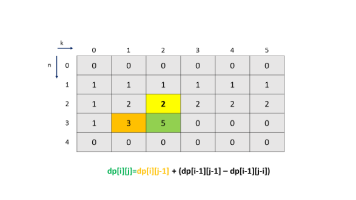
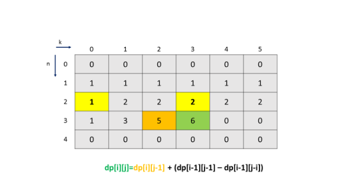
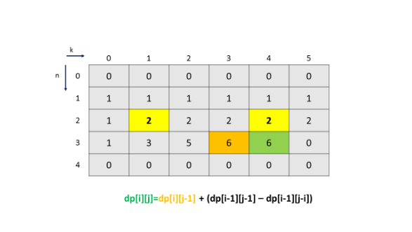
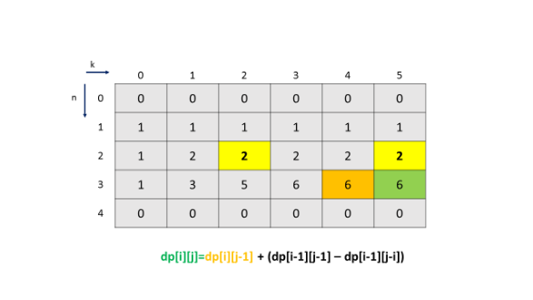
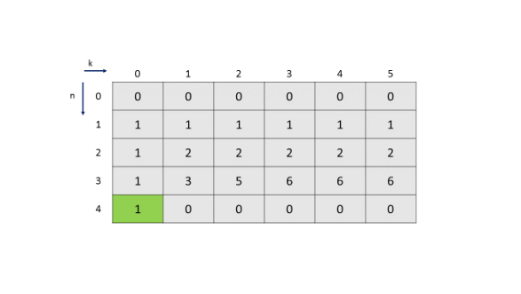
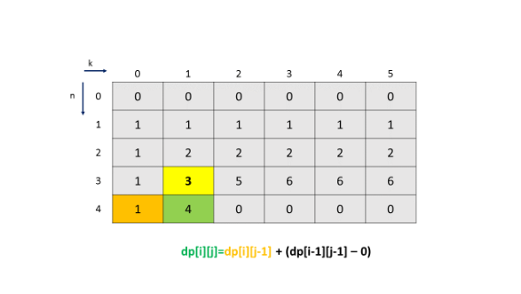

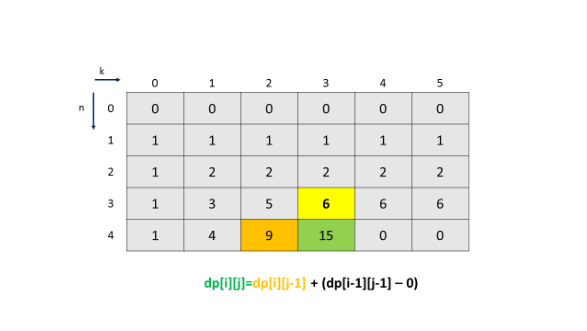

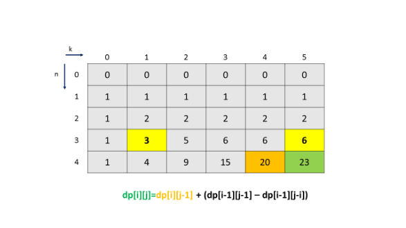
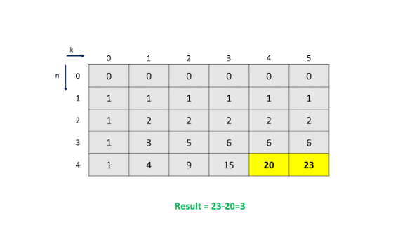

```java
public class Solution {
    public int kInversePairs(int n, int k) {
        int[][] dp = new int[n + 1][k + 1];
        int M = 1000000007;
        for (int i = 1; i <= n; i++) {
            for (int j = 0; j <= k; j++) {
                if (j == 0)
                    dp[i][j] = 1;
                else {
                    int val = (dp[i - 1][j] + M - ((j - i) >= 0 ? dp[i - 1][j - i] : 0)) % M;
                    dp[i][j] = (dp[i][j - 1] + val) % M;
                }
            }
        }
        return ((dp[n][k] + M - (k > 0 ? dp[n][k - 1] : 0)) % M);
    }
}
```

**Complexity Analysis**

* Time complexity : $O(n*k)$. $dp$ array of size $n$x$k$ is filled once.

* Space complexity : $O(n*k)$. $dp$ array of size $n$x$k$ is used.

## Approach 5: Another Optimized Dynamic Programming Approach
**Algorithm**

Another way to use the Dynamic Programming Approach could be if we can somehow directly store the required $count(i,j)$ in $dp[i][j]$ entry, but still we should not need to traverse back in the previous row to find the sum of the required elements.

To do so, we can note that for the $i^{th}$ row, we need to add the elements from $dp[i-1][j-i+1]$ to $dp[i-1][j]$(including both) if $(j-1) > 0$. Otherwise, we need to add all the elements from $dp[i-1][0]$ to $dp[i-1][j]$. This has already been discussed previously.

Now, when we go for filling in $dp[i][j+1]$ after filling $dp[i][j]$, we know $dp[i][j]$ already corresponds to the sum of the elements from $dp[i-1][j-i+1]$ to $dp[i-1][j]$. But, for filling $dp[i][j+1]$, we require the sum of the elements from $dp[i-1][(j-i+1)+1]$ to $dp[i-1][j+1]$.

We can observe that this sum only excludes $dp[i-1][j-i+1]$ from the previous sum($dp[i][j]$) and requires addition of only one new element($dp[i-1][j+1]$) to the to this sum. If the value $j-i+1<0$, we need not remove any value.

Thus, we can directly obtain $dp[i][j]$ value as $dp[i][j] = dp[i-1][j] - dp[i-1][j-i] + dp[i-1][j]$, if j-i ≥ 0. Otherwise, we can use: $dp[i][j] = dp[i-1][j] + dp[i-1][j]$.

We can also note that, since, here $j$ represents the number of inverse pairs that need to be currently considered, we can place another upper limit on $j$ as well. The maximum number of inverse pairs for any arbitrary $n$ occur only when the array is sorted in descending order leading to `[n,n-1,....,3,2,1]` as the arrangement.

This arrangement has a total of $n*(n-1)/2$ inverse pairs. Thus, for an array with $i$ as the number of elements, the maximum number of inverse pairs possible is $i*(i-1)/2$ only. Thus, for fillling in the $i^{th}$ row of $dp$, we can place this limit on $j$'s value.

The following animation shows the $dp$ filling process.


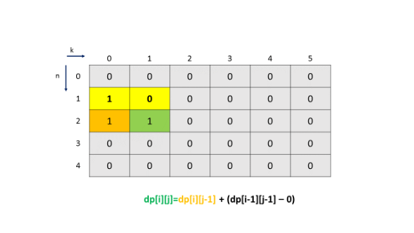
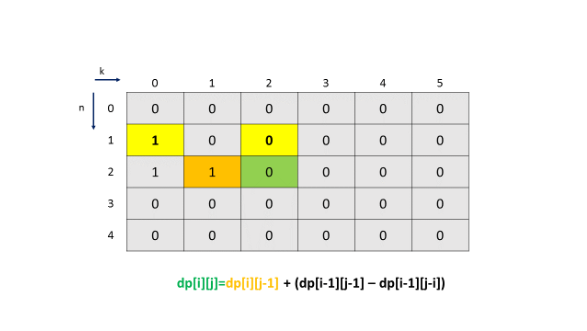
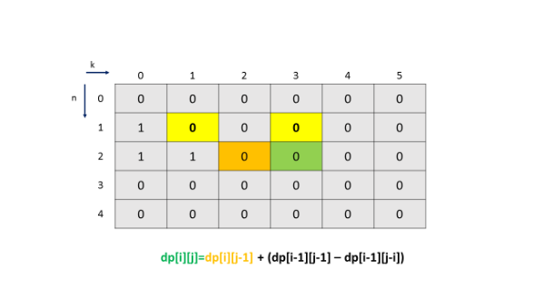

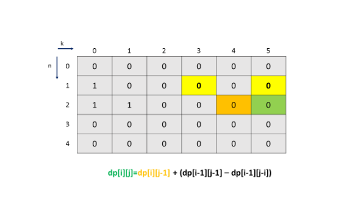

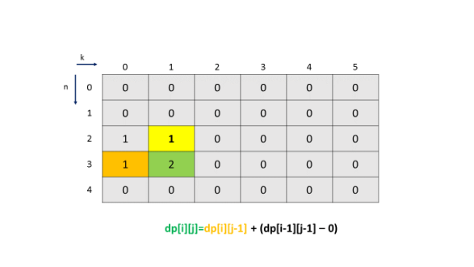


```java
public class Solution {
    public int kInversePairs(int n, int k) {
        int[][] dp = new int[n + 1][k + 1];
        int M = 1000000007;
        for (int i = 1; i <= n; i++) {
            for (int j = 0; j <= k && j <= i * (i - 1) / 2; j++) {
                if (i == 1 && j == 0) {
                    dp[i][j] = 1;
                    break;
                } else if (j == 0)
                    dp[i][j] = 1;
                else {
                    int val = (dp[i - 1][j] + M - ((j - i) >= 0 ? dp[i - 1][j - i] : 0)) % M;
                    dp[i][j] = (dp[i][j - 1] + val) % M;
                }
            }
        }
        return dp[n][k];
    }
}
```

**Complexity Analysis**

* Time complexity : $O(n*k)$. $dp$ array of size $(n+1)$x$(k+1)$ is filled once.

* Space complexity : $O(n*k)$. $dp$ array of size $(n+1)$x$(k+1)$ is used.

## Approach 6: Once Again Memoization
**Algorithm**

The Dynamic Programming solution discussed in Approach 5 can also be written down in the form of a recursive solution. But, again, that will include a lot of duplicate function calls. Thus, a better solution would be to use memoization to store the results of the previous function calls.

```java
public class Solution {
    Integer[][] memo = new Integer[1001][1001];
    int M = 1000000007;
    public int kInversePairs(int n, int k) {
        return ((inv(n, k) + M - (k > 0 ? inv(n, k - 1) : 0)) % M);
    }
    public int inv(int n, int k) {
        if (n == 0)
            return 0;
        if (k == 0)
            return 1;
        if (memo[n][k] != null)
            return memo[n][k];
        int val = (inv(n - 1, k) + M - ((k - n) >= 0 ? inv(n - 1, k - n) : 0)) % M;
        memo[n][k] = (inv(n, k - 1) + val) % M;
        return memo[n][k];
    }
}
```

**Complexity Analysis**

* Time complexity : $O(n*k)$. $n$x$k$ entries in the $memo$ array are filled once.

* Space complexity : $O(1)$. $memo$ array of constant size $1001$x$1001$ is used.

## Approach 7: 1-D Dynamic Programmming
**Algorithm**

From the Dynamic Programming solution, we can also note that we only need the values of the previous row in the $dp$ array, and not any other row. Thus, instead of storing the whole 2-D $dp$ in memory, we can make use of a 1-D $dp$ to store the previous row's entries only. The updations can be done in a 1-D $temp$ array of the same size as $dp$ and $dp$ can be updated using this $temp$ everytime a row is finished.

```java
public class Solution {
    public int kInversePairs(int n, int k) {
        int[] dp = new int[k + 1];
        int M = 1000000007;
        for (int i = 1; i <= n; i++) {
            int[] temp = new int[k + 1];
            temp[0] = 1;
            for (int j = 1; j <= k ; j++) {
                int val = (dp[j] + M - ((j - i) >= 0 ? dp[j - i] : 0)) % M;
                temp[j] = (temp[j - 1] + val) % M;
            }
            dp = temp;
        }
        return ((dp[k] + M - (k > 0 ? dp[k - 1] : 0)) % M);
    }
}
```

**Complexity Analysis**

* Time complexity : $O(n*k)$. $dp$ array of size $k+1$ is filled $n+1$ times.

* Space complexity : $O(k)$. $dp$ array of size $(k+1)$ is used.

# Submissions
---
**Solution 1: (DP Top-Down, Time Limit Exceeded)**
```python
class Solution:
    
    @functools.lru_cache(None)
    def kInversePairs(self, n: int, k: int) -> int:
        if n == 0:
            return 0
        if k == 0:
            return 1
        inv = 0
        for i in range(min(k, n - 1) + 1):
            inv = (inv + self.kInversePairs(n - 1, k - i)) % (10**9 + 7)
        return inv
```

**Solution 2 : (Using Recursion with Memoization, Time Limit Exceeded)**
```python
class Solution:
    memo = [[None]*1001 for _ in range(1001)]
    def kInversePairs(self, n: int, k: int) -> int:
        if n == 0:
            return 0
        if k == 0:
            return 1
        if self.memo[n][k] != None:
            return self.memo[n][k]
        inv = 0
        for i in range(min(k, n - 1) + 1):
            inv = (inv + self.kInversePairs(n - 1, k - i)) % (10**9 + 7)
        self.memo[n][k] = inv
        return inv
```

**Solution 3: (Dynamic Programming Bottom-Up, Time Limit Exceeded)**
```python
class Solution:
    def kInversePairs(self, n: int, k: int) -> int:
        dp = [[0]*(k + 1) for _ in range(n + 1)]
        for i in range(1, n+1):
            for j in range(k+1):
                if j == 0:
                    dp[i][j] = 1
                else:
                    for p in range(min(j, i - 1) + 1):
                        dp[i][j] = (dp[i][j] + dp[i - 1][j - p]) % (10**9 + 7)

        return dp[n][k]
```

**Solution 4: (Dynamic Programming with Cumulative Sum)**
```
Runtime: 836 ms
Memory Usage: 51.1 MB
```
```python
class Solution:
    def kInversePairs(self, n: int, k: int) -> int:
        dp = [[0]*(k + 1) for _ in range(n + 1)]
        MOD = 10**9 + 7
        for i in range(1, n+1):
            for j in range(k+1):
                if j <= i * (i - 1) // 2:
                    if j == 0:
                        dp[i][j] = 1
                    else:
                        val = (dp[i - 1][j] + MOD - (dp[i - 1][j - i] if (j - i) >= 0 else 0)) % MOD
                        dp[i][j] = (dp[i][j - 1] + val) % MOD

        return dp[n][k]
```

**Solution 5: (Another Optimized Dynamic Programming Approach)**
```
Runtime: 836 ms
Memory Usage: 52.4 MB
```
```python
class Solution:
    def kInversePairs(self, n: int, k: int) -> int:
        dp = [[0]*(k + 1) for _ in range(n + 1)]
        MOD = 10**9 + 7
        for i in range(1, n+1):
            for j in range(k+1):
                if j <= i * (i - 1) // 2:
                    if i == 1 and j == 0:
                        dp[i][j] = 1
                        break
                    elif j == 0:
                        dp[i][j] = 1
                    else:
                        val = (dp[i - 1][j] + MOD - (dp[i - 1][j - i] if (j - i) >= 0 else 0)) % MOD
                        dp[i][j] = (dp[i][j - 1] + val) % MOD

        return dp[n][k]
```

**Solution 6: (Once Again DP Top-Down)**
```
Runtime: 1348 ms
Memory Usage: 256 MB
```
```python
class Solution:
    def kInversePairs(self, n: int, k: int) -> int:
        MOD = 10**9 + 7
        
        @functools.lru_cache(None)
        def inv(n, k):
            if n == 0:
                return 0
            if k == 0:
                return 1
            val = (inv(n - 1, k) + MOD - (inv(n - 1, k - n) if (k - n) >= 0 else 0)) % MOD
            return (inv(n, k - 1) + val) % MOD
        
        return ((inv(n, k) + MOD - (inv(n, k - 1) if k > 0 else 0)) % MOD)
```

**Solution 7: (1-D Dynamic Programmming)**
```
Runtime: 516 ms
Memory Usage: 13.8 MB
```
```python
class Solution:
    def kInversePairs(self, n: int, k: int) -> int:
        dp = [0]*(k + 1)
        MOD = 10**9 + 7
        for i in range(1, n+1):
            temp = [0]*(k + 1)
            temp[0] = 1
            for j in range(1, k+1):
                val = (dp[j] + MOD - (dp[j - i] if (j - i) >= 0 else 0)) % MOD
                temp[j] = (temp[j - 1] + val) % MOD
            dp = temp

        return ((dp[k] + MOD - (dp[k - 1] if k > 0 else 0)) % MOD)
```

**Solution 8: (DP Bottom-Up)**
```
Runtime: 19 ms
Memory Usage: 14.8 MB
```
```c++
class Solution {
public:
    int kInversePairs(int n, int k) {
        long long dp[n + 1][k + 1];
        int M = 1e9 + 7;
        memset(dp, 0, sizeof(dp));
        for (int i = 0; i <= n; i++) dp[i][0] = 1;
        for (int i = 1; i <= n; i++)
        {
            for (int j = 1; j <= k; j++)
            {
                if (j >= i) dp[i][j] = (((dp[i][j - 1]) + (dp[i - 1][j]) - (dp[i - 1][j - i]) + M) % M);
                else dp[i][j] = ((dp[i][j - 1]) % M + (dp[i - 1][j]) % M) % M;
            }
        }
        return dp[n][k];
    }
};
```
